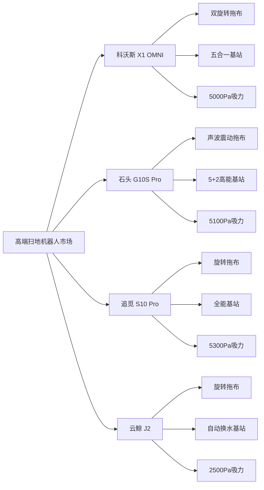
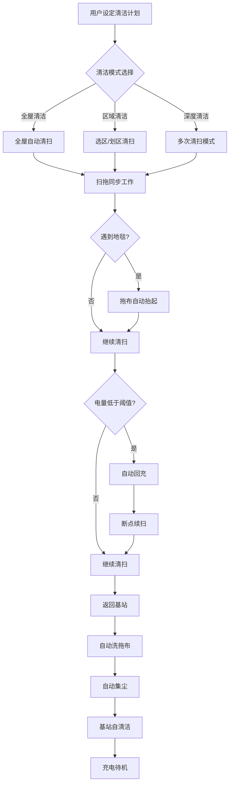
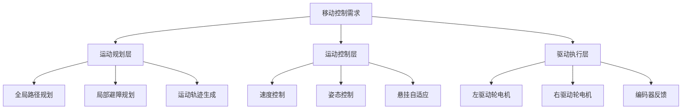
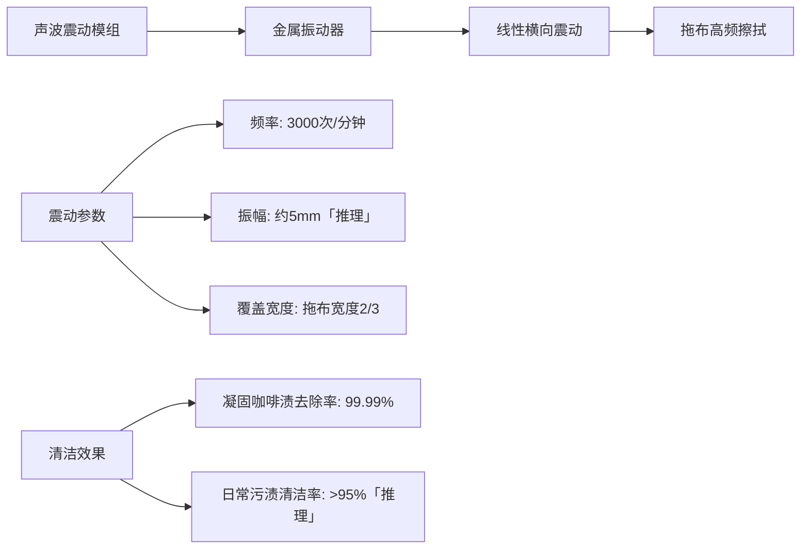
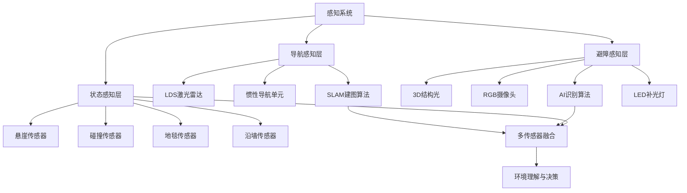
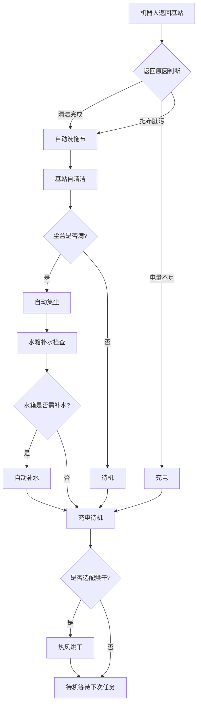
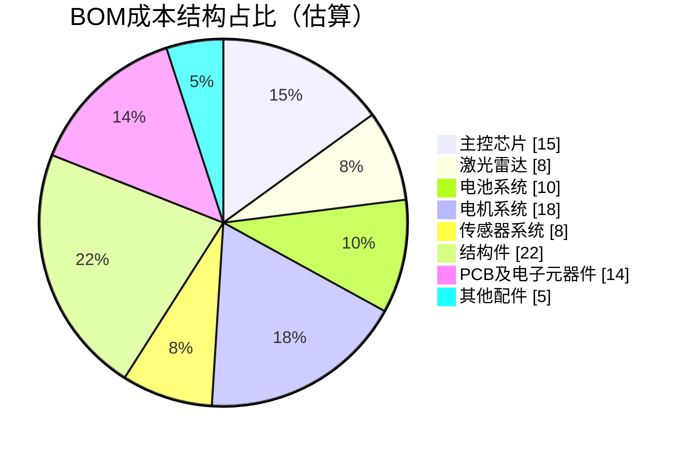

# 石头 G10S Pro 扫地机器人产品需求文档（PRD）

**文档版本**：V1.0  
**编制日期**：2022年1月  
**产品代号**：G10S Pro  
**目标市场**：全球高端家用扫地机器人市场  

---

## I. 产品定位与目标

### 1.1 市场画像

#### 目标用户群体

石头 G10S Pro 定位于高端全能旗舰扫地机器人市场，基于首发价 5699 元人民币及品牌定位，反推目标用户画像如下：

**核心受众**：
- **年龄区间**：28-45岁中高收入群体
- **家庭特征**：100-200㎡户型家庭，注重生活品质
- **消费特征**：追求"一步到位"的全能产品，愿意为技术溢价买单
- **痛点需求**：希望彻底解放双手，实现清洁全流程自动化

**对标竞品**：
- 科沃斯 X1 OMNI（约5999元）
- 追觅 S10 Pro（约5299元）
- 云鲸 J2（约4999元）

#### 市场竞争格局

### 1.2 应用场景

#### 主要应用场景

| 场景类型 | 场景描述 | 核心需求 | 功能对应 |
|---------|---------|---------|---------|
| 日常清洁 | 每日定时全屋清扫 | 自动化、智能化 | 定时预约、智能路径规划 |
| 深度清洁 | 周末大扫除 | 强力清洁、顽固污渍处理 | 5100Pa吸力、声波震动拖地 |
| 地毯清洁 | 客厅/卧室地毯区域 | 不打湿地毯、深度除尘 | 智能升降拖布、地毯识别 |
| 低矮空间 | 沙发底、床底 | 超薄机身、精准导航 | 9.65cm机身、升降雷达 |
| 宠物家庭 | 毛发清理 | 防缠绕、高效集尘 | 胶刷设计、自动集尘 |
| 多层住宅 | 复式/别墅 | 多地图管理、断点续扫 | 多楼层地图、智能回充 |

#### 典型使用流程

### 1.3 核心卖点（USP）

#### 功能优先级定义

| 优先级 | 功能模块 | 功能描述 | 差异化价值 |
|--------|---------|---------|-----------|
| P0 | 声波震动拖地 | 3000次/分钟高频震动，可升降设计 | 全球首创，清洁效率提升50% |
| P0 | 5+2高能基站 | 自动洗拖布、集尘、补水、抑菌、自清洁+选配换水烘干 | 60天免维护，行业领先 |
| P0 | Reactive AI 2.0避障 | 结构光+AI视觉，27种障碍物识别 | 毫米级精准避障 |
| P1 | 5100Pa超大吸力 | 行业最高吸力标准 | 深度清洁能力 |
| P1 | RR mason 9.0算法 | 智能建图、路径规划、房间识别 | 越用越聪明的导航系统 |
| P2 | 实时视频通话 | RGB摄像头+双向语音（Pro版独有） | 远程看护、隐私保护 |
| P2 | 谷点充电 | 夜间低谷电价时段充电 | 节能环保、成本优化 |

### 1.4 产品定位级别

**产品级别**：消费级高端旗舰

**定位依据**：
- 价格区间：5000-6000元，属于高端消费级产品
- 目标市场：家庭用户，非商用场景
- 技术特征：追求用户体验极致化，非工业级可靠性要求
- 销售渠道：线上电商为主，线下体验店为辅

---

## II. 功能需求详细定义

### 2.1 移动功能需求

#### 2.1.1 基础移动能力

| 功能项 | 需求描述 | 技术指标 |
|--------|---------|---------|
| 移动方式 | 双驱动轮+万向轮差速驱动 | 前进、后退、原地旋转 |
| 最大移动速度 | 标准清扫速度 | 0.3m/s「推理」 |
| 爬坡能力 | 越过门槛、地毯边缘 | ≤15°坡度「推理」 |
| 越障能力 | 跨越地面障碍物 | ≤2cm高度「推理」 |
| 转弯半径 | 原地旋转 | 0（原地旋转） |
| 悬挂系统 | 四连杆独立悬挂 | 适应不平整地面 |

#### 2.1.2 特殊移动能力

| 功能项 | 需求描述 | 实现方式 |
|--------|---------|---------|
| 低矮空间穿越 | 进入沙发底、床底等低矮区域 | 雷达升降技术，降至7.95cm |
| 地毯识别与适应 | 识别地毯并调整清洁模式 | 超声波传感器+拖布升降 |
| 脱困能力 | 被困时自动脱困 | 多传感器融合+脱困算法 |
| 防跌落 | 楼梯边缘防跌落 | 6组悬崖传感器 |

#### 2.1.3 移动控制系统架构

### 2.2 清洁功能需求

#### 2.2.1 吸尘清洁需求

| 功能项 | 需求描述 | 技术指标 |
|--------|---------|---------|
| 最大吸力 | 行业领先吸力 | 5100Pa |
| 吸力档位 | 多档吸力调节 | 标准/强力/Max+ 三档 |
| 主刷类型 | 全向浮动胶刷 | TPU软胶材质，防缠绕设计 |
| 主刷浮动 | 3D灵活浮动 | 前后左右上下六向浮动 |
| 边刷类型 | 单边刷设计 | 智能动态调速 |
| 边刷调速 | 根据场景自动调速 | 130RPM（正常）/330RPM（沿墙） |

#### 2.2.2 拖地清洁需求

| 功能项 | 需求描述 | 技术指标 |
|--------|---------|---------|
| 拖地方式 | 声波震动擦地 | 3000次/分钟（50Hz） |
| 震动档位 | 三档震动强度 | 弱1650次/分/中2300次/分/强3000次/分 |
| 拖布升降 | 智控升降设计 | 最大升起高度5mm |
| 升降触发场景 | 自动判断升降时机 | 地毯/回充/回洗/打滑/越障 |
| 水箱类型 | 电控水箱 | 200ml容量 |
| 出水量控制 | 三档水量调节 | 低/中/高三档 |
| 拖地模式 | 多种拖地模式 | 标准拖地/精细拖地/深度拖地 |

#### 2.2.3 声波震动拖布技术原理

#### 2.2.4 清洁模式矩阵

| 清洁模式 | 吸尘状态 | 拖地状态 | 适用场景 |
|---------|---------|---------|---------|
| 扫拖同步 | 开启 | 开启 | 日常清洁 |
| 单扫模式 | 开启 | 关闭 | 纯地面/地毯区域 |
| 单拖模式 | 关闭 | 开启 | 轻度脏污地面 |
| 深度清洁 | Max+吸力 | 强档震动 | 顽固污渍区域 |
| 静音清洁 | 标准吸力 | 低档震动 | 夜间/休息时段 |

### 2.3 感知功能需求

#### 2.3.1 环境感知需求

| 功能项 | 需求描述 | 技术指标 |
|--------|---------|---------|
| 建图能力 | 快速精准建图 | 8分钟完成全屋建图 |
| 地图类型 | 多种地图模式 | 2D地图/3D地图/Matrix地图 |
| 多楼层地图 | 支持多层住宅 | 最多4张地图（3张手动+1张自动） |
| 避障能力 | 主动智能避障 | 毫米级精准测距 |
| 障碍物识别 | AI物体识别 | 27种常见障碍物 |
| 避障距离 | 根据障碍物类型调整 | 约1cm处转身 |
| 导航定位精度 | 高精度定位 | 定位误差<5cm「推理」 |

#### 2.3.2 传感器配置清单

| 传感器类型 | 数量 | 功能描述 | 技术参数 |
|-----------|------|---------|---------|
| LDS激光雷达 | 1个 | 环境扫描建图 | 360°旋转扫描，支持升降 |
| 3D结构光发射器 | 2个 | 精准测距避障 | 850mm波段激光，80cm测距范围 |
| RGB摄像头 | 1个 | AI物体识别 | Pro版独有，支持视频通话 |
| LED补光灯 | 1个 | 暗光环境补光 | Pro版LED，标准版红外 |
| 超声波传感器 | 1个（侧面） | 沿墙检测 | 精确沿墙清扫 |
| 地毯识别传感器 | 1个（底部） | 地毯材质识别 | 超声波技术 |
| 悬崖传感器 | 6组（底部） | 防跌落检测 | 检测高度落差>3cm |
| 碰撞传感器 | 360°环绕 | 碰撞检测与保护 | 缓冲保护设计 |
| 回充传感器 | 若干 | 基站对接 | 红外引导「推理」 |

#### 2.3.3 感知系统架构

#### 2.3.4 障碍物识别清单

| 障碍物类别 | 具体物品 | 避障策略 |
|-----------|---------|---------|
| 线缆类 | 电源线、数据线、耳机线 | 绕行，保持安全距离 |
| 鞋类 | 拖鞋、运动鞋、高跟鞋 | 绕行或跨越 |
| 织物类 | 袜子、毛巾、抹布 | 绕行，避免吸入 |
| 家具类 | 椅子腿、桌腿、柜子 | 沿边清扫 |
| 宠物类 | 宠物粪便、宠物玩具 | 识别并绕行 |
| 其他类 | 体重秤、地垫、垃圾桶 | 根据类型智能避让 |

### 2.4 交互功能需求

#### 2.4.1 语音交互需求

| 功能项 | 需求描述 | 技术指标 |
|--------|---------|---------|
| 语音控制平台 | 支持主流语音助手 | 小爱音箱/小度/天猫精灵/Siri捷径 |
| 语音指令识别 | 基础控制指令 | 开始清扫/暂停/回充/定点清扫等 |
| 语音播报 | 状态播报与提示 | 工作状态/故障提示/完成提醒 |
| 拾音距离 | 远场语音唤醒 | 5m有效距离「推理」 |

#### 2.4.2 APP交互需求

| 功能模块 | 功能描述 | 具体功能项 |
|---------|---------|-----------|
| 地图管理 | 地图编辑与管理 | 房间分区/合并分割/命名/材质标注 |
| 清洁控制 | 清洁任务设置 | 全屋/选区/划区清扫，模式选择 |
| 参数设置 | 清洁参数调节 | 吸力/水量/震动强度/清洁次数 |
| 定时任务 | 预约清洁设置 | 一次性/周期性定时任务 |
| 禁区设置 | 区域限制设置 | 清洁禁区/虚拟墙 |
| 状态监控 | 实时状态查看 | 电量/清洁进度/故障信息 |
| 视频功能 | 实时视频通话 | 远程查看/双向语音（Pro版） |
| 历史记录 | 清洁历史查看 | 清洁日志/统计报表 |

#### 2.4.3 实体按键交互需求

| 按键位置 | 按键功能 | 操作方式 | 功能描述 |
|---------|---------|---------|---------|
| 局部清扫/童锁键 | 局部清扫/童锁切换 | 短按/长按 | 短按启动局部清扫，长按开启童锁 |
| 清扫/开关机键 | 清扫控制/开关机 | 短按/长按 | 短按开始/暂停清扫，长按开关机 |
| 回充键 | 返回充电 | 短按 | 启动自动回充 |
| 组合按键 | 视频功能开启 | 特定组合 | 开启摄像头权限「推理」 |

#### 2.4.4 视觉反馈需求

| 反馈类型 | 显示方式 | 显示内容 |
|---------|---------|---------|
| 工作状态 | LED灯带 | 不同颜色/闪烁模式表示不同状态 |
| 电量提示 | LED灯带/语音 | 低电量提醒 |
| 故障报警 | 语音+LED | 故障类型播报+灯光提示 |
| 充电状态 | LED指示灯 | 充电中/充满状态指示 |

### 2.5 智能功能需求

#### 2.5.1 任务规划需求

| 功能项 | 需求描述 | 技术实现 |
|--------|---------|---------|
| 房间识别 | 自动识别房间类型 | AI算法识别客厅/卧室/厨房/卫生间 |
| 清洁顺序规划 | 智能优化清洁顺序 | 根据使用频率/房间特性自动排序 |
| 多任务并行 | 多任务协调处理 | 清洁任务与充电任务智能调度 |
| 断点续扫 | 中断后继续清扫 | 记忆断点位置，充电后继续 |
| 智能回充 | 电量不足自动回充 | 预留足够电量返回基站 |

#### 2.5.2 学习与适应需求

| 功能项 | 需求描述 | 技术实现 |
|--------|---------|---------|
| 地图优化 | 持续优化地图精度 | 多次清扫数据融合 |
| 路径优化 | 优化清扫路径效率 | 学习用户习惯，优化路径 |
| 环境适应 | 适应环境变化 | 动态更新地图，适应家具变动 |
| 用户习惯学习 | 学习用户偏好 | 根据用户操作习惯调整策略「推理」 |

#### 2.5.3 自主决策需求

| 场景 | 决策内容 | 决策逻辑 |
|------|---------|---------|
| 遇到地毯 | 拖布升降+模式切换 | 地毯传感器触发→升起拖布→切换纯扫模式 |
| 电量不足 | 回充决策 | 电量<20%→计算回充路径→自动回充 |
| 被困住 | 脱困决策 | 检测被困→尝试多种脱困策略→失败则报警 |
| 遇到障碍物 | 避障决策 | 识别障碍物类型→选择避障策略→执行避让 |
| 清洁完成 | 返回基站 | 任务完成→返回基站→执行后续维护 |

### 2.6 基站功能需求

#### 2.6.1 基站核心功能

| 功能项 | 功能描述 | 技术指标 |
|--------|---------|---------|
| 自动洗拖布 | 三步骤清洁拖布 | 洗-刷-刮清洁流程 |
| 自动集尘 | 将尘盒垃圾吸入尘袋 | 2.5L尘袋容量，60天免倒 |
| 自动补水 | 为机身水箱补水 | 200ml水箱自动补水 |
| 基站自清洁 | 清洁基站污水槽 | 自动清洗基站内部 |
| 自动抑菌 | 全链路银离子抑菌 | 99.9%抑菌率 |
| 自动换水（选配） | 自动进出水 | 外接水管自动换水 |
| 热风烘干（选配） | 拖布热风烘干 | 防止拖布发霉异味 |

#### 2.6.2 基站工作流程

#### 2.6.3 基站水箱规格

| 水箱类型 | 容量 | 功能描述 | 续航能力 |
|---------|------|---------|---------|
| 清水箱 | 3L | 储存清洁用水 | 满水可拖400㎡ |
| 污水箱 | 2.5L「推理」 | 收集污水 | 配合浮漂提示 |

---

## III. 性能指标需求

### 3.1 移动性能指标

| 指标项 | 需求值 | 测试条件 |
|--------|--------|---------|
| 最大移动速度 | 0.3m/s「推理」 | 平整地面 |
| 爬坡角度 | ≤15°「推理」 | 干燥硬质地面 |
| 越障高度 | ≤2cm「推理」 | 门槛/地毯边缘 |
| 最小转弯半径 | 0（原地旋转） | 静止状态 |
| 定位精度 | <5cm「推理」 | 室内GPS拒止环境 |
| 导航精度 | <10cm「推理」 | 复杂家居环境 |

### 3.2 清洁性能指标

#### 3.2.1 吸尘性能指标

| 指标项 | 需求值 | 测试标准 |
|--------|--------|---------|
| 最大吸力 | 5100Pa | 风道入口测量 |
| 吸力档位 | 3档 | 标准/强力/Max+ |
| 吸尘效率 | >95%「推理」 | 标准测试尘样 |
| 地毯深层清洁率 | >90%「推理」 | 地毯深度清洁测试 |

#### 3.2.2 拖地性能指标

| 指标项 | 需求值 | 测试标准 |
|--------|--------|---------|
| 震动频率 | 3000次/分钟（强档） | 拖布支架测量 |
| 污渍去除率 | 99.99% | 凝固咖啡渍测试 |
| 拖布覆盖率 | >95%「推理」 | 全屋拖地覆盖率 |
| 拖布抬升高度 | 5mm | 地毯识别触发 |

#### 3.2.3 边角清洁指标

| 指标项 | 需求值 | 实现方式 |
|--------|--------|---------|
| 沿墙清洁距离 | <1cm「推理」 | 超声波沿墙传感器 |
| 边角覆盖率 | >95%「推理」 | 边刷智能调速 |
| 墙角清洁效果 | >90%「推理」 | 特殊路径规划 |

### 3.3 续航性能指标

| 指标项 | 需求值 | 测试条件 |
|--------|--------|---------|
| 电池容量 | 5200mAh | 14.4V锂离子电池 |
| 电池能量 | 74.88Wh | 额定电压×容量 |
| 标准续航时间 | >2.5小时 | 标准模式清扫 |
| 最大清扫面积 | 200㎡ | 单次满电清扫 |
| 充电时间 | <4小时 | 完全充电 |
| 充电提速 | 30% | 相比前代产品 |
| 电池循环寿命 | >500次「推理」 | 容量保持率>80% |

### 3.4 环境适应性指标

| 指标项 | 需求值 | 说明 |
|--------|--------|------|
| 防护等级 | IPX4 | 防溅水等级 |
| 工作温度 | 0°C~40°C「推理」 | 室内环境温度 |
| 存储温度 | -20°C~60°C「推理」 | 仓储运输温度 |
| 工作湿度 | <95%RH「推理」 | 非冷凝 |
| 噪音水平 | <65dB「推理」 | 标准模式工作噪音 |
| 机身高度 | 96.5mm | 含雷达高度 |
| 雷达降低后高度 | 79.5mm | 进入低矮空间 |

### 3.5 可靠性指标

| 指标项 | 需求值 | 说明 |
|--------|--------|------|
| 平均无故障时间（MTBF） | >2000小时「推理」 | 正常使用条件下 |
| 主刷寿命 | >1000小时「推理」 | 正常清洁使用 |
| 拖布寿命 | 3-6个月 | 正常使用更换周期 |
| 滤网寿命 | 6-12个月 | 正常使用更换周期 |
| 尘袋使用周期 | 60天 | 正常使用更换周期 |
| 电池循环寿命 | >500次「推理」 | 容量保持率>80% |
| 基站维护周期 | 1个月 | 基站污水槽清理 |

---

## IV. 技术规格需求

### 4.1 整机规格

| 规格项 | 参数值 | 备注 |
|--------|--------|------|
| 产品尺寸 | 353×350×96.5mm | 长×宽×高 |
| 产品重量 | 约4.7kg「推理」 | 主机重量 |
| 基站尺寸 | 422×492×420mm | 长×宽×高 |
| 基站重量 | 约8kg「推理」 | 不含水状态 |
| 尘盒容量 | 400ml | 机身尘盒 |
| 水箱容量 | 200ml | 电控水箱 |
| 清水箱容量 | 3L | 基站清水箱 |
| 污水箱容量 | 2.5L「推理」 | 基站污水箱 |
| 尘袋容量 | 2.5L | 基站集尘袋 |

### 4.2 计算平台需求

#### 4.2.1 主控芯片规格

| 规格项 | 需求值 | 说明 |
|--------|--------|------|
| 芯片供应商 | 全志科技 | 国产芯片方案 |
| 芯片系列 | MR系列「推理」 | 机器人专用芯片 |
| CPU核心 | 八核ARM Cortex-A55「推理」 | 主处理器核心 |
| 协处理器 | RISC-V核心「推理」 | 异构架构 |
| GPU | Arm Mali-G57「推理」 | 图形处理单元 |
| NPU算力 | 2Tops「推理」 | AI加速单元 |
| 内存 | ≥1GB DDR4「推理」 | 运行内存 |
| 存储 | ≥4GB eMMC「推理」 | 固件存储 |

#### 4.2.2 算法系统需求

| 算法模块 | 功能需求 | 性能要求 |
|---------|---------|---------|
| SLAM建图 | 实时同步定位与建图 | 8分钟完成全屋建图 |
| 路径规划 | 全局路径规划与局部避障 | 实时响应<100ms「推理」 |
| AI识别 | 障碍物识别与分类 | 27种障碍物识别 |
| 运动控制 | 电机驱动与运动控制 | 控制周期<10ms「推理」 |

### 4.3 通信需求

#### 4.3.1 无线通信需求

| 通信类型 | 技术规格 | 功能描述 |
|---------|---------|---------|
| Wi-Fi | 802.11 b/g/n 2.4GHz | APP连接、云端通信 |
| 蓝牙 | Bluetooth 5.0 | 设备配对、近距离通信 |

#### 4.3.2 内部通信需求

| 通信类型 | 应用场景 | 技术要求 |
|---------|---------|---------|
| I2C/SPI | 传感器数据采集 | 低速传感器通信 |
| UART | 模块间通信 | 调试接口、模块通信 |
| CAN总线 | 电机控制通信「推理」 | 实时控制通信 |
| USB | 固件升级调试 | Type-C接口 |

### 4.4 电气规格

| 规格项 | 参数值 | 备注 |
|--------|--------|------|
| 额定电压 | 14.4V DC | 电池电压 |
| 额定功率 | 69W | 整机额定功率 |
| 充电输入 | 100-240V AC 50/60Hz | 基站充电输入 |
| 充电输出 | 20V DC「推理」 | 基站充电输出 |
| 电池类型 | 锂离子电池 | 14.4V/5200mAh |

---

## V. 认证与合规需求

### 5.1 目标市场认证要求

| 认证类型 | 适用市场 | 认证标准 | 备注 |
|---------|---------|---------|------|
| CCC认证 | 中国市场 | 中国国家强制性产品认证 | 电气安全要求 |
| CE认证 | 欧盟市场 | 欧盟CE安全认证 | 健康、安全、环保标准 |
| FCC认证 | 美国市场 | 美国联邦通信委员会认证 | 电磁兼容标准 |
| RoHS认证 | 欧盟市场 | 欧盟有害物质限制指令 | 环保材料要求 |
| TÜV隐私认证 | 全球市场 | 德国莱茵TÜV隐私安全认证 | 视频功能隐私保护 |

### 5.2 安全标准符合要求

| 标准类型 | 标准编号 | 标准名称 |
|---------|---------|---------|
| 电气安全 | GB 4706.1 | 家用和类似用途电器安全标准 |
| 电池安全 | GB 31241 | 便携式电子产品用锂离子电池安全 |
| 电磁兼容 | GB 17625.1 | 谐波电流发射限值 |
| 静电抗扰 | GB/T 17626.2 | 静电放电抗扰度 |
| 数据安全 | GDPR | 欧盟数据保护法案 |
| 数据安全 | CCPA | 加州消费者隐私法案 |

### 5.3 隐私保护要求

| 要求项 | 具体要求 | 实现方式 |
|--------|---------|---------|
| 摄像头权限 | 默认关闭 | 需用户手动开启 |
| 视频加密 | 数据传输加密 | AES-256加密算法 |
| 密码保护 | 手势密码保护 | 视频功能需设置密码 |
| 硬件断电 | 未开启时摄像头断电 | 硬件级隐私保护 |
| 数据存储 | 本地加密存储 | 加密分区保护 |

---

## VI. 供应链与成本需求

### 6.1 关键器件供应需求

| 器件类别 | 供应商要求 | 备选方案 | 备注 |
|---------|-----------|---------|------|
| 主控芯片 | 全志科技（主供） | 其他国产芯片厂商 | 国产化优先 |
| 电池模组 | 德赛电池/欣旺达 | 其他一线电池厂商 | 双供应商策略 |
| 激光雷达 | 舜宇光学等 | 多家供应商 | 成本80-150元 |
| 电机系统 | 国产优质供应商 | 多家供应商 | 主风机+边刷+驱动电机 |
| 结构件 | 国内优质供应商 | 多家供应商 | ABS+PC复合材料 |

### 6.2 国产化比例要求

| 指标项 | 目标值 | 说明 |
|--------|--------|------|
| 核心芯片国产化率 | >80%「推理」 | 主控芯片、电源管理等 |
| 电池国产化率 | 100% | 德赛/欣旺达均为国产 |
| 结构件国产化率 | 100% | 机身、基站外壳等 |
| 整体国产化率 | >90%「推理」 | 按价值计算 |

### 6.3 成本目标需求

| 成本项目 | 目标值 | 占售价比例 | 备注 |
|---------|--------|-----------|------|
| BOM成本 | 1500-2000元 | 26-35% | 物料成本 |
| 制造成本 | 200-300元「推理」 | 4-5%「推理」 | 组装、测试、包装 |
| 研发摊销 | 500-800元「推理」 | 9-14%「推理」 | 研发成本摊销 |
| 总成本 | 2200-3100元「推理」 | 39-54%「推理」 | 综合成本 |

### 6.4 BOM成本结构

---

## VII. 开发生态需求

### 7.1 SDK/API接口需求

| 接口类型 | 功能描述 | 开放程度 |
|---------|---------|---------|
| 米家开放平台API | 智能家居联动 | 完全开放 |
| 石头开发者平台API | 自定义控制、场景联动 | 完全开放 |
| 地图数据接口 | 地图数据导出 | 部分开放「推理」 |
| 清洁数据接口 | 清洁记录、统计数据 | 完全开放 |

### 7.2 技术文档需求

| 文档类型 | 文档内容 | 目标用户 |
|---------|---------|---------|
| 用户手册 | 产品使用指南 | 终端用户 |
| 快速入门指南 | 产品快速上手 | 终端用户 |
| API开发文档 | 接口调用说明 | 开发者 |
| 固件更新说明 | 版本更新内容 | 终端用户/开发者 |

### 7.3 仿真平台支持需求

| 支持项 | 功能描述 | 用途 |
|--------|---------|------|
| Gazebo仿真 | 物理仿真环境 | 算法开发测试 |
| 地图编辑器 | 自定义地图创建 | 测试场景构建 |
| 虚拟机器人 | 软件模拟运行 | 算法验证 |

### 7.4 第三方生态支持需求

| 生态类型 | 支持平台 | 功能描述 |
|---------|---------|---------|
| 智能家居 | 米家、HomeKit等 | 场景联动 |
| 语音助手 | 小爱、小度、天猫精灵、Siri | 语音控制 |
| 第三方配件 | 替换耗材、扩展配件 | 配件生态 |

---

## VIII. 附录

### 8.1 术语定义

| 术语 | 定义 |
|------|------|
| LDS | Laser Distance Sensor，激光测距传感器 |
| SLAM | Simultaneous Localization and Mapping，同步定位与建图 |
| AI | Artificial Intelligence，人工智能 |
| NPU | Neural Processing Unit，神经网络处理单元 |
| OTA | Over-The-Air，空中升级 |
| BOM | Bill of Materials，物料清单 |
| MTBF | Mean Time Between Failures，平均无故障时间 |

### 8.2 文档修订记录

| 版本 | 日期 | 修订内容 | 作者 |
|------|------|---------|------|
| V1.0 | 2022-01 | 初始版本发布 | 产品部 |

---

*本产品需求文档基于石头G10S Pro深度产品调研报告编制，部分技术参数标注「推理」的内容为基于行业经验的合理推演。*
