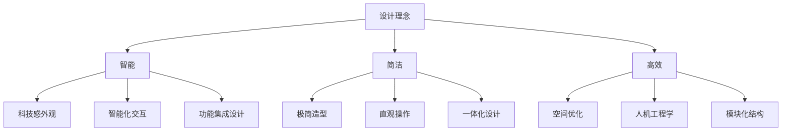
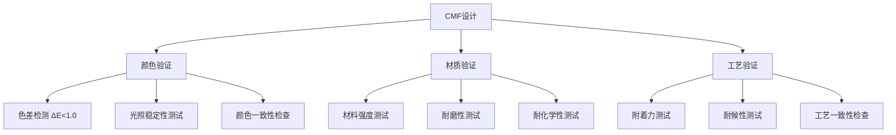
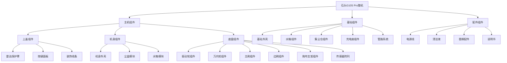
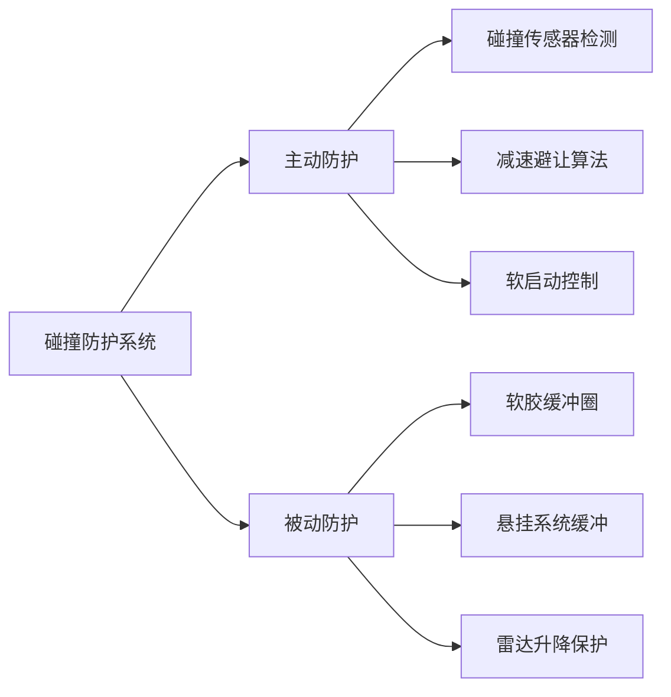
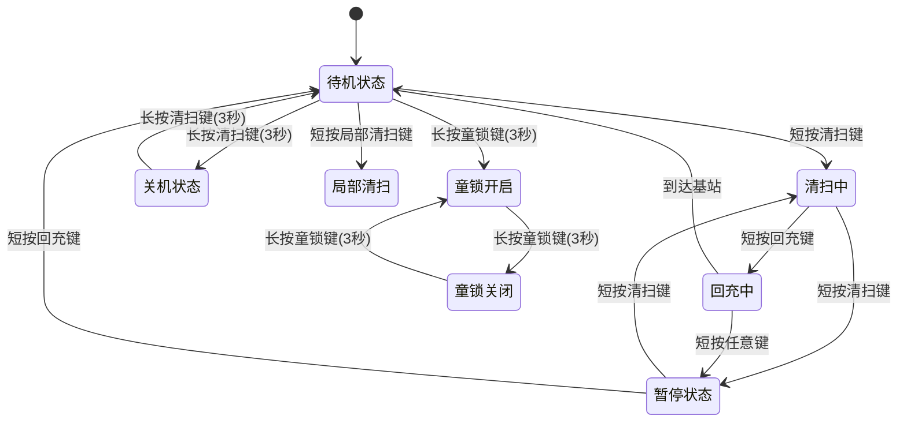
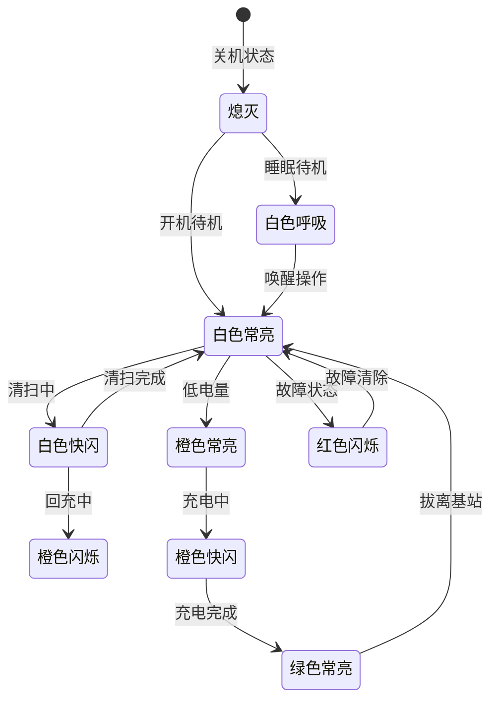
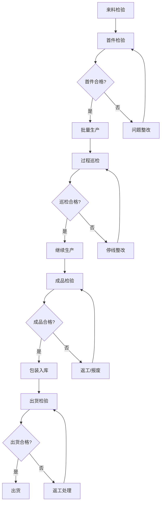

# 石头 G10S Pro 扫地机器人工业设计规格书

**文档版本**：V1.0  
**编制日期**：2022年1月  
**产品代号**：G10S Pro  
**设计机构**：石头科技 × 宾尼法利纳（Pininfarina）  

---

## I. 工业设计概述

### 1.1 视觉语言

石头 G10S Pro 的工业设计展现了**极简主义与科技感融合**的设计语言，整体采用经典的黑白配色，黑色机身搭配红色装饰线条，营造出强烈的科技感和运动感。

#### 设计风格特征

| 设计维度 | 风格描述 | 设计表达 |
|---------|---------|---------|
| 整体风格 | 极简主义 | 简洁的圆形机身，无多余装饰元素 |
| 科技感 | 高科技元素 | 碳纤维纹理、LED灯带、激光雷达模块 |
| 运动感 | 动态线条 | 红色装饰线条贯穿机身，增添活力 |
| 品质感 | 高端精致 | 哑光与高光对比，材质层次丰富 |
| 亲和力 | 家居融合 | 圆润造型，融入家居环境 |

#### 设计荣誉

- **2022年红点设计大奖**
- **2022年德国iF设计大奖**

### 1.2 设计理念

#### 核心设计理念

**"智能·简洁·高效"** —— 以用户为中心，将复杂的技术功能融入简洁的外观设计中，实现形式与功能的完美统一。



#### 设计目标

| 目标维度 | 具体目标 | 实现方式 |
|---------|---------|---------|
| 功能性 | 全能基站集成 | "5+2"功能一体化设计 |
| 美观性 | 高端旗舰质感 | 高品质CMF方案 |
| 易用性 | 简化用户操作 | 直观交互设计 |
| 空间性 | 超薄机身设计 | 96.5mm高度，适应低矮空间 |
| 辨识度 | 品牌家族特征 | 石头科技标志性设计语言 |

### 1.3 目标用户画像

#### 用户审美偏好

| 用户特征 | 审美偏好 | 设计响应 |
|---------|---------|---------|
| 年龄：28-45岁 | 现代简约风格 | 极简设计语言 |
| 收入：中高收入 | 品质感追求 | 高端CMF方案 |
| 家庭：100-200㎡ | 家居融合需求 | 圆润造型、低调配色 |
| 价值观：品质生活 | 科技与美学平衡 | 科技感与亲和力兼顾 |

#### 使用场景分析

| 场景类型 | 设计考量 | 设计响应 |
|---------|---------|---------|
| 客厅/公共区域 | 视觉存在感 | 精致外观，可作为装饰品 |
| 卧室/私密空间 | 噪音与光线 | 静音模式、柔和指示灯 |
| 低矮空间 | 机身高度 | 96.5mm超薄设计 |
| 多层住宅 | 便携性 | 主机重量控制在4.7kg |

---

## II. CMF定义

### 2.1 颜色方案

#### 主机颜色定义

| 部件名称 | 颜色名称 | 色号定义 | 分布区域 | 备注 |
|---------|---------|---------|---------|------|
| 机身上盖 | 哑光黑 | Pantone Black 6C / RGB(30,30,30)「推理」 | 机身顶部主体 | 主色调 |
| 雷达保护罩 | 半透明黑 | Pantone 412C / RGB(45,45,45)「推理」 | 顶部中央凸起 | 透光设计 |
| 按键区域 | 碳纤维纹理黑 | Pantone Black 7C「推理」 | 顶部前侧 | 纹理装饰 |
| 机身侧面 | 哑光黑 | Pantone Black 6C | 机身侧围 | 统一色调 |
| 装饰线条 | 红色 | Pantone 186C / RGB(200,16,46)「推理」 | 按键区域、尾部 | 品牌识别色 |
| 机身底部 | 深灰 | Pantone 425C「推理」 | 底部组件 | 功能性配色 |

#### 基站颜色定义

| 部件名称 | 颜色名称 | 色号定义 | 分布区域 | 备注 |
|---------|---------|---------|---------|------|
| 基站外壳 | 白色/浅灰 | Pantone Cool Gray 1C「推理」 | 基站主体 | 清洁感 |
| 水箱盖 | 半透明白 | Pantone 603C「推理」 | 顶部水箱 | 可视化设计 |
| 集尘仓盖 | 磨砂白 | Pantone 663C「推理」 | 顶部集尘仓 | 统一风格 |
| 内部结构 | 深灰 | Pantone 425C「推理」 | 内部组件 | 功能性配色 |

#### 颜色分布示意图

```
图2-1 主机颜色分布示意图

        ┌─────────────────────────────┐
        │     ┌─────────────────┐     │
        │     │  半透明黑(雷达)  │     │
        │     └─────────────────┘     │
        │  ┌───────────────────────┐  │
        │  │                       │  │
        │  │      哑光黑(上盖)      │  │
        │  │                       │  │
        │  │  ┌───┐ ┌───┐ ┌───┐   │  │
        │  │  │按键│ │按键│ │按键│   │  │ ← 碳纤维纹理+红色装饰线
        │  │  └───┘ └───┘ └───┘   │  │
        │  │                       │  │
        │  └───────────────────────┘  │
        │                             │
        │      哑光黑(侧面)            │
        │                             │
        └─────────────────────────────┘
              ────────────
                深灰(底部)
```

### 2.2 材质选型

#### 主机材质定义

| 部件名称 | 材质类型 | 材质规格 | 物理特性 | 选型理由 |
|---------|---------|---------|---------|---------|
| 机身上盖 | ABS+PC复合塑料 | 高强度工程塑料 | 抗冲击、耐热、尺寸稳定 | 轻量化、成本优化 |
| 雷达保护罩 | PC聚碳酸酯 | 高透光PC | 透光率>90%、耐冲击 | 激光信号传输 |
| 按键面板 | ABS塑料 | 标准ABS | 易成型、表面处理性好 | IMR工艺适配 |
| 机身侧面 | ABS塑料 | 标准ABS | 抗冲击、易加工 | 统一材质体系 |
| 装饰线条 | PC塑料 | 高光泽PC | 高光泽、耐刮擦 | 视觉识别 |
| 底盘结构 | PA66+GF30 | 玻纤增强尼龙 | 高强度、耐磨损 | 承重结构件 |
| 驱动轮 | TPU | 热塑性聚氨酯 | 耐磨、高摩擦系数 | 抓地性能 |
| 万向轮 | POM | 聚甲醛 | 低摩擦、耐磨 | 顺滑转向 |
| 拖布支架 | ABS+金属件 | 复合结构 | 刚性与韧性平衡 | 震动传递 |

#### 基站材质定义

| 部件名称 | 材质类型 | 材质规格 | 物理特性 | 选型理由 |
|---------|---------|---------|---------|---------|
| 基站外壳 | ABS塑料 | 高强度ABS | 抗冲击、易清洁 | 耐用性、成本 |
| 水箱 | PP | 聚丙烯 | 耐化学腐蚀、透明 | 水质可视化 |
| 尘袋支架 | ABS+金属件 | 复合结构 | 结构强度 | 承重需求 |
| 内部管路 | 硅胶/TPU | 食品级材质 | 耐腐蚀、柔韧 | 水路密封 |

### 2.3 表面处理工艺

#### 主机表面处理

| 部件名称 | 处理工艺 | 工艺参数 | 效果描述 | 备注 |
|---------|---------|---------|---------|------|
| 机身上盖 | 磨砂喷涂 | 粗糙度Ra 1.6-3.2「推理」 | 哑光质感、抗指纹 | 主视觉面 |
| 雷达保护罩 | 高透光抛光 | 透光率>90% | 高透光、光滑 | 功能需求 |
| 按键区域 | 模内转印(IMD) | 碳纤维纹理 | 耐磨、不褪色 | 装饰效果 |
| 机身侧面 | 磨砂咬花 | 咬花深度0.05-0.1mm「推理」 | 细腻手感、防刮 | 触感优化 |
| 装饰线条 | 钢琴烤漆 | 高光泽UV涂层 | 镜面效果、高光泽 | 品牌识别 |
| 底部组件 | 喷砂处理 | 粗糙度Ra 3.2-6.3「推理」 | 耐磨、防滑 | 功能性处理 |

#### 基站表面处理

| 部件名称 | 处理工艺 | 工艺参数 | 效果描述 | 备注 |
|---------|---------|---------|---------|------|
| 基站外壳 | 哑光喷涂 | 粗糙度Ra 1.6-3.2「推理」 | 哑光质感、易清洁 | 主视觉面 |
| 水箱盖 | 高光抛光 | 透光处理 | 透明可视 | 功能需求 |
| 操作面板 | 丝印工艺 | - | 标识清晰 | 操作指引 |

### 2.4 CMF设计验证矩阵



---

## III. 外观参数

### 3.1 整体尺寸

#### 主机尺寸规格

| 参数项 | 数值 | 公差 | 说明 |
|--------|------|------|------|
| 整体长度 | 353mm | ±2mm | 含边刷最大长度 |
| 整体宽度 | 350mm | ±2mm | 圆形机身直径 |
| 整体高度 | 96.5mm | ±1mm | 含雷达标准高度 |
| 雷达降低后高度 | 79.5mm | ±1mm | 进入低矮空间 |
| 雷达凸起高度 | 17mm | ±0.5mm | 雷达模块高度 |
| 机身净重 | 约4.7kg | ±0.2kg | 主机重量 |
| 整机毛重 | 约13kg | ±0.5kg | 含基站及配件 |

#### 主机尺寸示意图

```
图3-1 主机尺寸示意图（侧视图）

                    ┌─────────────────────┐
                    │    雷达保护罩        │ ← 高度: 17mm
                    │   (直径: 约60mm)     │
                ┌───┴─────────────────────┴───┐
                │                             │
                │        机身上盖              │
                │                             │
                │    ┌───┐ ┌───┐ ┌───┐       │
                │    │按键│ │按键│ │按键│       │
                │    └───┘ └───┘ └───┘       │
                │                             │
                │        机身主体              │ ← 高度: 79.5mm
                │                             │
    ────────────┴─────────────────────────────┴────────────
                │                             │
                │        底盘组件              │
                │  ┌─────┐         ┌─────┐    │
                │  │边刷 │         │主刷 │    │
                │  └─────┘         └─────┘    │
                │  ┌─────────────────────┐    │
                │  │      拖布支架        │    │
                │  └─────────────────────┘    │
                └─────────────────────────────┘
                    │                       │
                    └───────┬───────────────┘
                            │
                        ┌───┴───┐
                        │万向轮  │
                        └───────┘
                
                ←───────────────────────────→
                        直径: 350mm
                
                总高度: 96.5mm
```

```
图3-2 主机尺寸示意图（俯视图）

                        前方
                         ↑
                ┌─────────────────────┐
                │   ┌─────────────┐   │
                │   │  雷达模块    │   │
                │   └─────────────┘   │
                │                     │
                │  ┌───┐ ┌───┐ ┌───┐  │
                │  │ ● │ │ ● │ │ ● │  │ ← 按键区域
                │  └───┘ └───┘ └───┘  │
                │                     │
                │                     │
    左侧  ─────│      机身主体        │─────  右侧
                │                     │
                │                     │
                │                     │
                │  ┌───────────────┐  │
                │  │   结构光发射器  │  │ ← AI避障传感器
                │  └───────────────┘  │
                └─────────────────────┘
                    │             │
                ┌───┘             └───┐
                │边刷               │
                └─────────────────────┘
                         ↓
                        后方
                
            ←───────────────────────────→
                    直径: 350mm
```

#### 基站尺寸规格

| 参数项 | 数值 | 公差 | 说明 |
|--------|------|------|------|
| 基站长度 | 422mm | ±3mm | 深度方向 |
| 基站宽度 | 492mm | ±3mm | 宽度方向 |
| 基站高度 | 420mm | ±3mm | 含水箱高度 |
| 基站净重 | 约8kg | ±0.3kg | 不含水状态 |
| 清水箱容量 | 3L | ±50ml | 标称容量 |
| 污水箱容量 | 2.5L | ±50ml「推理」 | 标称容量 |
| 尘袋容量 | 2.5L | ±0.1L | 标称容量 |

#### 基站尺寸示意图

```
图3-3 基站尺寸示意图（正视图）

    ┌─────────────────────────────────────────────┐
    │                                             │
    │  ┌─────────┐  ┌─────────┐  ┌─────────────┐ │
    │  │ 污水箱  │  │ 清水箱  │  │   集尘仓    │ │
    │  │  2.5L   │  │   3L    │  │    2.5L     │ │
    │  │         │  │         │  │             │ │
    │  │  ┌───┐  │  │  ┌───┐  │  │    ┌───┐    │ │
    │  │  │提手│  │  │  │提手│  │  │    │尘袋│    │ │
    │  │  └───┘  │  │  └───┘  │  │    └───┘    │ │
    │  └─────────┘  └─────────┘  └─────────────┘ │
    │                                             │
    │              ┌───────────────┐              │
    │              │   基站主体     │              │
    │              │               │              │
    │              │   ┌───────┐   │              │
    │              │   │充电座 │   │              │
    │              │   └───────┘   │              │
    │              │               │              │
    │              └───────────────┘              │
    │                                             │
    └─────────────────────────────────────────────┘
    
    ←───────────────────────────────────────────→
                    宽度: 492mm
    
    总高度: 420mm
```

### 3.2 关键部件尺寸

#### 传感器布局尺寸

| 传感器类型 | 位置 | 尺寸规格 | 安装要求 |
|-----------|------|---------|---------|
| LDS激光雷达 | 顶部中央 | 直径约60mm，高度17mm | 360°旋转空间 |
| 3D结构光发射器 | 正面两侧内凹处 | 约20×10mm「推理」 | 前方无遮挡 |
| RGB摄像头 | 正面中央 | 约8mm直径「推理」 | 视野角>120° |
| LED补光灯 | 正面摄像头旁 | 约5mm直径「推理」 | 补光角度可调 |
| 超声波沿墙传感器 | 侧面 | 约15mm直径「推理」 | 侧面外露 |
| 地毯识别传感器 | 底部前端 | 约20mm直径「推理」 | 底部外露 |
| 悬崖传感器 | 底部边缘6组 | 每组约10mm直径「推理」 | 底部外露 |

#### 清洁组件尺寸

| 组件名称 | 尺寸规格 | 重量 | 备注 |
|---------|---------|------|------|
| 主刷 | 直径约50mm，长度约180mm「推理」 | 约80g「推理」 | TPU胶刷 |
| 边刷 | 直径约80mm「推理」 | 约20g「推理」 | 三叶设计 |
| 拖布支架 | 约250×80mm「推理」 | 约100g「推理」 | 含震动模组 |
| 拖布 | 约250×80mm「推理」 | 约30g「推理」 | 超细纤维 |
| 尘盒 | 约150×100×80mm「推理」 | 约150g「推理」 | 400ml容量 |
| 水箱 | 约120×80×60mm「推理」 | 约100g「推理」 | 200ml容量 |

### 3.3 包装尺寸

| 参数项 | 数值 | 说明 |
|--------|------|------|
| 外包装尺寸 | 540×510×480mm | 长×宽×高 |
| 毛重 | 约15.8kg | 含基站和全部配件 |
| 包装材质 | 高强度瓦楞纸 | 内衬EVA缓冲材料 |
| 环保标准 | RoHS合规 | 可回收利用 |

### 3.4 外观组件层级结构



---

## IV. 人机工程学设计

### 4.1 安全设计

#### 碰撞风险区域识别

| 风险区域 | 风险描述 | 设计措施 | 验证标准 |
|---------|---------|---------|---------|
| 机身边缘 | 碰撞家具、人体 | 360°软胶缓冲圈 | 碰撞力<5N「推理」 |
| 雷达凸起 | 卡困风险 | 可升降设计 | 自动降下保护 |
| 底部开口 | 夹手风险 | 警示标识 | 说明书提醒 |
| 基站开口 | 夹手风险 | 安全间隙>15mm | 手指无法伸入 |
| 水箱提手 | 割伤风险 | 圆角处理 | R>3mm |

#### 圆角半径设计

| 部件位置 | 圆角半径 | 设计理由 |
|---------|---------|---------|
| 机身外缘 | R≥5mm | 碰撞安全、家居保护 |
| 按键边缘 | R≥1mm | 触感舒适 |
| 水箱提手 | R≥3mm | 握持舒适、防割伤 |
| 基站边角 | R≥10mm | 安全防撞 |
| 内部结构 | R≥0.5mm | 应力集中缓解 |

#### 缓冲结构设计



### 4.2 操作舒适度设计

#### 按键操作设计

| 设计项 | 参数值 | 设计理由 |
|--------|--------|---------|
| 按键高度 | 凸出表面1.5mm「推理」 | 便于盲操作定位 |
| 按键面积 | ≥15mm直径「推理」 | 手指操作舒适 |
| 按键间距 | ≥10mm「推理」 | 防止误触 |
| 按键材质 | 软胶覆膜 | 触感舒适 |
| 按键背光 | LED指示 | 状态可视化 |

#### 水箱操作设计

| 设计项 | 参数值 | 设计理由 |
|--------|--------|---------|
| 提手设计 | 外置提手 | 便于提取 |
| 提手宽度 | ≥80mm「推理」 | 双指操作舒适 |
| 水箱重量 | <2kg（满水） | 单手可提 |
| 开盖角度 | 90°-120°「推理」 | 便于加水/倒水 |
| 卡扣力度 | 5-10N「推理」 | 易开易关 |

#### 基站操作设计

| 设计项 | 参数值 | 设计理由 |
|--------|--------|---------|
| 操作高度 | 800-1200mm「推理」 | 站立操作舒适 |
| 水箱位置 | 顶部 | 无需弯腰 |
| 尘袋位置 | 顶部 | 便于更换 |
| 指示标识 | 大字体、高对比 | 易于识别 |

### 4.3 可维护性设计

#### 模块化程度

| 模块名称 | 拆卸方式 | 工具需求 | 拆卸时间 |
|---------|---------|---------|---------|
| 尘盒 | 一键弹出 | 无 | <5秒 |
| 水箱 | 提手提取 | 无 | <5秒 |
| 主刷 | 卡扣释放 | 无 | <10秒 |
| 边刷 | 直接拔出 | 无 | <5秒 |
| 拖布 | 魔术贴撕下 | 无 | <5秒 |
| 滤网 | 直接取出 | 无 | <5秒 |
| 尘袋 | 提手取出 | 无 | <10秒 |

#### 易拆解设计要点

| 设计要点 | 具体措施 | 用户价值 |
|---------|---------|---------|
| 无工具设计 | 所有日常维护无需工具 | 降低使用门槛 |
| 一键操作 | 尘盒、水箱一键取放 | 操作便捷 |
| 可视化指示 | 拆卸方向箭头标识 | 操作直观 |
| 防呆设计 | 不对称接口设计 | 防止装反 |
| 快拆结构 | 卡扣式连接 | 快速拆装 |

#### 维修接口要求

| 接口类型 | 位置 | 用途 |
|---------|------|------|
| USB调试口 | 底部隐藏 | 固件升级、日志导出 |
| 电池接口 | 底部盖板内 | 电池更换 |
| 传感器接口 | 各模块内部 | 传感器更换 |

---

## V. 物理交互设计

### 5.1 按键与触控

#### 按键配置

| 按键名称 | 位置 | 类型 | 尺寸 | 触发力度 | 行程 | 反馈方式 |
|---------|------|------|------|---------|------|---------|
| 局部清扫/童锁键 | 顶部前侧左 | 机械按键 | Φ15mm「推理」 | 1.5-2.5N「推理」 | 0.8-1.2mm「推理」 | 触觉+LED |
| 清扫/开关机键 | 顶部前侧中 | 机械按键 | Φ15mm「推理」 | 1.5-2.5N「推理」 | 0.8-1.2mm「推理」 | 触觉+LED |
| 回充键 | 顶部前侧右 | 机械按键 | Φ15mm「推理」 | 1.5-2.5N「推理」 | 0.8-1.2mm「推理」 | 触觉+LED |

#### 按键操作逻辑



#### 按键手感曲线

```
图5-1 按键手感曲线示意图

    力(N)
      ↑
    3 │         ┌────┐
      │        /      \
    2 │       /        \
      │      /          \
    1 │     /            \
      │    /              \
    0 │───┴────────────────┴───→ 行程(mm)
      0   0.5  1.0  1.5  2.0
      
      └─触发点─┘  └─回弹区─┘
      
    说明：
    - 触发力度: 1.5-2.5N
    - 行程: 0.8-1.2mm
    - 回弹力: 0.5-1.0N
    - 手感: 清脆、有段落感
```

### 5.2 显示与指示

#### LED指示灯配置

| 指示灯名称 | 位置 | 数量 | 颜色 | 显示模式 |
|-----------|------|------|------|---------|
| 电源指示灯 | 按键区域 | 1 | 白色 | 常亮/呼吸/熄灭 |
| 工作状态灯 | 机身侧面 | 若干 | 白色 | 流动效果 |
| 充电指示灯 | 基站 | 1 | 橙色/绿色 | 充电中/充满 |
| Wi-Fi指示灯 | 按键区域 | 1 | 蓝色 | 连接状态 |

#### LED灯语逻辑



#### LED显示状态定义

| 状态 | 颜色 | 显示模式 | 含义 |
|------|------|---------|------|
| 关机 | 熄灭 | 无 | 设备关闭 |
| 待机 | 白色 | 常亮 | 准备就绪 |
| 睡眠 | 白色 | 呼吸（2秒周期） | 节能待机 |
| 清扫中 | 白色 | 快闪（0.5秒周期） | 正在工作 |
| 回充中 | 橙色 | 闪烁（1秒周期） | 返回基站 |
| 低电量 | 橙色 | 常亮 | 电量<20% |
| 充电中 | 橙色 | 快闪（0.5秒周期） | 正在充电 |
| 充满电 | 绿色 | 常亮 | 电量100% |
| 故障 | 红色 | 闪烁（0.5秒周期） | 需要处理 |
| Wi-Fi连接 | 蓝色 | 常亮 | 网络已连接 |
| Wi-Fi配网 | 蓝色 | 快闪 | 配网模式 |

### 5.3 接口设计

#### 外部接口配置

| 接口类型 | 位置 | 数量 | 规格 | 插拔寿命 | 备注 |
|---------|------|------|------|---------|------|
| 电源接口 | 基站背面 | 1 | 国标三插10A/250V | >10000次 | 固定连接 |
| 充电触点 | 主机底部 | 2组 | 弹性触点 | >50000次 | 自动对接 |
| USB调试口 | 主机底部 | 1 | Type-C | >1000次 | 隐藏设计 |

#### 充电触点设计

| 设计项 | 参数值 | 说明 |
|--------|--------|------|
| 触点数量 | 2组（主+备） | 提升可靠性 |
| 触点材质 | 镀金铜合金 | 导电性、耐腐蚀 |
| 触点直径 | Φ3mm「推理」 | 接触面积 |
| 弹性行程 | 2-3mm「推理」 | 对接容差 |
| 对接精度 | ±5mm「推理」 | 自动对准 |

### 5.4 音频交互硬件

#### 扬声器配置

| 参数项 | 规格值 | 说明 |
|--------|--------|------|
| 扬声器数量 | 1个 | 语音播报 |
| 额定功率 | 1W「推理」 | 音量足够 |
| 频响范围 | 200Hz-10kHz「推理」 | 语音清晰 |
| 音量等级 | 3档可调 | 静音/标准/大声 |

#### 麦克风配置

| 参数项 | 规格值 | 说明 |
|--------|--------|------|
| 麦克风数量 | 1个「推理」 | 语音交互 |
| 灵敏度 | -38dB±3dB「推理」 | 远场拾音 |
| 频响范围 | 100Hz-10kHz「推理」 | 语音识别 |
| 拾音距离 | 5m「推理」 | 远场唤醒 |

---

## VI. 外观质量控制

### 6.1 外观缺陷分类

#### 缺陷等级定义

| 缺陷等级 | 定义 | 判定标准 | 处理方式 |
|---------|------|---------|---------|
| 致命缺陷(CR) | 影响安全或功能 | 不允许存在 | 报废处理 |
| 严重缺陷(MA) | 明显影响外观 | A面不允许，B面≤1处 | 返工/降级 |
| 轻微缺陷(MI) | 不明显影响外观 | A面≤2处，B面≤3处 | 可接受 |
| 允许缺陷 | 正常工艺范围 | 符合限度样板 | 正常接受 |

#### 外观检验区域划分

```
图6-1 外观检验区域划分示意图

    主机外观区域划分：
    
    ┌─────────────────────────────┐
    │                             │
    │         A面（正面）          │ ← 高可见区域
    │     顶部及按键区域           │    最严格标准
    │                             │
    │  ─────────────────────────  │
    │                             │
    │         B面（侧面）          │ ← 中可见区域
    │       机身侧面区域           │    一般标准
    │                             │
    │  ─────────────────────────  │
    │                             │
    │         C面（底部）          │ ← 低可见区域
    │       底部及内部             │    宽松标准
    │                             │
    └─────────────────────────────┘
```

### 6.2 表面质量要求

#### 外观面质量标准

| 检验项目 | A面标准 | B面标准 | C面标准 | 检验方法 |
|---------|---------|---------|---------|---------|
| 划痕 | 不允许 | 长度<5mm，深度<0.02mm | 长度<10mm | 目视/放大镜 |
| 凹陷 | 不允许 | 直径<1mm，深度<0.1mm | 直径<2mm | 目视/触感 |
| 凸起 | 不允许 | 直径<1mm，高度<0.1mm | 直径<2mm | 目视/触感 |
| 色差 | ΔE<1.0 | ΔE<1.5 | ΔE<2.0 | 色差仪 |
| 气纹 | 不允许 | 面积<5mm² | 面积<10mm² | 目视 |
| 熔接痕 | 不允许 | 长度<5mm，不明显 | 长度<10mm | 目视 |
| 飞边 | 不允许 | 不允许 | 高度<0.1mm | 目视/触感 |

#### 表面粗糙度要求

| 部件名称 | 粗糙度Ra | 测量方向 | 备注 |
|---------|---------|---------|------|
| 哑光面 | 1.6-3.2μm | 任意方向 | 主视觉面 |
| 高光面 | 0.2-0.4μm | 任意方向 | 装饰线条 |
| 咬花面 | 3.2-6.3μm | 任意方向 | 侧面 |
| 功能面 | 0.8-1.6μm | 任意方向 | 接触面 |

### 6.3 材料性能要求

#### 机械性能要求

| 性能项目 | 测试标准 | 要求值 | 测试方法 |
|---------|---------|--------|---------|
| 拉伸强度 | GB/T 1040 | >45MPa | 万能试验机 |
| 弯曲强度 | GB/T 9341 | >70MPa | 万能试验机 |
| 冲击强度 | GB/T 1843 | >20kJ/m² | 冲击试验机 |
| 硬度 | GB/T 2411 | >80（邵氏D） | 硬度计 |

#### 耐候性能要求

| 性能项目 | 测试条件 | 要求值 | 测试方法 |
|---------|---------|--------|---------|
| 耐热性 | 70°C×24h | 无变形 | 恒温箱 |
| 耐寒性 | -20°C×24h | 无开裂 | 低温箱 |
| 耐湿热 | 40°C/95%RH×48h | 无变化 | 恒温恒湿箱 |
| 耐光性 | UV照射200h | ΔE<2.0 | 紫外老化箱 |

#### 耐化学性能要求

| 测试介质 | 测试条件 | 要求值 | 测试方法 |
|---------|---------|--------|---------|
| 清洁剂 | 5%溶液擦拭 | 无变化 | 擦拭测试 |
| 酒精 | 75%乙醇擦拭 | 无变化 | 擦拭测试 |
| 汗液 | 人工汗液浸泡24h | 无变化 | 浸泡测试 |
| 油污 | 食用油滴落 | 无渗透 | 滴落测试 |

### 6.4 耐久性要求

#### 表面耐磨性

| 测试项目 | 测试条件 | 要求值 | 测试方法 |
|---------|---------|--------|---------|
| 耐磨性 | TABER磨耗500转 | 磨耗量<20mg | TABER磨耗仪 |
| 耐刮擦 | 钢丝绒#0000，500g负载 | 无明显划痕 | 刮擦测试 |
| 耐擦洗 | 清洁布擦拭1000次 | 无变化 | 擦洗测试 |

#### 涂层附着力

| 测试项目 | 测试条件 | 要求值 | 测试方法 |
|---------|---------|--------|---------|
| 附着力 | 百格测试 | ≥4B | GB/T 9286 |
| 铅笔硬度 | 三菱铅笔 | ≥HB | GB/T 6739 |
| 耐冲击 | 500g×50cm | 无脱落 | GB/T 1732 |

### 6.5 质量检验流程



---

## VII. 附录

### 7.1 术语定义

| 术语 | 定义 |
|------|------|
| CMF | Color, Material, Finish，颜色、材质、表面处理 |
| IMD | In-Mold Decoration，模内装饰技术 |
| Ra | 算术平均粗糙度 |
| ΔE | 色差值 |
| A面 | 高可见外观面 |
| B面 | 中可见外观面 |
| C面 | 低可见外观面 |
| CR | Critical，致命缺陷 |
| MA | Major，严重缺陷 |
| MI | Minor，轻微缺陷 |

### 7.2 参考标准

| 标准编号 | 标准名称 |
|---------|---------|
| GB/T 1040 | 塑料拉伸性能的测定 |
| GB/T 9341 | 塑料弯曲性能的测定 |
| GB/T 1843 | 塑料悬臂梁冲击强度的测定 |
| GB/T 2411 | 塑料邵氏硬度试验方法 |
| GB/T 9286 | 色漆和清漆漆膜的划格试验 |
| GB/T 6739 | 色漆和清漆铅笔法测定漆膜硬度 |
| GB/T 1732 | 漆膜耐冲击测定法 |
| GB/T 1766 | 色漆和清漆涂层老化的评级方法 |

### 7.3 文档修订记录

| 版本 | 日期 | 修订内容 | 作者 |
|------|------|---------|------|
| V1.0 | 2022-01 | 初始版本发布 | 工业设计部 |

---

*本工业设计规格书基于石头G10S Pro深度产品调研报告及产品需求文档编制，部分参数标注「推理」的内容为基于行业经验的合理推演。*
