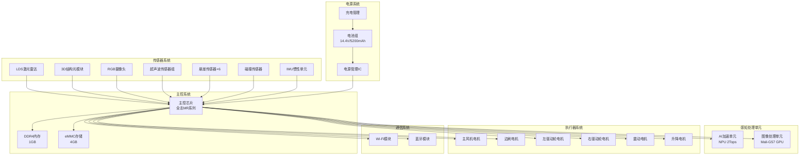
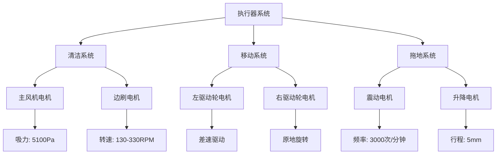
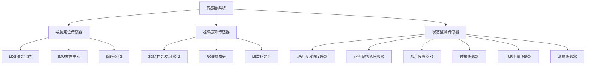
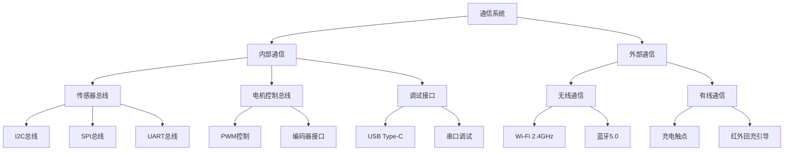

# 石头 G10S Pro 扫地机器人硬件需求说明书

**文档版本**：V1.0  
**编制日期**：2022年1月  
**产品代号**：G10S Pro  
**硬件平台**：G10S-HW-01  

---

## I. 系统架构

### 1.1 硬件系统总体架构

石头 G10S Pro 硬件系统采用分层分布式架构，以主控芯片为核心，通过多种通信总线连接传感器系统、执行器系统和电源管理系统，实现扫地机器人的智能化清洁功能。

#### 系统架构框图



### 1.2 核心控制系统

#### 1.2.1 主控芯片规格

| 规格项 | 需求值 | 说明 |
|--------|--------|------|
| 芯片供应商 | 全志科技 | 国产芯片方案 |
| 芯片系列 | MR系列 | 机器人专用芯片 |
| CPU架构 | 八核ARM Cortex-A55 | 主处理器核心 |
| CPU主频 | ≥1.8GHz「推理」 | 满足实时运算需求 |
| 协处理器 | RISC-V核心 | 异构架构，低功耗待机 |
| GPU | Arm Mali-G57 | 图形处理、图像预处理 |
| NPU算力 | 2Tops | AI加速，障碍物识别 |
| 制程工艺 | 12nm「推理」 | 平衡性能与功耗 |
| 封装形式 | BGA封装「推理」 | 高集成度设计 |

#### 1.2.2 内存与存储配置

| 规格项 | 需求值 | 说明 |
|--------|--------|------|
| 运行内存 | ≥1GB DDR4 | 系统运行、地图数据缓存 |
| 内存位宽 | 32bit「推理」 | 数据带宽 |
| 内存频率 | ≥1600MHz「推理」 | 数据传输速率 |
| 存储容量 | ≥4GB eMMC | 固件、地图、日志存储 |
| 存储接口 | eMMC 5.1「推理」 | 高速存储接口 |
| 预留扩展 | 支持SD卡扩展「推理」 | 固件升级、日志导出 |

#### 1.2.3 主控系统性能要求

| 性能指标 | 需求值 | 测试条件 |
|---------|--------|---------|
| 开机启动时间 | <30秒 | 冷启动至就绪状态 |
| 系统响应延迟 | <100ms | 用户指令响应 |
| 地图处理能力 | 支持4张地图 | 多楼层地图存储 |
| AI推理帧率 | ≥15fps | 障碍物识别 |
| 多任务处理 | ≥5个并发任务 | 清洁、建图、避障并行 |

### 1.3 专用处理单元

#### 1.3.1 运动控制单元

| 规格项 | 需求值 | 说明 |
|--------|--------|------|
| 控制方式 | 主控芯片集成 | 无独立MCU |
| 控制周期 | <10ms | 实时控制要求 |
| PWM通道数 | ≥10路 | 电机驱动控制 |
| 编码器接口 | ≥4路 | 电机位置反馈 |
| ADC通道数 | ≥8路 | 传感器数据采集 |

#### 1.3.2 感知处理单元

| 处理单元 | 功能描述 | 性能要求 |
|---------|---------|---------|
| NPU | AI障碍物识别 | 27种障碍物实时识别 |
| ISP | 图像信号处理 | 支持RGB摄像头输入 |
| DSP | 音频信号处理 | 语音识别、降噪处理 |
| 视频编码 | H.264/H.265 | 视频通话编码 |

---

## II. 执行器系统

### 2.1 执行器清单

石头 G10S Pro 共配备 6 个执行器，分布于清洁系统、移动系统和拖地系统。



### 2.2 主风机电机

#### 2.2.1 电机规格

| 规格项 | 需求值 | 说明 |
|--------|--------|------|
| 电机类型 | 无刷直流电机（BLDC） | 高效率、长寿命 |
| 额定电压 | 14.4V DC | 电池电压 |
| 额定功率 | 40-50W「推理」 | 最大吸力时功率 |
| 最大转速 | 15000-20000RPM「推理」 | Max+模式 |
| 最大吸力 | 5100Pa | 风道入口测量 |
| 噪音水平 | <65dB | 标准模式 |
| 使用寿命 | >2000小时 | MTBF要求 |

#### 2.2.2 驱动控制

| 控制项 | 需求值 | 说明 |
|--------|--------|------|
| 驱动方式 | 三相无刷驱动 | FOC控制 |
| 调速方式 | PWM调速 | 三档吸力调节 |
| 控制精度 | ±5%转速 | 稳速控制 |
| 启动时间 | <3秒 | 达到额定转速 |
| 软启动 | 支持 | 降低启动冲击 |

### 2.3 边刷电机

#### 2.3.1 电机规格

| 规格项 | 需求值 | 说明 |
|--------|--------|------|
| 电机类型 | 有刷直流电机 | 成本优化 |
| 额定电压 | 5V或12V DC「推理」 | 降压供电 |
| 额定功率 | 1-2W「推理」 | 边刷清扫功率 |
| 转速范围 | 130-330RPM | 智能调速 |
| 转矩 | ≥10mN·m「推理」 | 克服清扫阻力 |
| 使用寿命 | >1500小时 | MTBF要求 |

#### 2.3.2 智能调速控制

| 场景 | 转速 | 控制逻辑 |
|------|------|---------|
| 正常清扫 | 130RPM | 低速旋转，避免打飞垃圾 |
| 沿墙清扫 | 330RPM | 高速旋转，清扫墙边灰尘 |
| 遇障碍物 | 停止或反转 | 防止推动障碍物 |

### 2.4 驱动轮电机

#### 2.4.1 电机规格

| 规格项 | 需求值 | 说明 |
|--------|--------|------|
| 电机类型 | 有刷直流电机 | 成本优化 |
| 数量 | 2个 | 左右差速驱动 |
| 额定电压 | 14.4V DC | 电池电压 |
| 额定功率 | 5-10W×2「推理」 | 驱动功率 |
| 额定转速 | 100-150RPM「推理」 | 车轮转速 |
| 额定转矩 | ≥50mN·m「推理」 | 爬坡能力 |
| 爬坡能力 | ≤15° | 越过门槛、地毯 |
| 使用寿命 | >2000小时 | MTBF要求 |

#### 2.4.2 运动控制参数

| 控制项 | 需求值 | 说明 |
|--------|--------|------|
| 最大速度 | 0.3m/s | 标准清扫速度 |
| 加速度 | 0.2m/s²「推理」 | 平稳启停 |
| 转弯半径 | 0 | 原地旋转 |
| 定位精度 | <5cm | 编码器+IMU融合 |
| 悬挂行程 | 10-15mm「推理」 | 四连杆独立悬挂 |

### 2.5 震动电机

#### 2.5.1 电机规格

| 规格项 | 需求值 | 说明 |
|--------|--------|------|
| 电机类型 | 线性振动马达 | 声波震动 |
| 额定电压 | 5V或12V DC「推理」 | 驱动电压 |
| 震动频率 | 1650-3000次/分钟 | 三档调节 |
| 震动幅度 | 约5mm「推理」 | 拖布擦拭幅度 |
| 震动质量 | 约100g「推理」 | 金属振动器 |
| 使用寿命 | >1500小时 | MTBF要求 |

#### 2.5.2 震动档位控制

| 档位 | 频率 | 适用场景 |
|------|------|---------|
| 弱档 | 1650次/分钟（28Hz） | 轻度污渍 |
| 中档 | 2300次/分钟（38Hz） | 日常清洁 |
| 强档 | 3000次/分钟（50Hz） | 顽固污渍 |

### 2.6 升降电机

#### 2.6.1 电机规格

| 规格项 | 需求值 | 说明 |
|--------|--------|------|
| 电机类型 | 步进电机或直流电机 | 精确位置控制 |
| 额定电压 | 5V或12V DC「推理」 | 驱动电压 |
| 升降行程 | 5mm | 拖布抬起高度 |
| 升降速度 | <2秒「推理」 | 快速响应 |
| 保持力 | ≥5N「推理」 | 保持拖布抬起 |
| 使用寿命 | >10000次循环 | 可靠性要求 |

#### 2.6.2 升降触发场景

| 触发场景 | 动作 | 控制逻辑 |
|---------|------|---------|
| 识别地毯 | 升起拖布 | 超声波传感器触发 |
| 返回基站 | 升起拖布 | 避免打湿基站 |
| 回洗拖布 | 升起拖布 | 进入清洗位置 |
| 打滑检测 | 升起拖布 | 脱困辅助 |
| 越障时 | 升起拖布 | 避免拖布损坏 |

### 2.7 执行器驱动电路

#### 2.7.1 电机驱动方案

| 电机类型 | 驱动方案 | 驱动芯片「推理」 |
|---------|---------|-----------------|
| 主风机BLDC | 三相桥驱动 | DRV8313或同类 |
| 边刷DC | H桥驱动 | DRV8871或同类 |
| 驱动轮DC×2 | H桥驱动×2 | DRV8871×2或同类 |
| 震动电机 | 线性驱动 | 专用驱动IC |
| 升降电机 | H桥驱动 | DRV8871或同类 |

#### 2.7.2 电机保护功能

| 保护功能 | 描述 | 实现方式 |
|---------|------|---------|
| 过流保护 | 电流超过阈值时停机 | 硬件限流+软件检测 |
| 过热保护 | 温度过高时降功率 | NTC温度检测 |
| 堵转保护 | 电机堵转时停机 | 电流异常检测 |
| 欠压保护 | 电压过低时停机 | 电压监测 |

---

## III. 传感器系统

### 3.1 传感器系统架构



### 3.2 导航定位传感器

#### 3.2.1 LDS激光雷达

| 规格项 | 需求值 | 说明 |
|--------|--------|------|
| 传感器类型 | 三角测距激光雷达 | 成本优化 |
| 扫描频率 | 5-10Hz「推理」 | 实时建图 |
| 角度分辨率 | ≤1° | 精确建图 |
| 测距范围 | 0.15-12m「推理」 | 室内建图需求 |
| 测距精度 | ±30mm「推理」 | 定位精度要求 |
| 扫描角度 | 360° | 全向扫描 |
| 升降功能 | 支持 | 降至7.95cm高度 |
| 升降电机 | 步进电机「推理」 | 精确位置控制 |

#### 3.2.2 IMU惯性单元

| 规格项 | 需求值 | 说明 |
|--------|--------|------|
| 传感器类型 | 6轴IMU | 3轴加速度+3轴陀螺仪 |
| 加速度量程 | ±2g~±16g | 运动检测 |
| 陀螺仪量程 | ±250~±2000°/s | 角速度检测 |
| 通信接口 | I2C/SPI | 数据传输 |
| 采样率 | ≥100Hz「推理」 | 实时姿态更新 |
| 零偏稳定性 | <0.1°/s「推理」 | 长时间漂移控制 |

#### 3.2.3 编码器

| 规格项 | 需求值 | 说明 |
|--------|--------|------|
| 传感器类型 | 光电编码器 | 驱动轮位置检测 |
| 数量 | 2个 | 左右轮各一个 |
| 分辨率 | ≥360脉冲/转「推理」 | 位置精度 |
| 最大转速 | ≥200RPM | 匹配电机转速 |
| 输出信号 | A/B相正交 | 方向识别 |

### 3.3 避障感知传感器

#### 3.3.1 3D结构光模块

| 规格项 | 需求值 | 说明 |
|--------|--------|------|
| 传感器类型 | 线激光结构光 | 精准测距 |
| 数量 | 2个 | 正面两侧内凹处 |
| 激光波长 | 850nm | 红外激光 |
| 激光等级 | Class 1 | 人眼安全 |
| 测距范围 | 0-80cm | 避障需求 |
| 测距精度 | ±5mm「推理」 | 毫米级测距 |
| 视场角 | 约70°「推理」 | 前方覆盖 |
| 安全标准 | IEC 60825-1 | 激光安全认证 |

#### 3.3.2 RGB摄像头

| 规格项 | 需求值 | 说明 |
|--------|--------|------|
| 传感器类型 | CMOS图像传感器 | AI视觉识别 |
| 分辨率 | ≥720P「推理」 | 物体识别需求 |
| 视场角 | ≥120° | 广角视野 |
| 帧率 | ≥15fps | 实时识别 |
| 光圈 | F2.0~F2.8「推理」 | 进光量 |
| 自动曝光 | 支持 | 适应不同光照 |
| 夜视功能 | LED补光 | 暗光环境工作 |

#### 3.3.3 LED补光灯

| 规格项 | 需求值 | 说明 |
|--------|--------|------|
| 灯珠类型 | 白光LED | Pro版配置 |
| 数量 | 1-2个「推理」 | 补光需求 |
| 功率 | 0.5-1W「推理」 | 补光亮度 |
| 色温 | 5000-6500K「推理」 | 自然白光 |
| 控制方式 | 自动开关 | 暗光环境自动开启 |

### 3.4 状态监测传感器

#### 3.4.1 超声波传感器

| 传感器位置 | 功能描述 | 技术参数 |
|-----------|---------|---------|
| 侧面沿墙传感器 | 沿墙距离检测 | 检测距离0-30cm「推理」 |
| 底部地毯传感器 | 地毯材质识别 | 识别地毯/硬质地面 |

#### 3.4.2 悬崖传感器

| 规格项 | 需求值 | 说明 |
|--------|--------|------|
| 传感器类型 | 红外光电传感器 | 跌落检测 |
| 数量 | 6组 | 底部边缘分布 |
| 检测高度 | ≥3cm | 楼梯边缘检测 |
| 响应时间 | <10ms | 快速响应 |
| 防误触发 | 支持 | 避免地毯误判 |

#### 3.4.3 碰撞传感器

| 规格项 | 需求值 | 说明 |
|--------|--------|------|
| 传感器类型 | 机械开关/光电传感器 | 碰撞检测 |
| 检测范围 | 360°环绕 | 全向碰撞检测 |
| 触发力 | 1-3N「推理」 | 灵敏度要求 |
| 缓冲结构 | 软胶缓冲圈 | 保护机身和家具 |

#### 3.4.4 其他传感器

| 传感器类型 | 功能描述 | 技术参数 |
|-----------|---------|---------|
| 电池电量传感器 | 电量监测 | 精度±5%「推理」 |
| 电池温度传感器 | 电池温度监测 | NTC热敏电阻 |
| 环境温度传感器 | 工作环境温度 | 范围0-40°C |
| 水箱液位传感器 | 水箱水量检测 | 浮漂开关「推理」 |

### 3.5 传感器接口定义

| 传感器类型 | 通信接口 | 数据更新率 | 备注 |
|-----------|---------|-----------|------|
| LDS激光雷达 | UART/USB | 5-10Hz | 高速数据传输 |
| IMU | I2C/SPI | ≥100Hz | 实时姿态更新 |
| 编码器 | GPIO | ≥1kHz | 位置反馈 |
| 3D结构光 | I2C/SPI | 15-30Hz「推理」 | 测距数据 |
| RGB摄像头 | MIPI CSI | 15-30fps | 图像数据 |
| 超声波传感器 | GPIO/I2C | 10-20Hz「推理」 | 距离数据 |
| 悬崖传感器 | GPIO | ≥100Hz | 实时检测 |
| 碰撞传感器 | GPIO | ≥100Hz | 实时检测 |

---

## IV. 通信系统

### 4.1 通信系统架构



### 4.2 内部通信

#### 4.2.1 I2C总线

| 总线参数 | 需求值 | 连接设备 |
|---------|--------|---------|
| 总线数量 | 2-3组「推理」 | 分组管理 |
| 时钟频率 | 100kHz/400kHz | 标准模式/快速模式 |
| 连接设备 | IMU、超声波传感器、RTC等 | 低速传感器 |
| 地址分配 | 7位地址 | 最多128个设备 |

#### 4.2.2 SPI总线

| 总线参数 | 需求值 | 连接设备 |
|---------|--------|---------|
| 总线数量 | 1-2组「推理」 | 高速设备 |
| 时钟频率 | ≤50MHz | 高速数据传输 |
| 连接设备 | Flash存储、高速传感器 | 高速数据设备 |
| 数据位宽 | 8bit | 标准SPI |

#### 4.2.3 UART总线

| 总线参数 | 需求值 | 连接设备 |
|---------|--------|---------|
| 串口数量 | ≥4组「推理」 | 多设备通信 |
| 波特率 | 115200~921600bps | 高速串口 |
| 连接设备 | LDS雷达、调试接口、Wi-Fi模块 | 串口设备 |
| 数据格式 | 8N1 | 标准格式 |

#### 4.2.4 PWM控制

| 参数项 | 需求值 | 说明 |
|--------|--------|------|
| PWM通道数 | ≥10路 | 电机驱动控制 |
| PWM频率 | 10kHz~50kHz | 电机驱动频率 |
| 分辨率 | ≥10bit | 速度控制精度 |
| 死区时间 | 可配置 | H桥驱动保护 |

### 4.3 外部通信

#### 4.3.1 Wi-Fi模块

| 规格项 | 需求值 | 说明 |
|--------|--------|------|
| 协议标准 | IEEE 802.11 b/g/n | 2.4GHz频段 |
| 最大速率 | 150Mbps「推理」 | 数据传输速率 |
| 天线类型 | PCB天线或外置天线 | 内置设计 |
| 发射功率 | ≤20dBm | 符合法规要求 |
| 接收灵敏度 | -90dBm@1Mbps「推理」 | 接收能力 |
| 安全协议 | WPA/WPA2 | 无线安全 |
| 工作模式 | Station/AP | 连接路由/热点模式 |

#### 4.3.2 蓝牙模块

| 规格项 | 需求值 | 说明 |
|--------|--------|------|
| 蓝牙版本 | Bluetooth 5.0 | 低功耗蓝牙 |
| 工作频段 | 2.4GHz ISM | 全球通用 |
| 最大速率 | 2Mbps「推理」 | BLE高速模式 |
| 通信距离 | ≤10m | 近距离通信 |
| 配对方式 | 快速配对 | 简化操作 |
| 应用场景 | 设备配对、OTA升级 | 辅助通信 |

#### 4.3.3 红外回充引导

| 规格项 | 需求值 | 说明 |
|--------|--------|------|
| 发射端位置 | 基站 | 红外引导信号 |
| 接收端位置 | 主机前端 | 红外接收器 |
| 引导距离 | 0-3m「推理」 | 回充引导范围 |
| 引导角度 | 约180°「推理」 | 前方引导 |
| 信号编码 | 特定编码 | 防止干扰 |

#### 4.3.4 充电触点通信

| 规格项 | 需求值 | 说明 |
|--------|--------|------|
| 触点数量 | 2组（主+备） | 充电+数据通信 |
| 通信协议 | 1-Wire或自定义 | 基站握手 |
| 数据速率 | ≤100kbps「推理」 | 低速通信 |
| 功能 | 充电状态、基站识别 | 智能充电 |

### 4.4 调试接口

| 接口类型 | 位置 | 功能描述 |
|---------|------|---------|
| USB Type-C | 底部隐藏 | 固件升级、日志导出 |
| UART调试口 | 内部测试点 | 开发调试 |
| JTAG/SWD | 内部测试点 | 芯片调试 |

---

## V. 电源管理系统

### 5.1 供电方案

#### 5.1.1 电池系统规格

| 规格项 | 需求值 | 说明 |
|--------|--------|------|
| 电池类型 | 锂离子电池 | 高能量密度 |
| 标称电压 | 14.4V | 4S配置 |
| 电压范围 | 12.0V~16.8V | 工作电压范围 |
| 额定容量 | 5200mAh | 续航能力 |
| 额定能量 | 74.88Wh | 电压×容量 |
| 充电截止电压 | 16.8V | 4.2V×4 |
| 放电截止电压 | 12.0V | 3.0V×4 |
| 最大放电电流 | 10A「推理」 | 峰值功率需求 |
| 最大充电电流 | 2A「推理」 | 快速充电 |
| 电池组配置 | 4S1P或2S2P「推理」 | 电压/容量配置 |
| 供应商 | 德赛电池/欣旺达 | 核心供应商 |

#### 5.1.2 电池保护功能

| 保护功能 | 触发条件 | 保护动作 |
|---------|---------|---------|
| 过充保护 | 电压>4.25V/节 | 切断充电回路 |
| 过放保护 | 电压<2.5V/节 | 切断放电回路 |
| 过流保护 | 电流>15A「推理」 | 切断放电回路 |
| 短路保护 | 短路检测 | 切断回路 |
| 过温保护 | 温度>60°C | 停止充放电 |
| 均衡功能 | 电芯压差>0.1V | 主动/被动均衡 |

### 5.2 充电系统

#### 5.2.1 基站充电规格

| 规格项 | 需求值 | 说明 |
|--------|--------|------|
| 输入电压 | 100-240V AC | 全球电压兼容 |
| 输入频率 | 50/60Hz | 全球频率兼容 |
| 输出电压 | 20V DC「推理」 | 充电输出 |
| 输出功率 | 65W「推理」 | 快速充电 |
| 充电效率 | ≥85%「推理」 | 能效要求 |
| 充电时间 | <4小时 | 完全充电 |
| 充电提速 | 30% | 相比前代产品 |

#### 5.2.2 充电管理方案

| 功能项 | 需求值 | 说明 |
|--------|--------|------|
| 充电方式 | 恒流恒压（CC-CV） | 标准充电曲线 |
| 充电电流 | 1-2A可调 | 充电速度控制 |
| 充电截止 | 电流<0.1C | 充满判断 |
| 预充电 | 支持 | 过放电池恢复 |
| 温度监测 | NTC检测 | 充电温度保护 |
| 谷点充电 | 支持 | 夜间低谷充电 |

### 5.3 电源分配

#### 5.3.1 电源树架构

```
图5-1 电源树架构图

                    ┌─────────────────────────────────────┐
                    │           电池组 14.4V              │
                    │         (12.0V~16.8V)              │
                    └──────────────┬──────────────────────┘
                                   │
                    ┌──────────────┴──────────────┐
                    │         电源管理IC           │
                    │   (PMIC + DC-DC转换器)       │
                    └──────────────┬──────────────┘
                                   │
        ┌──────────────┬───────────┼───────────┬──────────────┐
        │              │           │           │              │
        ▼              ▼           ▼           ▼              ▼
   ┌─────────┐   ┌─────────┐ ┌─────────┐ ┌─────────┐   ┌─────────┐
   │ 5V轨    │   │ 3.3V轨  │ │ 1.8V轨  │ │ 1.1V轨  │   │ 14.4V轨 │
   │ (Buck)  │   │ (Buck)  │ │ (LDO)   │ │ (LDO)   │   │ (直通)  │
   └────┬────┘   └────┬────┘ └────┬────┘ └────┬────┘   └────┬────┘
        │              │           │           │              │
        │              │           │           │              │
   ┌────┴────┐   ┌────┴────┐      │      ┌────┴────┐   ┌────┴────┐
   │ 外设供电│   │外设供电 │      │      │ CPU核心 │   │电机供电 │
   │         │   │         │      │      │         │   │         │
   │• 边刷电机│   │• IMU    │      │      │• CPU    │   │• 主风机 │
   │• 升降电机│   │• 超声波 │      │      │• NPU    │   │• 驱动轮 │
   │• 震动电机│   │• 悬崖传感器│    │      │• 内存   │   │         │
   │• LED灯  │   │• Wi-Fi  │      │      │         │   │         │
   │• 摄像头 │   │• 蓝牙   │      │      │         │   │         │
   │• 雷达   │   │• 闪光存储│      │      │         │   │         │
   └─────────┘   └─────────┘      │      └─────────┘   └─────────┘
                                  │
                             ┌────┴────┐
                             │IO供电   │
                             │         │
                             │• GPIO   │
                             │• 外设IO │
                             └─────────┘
```

#### 5.3.2 各电压轨规格

| 电压轨 | 电压值 | 最大电流 | 供电设备 | 转换效率 |
|--------|--------|---------|---------|---------|
| 14.4V轨 | 12.0-16.8V | 10A | 主风机、驱动轮电机 | 直通 |
| 5V轨 | 5.0V±5% | 3A「推理」 | 边刷、升降、震动电机、摄像头、雷达 | ≥90% |
| 3.3V轨 | 3.3V±3% | 2A「推理」 | IMU、超声波、Wi-Fi、蓝牙、Flash | ≥90% |
| 1.8V轨 | 1.8V±3% | 0.5A「推理」 | IO供电、低速外设 | ≥85% |
| 1.1V轨 | 1.1V±3% | 2A「推理」 | CPU核心、NPU核心 | ≥85% |

#### 5.3.3 功耗预算

| 工作模式 | 功耗估算 | 说明 |
|---------|---------|------|
| 待机模式 | <1W | 睡眠待机 |
| 标准清扫 | 30-40W | 标准吸力+移动 |
| 强力清扫 | 50-60W | Max+吸力+移动 |
| 扫拖同步 | 35-45W | 清扫+拖地震动 |
| 回充模式 | 15-20W | 低速移动 |
| 充电模式 | 65W | 快速充电 |

---

## VI. PCB与电子架构

### 6.1 PCB设计要求

#### 6.1.1 主板规格

| 规格项 | 需求值 | 说明 |
|--------|--------|------|
| PCB层数 | 6-8层「推理」 | 高速信号完整性 |
| PCB材质 | FR-4高Tg | 耐热性要求 |
| 板厚 | 1.6mm | 标准厚度 |
| 最小线宽/线距 | 4/4mil | 高密度布线 |
| 最小过孔 | 0.2mm | 高密度设计 |
| 表面处理 | ENIG或HASL | 可焊性要求 |
| 阻抗控制 | 50Ω/100Ω差分 | 高速信号 |
| 外形尺寸 | 根据机身空间 | 圆形/异形设计 |

#### 6.1.2 PCB布局要求

| 设计要求 | 描述 | 目的 |
|---------|------|------|
| 电源分区 | 模拟电源与数字电源分离 | 降低噪声干扰 |
| 接地设计 | 完整接地层 | 信号完整性 |
| 散热设计 | 大电流器件散热焊盘 | 热管理 |
| EMI设计 | 关键信号屏蔽 | 电磁兼容 |
| 防护设计 | 接口ESD防护 | 可靠性提升 |

### 6.2 接口定义

#### 6.2.1 外部接口

| 接口名称 | 位置 | 接口类型 | 功能描述 |
|---------|------|---------|---------|
| 充电触点 | 底部 | 弹性触点×2组 | 充电+通信 |
| USB调试口 | 底部隐藏 | USB Type-C | 固件升级、调试 |
| 传感器接口 | 各传感器位置 | 板对板连接器 | 传感器连接 |
| 电机接口 | 各电机位置 | 板对线连接器 | 电机驱动 |

#### 6.2.2 内部连接器

| 连接器类型 | 数量 | 连接设备 | 备注 |
|-----------|------|---------|------|
| FPC连接器 | 3-5个 | 摄像头、雷达、显示屏 | 高速信号 |
| 板对板连接器 | 2-3组 | 主板与按键板 | 控制信号 |
| 线对板连接器 | 5-8个 | 电机、传感器 | 电源与信号 |
| 天线连接器 | 1-2个 | Wi-Fi/蓝牙天线 | RF信号 |

### 6.3 电子架构设计

#### 6.3.1 主板功能分区

```
图6-1 主板功能分区示意图

    ┌─────────────────────────────────────────────────────┐
    │                                                     │
    │   ┌─────────────┐     ┌─────────────────────────┐  │
    │   │   电源管理   │     │        主控芯片          │  │
    │   │   DC-DC     │     │    (全志MR系列)         │  │
    │   │   LDO       │     │                         │  │
    │   └─────────────┘     │   ┌─────┐   ┌─────┐    │  │
    │                       │   │CPU  │   │NPU  │    │  │
    │   ┌─────────────┐     │   └─────┘   └─────┘    │  │
    │   │   电机驱动   │     │                         │  │
    │   │   H桥×N     │     │   ┌─────┐   ┌─────┐    │  │
    │   │             │     │   │GPU  │   │内存  │    │  │
    │   └─────────────┘     │   └─────┘   └─────┘    │  │
    │                       └─────────────────────────┘  │
    │   ┌─────────────┐                                  │
    │   │  传感器接口  │     ┌─────────────────────────┐  │
    │   │  I2C/SPI    │     │      无线通信模块        │  │
    │   │  UART       │     │   Wi-Fi + 蓝牙          │  │
    │   └─────────────┘     └─────────────────────────┘  │
    │                                                     │
    │   ┌─────────────┐     ┌─────────────────────────┐  │
    │   │   外设接口   │     │       存储器            │  │
    │   │   USB/调试   │     │   eMMC Flash           │  │
    │   └─────────────┘     └─────────────────────────┘  │
    │                                                     │
    └─────────────────────────────────────────────────────┘
```

#### 6.3.2 关键信号定义

| 信号类别 | 信号名称 | 电压电平 | 功能描述 |
|---------|---------|---------|---------|
| 电源信号 | VBAT | 12.0-16.8V | 电池电压 |
| 电源信号 | VCC_5V | 5.0V | 5V供电轨 |
| 电源信号 | VCC_3V3 | 3.3V | 3.3V供电轨 |
| 控制信号 | PWM_MOTOR | 3.3V | 电机PWM控制 |
| 控制信号 | DIR_MOTOR | 3.3V | 电机方向控制 |
| 反馈信号 | ENCODER_A/B | 3.3V | 编码器信号 |
| 传感器信号 | SENSOR_DATA | 3.3V | 传感器数据 |
| 通信信号 | UART_TX/RX | 3.3V | 串口通信 |
| 通信信号 | I2C_SDA/SCL | 3.3V | I2C通信 |
| RF信号 | ANT_WIFI | RF | Wi-Fi天线 |
| RF信号 | ANT_BT | RF | 蓝牙天线 |

### 6.4 可靠性设计

#### 6.4.1 ESD防护

| 防护位置 | 防护器件 | 防护等级 | 说明 |
|---------|---------|---------|------|
| USB接口 | TVS二极管 | IEC 61000-4-2 Level 4 | 接触放电8kV |
| 充电触点 | TVS二极管 | IEC 61000-4-2 Level 3 | 接触放电6kV |
| 按键接口 | TVS二极管 | IEC 61000-4-2 Level 3 | 接触放电6kV |
| 天线接口 | ESD二极管 | IEC 61000-4-2 Level 2 | 接触放电4kV |

#### 6.4.2 EMC设计

| 设计项 | 措施 | 目的 |
|--------|------|------|
| 电源滤波 | π型滤波器 | 抑制电源噪声 |
| 信号滤波 | RC滤波 | 抑制信号噪声 |
| 屏蔽设计 | 金属屏蔽罩 | 抑制辐射干扰 |
| 接地设计 | 多点接地 | 降低地阻抗 |
| 布线设计 | 差分走线 | 抑制共模干扰 |

#### 6.4.3 热设计

| 设计项 | 措施 | 目的 |
|--------|------|------|
| PCB散热 | 大面积铜箔 | 热量传导 |
| 器件散热 | 散热焊盘 | 热量散发 |
| 整机散热 | 通风孔设计 | 空气对流 |
| 温度监测 | NTC传感器 | 过温保护 |

---

## VII. 硬件测试需求

### 7.1 功能测试

| 测试项目 | 测试内容 | 通过标准 |
|---------|---------|---------|
| 开机测试 | 正常启动、启动时间 | <30秒启动完成 |
| 充电测试 | 充电功能、充电时间 | <4小时充满 |
| 电机测试 | 各电机运转正常 | 无异常噪音、振动 |
| 传感器测试 | 各传感器数据正常 | 数据准确、响应及时 |
| 通信测试 | Wi-Fi/蓝牙连接正常 | 连接稳定、数据正确 |
| 清洁测试 | 吸力、拖地功能正常 | 达到性能指标 |

### 7.2 性能测试

| 测试项目 | 测试条件 | 通过标准 |
|---------|---------|---------|
| 续航测试 | 标准模式清扫 | >2.5小时 |
| 吸力测试 | Max+模式 | ≥5100Pa |
| 震动测试 | 强档模式 | 3000次/分钟±5% |
| 爬坡测试 | 15°坡度 | 正常通过 |
| 越障测试 | 2cm障碍物 | 正常通过 |

### 7.3 可靠性测试

| 测试项目 | 测试条件 | 通过标准 |
|---------|---------|---------|
| 高温测试 | 40°C×48h | 功能正常 |
| 低温测试 | 0°C×48h | 功能正常 |
| 高湿测试 | 40°C/95%RH×48h | 功能正常 |
| 跌落测试 | 0.5m高度跌落 | 功能正常、无损坏 |
| 振动测试 | 随机振动2小时 | 功能正常 |
| 寿命测试 | 连续工作200小时 | 功能正常 |

### 7.4 安规测试

| 测试项目 | 测试标准 | 通过标准 |
|---------|---------|---------|
| 绝缘电阻 | DC 500V | >10MΩ |
| 耐压测试 | AC 1500V/1min | 无击穿 |
| 接地电阻 | 25A电流 | <0.1Ω |
| 泄漏电流 | 额定电压 | <0.5mA |

---

## VIII. 附录

### 8.1 术语定义

| 术语 | 定义 |
|------|------|
| BLDC | Brushless DC Motor，无刷直流电机 |
| IMU | Inertial Measurement Unit，惯性测量单元 |
| NPU | Neural Processing Unit，神经网络处理单元 |
| PMIC | Power Management IC，电源管理芯片 |
| ESD | Electro-Static Discharge，静电放电 |
| EMC | Electromagnetic Compatibility，电磁兼容 |
| FOC | Field-Oriented Control，磁场定向控制 |
| PWM | Pulse Width Modulation，脉宽调制 |

### 8.2 参考标准

| 标准编号 | 标准名称 |
|---------|---------|
| GB 4706.1 | 家用和类似用途电器的安全 第1部分：通用要求 |
| GB 31241 | 便携式电子产品用锂离子电池和电池组 安全要求 |
| GB/T 17626.2 | 电磁兼容 试验和测量技术 静电放电抗扰度试验 |
| IEC 61000-4-2 | Electromagnetic compatibility - Part 4-2: ESD |
| IEC 60825-1 | Safety of laser products - Part 1: Equipment classification |

### 8.3 文档修订记录

| 版本 | 日期 | 修订内容 | 作者 |
|------|------|---------|------|
| V1.0 | 2022-01 | 初始版本发布 | 硬件部 |

---

*本硬件需求说明书基于石头G10S Pro深度产品调研报告、产品需求文档及工业设计规格书编制，部分参数标注「推理」的内容为基于行业经验的合理推演。*
