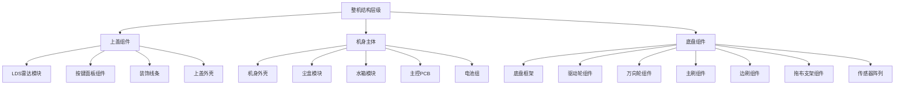
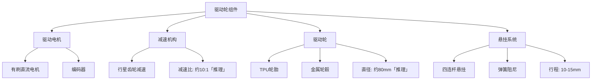
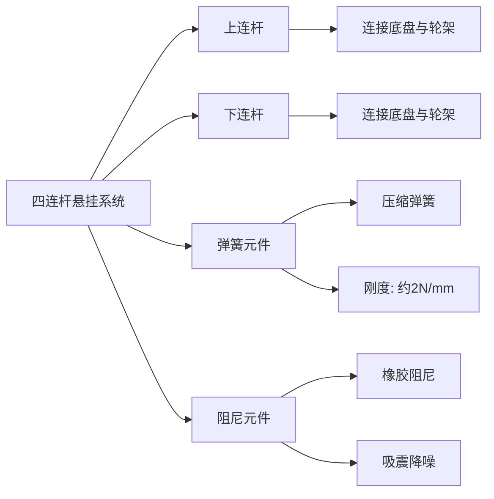
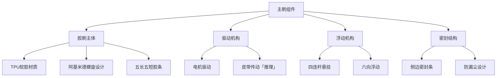
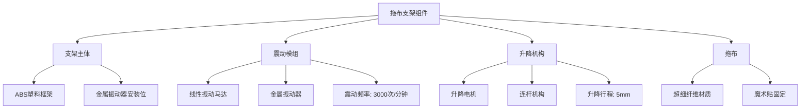
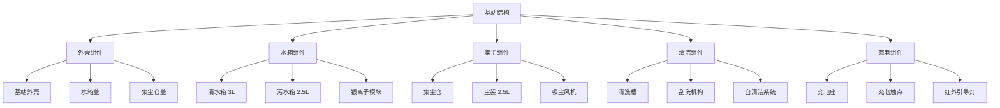
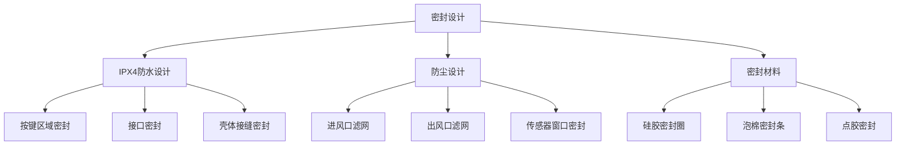
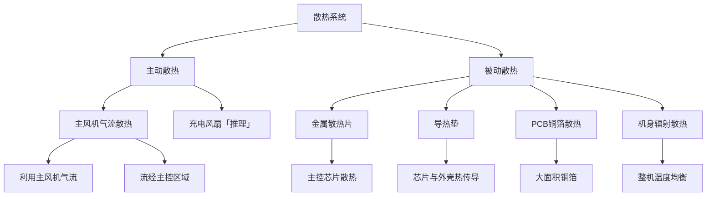
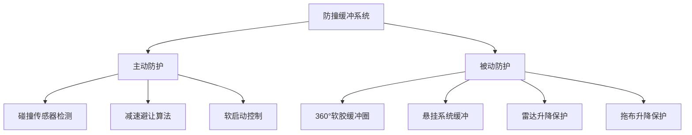
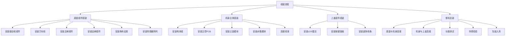

# 石头 G10S Pro 扫地机器人结构设计说明书

**文档版本**：V1.0  
**编制日期**：2022年1月  
**产品代号**：G10S Pro  
**结构平台**：G10S-MD-01  

---

## I. 堆叠方案与结构设计

### 1.1 整体架构

#### 1.1.1 产品物理层级

石头 G10S Pro 采用分层堆叠架构，从上至下依次为：上盖组件、机身主体、底盘组件三个主要层级。整体结构设计充分考虑了功能集成、散热需求和可维护性要求。



#### 1.1.2 主体结构类型

| 结构类型 | 设计方案 | 设计理由 |
|---------|---------|---------|
| 机身形态 | 圆形机身 | 360°旋转清扫、无死角 |
| 壳体结构 | 分体式设计 | 便于组装和维护 |
| 连接方式 | 卡扣+螺丝组合 | 可靠性与可拆性平衡 |
| 悬挂系统 | 四连杆独立悬挂 | 适应不平整地面 |

#### 1.1.3 主要材料选型

| 部件名称 | 材料选型 | 材料规格 | 选型理由 |
|---------|---------|---------|---------|
| 上盖外壳 | ABS+PC复合 | 高强度工程塑料 | 抗冲击、耐热、轻量化 |
| 机身外壳 | ABS塑料 | 标准ABS | 成本优化、易加工 |
| 底盘框架 | PA66+GF30 | 30%玻纤增强尼龙 | 高强度、耐磨损 |
| 雷达保护罩 | PC聚碳酸酯 | 高透光PC | 激光信号传输 |
| 驱动轮 | TPU+金属轴 | 热塑性聚氨酯 | 耐磨、高摩擦系数 |
| 拖布支架 | ABS+金属件 | 复合结构 | 刚性与韧性平衡 |
| 密封件 | 硅胶/橡胶 | 食品级硅胶 | 密封性、耐老化 |

#### 1.1.4 模块化程度

| 模块名称 | 模块化等级 | 拆装方式 | 维护周期 |
|---------|-----------|---------|---------|
| 尘盒模块 | 高度模块化 | 一键弹出 | 每次清洁后 |
| 水箱模块 | 高度模块化 | 提手提取 | 每次清洁后 |
| 主刷模块 | 模块化设计 | 卡扣释放 | 每周清理 |
| 边刷模块 | 模块化设计 | 直接拔出 | 每周清理 |
| 拖布模块 | 高度模块化 | 魔术贴撕下 | 每次清洁后 |
| 滤网模块 | 模块化设计 | 直接取出 | 每月清洗 |
| 电池模块 | 半模块化 | 螺丝固定 | 更换时拆卸 |

### 1.2 移动机构结构设计

#### 1.2.1 驱动轮组件结构

石头 G10S Pro 采用双驱动轮差速驱动方案，配合万向轮实现全向移动能力。



#### 驱动轮结构参数

| 结构参数 | 数值 | 说明 |
|---------|------|------|
| 轮子直径 | 约80mm「推理」 | 通过障碍物能力 |
| 轮子宽度 | 约25mm「推理」 | 接触面积 |
| 轮距（左右轮中心距） | 约240mm「推理」 | 转向灵活性 |
| 悬挂行程 | 10-15mm | 适应不平整地面 |
| 悬挂刚度 | 约2N/mm「推理」 | 承载与舒适性平衡 |
| 最大承重 | 单轮≥5kg | 整机重量支撑 |

#### 1.2.2 万向轮组件结构

| 结构参数 | 数值 | 说明 |
|---------|------|------|
| 轮子直径 | 约30mm「推理」 | 转向灵活性 |
| 轮子材质 | POM | 低摩擦、耐磨 |
| 安装方式 | 弹性卡扣 | 便于更换 |
| 转向角度 | 360°自由旋转 | 全向移动 |

#### 1.2.3 悬挂系统设计



#### 悬挂系统参数

| 参数项 | 数值 | 设计目标 |
|--------|------|---------|
| 悬挂类型 | 四连杆独立悬挂 | 3D灵活浮动 |
| 弹簧刚度 | 约2N/mm「推理」 | 承载能力 |
| 阻尼系数 | 约0.3「推理」 | 振动衰减 |
| 行程范围 | 10-15mm | 越障能力 |
| 侧倾刚度 | 较低 | 适应倾斜地面 |

### 1.3 清洁机构结构设计

#### 1.3.1 主刷组件结构



#### 主刷结构参数

| 结构参数 | 数值 | 说明 |
|---------|------|------|
| 主刷长度 | 约180mm「推理」 | 清洁宽度 |
| 主刷直径 | 约50mm「推理」 | 清洁效率 |
| 胶条数量 | 10条（5长5短） | 降低阻力 |
| 浮动行程 | 前后左右上下各约5mm「推理」 | 3D贴合地面 |
| 驱动方式 | 电机+皮带传动 | 可靠传动 |
| 反转功能 | 支持 | 排出大块物体 |

#### 1.3.2 边刷组件结构

| 结构参数 | 数值 | 说明 |
|---------|------|------|
| 边刷类型 | 单边刷 | 成本优化 |
| 刷叶数量 | 3叶设计 | 清洁效率 |
| 刷叶材质 | 尼龙刷毛 | 耐磨性 |
| 刷叶长度 | 约80mm「推理」 | 墙边清扫 |
| 安装方式 | 快拆卡扣 | 便于更换 |

#### 1.3.3 拖布支架组件结构



#### 拖布支架结构参数

| 结构参数 | 数值 | 说明 |
|---------|------|------|
| 支架长度 | 约250mm「推理」 | 拖地宽度 |
| 支架宽度 | 约80mm「推理」 | 清洁面积 |
| 震动频率 | 1650-3000次/分钟 | 三档调节 |
| 震动幅度 | 约5mm | 擦拭效果 |
| 升降行程 | 5mm | 地毯识别抬起 |
| 拖布材质 | 超细纤维 | 吸水清洁 |

### 1.4 基站结构设计

#### 1.4.1 基站整体架构



#### 1.4.2 基站结构参数

| 结构参数 | 数值 | 说明 |
|---------|------|------|
| 基站尺寸 | 422×492×420mm | 长×宽×高 |
| 基站重量 | 约8kg（不含水） | 稳定性 |
| 清水箱容量 | 3L | 拖地续航 |
| 污水箱容量 | 2.5L「推理」 | 污水收集 |
| 尘袋容量 | 2.5L | 60天免倒 |
| 充电座高度 | 约50mm「推理」 | 机器人对接 |

---

## II. 关键组件固定方案

### 2.1 核心部件固定

#### 2.1.1 主控PCB固定方案

| 固定项 | 固定方式 | 固定位置 | 备注 |
|--------|---------|---------|------|
| 主板固定 | 螺丝+定位柱 | 机身主体中部 | 4-6个固定点 |
| 定位方式 | 定位柱+定位孔 | 精确定位 | 防止位移 |
| 散热接触 | 导热垫+金属支架 | 主芯片位置 | 热传导 |
| 防震设计 | 软胶垫圈 | 螺丝安装位 | 减震保护 |

#### 2.1.2 电池组固定方案

| 固定项 | 固定方式 | 固定位置 | 备注 |
|--------|---------|---------|------|
| 电池组固定 | 螺丝固定+双面胶 | 机身主体后部 | 牢固固定 |
| 保护结构 | 电池仓+缓冲垫 | 独立空间 | 防撞击 |
| 散热设计 | 通风槽+导热垫 | 电池表面 | 温度控制 |
| 更换方式 | 拆卸底部盖板 | 维修接口 | 可更换设计 |

#### 2.1.3 传感器固定方案

| 传感器类型 | 固定方式 | 固定位置 | 精度要求 |
|-----------|---------|---------|---------|
| LDS激光雷达 | 螺丝+定位销 | 顶部中央 | 高精度定位 |
| 3D结构光 | 螺丝+卡扣 | 正面两侧内凹 | 角度校准 |
| RGB摄像头 | 卡扣+点胶 | 正面中央 | 视野角度 |
| 悬崖传感器×6 | 卡扣+点胶 | 底部边缘 | 水平安装 |
| 超声波传感器 | 卡扣 | 侧面/底部 | 外露安装 |
| 碰撞传感器 | 机械结构 | 360°环绕 | 灵敏度调节 |

### 2.2 执行器固定

#### 2.2.1 主风机固定方案

| 固定项 | 固定方式 | 设计要点 |
|--------|---------|---------|
| 风机固定 | 螺丝固定+减震垫 | 降低振动传递 |
| 风道密封 | 泡棉密封圈 | 防止漏风 |
| 进风口设计 | 导流结构 | 优化气流 |
| 出风口设计 | 消音结构 | 降低噪音 |

#### 2.2.2 驱动电机固定方案

| 固定项 | 固定方式 | 设计要点 |
|--------|---------|---------|
| 电机固定 | 螺丝固定+定位销 | 精确定位 |
| 悬挂连接 | 四连杆机构 | 独立悬挂 |
| 轮轴支撑 | 轴承支撑 | 减少摩擦 |
| 编码器安装 | 同轴安装 | 精确测量 |

#### 2.2.3 震动电机固定方案

| 固定项 | 固定方式 | 设计要点 |
|--------|---------|---------|
| 电机固定 | 螺丝固定 | 牢固安装 |
| 震动传递 | 金属振动器 | 高频震动 |
| 隔震设计 | 软胶垫 | 防止共振 |
| 拖布连接 | 魔术贴 | 快速更换 |

### 2.3 密封与连接设计

#### 2.3.1 壳体连接方式

| 连接位置 | 连接方式 | 连接数量 | 备注 |
|---------|---------|---------|------|
| 上盖与机身 | 卡扣+螺丝 | 卡扣8个+螺丝4个 | 可拆设计 |
| 机身与底盘 | 螺丝固定 | 螺丝8-10个 | 牢固连接 |
| 雷达模块与上盖 | 螺丝+卡扣 | 螺丝2个+卡扣2个 | 可升降 |
| 按键面板与上盖 | 卡扣+点胶 | 卡扣4个 | 防水密封 |

#### 2.3.2 防水防尘密封设计



#### 密封方案详情

| 密封位置 | 密封方式 | 密封材料 | 防护等级 |
|---------|---------|---------|---------|
| 按键区域 | 密封圈+点胶 | 硅胶密封圈 | IPX4 |
| 充电接口 | 密封盖 | 橡胶盖 | IPX4 |
| 壳体接缝 | 泡棉密封条 | EVA泡棉 | IPX4 |
| 传感器窗口 | 透明密封片 | PC+密封胶 | IPX4 |
| 进风口 | 滤网 | HEPA滤网 | 防尘 |

### 2.4 组件固定爆炸图

```
图2-1 主机结构爆炸图

    ┌─────────────────────────────────────────────────────┐
    │                    上盖组件                          │
    │  ┌─────────────────────────────────────────────┐   │
    │  │              雷达保护罩                       │   │
    │  │         ┌─────────────────┐                 │   │
    │  │         │   LDS雷达模块    │                 │   │
    │  │         └─────────────────┘                 │   │
    │  │  ┌───┐ ┌───┐ ┌───┐                         │   │
    │  │  │按键│ │按键│ │按键│  ← 按键面板组件       │   │
    │  │  └───┘ └───┘ └───┘                         │   │
    │  │              上盖外壳                        │   │
    │  └─────────────────────────────────────────────┘   │
    └─────────────────────────────────────────────────────┘
                            │
                            │ 卡扣+螺丝连接
                            ▼
    ┌─────────────────────────────────────────────────────┐
    │                    机身主体                          │
    │  ┌─────────────────────────────────────────────┐   │
    │  │  ┌───────┐  ┌───────┐  ┌───────────────┐   │   │
    │  │  │ 尘盒  │  │ 水箱  │  │   主控PCB     │   │   │
    │  │  │ 400ml │  │ 200ml │  │  (全志MR)     │   │   │
    │  │  └───────┘  └───────┘  └───────────────┘   │   │
    │  │                                             │   │
    │  │  ┌─────────────────────────────────────┐   │   │
    │  │  │          电池组 14.4V/5200mAh        │   │   │
    │  │  └─────────────────────────────────────┘   │   │
    │  │              机身外壳                        │   │
    │  └─────────────────────────────────────────────┘   │
    └─────────────────────────────────────────────────────┘
                            │
                            │ 螺丝连接
                            ▼
    ┌─────────────────────────────────────────────────────┐
    │                    底盘组件                          │
    │  ┌─────────────────────────────────────────────┐   │
    │  │  ┌─────┐         主刷          ┌─────┐     │   │
    │  │  │边刷 │  ┌───────────────┐    │驱动轮│     │   │
    │  │  │     │  │  全向浮动胶刷  │    │  左  │     │   │
    │  │  └─────┘  └───────────────┘    └─────┘     │   │
    │  │                                           │   │
    │  │       ┌─────────────────────┐             │   │
    │  │       │     拖布支架组件     │             │   │
    │  │       │  (震动+升降机构)     │             │   │
    │  │       └─────────────────────┘             │   │
    │  │                                           │   │
    │  │  ┌─────┐         万向轮        ┌─────┐   │   │
    │  │  │驱动轮│  ┌───────────────┐  │悬崖  │   │   │
    │  │  │  右  │  │   传感器阵列   │  │传感器│   │   │
    │  │  └─────┘  └───────────────┘  │×6   │   │   │
    │  │                              └─────┘   │   │
    │  │              底盘框架                        │   │
    │  └─────────────────────────────────────────────┘   │
    └─────────────────────────────────────────────────────┘
```

---

## III. 热管理与可靠性设计

### 3.1 散热系统设计

#### 3.1.1 发热源识别

| 发热源 | 功耗范围 | 发热特点 | 散热优先级 |
|--------|---------|---------|-----------|
| 主控芯片 | 2-5W | 持续发热 | 高 |
| 主风机电机 | 40-50W | 高负载发热 | 高 |
| 驱动轮电机 | 5-10W×2 | 间歇发热 | 中 |
| NPU/AI单元 | 1-2W | AI运算发热 | 中 |
| 电池充电 | 65W | 充电时发热 | 高 |
| 无线模块 | 1-2W | 持续低发热 | 低 |

#### 3.1.2 散热方式选择



#### 3.1.3 散热路径设计

| 散热路径 | 热源 | 散热方式 | 散热介质 |
|---------|------|---------|---------|
| 路径1 | 主控芯片 | 导热垫→金属支架→外壳 | 导热硅胶垫 |
| 路径2 | 主风机电机 | 气流冷却 | 空气对流 |
| 路径3 | 驱动电机 | 辐射散热 | 金属外壳 |
| 路径4 | 电池组 | 通风槽+导热垫 | 空气+导热垫 |
| 路径5 | 无线模块 | PCB铜箔散热 | PCB铜箔 |

#### 3.1.4 导热介质选型

| 导热介质 | 应用位置 | 导热系数 | 厚度 |
|---------|---------|---------|------|
| 导热硅胶垫 | 主控芯片 | 3-5 W/m·K | 1-2mm |
| 导热硅脂 | 功率器件 | 2-3 W/m·K | 0.1-0.3mm |
| 相变材料 | 电池组 | 1-2 W/m·K | 1mm |
| 金属散热片 | 主控区域 | 200 W/m·K | 2-3mm |

### 3.2 防护系统设计

#### 3.2.1 防撞缓冲设计



#### 缓冲结构参数

| 缓冲结构 | 材质 | 缓冲行程 | 能量吸收 |
|---------|------|---------|---------|
| 360°缓冲圈 | 软胶（TPE） | 5-10mm | 低速碰撞 |
| 悬挂系统 | 弹簧+阻尼 | 10-15mm | 跌落缓冲 |
| 雷达保护 | 弹性支撑 | 2-3mm | 碰撞保护 |
| 拖布保护 | 升降机构 | 5mm | 地毯保护 |

#### 3.2.2 跌落保护结构

| 保护措施 | 设计方案 | 保护对象 |
|---------|---------|---------|
| 悬崖传感器 | 6组红外传感器 | 楼梯边缘检测 |
| 跌落缓冲 | 悬挂系统+软胶外壳 | 跌落冲击吸收 |
| 关键部件保护 | 内部骨架结构 | PCB、电池保护 |
| 雷达保护 | 可升降设计 | 低矮空间保护 |

#### 3.2.3 过载保护设计

| 保护类型 | 检测方式 | 保护动作 |
|---------|---------|---------|
| 电机过载 | 电流检测 | 停机并报警 |
| 机械卡死 | 位置传感器 | 反转尝试 |
| 拖布打滑 | 转速检测 | 升起拖布 |
| 电池过放 | 电压检测 | 强制回充 |

#### 3.2.4 环境适应性要求

| 环境因素 | 设计要求 | 实现方式 |
|---------|---------|---------|
| 防水等级 | IPX4 | 密封设计 |
| 工作温度 | 0-40°C | 散热设计 |
| 存储温度 | -20-60°C | 材料选型 |
| 工作湿度 | <95%RH | 防潮设计 |
| 抗振动 | 运输振动 | 结构加强 |

### 3.3 可靠性设计

#### 3.3.1 结构可靠性指标

| 可靠性指标 | 目标值 | 验证方法 |
|-----------|--------|---------|
| 跌落测试 | 0.5m高度×6面 | 跌落测试 |
| 振动测试 | 随机振动2小时 | 振动台测试 |
| 碰撞测试 | 10000次碰撞 | 寿命测试 |
| 悬挂寿命 | >100万次循环 | 疲劳测试 |
| 密封寿命 | >500次拆装 | 密封测试 |

#### 3.3.2 材料可靠性

| 材料类型 | 可靠性要求 | 测试标准 |
|---------|-----------|---------|
| 塑料外壳 | 耐候性>500h UV | GB/T 16422.2 |
| 橡胶密封件 | 耐老化>1000h | GB/T 3512 |
| 金属件 | 盐雾测试>48h | GB/T 2423.17 |
| 涂层 | 附着力≥4B | GB/T 9286 |

---

## IV. 组装与维护设计

### 4.1 组装工艺

#### 4.1.1 组装流程



#### 4.1.2 组装精度要求

| 组装项目 | 精度要求 | 检验方法 |
|---------|---------|---------|
| PCB定位 | ±0.5mm | 目视检查 |
| 传感器安装 | ±1mm/±2° | 专用工装 |
| 电机安装 | ±0.5mm | 专用工装 |
| 壳体配合 | 间隙<0.3mm | 塞尺测量 |
| 整机高度 | ±1mm | 高度尺 |

#### 4.1.3 检验标准

| 检验项目 | 检验标准 | 检验方法 |
|---------|---------|---------|
| 外观检验 | 无明显缺陷 | 目视检查 |
| 功能检验 | 所有功能正常 | 功能测试 |
| 尺寸检验 | 符合图纸要求 | 量具测量 |
| 重量检验 | ±100g | 电子秤 |
| 包装检验 | 完整无破损 | 目视检查 |

### 4.2 可维护性设计

#### 4.2.1 模块化拆装设计

| 模块名称 | 拆装方式 | 所需工具 | 拆装时间 |
|---------|---------|---------|---------|
| 尘盒 | 一键弹出 | 无 | <5秒 |
| 水箱 | 提手提取 | 无 | <5秒 |
| 主刷 | 卡扣释放 | 无 | <10秒 |
| 边刷 | 直接拔出 | 无 | <5秒 |
| 拖布 | 魔术贴撕下 | 无 | <5秒 |
| 滤网 | 直接取出 | 无 | <5秒 |
| 尘袋 | 提手取出 | 无 | <10秒 |
| 电池 | 螺丝固定 | 十字螺丝刀 | <5分钟 |
| PCB | 螺丝固定 | 十字螺丝刀 | <10分钟 |

#### 4.2.2 易损件更换方案

| 易损件 | 更换周期 | 更换方式 | 用户可自行更换 |
|--------|---------|---------|---------------|
| 拖布 | 3-6个月 | 魔术贴撕下 | 是 |
| 滤网 | 6-12个月 | 直接取出 | 是 |
| 边刷 | 6-12个月 | 直接拔出 | 是 |
| 主刷 | 12-18个月 | 卡扣释放 | 是 |
| 尘袋 | 60天 | 提手取出 | 是 |
| 电池 | 2-3年 | 螺丝固定 | 需售后 |

#### 4.2.3 维护周期要求

| 维护项目 | 维护周期 | 维护内容 |
|---------|---------|---------|
| 日常维护 | 每次清洁后 | 清空尘盒、清洗拖布 |
| 周维护 | 每周 | 清理主刷、边刷毛发 |
| 月维护 | 每月 | 清洗滤网、清理基站 |
| 季度维护 | 每季度 | 检查传感器、清洁水箱 |
| 年度维护 | 每年 | 深度清洁、检查易损件 |

### 4.3 维修接口设计

#### 4.3.1 调试接口

| 接口类型 | 位置 | 功能 | 访问方式 |
|---------|------|------|---------|
| USB Type-C | 底部隐藏 | 固件升级、日志导出 | 打开盖板 |
| UART调试口 | 内部 | 开发调试 | 拆机 |
| JTAG/SWD | 内部 | 芯片调试 | 拆机 |

#### 4.3.2 故障诊断接口

| 故障类型 | 诊断方式 | 提示方式 |
|---------|---------|---------|
| 硬件故障 | 自检程序 | 语音+APP提示 |
| 传感器故障 | 数据异常检测 | 故障代码 |
| 电机故障 | 电流检测 | 故障代码 |
| 电池故障 | 电压检测 | 故障代码 |

---

## V. 附录

### 5.1 术语定义

| 术语 | 定义 |
|------|------|
| IPX4 | 防溅水等级，可承受各方向溅水 |
| TPU | 热塑性聚氨酯，耐磨弹性材料 |
| PA66+GF30 | 30%玻纤增强尼龙66 |
| PCB | Printed Circuit Board，印刷电路板 |
| LDS | Laser Distance Sensor，激光测距传感器 |
| IMU | Inertial Measurement Unit，惯性测量单元 |
| MTBF | Mean Time Between Failures，平均无故障时间 |

### 5.2 参考标准

| 标准编号 | 标准名称 |
|---------|---------|
| GB/T 2423.17 | 电工电子产品环境试验 第2部分：试验方法 试验Ka：盐雾 |
| GB/T 16422.2 | 塑料实验室光源暴露试验方法 第2部分：氙弧灯 |
| GB/T 3512 | 硫化橡胶或热塑性橡胶 热空气加速老化和耐热试验 |
| GB/T 9286 | 色漆和清漆 漆膜的划格试验 |
| GB 4706.1 | 家用和类似用途电器的安全 第1部分：通用要求 |

### 5.3 文档修订记录

| 版本 | 日期 | 修订内容 | 作者 |
|------|------|---------|------|
| V1.0 | 2022-01 | 初始版本发布 | 结构设计部 |

---

*本结构设计说明书基于石头G10S Pro深度产品调研报告、工业设计规格书及硬件需求说明书编制，部分参数标注「推理」的内容为基于行业经验的合理推演。*
