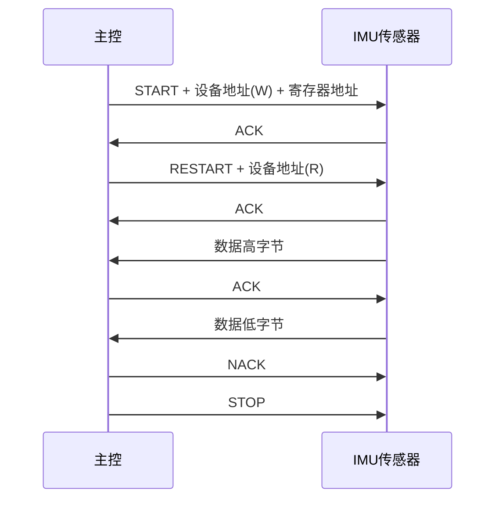
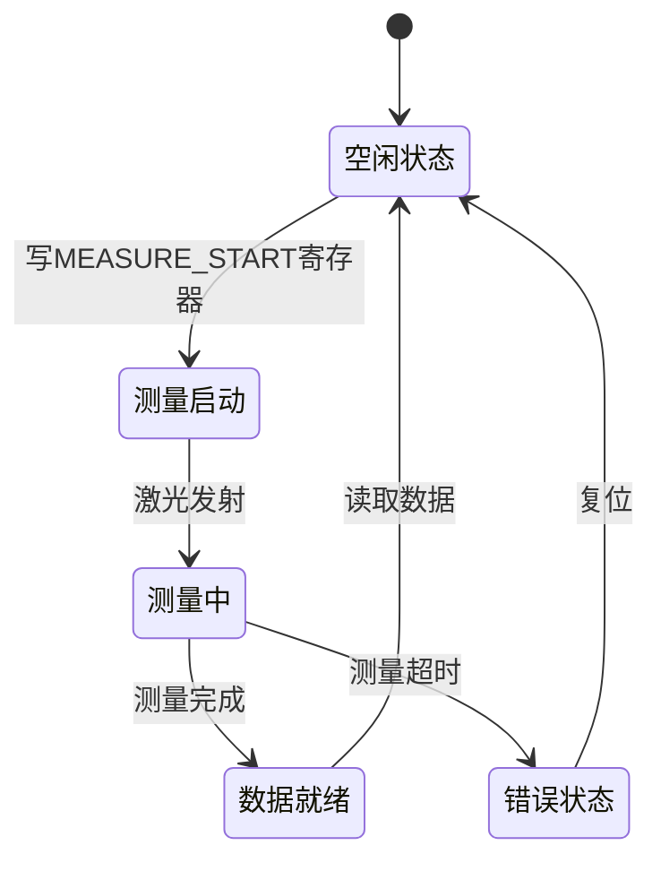
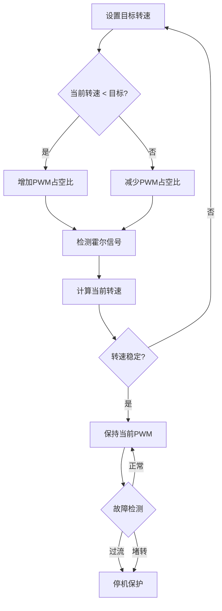
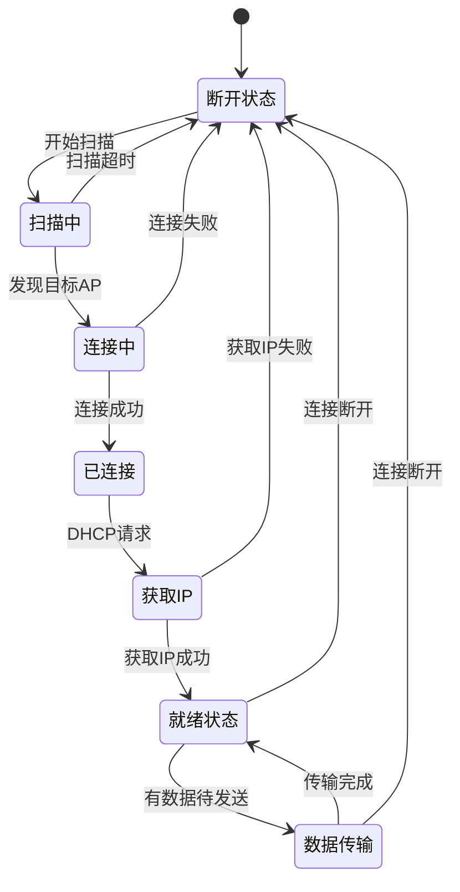
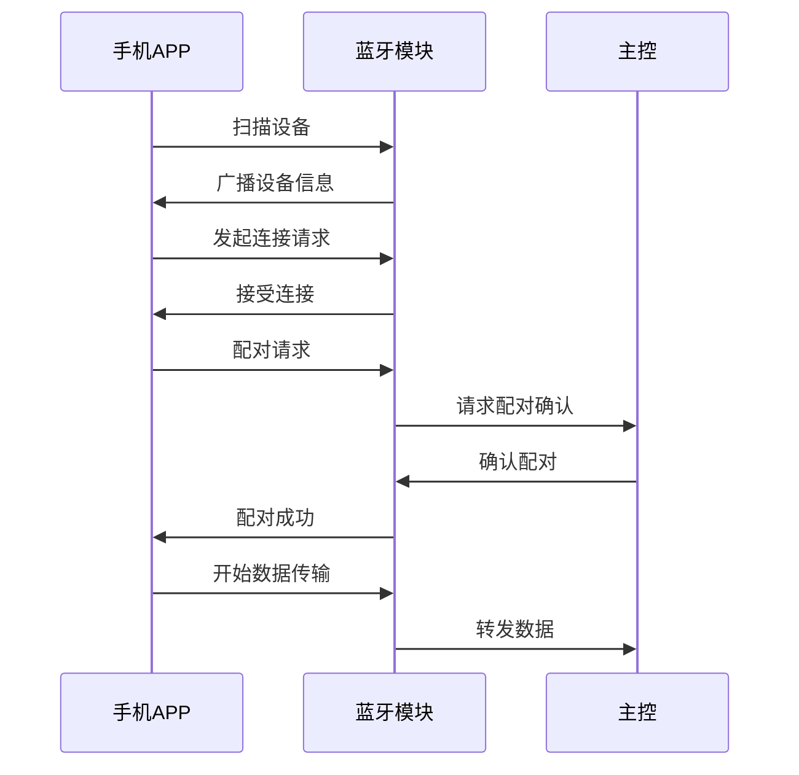

# 石头 G10S Pro 扫地机器人接口控制文档

**文档版本**：V1.0  
**编制日期**：2022年1月  
**产品代号**：G10S Pro  
**接口版本**：ICD-01  

---

## I. 物理层定义

### 1.1 接口分配总览

石头 G10S Pro 主控芯片通过多种通信接口连接传感器系统、执行器系统和通信系统，实现整机的协调控制。

#### 1.1.1 接口分配表

| 接口编号 | 接口类型 | 连接对象 | 通讯协议 | 速率 | 引脚数量 |
|---------|---------|---------|---------|------|---------|
| IF-001 | UART0 | LDS激光雷达 | 自定义协议 | 921600bps | 2 (TX/RX) |
| IF-002 | UART1 | Wi-Fi模块 | AT指令 | 115200bps | 2 (TX/RX) |
| IF-003 | UART2 | 蓝牙模块 | HCI协议 | 115200bps | 2 (TX/RX) |
| IF-004 | I2C0 | IMU传感器 | I2C协议 | 400kHz | 2 (SDA/SCL) |
| IF-005 | I2C1 | 超声波传感器组 | I2C协议 | 100kHz | 2 (SDA/SCL) |
| IF-006 | SPI0 | Flash存储 | SPI协议 | 50MHz | 4 (MOSI/MISO/SCK/CS) |
| IF-007 | SPI1 | 3D结构光模块 | SPI协议 | 25MHz | 4 (MOSI/MISO/SCK/CS) |
| IF-008 | MIPI CSI | RGB摄像头 | MIPI CSI-2 | 1.5Gbps/lane | 4 (DATA/CLK) |
| IF-009 | PWM0-3 | 主风机电机 | PWM | 20kHz | 3 (U/V/W) |
| IF-010 | PWM4-5 | 边刷电机 | PWM | 10kHz | 2 (IN1/IN2) |
| IF-011 | PWM6-7 | 驱动轮电机左 | PWM | 10kHz | 2 (IN1/IN2) |
| IF-012 | PWM8-9 | 驱动轮电机右 | PWM | 10kHz | 2 (IN1/IN2) |
| IF-013 | PWM10 | 震动电机 | PWM | 5kHz | 1 (PWM) |
| IF-014 | PWM11 | 升降电机 | PWM | 10kHz | 2 (IN1/IN2) |
| IF-015 | GPIO | 悬崖传感器×6 | GPIO中断 | - | 6 |
| IF-016 | GPIO | 碰撞传感器 | GPIO中断 | - | 4 |
| IF-017 | GPIO | 按键输入 | GPIO | - | 3 |
| IF-018 | GPIO | LED控制 | GPIO/PWM | - | 4 |
| IF-019 | ADC | 电池电压/电流 | ADC | 1kHz采样 | 2 |
| IF-020 | ADC | 编码器×2 | ADC/计数器 | 10kHz | 4 |
| IF-021 | USB | 调试接口 | USB 2.0 | 480Mbps | 4 (D+/D-/VBUS/GND) |

#### 1.1.2 接口拓扑图

```mermaid
flowchart TD
    subgraph 主控系统
        A[主控芯片<br/>全志MR系列]
    end
    
    subgraph 传感器接口
        B1[LDS激光雷达<br/>UART0]
        B2[IMU传感器<br/>I2C0]
        B3[3D结构光<br/>SPI1]
        B4[RGB摄像头<br/>MIPI CSI]
        B5[超声波传感器<br/>I2C1]
        B6[悬崖传感器×6<br/>GPIO]
        B7[碰撞传感器<br/>GPIO]
    end
    
    subgraph 执行器接口
        C1[主风机电机<br/>PWM0-3]
        C2[边刷电机<br/>PWM4-5]
        C3[驱动轮电机左<br/>PWM6-7]
        C4[驱动轮电机右<br/>PWM8-9]
        C5[震动电机<br/>PWM10]
        C6[升降电机<br/>PWM11]
    end
    
    subgraph 通信接口
        D1[Wi-Fi模块<br/>UART1]
        D2[蓝牙模块<br/>UART2]
        D3[USB调试口<br/>USB]
    end
    
    subgraph 系统接口
        E1[按键输入<br/>GPIO]
        E2[LED控制<br/>GPIO/PWM]
        E3[电池监测<br/>ADC]
        E4[编码器反馈<br/>ADC/计数器]
    end
    
    A --> B1
    A --> B2
    A --> B3
    A --> B4
    A --> B5
    A --> B6
    A --> B7
    
    A --> C1
    A --> C2
    A --> C3
    A --> C4
    A --> C5
    A --> C6
    
    A --> D1
    A --> D2
    A --> D3
    
    A --> E1
    A --> E2
    A --> E3
    A --> E4
```



### 1.2 电气特性

#### 1.2.1 逻辑电平定义

| 信号类型 | 逻辑电平 | VOH (最小) | VOL (最大) | VIH (最小) | VIL (最大) |
|---------|---------|-----------|-----------|-----------|-----------|
| GPIO输出 | 3.3V CMOS | 2.4V | 0.4V | - | - |
| GPIO输入 | 3.3V CMOS | - | - | 2.0V | 0.8V |
| I2C信号 | 3.3V 开漏 | - | 0.4V | 2.0V | 0.8V |
| SPI信号 | 3.3V CMOS | 2.4V | 0.4V | 2.0V | 0.8V |
| UART信号 | 3.3V CMOS | 2.4V | 0.4V | 2.0V | 0.8V |
| PWM信号 | 3.3V CMOS | 2.4V | 0.4V | - | - |

#### 1.2.2 中断触发类型

| 中断源 | 触发类型 | 触发电平 | 去抖时间 | 优先级 |
|--------|---------|---------|---------|--------|
| 悬崖传感器 | 下降沿触发 | 低电平有效 | 1ms | 最高 |
| 碰撞传感器 | 电平触发 | 低电平有效 | 5ms | 高 |
| 按键输入 | 下降沿触发 | 低电平有效 | 20ms | 中 |
| 编码器 | 边沿触发 | 双边沿 | 无 | 高 |
| 电池低电量 | 电平触发 | 低电平有效 | 100ms | 最高 |

#### 1.2.3 上拉/下拉配置

| 信号名称 | 默认状态 | 上拉/下拉 | 电阻值 | 说明 |
|---------|---------|----------|--------|------|
| I2C_SDA | 高阻 | 外部上拉 | 4.7kΩ | 开漏输出 |
| I2C_SCL | 高阻 | 外部上拉 | 4.7kΩ | 开漏输出 |
| 悬崖传感器 | 高电平 | 内部上拉 | 50kΩ | 低电平触发 |
| 碰撞传感器 | 高电平 | 内部上拉 | 50kΩ | 低电平触发 |
| 按键输入 | 高电平 | 内部上拉 | 50kΩ | 低电平触发 |
| 编码器A/B | - | 内部上拉 | 50kΩ | 数字输入 |

### 1.3 传感器接口定义

#### 1.3.1 LDS激光雷达接口

| 引脚号 | 信号名称 | 方向 | 功能描述 | 电气特性 |
|--------|---------|------|---------|---------|
| 1 | VCC_5V | PWR | 电源供电 | 5V/500mA |
| 2 | GND | PWR | 地 | 0V |
| 3 | UART_TX | O | 雷达数据发送 | 3.3V CMOS |
| 4 | UART_RX | I | 雷达数据接收 | 3.3V CMOS |
| 5 | MOTOR_PWM | O | 电机转速控制 | 3.3V PWM |
| 6 | MOTOR_EN | O | 电机使能 | 3.3V CMOS |
| 7 | LIFT_UP | I | 升降上升信号 | 3.3V CMOS |
| 8 | LIFT_DOWN | I | 升降下降信号 | 3.3V CMOS |

#### 1.3.2 IMU传感器接口

| 引脚号 | 信号名称 | 方向 | 功能描述 | 电气特性 |
|--------|---------|------|---------|---------|
| 1 | VCC_3V3 | PWR | 电源供电 | 3.3V/10mA |
| 2 | GND | PWR | 地 | 0V |
| 3 | I2C_SDA | I/O | I2C数据线 | 3.3V 开漏 |
| 4 | I2C_SCL | I | I2C时钟线 | 3.3V 开漏 |
| 5 | INT1 | O | 中断输出1 | 3.3V CMOS |
| 6 | INT2 | O | 中断输出2 | 3.3V CMOS |

#### 1.3.3 3D结构光模块接口

| 引脚号 | 信号名称 | 方向 | 功能描述 | 电气特性 |
|--------|---------|------|---------|---------|
| 1 | VCC_5V | PWR | 电源供电 | 5V/200mA |
| 2 | GND | PWR | 地 | 0V |
| 3 | SPI_MOSI | I | SPI数据输入 | 3.3V CMOS |
| 4 | SPI_MISO | O | SPI数据输出 | 3.3V CMOS |
| 5 | SPI_SCK | I | SPI时钟 | 3.3V CMOS |
| 6 | SPI_CS | I | 片选信号 | 3.3V CMOS |
| 7 | INT | O | 数据就绪中断 | 3.3V CMOS |
| 8 | LASER_EN | O | 激光使能 | 3.3V CMOS |

#### 1.3.4 RGB摄像头接口

| 引脚号 | 信号名称 | 方向 | 功能描述 | 电气特性 |
|--------|---------|------|---------|---------|
| 1-4 | MIPI_D0-D3 | I | MIPI数据通道 | MIPI差分 |
| 5-6 | MIPI_CLK | I | MIPI时钟 | MIPI差分 |
| 7 | VCC_3V3 | PWR | 数字电源 | 3.3V/100mA |
| 8 | VCC_2V8 | PWR | 模拟电源 | 2.8V/50mA |
| 9 | GND | PWR | 地 | 0V |
| 10 | I2C_SDA | I/O | I2C控制 | 3.3V 开漏 |
| 11 | I2C_SCL | I | I2C时钟 | 3.3V 开漏 |
| 12 | RST | I | 复位信号 | 3.3V CMOS |
| 13 | PWDN | I | 电源使能 | 3.3V CMOS |
| 14 | LED_CTRL | O | 补光灯控制 | 3.3V CMOS |

#### 1.3.5 悬崖传感器接口

| 传感器编号 | 信号名称 | 方向 | 功能描述 | 电气特性 |
|-----------|---------|------|---------|---------|
| CLF_1 | CLIFF_1 | I | 前左悬崖检测 | 3.3V CMOS |
| CLF_2 | CLIFF_2 | I | 前右悬崖检测 | 3.3V CMOS |
| CLF_3 | CLIFF_3 | I | 左侧悬崖检测 | 3.3V CMOS |
| CLF_4 | CLIFF_4 | I | 右侧悬崖检测 | 3.3V CMOS |
| CLF_5 | CLIFF_5 | I | 后左悬崖检测 | 3.3V CMOS |
| CLF_6 | CLIFF_6 | I | 后右悬崖检测 | 3.3V CMOS |

### 1.4 执行器接口定义

#### 1.4.1 主风机电机接口

| 引脚号 | 信号名称 | 方向 | 功能描述 | 电气特性 |
|--------|---------|------|---------|---------|
| 1 | VCC_14V | PWR | 电机电源 | 14.4V/5A |
| 2 | GND | PWR | 地 | 0V |
| 3 | PWM_U | O | U相PWM | 5V PWM |
| 4 | PWM_V | O | V相PWM | 5V PWM |
| 5 | PWM_W | O | W相PWM | 5V PWM |
| 6 | HALL_U | I | U相霍尔 | 5V CMOS |
| 7 | HALL_V | I | V相霍尔 | 5V CMOS |
| 8 | HALL_W | I | W相霍尔 | 5V CMOS |
| 9 | FAULT | I | 故障反馈 | 5V CMOS |
| 10 | EN | O | 使能信号 | 5V CMOS |

#### 1.4.2 驱动轮电机接口

| 引脚号 | 信号名称 | 方向 | 功能描述 | 电气特性 |
|--------|---------|------|---------|---------|
| 1 | VCC_14V | PWR | 电机电源 | 14.4V/2A |
| 2 | GND | PWR | 地 | 0V |
| 3 | IN1 | O | 方向控制1 | 5V PWM |
| 4 | IN2 | O | 方向控制2 | 5V PWM |
| 5 | EN | O | 使能信号 | 5V CMOS |
| 6 | FAULT | I | 故障反馈 | 5V CMOS |
| 7 | ENC_A | I | 编码器A相 | 5V CMOS |
| 8 | ENC_B | I | 编码器B相 | 5V CMOS |

#### 1.4.3 边刷电机接口

| 引脚号 | 信号名称 | 方向 | 功能描述 | 电气特性 |
|--------|---------|------|---------|---------|
| 1 | VCC_5V | PWR | 电机电源 | 5V/500mA |
| 2 | GND | PWR | 地 | 0V |
| 3 | IN1 | O | 方向控制1 | 3.3V PWM |
| 4 | IN2 | O | 方向控制2 | 3.3V PWM |
| 5 | EN | O | 使能信号 | 3.3V CMOS |

#### 1.4.4 震动电机接口

| 引脚号 | 信号名称 | 方向 | 功能描述 | 电气特性 |
|--------|---------|------|---------|---------|
| 1 | VCC_5V | PWR | 电机电源 | 5V/500mA |
| 2 | GND | PWR | 地 | 0V |
| 3 | PWM | O | 震动频率控制 | 3.3V PWM |
| 4 | EN | O | 使能信号 | 3.3V CMOS |

#### 1.4.5 升降电机接口

| 引脚号 | 信号名称 | 方向 | 功能描述 | 电气特性 |
|--------|---------|------|---------|---------|
| 1 | VCC_5V | PWR | 电机电源 | 5V/500mA |
| 2 | GND | PWR | 地 | 0V |
| 3 | IN1 | O | 方向控制1 | 3.3V PWM |
| 4 | IN2 | O | 方向控制2 | 3.3V PWM |
| 5 | LIMIT_UP | I | 上限位开关 | 3.3V CMOS |
| 6 | LIMIT_DOWN | I | 下限位开关 | 3.3V CMOS |

### 1.5 通信网络接口

#### 1.5.1 Wi-Fi模块接口

| 引脚号 | 信号名称 | 方向 | 功能描述 | 电气特性 |
|--------|---------|------|---------|---------|
| 1 | VCC_3V3 | PWR | 电源供电 | 3.3V/300mA |
| 2 | GND | PWR | 地 | 0V |
| 3 | UART_TX | O | 数据发送 | 3.3V CMOS |
| 4 | UART_RX | I | 数据接收 | 3.3V CMOS |
| 5 | RST | O | 复位信号 | 3.3V CMOS |
| 6 | EN | O | 使能信号 | 3.3V CMOS |
| 7 | ANT | RF | 天线接口 | RF信号 |

#### 1.5.2 蓝牙模块接口

| 引脚号 | 信号名称 | 方向 | 功能描述 | 电气特性 |
|--------|---------|------|---------|---------|
| 1 | VCC_3V3 | PWR | 电源供电 | 3.3V/100mA |
| 2 | GND | PWR | 地 | 0V |
| 3 | UART_TX | O | 数据发送 | 3.3V CMOS |
| 4 | UART_RX | I | 数据接收 | 3.3V CMOS |
| 5 | RST | O | 复位信号 | 3.3V CMOS |

#### 1.5.3 USB调试接口

| 引脚号 | 信号名称 | 方向 | 功能描述 | 电气特性 |
|--------|---------|------|---------|---------|
| 1 | VBUS | PWR | USB电源 | 5V/500mA |
| 2 | D- | I/O | USB数据负 | USB差分 |
| 3 | D+ | I/O | USB数据正 | USB差分 |
| 4 | GND | PWR | 地 | 0V |
| 5 | ID | I | OTG识别 | 3.3V CMOS |

### 1.6 安全接口定义

#### 1.6.1 急停/碰撞检测接口

| 信号名称 | 方向 | 触发条件 | 响应动作 | 恢复条件 |
|---------|------|---------|---------|---------|
| COLLISION_0 | I | 前方碰撞 | 立即停止前进 | 信号释放 |
| COLLISION_1 | I | 左侧碰撞 | 左转避让 | 信号释放 |
| COLLISION_2 | I | 右侧碰撞 | 右转避让 | 信号释放 |
| COLLISION_3 | I | 后方碰撞 | 立即停止后退 | 信号释放 |

#### 1.6.2 跌落保护接口

| 信号名称 | 方向 | 触发条件 | 响应动作 | 恢复条件 |
|---------|------|---------|---------|---------|
| CLIFF_x | I | 检测到落差>3cm | 立即停止并后退 | 信号释放 |

#### 1.6.3 过载保护接口

| 信号名称 | 方向 | 触发条件 | 响应动作 | 恢复条件 |
|---------|------|---------|---------|---------|
| FAULT_FAN | I | 主风机过流 | 停止风机 | 手动复位 |
| FAULT_WHEEL_L | I | 左轮过流 | 停止左轮 | 手动复位 |
| FAULT_WHEEL_R | I | 右轮过流 | 停止右轮 | 手动复位 |

---

## II. 通讯协议规范

### 2.1 总线协议基本规范

#### 2.1.1 I2C协议规范

| 参数 | 标准模式 | 快速模式 | 说明 |
|------|---------|---------|------|
| 时钟频率 | 100kHz | 400kHz | 可配置 |
| 数据格式 | 8位数据+ACK | 8位数据+ACK | 标准格式 |
| 地址模式 | 7位地址 | 7位地址 | 从机地址 |
| 起始条件 | SCL高时SDA下降沿 | - | 通讯开始 |
| 停止条件 | SCL高时SDA上升沿 | - | 通讯结束 |
| 应答信号 | 接收方拉低SDA | - | 数据确认 |

#### I2C数据帧格式

```
图2-1 I2C数据帧格式

┌─────┬──────────┬─────┬────────────┬─────┬─────┬────────┬─────┐
│ START│ 从机地址  │ R/W │   ACK      │ 数据 │ ACK │  ...   │STOP │
│  位  │  7bit   │ 1bit│  1bit     │8bit │1bit │        │ 位  │
└─────┴──────────┴─────┴────────────┴─────┴─────┴────────┴─────┘

时序要求：
- 起始条件保持时间: >4.0μs (标准模式) / >0.6μs (快速模式)
- 数据建立时间: >250ns (标准模式) / >100ns (快速模式)
- 数据保持时间: >0ns
- 停止条件建立时间: >4.0μs (标准模式) / >0.6μs (快速模式)
```

#### 2.1.2 SPI协议规范

| 参数 | 配置值 | 说明 |
|------|--------|------|
| 时钟极性(CPOL) | 0/1可配置 | 空闲时SCK电平 |
| 时钟相位(CPHA) | 0/1可配置 | 数据采样边沿 |
| 数据位宽 | 8bit | 标准配置 |
| 位顺序 | MSB优先 | 高位先发 |
| 时钟频率 | ≤50MHz | 最大频率 |
| 片选方式 | 硬件CS | 自动控制 |

#### SPI模式配置

| SPI模式 | CPOL | CPHA | 空闲时钟 | 采样边沿 |
|---------|------|------|---------|---------|
| Mode 0 | 0 | 0 | 低电平 | 上升沿 |
| Mode 1 | 0 | 1 | 低电平 | 下降沿 |
| Mode 2 | 1 | 0 | 高电平 | 下降沿 |
| Mode 3 | 1 | 1 | 高电平 | 上升沿 |

#### 2.1.3 UART协议规范

| 参数 | 配置值 | 说明 |
|------|--------|------|
| 数据位 | 8bit | 标准配置 |
| 校验位 | 无 | 简化协议 |
| 停止位 | 1bit | 标准配置 |
| 波特率 | 115200/921600bps | 可配置 |
| 流控 | 无 | 简化连接 |

#### UART数据帧格式

```
图2-2 UART数据帧格式

空闲状态(高电平)
    ────────────────────────────────────────────────────────
         ┌─────┬─────┬─────┬─────┬─────┬─────┬─────┬─────┬─────┐
         │起始位│ D0  │ D1  │ D2  │ D3  │ D4  │ D5  │ D6  │ D7  │停止位│
         │ 0   │ LSB │     │     │     │     │     │     │ MSB │ 1  │
         └─────┴─────┴─────┴─────┴─────┴─────┴─────┴─────┴─────┘
         │←────────────── 1个字符帧 ──────────────────→│

时序要求：
- 起始位: 1bit低电平
- 数据位: 8bit，LSB优先
- 停止位: 1bit高电平
- 位时间: 1/波特率 (如115200bps时约8.68μs)
```

#### 2.1.4 PWM协议规范

| 参数 | 主风机 | 驱动轮/边刷 | 震动电机 |
|------|--------|-----------|---------|
| 频率 | 20kHz | 10kHz | 5kHz |
| 分辨率 | 10bit | 10bit | 8bit |
| 死区时间 | 1μs | 500ns | - |
| 模式 | 互补PWM | 独立PWM | 单路PWM |

### 2.2 传感器通信协议

#### 2.2.1 LDS激光雷达通信协议

**数据帧格式：**

```
图2-3 LDS数据帧格式

┌────────┬────────┬────────┬────────┬────────┬────────┬────────┐
│ 帧头   │ 命令字 │ 长度   │ 数据   │ 数据   │  ...   │ 校验和 │
│ 2字节  │ 1字节  │ 2字节  │ N字节  │        │        │ 1字节  │
└────────┴────────┴────────┴────────┴────────┴────────┴────────┘

帧头: 0xAA55
命令字: 定义操作类型
长度: 数据域字节数
数据: 具体数据内容
校验和: 从帧头到数据的累加和(取低8位)
```

**命令字定义：**

| 命令字 | 名称 | 方向 | 功能描述 | 数据长度 |
|--------|------|------|---------|---------|
| 0x01 | GET_SCAN_DATA | 雷达→主控 | 获取扫描数据 | 可变 |
| 0x02 | SET_MOTOR_SPEED | 主控→雷达 | 设置电机转速 | 2字节 |
| 0x03 | GET_INFO | 雷达→主控 | 获取雷达信息 | 16字节 |
| 0x04 | RESET | 主控→雷达 | 复位雷达 | 0字节 |
| 0x05 | SET_BAUDRATE | 主控→雷达 | 设置波特率 | 4字节 |

**扫描数据格式：**

```
扫描数据包结构 (每度一个数据点):

┌────────┬────────┬────────┬────────┐
│ 角度   │ 距离   │ 强度   │ 状态   │
│ 2字节  │ 2字节  │ 1字节  │ 1字节  │
└────────┴────────┴────────┴────────┘

角度: 0-359度，单位0.01度
距离: 0-12000mm，单位mm
强度: 0-255，反射强度
状态: 0=正常，1=警告，2=错误
```

#### 2.2.2 IMU传感器通信协议

**I2C设备地址：** 0x68 (7位地址)

**寄存器映射表：**

| 寄存器地址 | 寄存器名称 | 读/写 | 功能描述 | 数据长度 |
|-----------|-----------|------|---------|---------|
| 0x00 | WHO_AM_I | R | 设备ID | 1字节 |
| 0x3B | ACCEL_XOUT_H | R | X轴加速度高字节 | 1字节 |
| 0x3C | ACCEL_XOUT_L | R | X轴加速度低字节 | 1字节 |
| 0x3D | ACCEL_YOUT_H | R | Y轴加速度高字节 | 1字节 |
| 0x3E | ACCEL_YOUT_L | R | Y轴加速度低字节 | 1字节 |
| 0x3F | ACCEL_ZOUT_H | R | Z轴加速度高字节 | 1字节 |
| 0x40 | ACCEL_ZOUT_L | R | Z轴加速度低字节 | 1字节 |
| 0x41 | TEMP_OUT_H | R | 温度高字节 | 1字节 |
| 0x42 | TEMP_OUT_L | R | 温度低字节 | 1字节 |
| 0x43 | GYRO_XOUT_H | R | X轴角速度高字节 | 1字节 |
| 0x44 | GYRO_XOUT_L | R | X轴角速度低字节 | 1字节 |
| 0x45 | GYRO_YOUT_H | R | Y轴角速度高字节 | 1字节 |
| 0x46 | GYRO_YOUT_L | R | Y轴角速度低字节 | 1字节 |
| 0x47 | GYRO_ZOUT_H | R | Z轴角速度高字节 | 1字节 |
| 0x48 | GYRO_ZOUT_L | R | Z轴角速度低字节 | 1字节 |
| 0x6B | PWR_MGMT_1 | R/W | 电源管理1 | 1字节 |
| 0x6C | PWR_MGMT_2 | R/W | 电源管理2 | 1字节 |
| 0x19 | SMPLRT_DIV | R/W | 采样率分频 | 1字节 |
| 0x1A | CONFIG | R/W | 配置 | 1字节 |
| 0x1B | GYRO_CONFIG | R/W | 陀螺仪配置 | 1字节 |
| 0x1C | ACCEL_CONFIG | R/W | 加速度配置 | 1字节 |

**数据读取时序：**



#### 2.2.3 3D结构光通信协议

**SPI设备配置：** Mode 0, 25MHz

**寄存器映射表：**

| 寄存器地址 | 寄存器名称 | 读/写 | 功能描述 | 数据长度 |
|-----------|-----------|------|---------|---------|
| 0x00 | DEVICE_ID | R | 设备ID | 2字节 |
| 0x01 | FIRMWARE_VER | R | 固件版本 | 2字节 |
| 0x10 | MEASURE_START | W | 启动测量 | 1字节 |
| 0x11 | MEASURE_STATUS | R | 测量状态 | 1字节 |
| 0x12 | DISTANCE_DATA | R | 距离数据 | 4字节 |
| 0x13 | INTENSITY_DATA | R | 强度数据 | 2字节 |
| 0x20 | LASER_CTRL | R/W | 激光控制 | 1字节 |
| 0x21 | MEASURE_MODE | R/W | 测量模式 | 1字节 |
| 0x30 | INTERRUPT_EN | R/W | 中断使能 | 1字节 |
| 0x31 | INTERRUPT_STATUS | R | 中断状态 | 1字节 |

**测量流程：**



### 2.3 执行器通信协议

#### 2.3.1 主风机电机控制协议

**控制方式：** 三相PWM无刷电机驱动

**控制参数：**

| 参数 | 范围 | 单位 | 说明 |
|------|------|------|------|
| 目标转速 | 0-20000 | RPM | 电机转速 |
| PWM占空比 | 0-100 | % | 功率控制 |
| 加速时间 | 100-5000 | ms | 软启动时间 |
| 减速时间 | 100-5000 | ms | 软停止时间 |

**控制流程：**



#### 2.3.2 驱动轮电机控制协议

**控制方式：** H桥PWM调速

**控制命令：**

| 命令 | IN1 | IN2 | 功能 |
|------|-----|-----|------|
| 正转 | PWM | 0 | 前进 |
| 反转 | 0 | PWM | 后退 |
| 刹车 | 1 | 1 | 急停 |
| 滑行 | 0 | 0 | 自由停止 |

**速度控制：**

| 参数 | 范围 | 单位 | 说明 |
|------|------|------|------|
| 目标速度 | -300~300 | mm/s | 线速度 |
| PWM占空比 | 0-100 | % | 功率控制 |
| 加速度 | 0-500 | mm/s² | 加速控制 |

#### 2.3.3 震动电机控制协议

**控制方式：** 单路PWM频率控制

**震动档位：**

| 档位 | 频率 | PWM占空比 | 说明 |
|------|------|----------|------|
| 关闭 | 0Hz | 0% | 停止震动 |
| 弱档 | 28Hz (1650次/分) | 30% | 轻度震动 |
| 中档 | 38Hz (2300次/分) | 60% | 中度震动 |
| 强档 | 50Hz (3000次/分) | 100% | 强力震动 |

### 2.4 无线通信协议

#### 2.4.1 Wi-Fi通信协议

**连接流程：**



**数据传输格式：**

```
图2-4 Wi-Fi数据帧格式

┌────────┬────────┬────────┬────────┬────────┬────────┐
│ 帧头   │ 类型   │ 长度   │ 序列号 │ 数据   │ 校验和 │
│ 4字节  │ 1字节  │ 2字节  │ 2字节  │ N字节  │ 2字节  │
└────────┴────────┴────────┴────────┴────────┴────────┘

帧头: 0x524F424F (ROBO)
类型: 0x01=控制命令, 0x02=状态上报, 0x03=地图数据, 0x04=视频数据
长度: 数据域字节数
序列号: 用于确认和重传
数据: 具体数据内容
校验和: CRC16校验
```

#### 2.4.2 蓝牙通信协议

**配对流程：**



---

## III. 寄存器/指令集映射

### 3.1 系统控制指令集

#### 3.1.1 系统控制命令

| 命令码 | 命令名称 | 参数 | 功能描述 | 响应时间 |
|--------|---------|------|---------|---------|
| 0x0001 | SYS_RESET | 无 | 系统软重启 | <5s |
| 0x0002 | SYS_GET_VERSION | 无 | 获取固件版本 | <10ms |
| 0x0003 | SYS_GET_STATUS | 无 | 获取系统状态 | <10ms |
| 0x0004 | SYS_SET_MODE | 1字节 | 设置工作模式 | <50ms |
| 0x0005 | SYS_SLEEP | 无 | 进入睡眠模式 | <100ms |
| 0x0006 | SYS_WAKEUP | 无 | 唤醒系统 | <500ms |
| 0x0007 | SYS_OTA_START | 4字节 | 启动OTA升级 | <1s |
| 0x0008 | SYS_OTA_DATA | N字节 | OTA数据传输 | <100ms |
| 0x0009 | SYS_OTA_END | 4字节 | 结束OTA升级 | <5s |

#### 3.1.2 工作模式定义

| 模式码 | 模式名称 | 功能描述 |
|--------|---------|---------|
| 0x00 | 待机模式 | 系统空闲，低功耗 |
| 0x01 | 清扫模式 | 正常清扫工作 |
| 0x02 | 建图模式 | 快速建图 |
| 0x03 | 回充模式 | 返回基站充电 |
| 0x04 | 拖地模式 | 纯拖地工作 |
| 0x05 | 局部清扫 | 局部区域清扫 |
| 0x06 | 调试模式 | 工厂测试 |

### 3.2 传感器控制指令集

#### 3.2.1 LDS激光雷达指令

| 命令码 | 命令名称 | 参数 | 功能描述 |
|--------|---------|------|---------|
| 0x1001 | LIDAR_START | 无 | 启动雷达扫描 |
| 0x1002 | LIDAR_STOP | 无 | 停止雷达扫描 |
| 0x1003 | LIDAR_SET_SPEED | 2字节 | 设置电机转速 |
| 0x1004 | LIDAR_GET_DATA | 无 | 获取扫描数据 |
| 0x1005 | LIDAR_LIFT_UP | 无 | 升起雷达 |
| 0x1006 | LIDAR_LIFT_DOWN | 无 | 降下雷达 |
| 0x1007 | LIDAR_GET_INFO | 无 | 获取雷达信息 |

#### 3.2.2 IMU传感器指令

| 命令码 | 命令名称 | 参数 | 功能描述 |
|--------|---------|------|---------|
| 0x1101 | IMU_INIT | 无 | 初始化IMU |
| 0x1102 | IMU_GET_ACCEL | 无 | 读取加速度 |
| 0x1103 | IMU_GET_GYRO | 无 | 读取角速度 |
| 0x1104 | IMU_GET_ALL | 无 | 读取全部数据 |
| 0x1105 | IMU_SET_RANGE | 1字节 | 设置量程 |
| 0x1106 | IMU_SET_RATE | 1字节 | 设置采样率 |
| 0x1107 | IMU_CALIBRATE | 无 | 校准IMU |

#### 3.2.3 3D结构光指令

| 命令码 | 命令名称 | 参数 | 功能描述 |
|--------|---------|------|---------|
| 0x1201 | TOF_START | 无 | 启动测距 |
| 0x1202 | TOF_STOP | 无 | 停止测距 |
| 0x1203 | TOF_GET_DISTANCE | 无 | 获取距离数据 |
| 0x1204 | TOF_SET_MODE | 1字节 | 设置测量模式 |
| 0x1205 | TOF_LASER_ON | 无 | 开启激光 |
| 0x1206 | TOF_LASER_OFF | 无 | 关闭激光 |

#### 3.2.4 摄像头指令

| 命令码 | 命令名称 | 参数 | 功能描述 |
|--------|---------|------|---------|
| 0x1301 | CAM_INIT | 无 | 初始化摄像头 |
| 0x1302 | CAM_START | 无 | 启动采集 |
| 0x1303 | CAM_STOP | 无 | 停止采集 |
| 0x1304 | CAM_GET_FRAME | 无 | 获取一帧图像 |
| 0x1305 | CAM_SET_RESOLUTION | 2字节 | 设置分辨率 |
| 0x1306 | CAM_SET_FPS | 1字节 | 设置帧率 |
| 0x1307 | CAM_LED_ON | 无 | 开启补光灯 |
| 0x1308 | CAM_LED_OFF | 无 | 关闭补光灯 |

### 3.3 执行器控制指令集

#### 3.3.1 主风机控制指令

| 命令码 | 命令名称 | 参数 | 功能描述 |
|--------|---------|------|---------|
| 0x2001 | FAN_START | 2字节 | 启动风机(转速) |
| 0x2002 | FAN_STOP | 无 | 停止风机 |
| 0x2003 | FAN_SET_SPEED | 2字节 | 设置转速 |
| 0x2004 | FAN_GET_SPEED | 无 | 获取当前转速 |
| 0x2005 | FAN_GET_STATUS | 无 | 获取风机状态 |

#### 3.3.2 驱动轮控制指令

| 命令码 | 命令名称 | 参数 | 功能描述 |
|--------|---------|------|---------|
| 0x2101 | WHEEL_SET_SPEED | 4字节 | 设置左右轮速度 |
| 0x2102 | WHEEL_STOP | 无 | 停止驱动轮 |
| 0x2103 | WHEEL_GET_SPEED | 无 | 获取当前速度 |
| 0x2104 | WHEEL_GET_ENCODER | 无 | 获取编码器值 |
| 0x2105 | WHEEL_RESET_ENCODER | 无 | 清零编码器 |

#### 3.3.3 边刷控制指令

| 命令码 | 命令名称 | 参数 | 功能描述 |
|--------|---------|------|---------|
| 0x2201 | BRUSH_START | 1字节 | 启动边刷(方向) |
| 0x2202 | BRUSH_STOP | 无 | 停止边刷 |
| 0x2203 | BRUSH_SET_SPEED | 1字节 | 设置转速 |
| 0x2204 | BRUSH_REVERSE | 无 | 反转边刷 |

#### 3.3.4 拖布控制指令

| 命令码 | 命令名称 | 参数 | 功能描述 |
|--------|---------|------|---------|
| 0x2301 | MOP_START_VIBRATE | 1字节 | 启动震动(档位) |
| 0x2302 | MOP_STOP_VIBRATE | 无 | 停止震动 |
| 0x2303 | MOP_LIFT_UP | 无 | 升起拖布 |
| 0x2304 | MOP_LIFT_DOWN | 无 | 降下拖布 |
| 0x2305 | MOP_GET_STATUS | 无 | 获取拖布状态 |

### 3.4 清洁控制指令集

#### 3.4.1 清洁任务指令

| 命令码 | 命令名称 | 参数 | 功能描述 |
|--------|---------|------|---------|
| 0x3001 | CLEAN_START | 4字节 | 开始清洁任务 |
| 0x3002 | CLEAN_PAUSE | 无 | 暂停清洁 |
| 0x3003 | CLEAN_RESUME | 无 | 恢复清洁 |
| 0x3004 | CLEAN_STOP | 无 | 停止清洁 |
| 0x3005 | CLEAN_SET_MODE | 1字节 | 设置清洁模式 |
| 0x3006 | CLEAN_SET_AREA | 8字节 | 设置清洁区域 |
| 0x3007 | CLEAN_GET_PROGRESS | 无 | 获取清洁进度 |

#### 3.4.2 吸力档位定义

| 档位码 | 档位名称 | 转速 | 功率 |
|--------|---------|------|------|
| 0x00 | 静音 | 8000RPM | 15W |
| 0x01 | 标准 | 12000RPM | 30W |
| 0x02 | 强力 | 16000RPM | 45W |
| 0x03 | Max+ | 20000RPM | 60W |

#### 3.4.3 震动档位定义

| 档位码 | 档位名称 | 频率 | 占空比 |
|--------|---------|------|--------|
| 0x00 | 关闭 | 0Hz | 0% |
| 0x01 | 弱档 | 28Hz | 30% |
| 0x02 | 中档 | 38Hz | 60% |
| 0x03 | 强档 | 50Hz | 100% |

### 3.5 导航控制指令集

#### 3.5.1 导航指令

| 命令码 | 命令名称 | 参数 | 功能描述 |
|--------|---------|------|---------|
| 0x4001 | NAV_START_MAPPING | 无 | 开始建图 |
| 0x4002 | NAV_STOP_MAPPING | 无 | 停止建图 |
| 0x4003 | NAV_GET_MAP | 无 | 获取地图数据 |
| 0x4004 | NAV_SET_TARGET | 8字节 | 设置目标点 |
| 0x4005 | NAV_START_NAV | 无 | 开始导航 |
| 0x4006 | NAV_STOP_NAV | 无 | 停止导航 |
| 0x4007 | NAV_GET_POSE | 无 | 获取当前位姿 |
| 0x4008 | NAV_SET_VIRTUAL_WALL | N字节 | 设置虚拟墙 |
| 0x4009 | NAV_SET_FORBIDDEN | N字节 | 设置禁区 |

#### 3.5.2 地图数据格式

```
图3-1 地图数据帧格式

┌────────┬────────┬────────┬────────┬────────┬────────┐
│ 帧头   │ 地图ID │ 尺寸   │ 分辨率 │ 数据   │ 校验和 │
│ 4字节  │ 1字节  │ 4字节  │ 2字节  │ N字节  │ 2字节  │
└────────┴────────┴────────┴────────┴────────┴────────┘

地图数据格式:
- 栅格地图: 每个字节代表一个栅格
- 栅格值: 0=未知, 1=空闲, 2=障碍, 3=禁区
- 分辨率: 每个栅格代表的实际距离(cm)
```

### 3.6 基站控制指令集

#### 3.6.1 基站指令

| 命令码 | 命令名称 | 参数 | 功能描述 |
|--------|---------|------|---------|
| 0x5001 | DOCK_RETURN | 无 | 返回基站 |
| 0x5002 | DOCK_WASH_MOP | 无 | 清洗拖布 |
| 0x5003 | DOCK_DUST_COLLECT | 无 | 自动集尘 |
| 0x5004 | DOCK_SELF_CLEAN | 无 | 基站自清洁 |
| 0x5005 | DOCK_REFILL_WATER | 无 | 补水 |
| 0x5006 | DOCK_DRY_MOP | 无 | 烘干拖布 |
| 0x5007 | DOCK_GET_STATUS | 无 | 获取基站状态 |

### 3.7 安全控制指令集

#### 3.7.1 安全指令

| 命令码 | 命令名称 | 参数 | 功能描述 |
|--------|---------|------|---------|
| 0x6001 | SAFETY_STOP | 无 | 紧急停止 |
| 0x6002 | SAFETY_RESUME | 无 | 恢复运行 |
| 0x6003 | SAFETY_GET_STATUS | 无 | 获取安全状态 |
| 0x6004 | SAFETY_CLEAR_FAULT | 1字节 | 清除故障 |
| 0x6005 | SAFETY_SET_SENSITIVITY | 1字节 | 设置灵敏度 |

#### 3.7.2 故障码定义

| 故障码 | 故障名称 | 故障描述 | 处理方式 |
|--------|---------|---------|---------|
| 0x01 | FAULT_CLIFF | 悬崖检测 | 后退并停止 |
| 0x02 | FAULT_COLLISION | 碰撞检测 | 停止并避让 |
| 0x03 | FAULT_STUCK | 被困住 | 尝试脱困 |
| 0x04 | FAULT_LOW_BAT | 低电量 | 返回充电 |
| 0x05 | FAULT_MOTOR_OVERLOAD | 电机过载 | 停止电机 |
| 0x06 | FAULT_LIDAR_ERROR | 雷达故障 | 停止清扫 |
| 0x07 | FAULT_DUSTBIN_FULL | 尘盒已满 | 提示清理 |
| 0x08 | FAULT_WATER_EMPTY | 水箱缺水 | 提示加水 |
| 0x09 | FAULT_BRUSH_JAM | 主刷卡住 | 反转尝试 |
| 0x0A | FAULT_WHEEL_JAM | 轮子卡住 | 脱困尝试 |

---

## IV. 附录

### 4.1 术语定义

| 术语 | 定义 |
|------|------|
| I2C | Inter-Integrated Circuit，两线式串行总线 |
| SPI | Serial Peripheral Interface，串行外设接口 |
| UART | Universal Asynchronous Receiver/Transmitter，通用异步收发器 |
| PWM | Pulse Width Modulation，脉宽调制 |
| GPIO | General Purpose Input/Output，通用输入输出 |
| ADC | Analog-to-Digital Converter，模数转换器 |
| MIPI CSI | Mobile Industry Processor Interface Camera Serial Interface |
| BLDC | Brushless DC Motor，无刷直流电机 |
| IMU | Inertial Measurement Unit，惯性测量单元 |
| TOF | Time of Flight，飞行时间测距 |

### 4.2 参考标准

| 标准编号 | 标准名称 |
|---------|---------|
| I2C-bus specification | NXP I2C总线规范 |
| SPI specification | Motorola SPI规范 |
| RS-232 | EIA-232接口标准 |
| USB 2.0 | Universal Serial Bus规范 |
| MIPI CSI-2 | MIPI相机串行接口规范 |

### 4.3 文档修订记录

| 版本 | 日期 | 修订内容 | 作者 |
|------|------|---------|------|
| V1.0 | 2022-01 | 初始版本发布 | 嵌入式软件部 |

---

*本接口控制文档基于石头G10S Pro深度产品调研报告、产品需求文档及硬件需求说明书编制，部分参数标注「推理」的内容为基于行业经验的合理推演。*
