# 石头 G10S Pro 扫地机器人软件需求规格书

**文档版本**：V1.0  
**编制日期**：2022年1月  
**产品代号**：G10S Pro  
**软件版本**：RR mason 9.0

---

## I. 软件系统概述

### 1.1 整体架构

石头 G10S Pro 软件系统采用分层模块化架构设计，基于 Linux 内核深度定制的实时嵌入式操作系统，实现感知、决策、控制三层架构的有机协同。

#### 1.1.1 系统分层架构

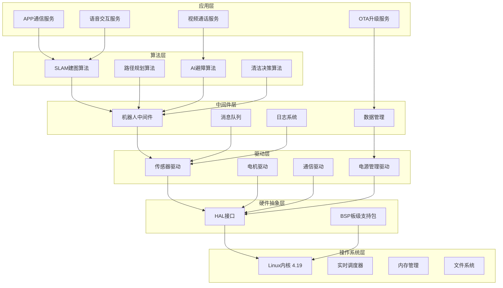
```mermaid
flowchart TD
    subgraph 应用层
        A1[APP通信服务]
        A2[语音交互服务]
        A3[OTA升级服务]
        A4[视频通话服务]
    end
    
    subgraph 算法层
        B1[SLAM建图算法]
        B2[路径规划算法]
        B3[AI避障算法]
        B4[清洁决策算法]
    end
    
    subgraph 中间件层
        C1[机器人中间件]
        C2[消息队列]
        C3[数据管理]
        C4[日志系统]
    end
    
    subgraph 驱动层
        D1[传感器驱动]
        D2[电机驱动]
        D3[通信驱动]
        D4[电源管理驱动]
    end
    
    subgraph 硬件抽象层
        E1[HAL接口]
        E2[BSP板级支持包]
    end
    
    subgraph 操作系统层
        F1[Linux内核 4.19]
        F2[实时调度器]
        F3[内存管理]
        F4[文件系统]
    end
    
    A1 --> B1
    A2 --> B1
    A3 --> C3
    A4 --> B3
    
    B1 --> C1
    B2 --> C1
    B3 --> C1
    B4 --> C1
    
    C1 --> D1
    C2 --> D1
    C3 --> D4
    C4 --> D1
    
    D1 --> E1
    D2 --> E1
    D3 --> E1
    D4 --> E1
    
    E1 --> F1
    E2 --> F1
```

#### 1.1.2 系统核心参数

| 参数项 | 参数值 | 说明 |
|--------|--------|------|
| 操作系统 | Linux 4.19内核 | 深度定制实时嵌入式系统 |
| 任务调度延迟 | <10ms | 满足运动控制实时性要求 |
| 中间件类型 | 自研轻量级机器人中间件 | 替代ROS，优化资源占用 |
| 消息传输延迟 | <5ms | 模块间低延迟通信 |
| 运行内存占用 | <256MB | 系统运行时内存需求 |
| 固件镜像大小 | <512MB | 完整固件包大小 |
| 开机启动时间 | <30秒 | 从上电到就绪状态 |

### 1.2 模块划分

#### 1.2.1 核心模块清单

| 模块编号 | 模块名称 | 功能描述 | 依赖模块 |
|---------|---------|---------|---------|
| MOD-001 | 运动控制模块 | 驱动轮、边刷、主刷、风机控制 | 驱动层 |
| MOD-002 | 感知处理模块 | 传感器数据采集、融合、处理 | 驱动层 |
| MOD-003 | 导航规划模块 | SLAM建图、路径规划、避障 | MOD-002 |
| MOD-004 | 清洁决策模块 | 清洁模式决策、任务调度 | MOD-003 |
| MOD-005 | 交互服务模块 | APP通信、语音控制、视频通话 | MOD-004 |
| MOD-006 | 安全监控模块 | 故障检测、安全保护、异常处理 | MOD-001, MOD-002 |
| MOD-007 | 系统管理模块 | 启动管理、配置管理、OTA升级 | 无 |
| MOD-008 | 数据管理模块 | 地图存储、日志记录、数据同步 | MOD-007 |

#### 1.2.2 模块依赖关系

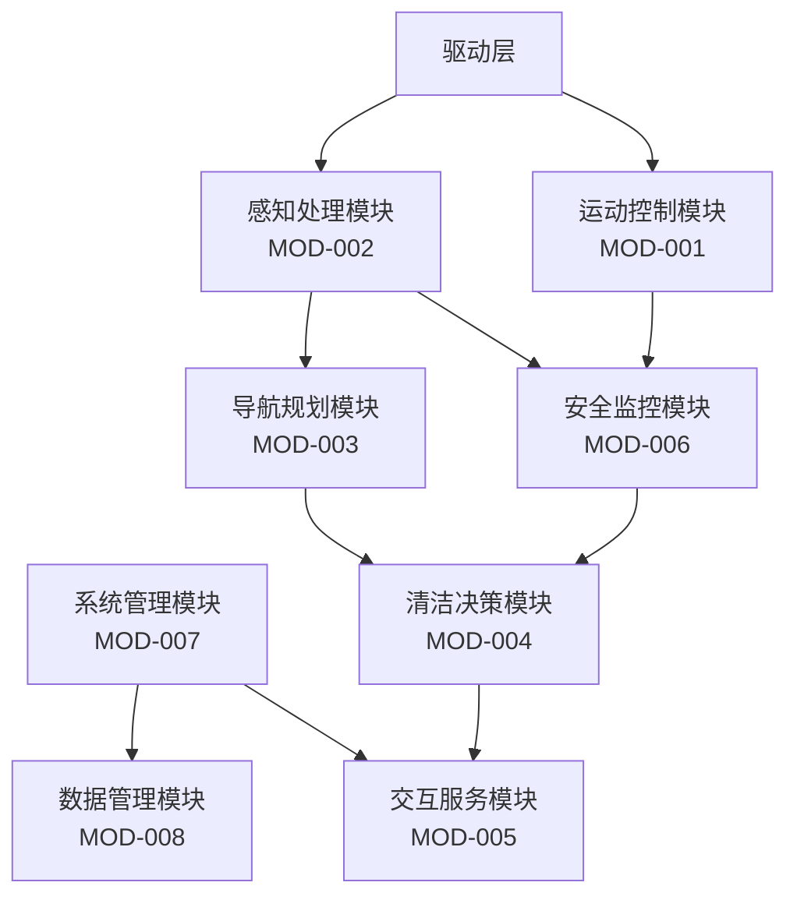
```mermaid
flowchart TD
    A[系统管理模块<br/>MOD-007] --> B[数据管理模块<br/>MOD-008]
    A --> C[交互服务模块<br/>MOD-005]
    
    D[感知处理模块<br/>MOD-002] --> E[导航规划模块<br/>MOD-003]
    E --> F[清洁决策模块<br/>MOD-004]
    F --> C
    
    G[运动控制模块<br/>MOD-001] --> H[安全监控模块<br/>MOD-006]
    D --> H
    
    H --> F
    
    I[驱动层] --> D
    I --> G
```

### 1.3 开发工具链

#### 1.3.1 开发环境配置

| 工具类型 | 工具名称 | 版本要求 | 用途说明 |
|---------|---------|---------|---------|
| 编译器 | GCC | 9.0+ | 核心算法编译 |
| 交叉编译工具链 | ARM GCC | 9.0+ | 嵌入式交叉编译 |
| 调试器 | GDB | 8.0+ | 代码调试 |
| 仿真平台 | Gazebo | 11.0+ | 算法仿真测试 |
| 版本控制 | Git | 2.0+ | 代码版本管理 |
| 构建工具 | CMake | 3.16+ | 项目构建管理 |

#### 1.3.2 开发语言规范

| 语言类型 | 应用场景 | 编码规范 |
|---------|---------|---------|
| C++ | 核心算法、驱动程序 | C++14标准，Google编码规范 |
| C | 底层驱动、实时控制 | C99标准，MISRA-C规范 |
| Python | 应用层功能、脚本工具 | Python 3.8+，PEP8规范 |
| Java/Kotlin | 安卓APP开发 | Android开发规范 |
| Swift | iOS APP开发 | Swift 5.0+，Apple开发规范 |

---

## II. 核心功能软件模块

### 2.1 运动控制软件

#### 2.1.1 运动控制模块架构

运动控制软件负责整机的运动执行，包括驱动轮运动控制、主风机控制、边刷控制、拖布震动控制及升降控制等功能。

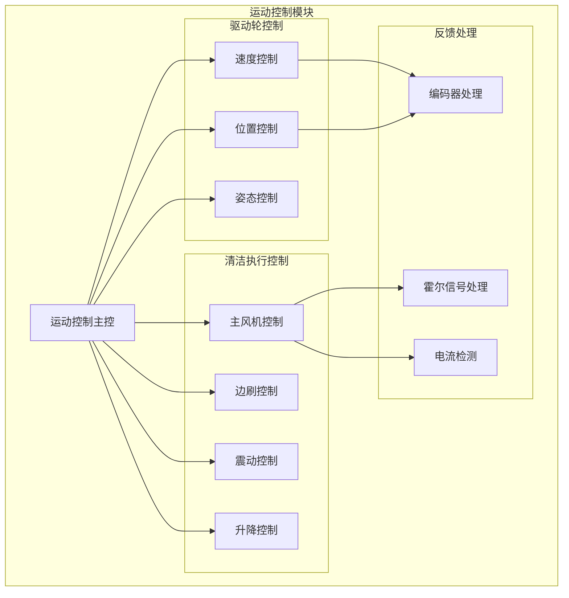
```mermaid
flowchart TD
    subgraph 运动控制模块
        A[运动控制主控]
        
        subgraph 驱动轮控制
            B1[速度控制]
            B2[位置控制]
            B3[姿态控制]
        end
        
        subgraph 清洁执行控制
            C1[主风机控制]
            C2[边刷控制]
            C3[震动控制]
            C4[升降控制]
        end
        
        subgraph 反馈处理
            D1[编码器处理]
            D2[霍尔信号处理]
            D3[电流检测]
        end
    end
    
    A --> B1
    A --> B2
    A --> B3
    A --> C1
    A --> C2
    A --> C3
    A --> C4
    
    B1 --> D1
    B2 --> D1
    C1 --> D2
    C1 --> D3
```

#### 2.1.2 驱动轮控制软件需求

| 需求项 | 需求描述 | 技术指标 |
|--------|---------|---------|
| 速度控制 | 双轮差速驱动控制 | 控制周期<10ms，速度误差<5% |
| 位置控制 | 基于编码器的位置闭环 | 位置误差<1cm/米 |
| 姿态控制 | 基于IMU的姿态校正 | 姿态角误差<2° |
| 加减速控制 | 平滑加减速曲线 | 加速度可配置，最大500mm/s² |
| 原地旋转 | 零半径原地转向 | 转向精度<1° |

#### 2.1.3 驱动轮控制状态机

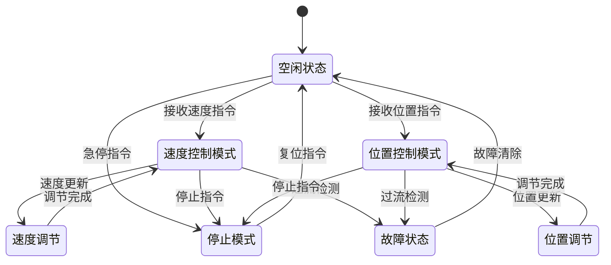
```mermaid
stateDiagram-v2
    [*] --> 空闲状态
    
    空闲状态 --> 速度控制模式: 接收速度指令
    空闲状态 --> 位置控制模式: 接收位置指令
    空闲状态 --> 停止模式: 急停指令
    
    速度控制模式 --> 速度调节: 速度更新
    速度调节 --> 速度控制模式: 调节完成
    速度控制模式 --> 停止模式: 停止指令
    速度控制模式 --> 故障状态: 过流检测
    
    位置控制模式 --> 位置调节: 位置更新
    位置调节 --> 位置控制模式: 调节完成
    位置控制模式 --> 停止模式: 停止指令
    位置控制模式 --> 故障状态: 过流检测
    
    停止模式 --> 空闲状态: 复位指令
    
    故障状态 --> 空闲状态: 故障清除
```

#### 2.1.4 主风机控制软件需求

| 需求项 | 需求描述 | 技术指标 |
|--------|---------|---------|
| 转速控制 | 无刷电机FOC控制 | 转速范围0-20000RPM |
| 吸力档位 | 三档吸力调节 | 标准/强力/Max+三档 |
| 软启动 | 渐进式启动控制 | 启动时间可配置，默认2秒 |
| 过载保护 | 电流检测与保护 | 过流阈值5A，响应时间<10ms |
| 堵转检测 | 堵转状态识别 | 堵转检测时间<100ms |

#### 2.1.5 拖布震动控制软件需求

| 需求项 | 需求描述 | 技术指标 |
|--------|---------|---------|
| 频率控制 | PWM频率调节 | 28Hz/38Hz/50Hz三档 |
| 档位切换 | 震动强度调节 | 弱/中/强三档 |
| 启停控制 | 震动启停管理 | 启动响应<100ms |
| 升降控制 | 拖布升降管理 | 升降时间<500ms，精度<0.5mm |

#### 2.1.6 运动控制接口定义

| 接口名称 | 接口类型 | 输入参数 | 输出参数 | 功能描述 |
|---------|---------|---------|---------|---------|
| set_wheel_speed | 函数调用 | 左轮速度, 右轮速度 | 执行结果 | 设置双轮速度 |
| set_fan_speed | 函数调用 | 目标转速 | 执行结果 | 设置风机转速 |
| set_brush_speed | 函数调用 | 目标转速, 方向 | 执行结果 | 设置边刷转速 |
| set_vibration | 函数调用 | 档位 | 执行结果 | 设置震动档位 |
| set_mop_lift | 函数调用 | 升降状态 | 执行结果 | 控制拖布升降 |
| get_motion_status | 函数调用 | 无 | 运动状态 | 获取运动状态 |

### 2.2 感知处理软件

#### 2.2.1 感知处理模块架构

感知处理软件负责多传感器数据的采集、预处理、融合处理，为导航决策提供环境感知信息。

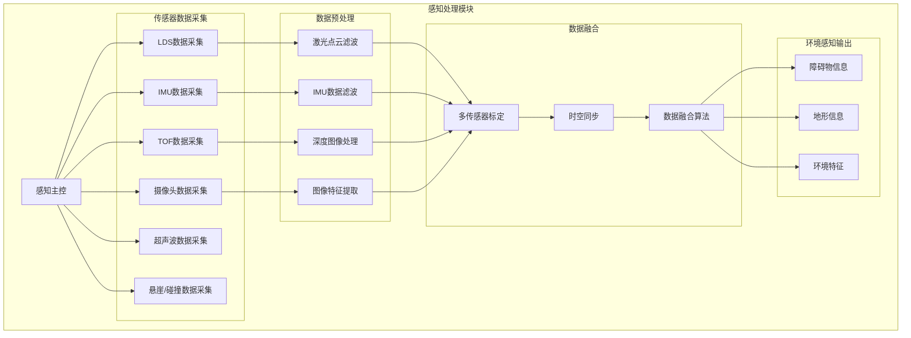
```mermaid
flowchart TD
    subgraph 感知处理模块
        A[感知主控]
        
        subgraph 传感器数据采集
            B1[LDS数据采集]
            B2[IMU数据采集]
            B3[TOF数据采集]
            B4[摄像头数据采集]
            B5[超声波数据采集]
            B6[悬崖/碰撞数据采集]
        end
        
        subgraph 数据预处理
            C1[激光点云滤波]
            C2[IMU数据滤波]
            C3[深度图像处理]
            C4[图像特征提取]
        end
        
        subgraph 数据融合
            D1[多传感器标定]
            D2[时空同步]
            D3[数据融合算法]
        end
        
        subgraph 环境感知输出
            E1[障碍物信息]
            E2[地形信息]
            E3[环境特征]
        end
    end
    
    A --> B1
    A --> B2
    A --> B3
    A --> B4
    A --> B5
    A --> B6
    
    B1 --> C1
    B2 --> C2
    B3 --> C3
    B4 --> C4
    
    C1 --> D1
    C2 --> D1
    C3 --> D1
    C4 --> D1
    
    D1 --> D2
    D2 --> D3
    D3 --> E1
    D3 --> E2
    D3 --> E3
```

#### 2.2.2 LDS激光雷达处理需求

| 需求项 | 需求描述 | 技术指标 |
|--------|---------|---------|
| 数据采集 | 实时采集激光扫描数据 | 采样频率10Hz，360°全覆盖 |
| 点云滤波 | 去除噪声点和离群点 | 滤波延迟<5ms |
| 特征提取 | 提取线段、角点特征 | 特征提取延迟<10ms |
| 升降控制 | 雷达升降管理 | 升降响应<1秒 |
| 数据输出 | 输出处理后的点云数据 | 数据格式：角度+距离+强度 |

#### 2.2.3 IMU数据处理需求

| 需求项 | 需求描述 | 技术指标 |
|--------|---------|---------|
| 数据采集 | 采集加速度和角速度数据 | 采样频率200Hz |
| 零偏校准 | 自动零偏校准 | 校准精度<0.01°/s |
| 数据滤波 | 卡尔曼滤波降噪 | 滤波延迟<2ms |
| 姿态解算 | 四元数姿态解算 | 解算精度<0.5° |
| 运动检测 | 静止/运动状态判断 | 检测延迟<50ms |

#### 2.2.4 3D结构光处理需求

| 需求项 | 需求描述 | 技术指标 |
|--------|---------|---------|
| 测距控制 | 控制结构光测距 | 测距范围0-80cm |
| 数据采集 | 采集深度测量数据 | 采样频率30Hz |
| 距离计算 | 计算目标距离 | 测距精度<5mm |
| 障碍物检测 | 检测前方障碍物 | 检测延迟<50ms |

#### 2.2.5 AI视觉处理需求

| 需求项 | 需求描述 | 技术指标 |
|--------|---------|---------|
| 图像采集 | RGB图像采集 | 分辨率640×480，帧率15fps |
| 物体识别 | AI物体分类识别 | 识别27种障碍物 |
| 识别延迟 | 图像处理到识别输出 | 延迟<100ms |
| 暗光适应 | LED补光支持 | 支持0Lux环境 |
| 隐私保护 | 视频流加密传输 | AES-256加密 |

#### 2.2.6 多传感器融合需求

| 需求项 | 需求描述 | 技术指标 |
|--------|---------|---------|
| 时间同步 | 传感器时间戳对齐 | 同步精度<1ms |
| 空间标定 | 传感器坐标系标定 | 标定精度<2mm |
| 数据融合 | 多源数据融合处理 | 融合延迟<20ms |
| 置信度评估 | 融合结果置信度计算 | 置信度范围0-100% |

#### 2.2.7 感知数据处理流程

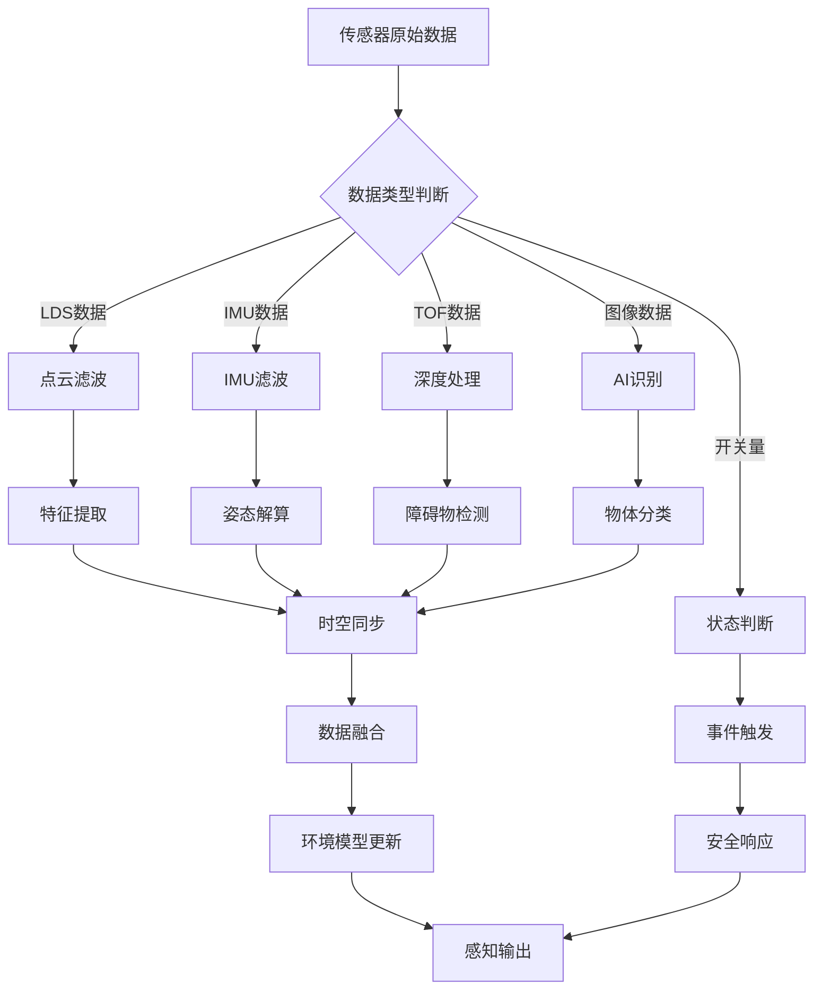
```mermaid
flowchart TD
    A[传感器原始数据] --> B{数据类型判断}
    
    B -->|LDS数据| C[点云滤波]
    B -->|IMU数据| D[IMU滤波]
    B -->|TOF数据| E[深度处理]
    B -->|图像数据| F[AI识别]
    B -->|开关量| G[状态判断]
    
    C --> H[特征提取]
    D --> I[姿态解算]
    E --> J[障碍物检测]
    F --> K[物体分类]
    G --> L[事件触发]
    
    H --> M[时空同步]
    I --> M
    J --> M
    K --> M
    
    M --> N[数据融合]
    N --> O[环境模型更新]
    
    L --> P[安全响应]
    O --> Q[感知输出]
    P --> Q
```

### 2.3 决策规划软件

#### 2.3.1 决策规划模块架构

决策规划软件负责整机的智能决策和路径规划，包括SLAM建图、全局路径规划、局部避障规划、清洁任务规划等功能。

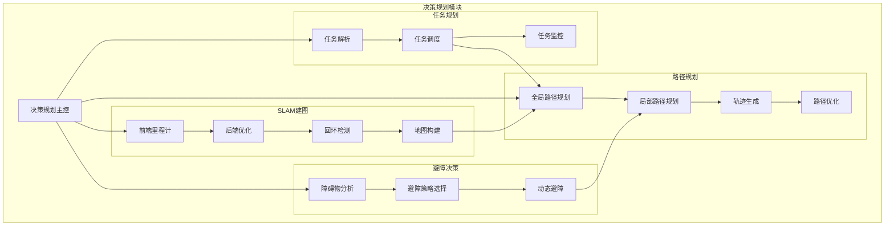
```mermaid
flowchart TD
    subgraph 决策规划模块
        A[决策规划主控]
        
        subgraph SLAM建图
            B1[前端里程计]
            B2[后端优化]
            B3[回环检测]
            B4[地图构建]
        end
        
        subgraph 路径规划
            C1[全局路径规划]
            C2[局部路径规划]
            C3[轨迹生成]
            C4[路径优化]
        end
        
        subgraph 避障决策
            D1[障碍物分析]
            D2[避障策略选择]
            D3[动态避障]
        end
        
        subgraph 任务规划
            E1[任务解析]
            E2[任务调度]
            E3[任务监控]
        end
    end
    
    A --> B1
    B1 --> B2
    B2 --> B3
    B3 --> B4
    
    A --> C1
    C1 --> C2
    C2 --> C3
    C3 --> C4
    
    A --> D1
    D1 --> D2
    D2 --> D3
    
    A --> E1
    E1 --> E2
    E2 --> E3
    
    B4 --> C1
    D3 --> C2
    E2 --> C1
```

#### 2.3.2 SLAM建图软件需求

| 需求项 | 需求描述 | 技术指标 |
|--------|---------|---------|
| 建图速度 | 快速完成全屋建图 | 8分钟完成100㎡建图 |
| 地图精度 | 地图构建精度 | 精度<5cm |
| 地图类型 | 支持多种地图格式 | 2D栅格/3D地图/Matrix地图 |
| 多楼层支持 | 多楼层地图管理 | 最多4张地图 |
| 地图更新 | 动态更新地图 | 实时更新延迟<1秒 |
| 闭环检测 | 消除累积误差 | 闭环检测成功率>95% |

#### 2.3.3 SLAM算法流程

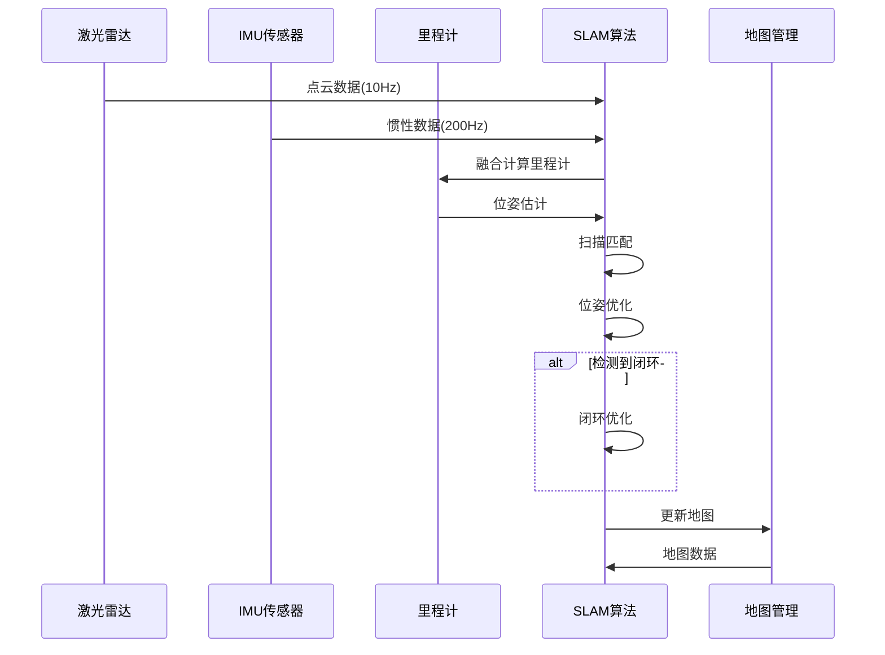
```mermaid
sequenceDiagram
    participant LDS as 激光雷达
    participant IMU as IMU传感器
    participant ODOM as 里程计
    participant SLAM as SLAM算法
    participant MAP as 地图管理
    
    LDS->>SLAM: 点云数据(10Hz)
    IMU->>SLAM: 惯性数据(200Hz)
    
    SLAM->>ODOM: 融合计算里程计
    ODOM->>SLAM: 位姿估计
    
    SLAM->>SLAM: 扫描匹配
    SLAM->>SLAM: 位姿优化
    
    alt 检测到闭环
        SLAM->>SLAM: 闭环优化
    end
    
    SLAM->>MAP: 更新地图
    MAP->>SLAM: 地图数据
```

#### 2.3.4 路径规划软件需求

| 需求项 | 需求描述 | 技术指标 |
|--------|---------|---------|
| 全局规划 | 从起点到终点的最优路径 | 规划时间<500ms |
| 局部规划 | 实时避障路径调整 | 规划周期<100ms |
| 覆盖规划 | 全屋清扫覆盖路径 | 覆盖率>99% |
| 弓字形规划 | 高效清扫路径 | 路径效率>90% |
| 沿边规划 | 墙边清扫路径 | 沿边距离<1cm |

#### 2.3.5 清洁任务规划需求

| 需求项 | 需求描述 | 技术指标 |
|--------|---------|---------|
| 任务解析 | 解析用户清洁指令 | 解析时间<100ms |
| 房间识别 | 自动识别房间类型 | 识别准确率>90% |
| 顺序规划 | 智能规划清洁顺序 | 支持自定义顺序 |
| 断点续扫 | 记忆断点位置 | 续扫准确率>95% |
| 回充决策 | 智能回充电量计算 | 预留电量误差<5% |

#### 2.3.6 避障决策需求

| 需求项 | 需求描述 | 技术指标 |
|--------|---------|---------|
| 障碍物识别 | 识别27种障碍物 | 识别准确率>95% |
| 避障距离 | 根据障碍物类型调整 | 距离范围1-10cm |
| 避障策略 | 选择最优避障策略 | 策略响应<50ms |
| 动态避障 | 应对动态障碍物 | 响应时间<200ms |

#### 2.3.7 清洁任务状态机

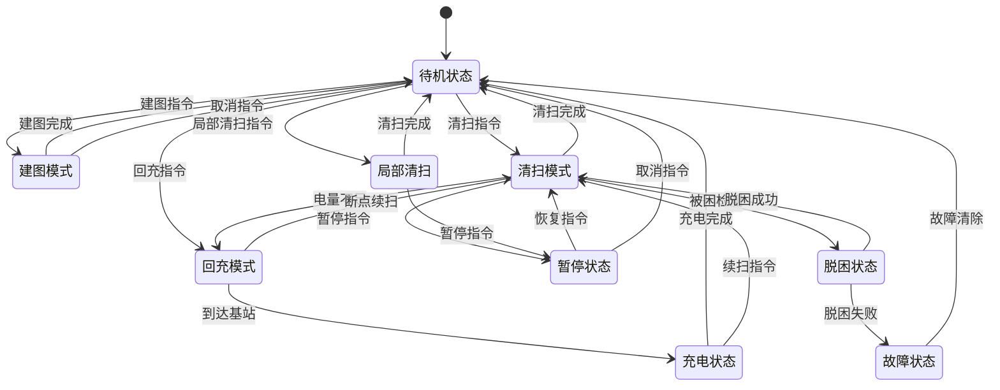
```mermaid
stateDiagram-v2
    [*] --> 待机状态
    
    待机状态 --> 建图模式: 建图指令
    待机状态 --> 清扫模式: 清扫指令
    待机状态 --> 回充模式: 回充指令
    待机状态 --> 局部清扫: 局部清扫指令
    
    建图模式 --> 待机状态: 建图完成
    建图模式 --> 待机状态: 取消指令
    
    清扫模式 --> 暂停状态: 暂停指令
    清扫模式 --> 回充模式: 电量不足
    清扫模式 --> 待机状态: 清扫完成
    清扫模式 --> 脱困状态: 被困检测
    
    暂停状态 --> 清扫模式: 恢复指令
    暂停状态 --> 待机状态: 取消指令
    
    回充模式 --> 充电状态: 到达基站
    回充模式 --> 清扫模式: 断点续扫
    
    充电状态 --> 待机状态: 充电完成
    充电状态 --> 清扫模式: 续扫指令
    
    局部清扫 --> 待机状态: 清扫完成
    局部清扫 --> 暂停状态: 暂停指令
    
    脱困状态 --> 清扫模式: 脱困成功
    脱困状态 --> 故障状态: 脱困失败
    
    故障状态 --> 待机状态: 故障清除
```

### 2.4 智能交互软件

#### 2.4.1 智能交互模块架构

智能交互软件负责用户与机器人之间的交互，包括APP通信、语音控制、视频通话等功能。

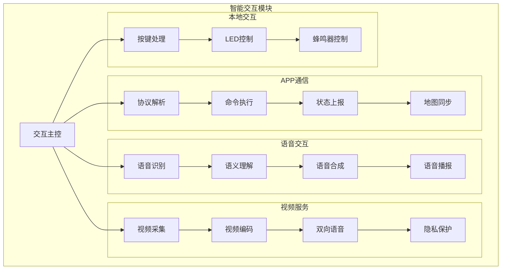
```mermaid
flowchart TD
    subgraph 智能交互模块
        A[交互主控]
        
        subgraph APP通信
            B1[协议解析]
            B2[命令执行]
            B3[状态上报]
            B4[地图同步]
        end
        
        subgraph 语音交互
            C1[语音识别]
            C2[语义理解]
            C3[语音合成]
            C4[语音播报]
        end
        
        subgraph 视频服务
            D1[视频采集]
            D2[视频编码]
            D3[双向语音]
            D4[隐私保护]
        end
        
        subgraph 本地交互
            E1[按键处理]
            E2[LED控制]
            E3[蜂鸣器控制]
        end
    end
    
    A --> B1
    A --> C1
    A --> D1
    A --> E1
    
    B1 --> B2
    B2 --> B3
    B3 --> B4
    
    C1 --> C2
    C2 --> C3
    C3 --> C4
    
    D1 --> D2
    D2 --> D3
    D3 --> D4
    
    E1 --> E2
    E2 --> E3
```

#### 2.4.2 APP通信软件需求

| 需求项 | 需求描述 | 技术指标 |
|--------|---------|---------|
| 连接方式 | Wi-Fi连接与通信 | 802.11 b/g/n 2.4GHz |
| 协议支持 | MQTT物联网协议 | QoS等级1 |
| 命令响应 | APP命令执行响应 | 响应时间<200ms |
| 状态同步 | 实时状态同步 | 同步周期1秒 |
| 地图传输 | 地图数据传输 | 传输时间<2秒 |
| 离线支持 | 离线任务执行 | 支持定时任务离线执行 |

#### 2.4.3 语音交互软件需求

| 需求项 | 需求描述 | 技术指标 |
|--------|---------|---------|
| 平台支持 | 支持主流语音平台 | 小爱/小度/天猫精灵/Siri |
| 指令识别 | 语音指令识别 | 识别准确率>95% |
| 语义理解 | 自然语言理解 | 支持模糊指令 |
| 语音播报 | 状态语音播报 | 播报延迟<500ms |
| 拾音距离 | 远场语音唤醒 | 有效距离5m |

#### 2.4.4 视频通话软件需求

| 需求项 | 需求描述 | 技术指标 |
|--------|---------|---------|
| 视频分辨率 | 实时视频分辨率 | 640×480@15fps |
| 视频编码 | 视频压缩编码 | H.264编码 |
| 双向语音 | 双向语音通话 | 延迟<300ms |
| 隐私保护 | 视频加密传输 | AES-256加密 |
| 权限控制 | 视频功能权限管理 | 手势密码保护 |

#### 2.4.5 本地交互软件需求

| 需求项 | 需求描述 | 技术指标 |
|--------|---------|---------|
| 按键响应 | 物理按键响应 | 响应时间<50ms |
| 长按检测 | 长按按键识别 | 长按时间>2秒 |
| LED显示 | 状态LED显示 | 多种颜色/闪烁模式 |
| 语音提示 | 状态语音提示 | 支持多语言 |

#### 2.4.6 APP通信协议数据流

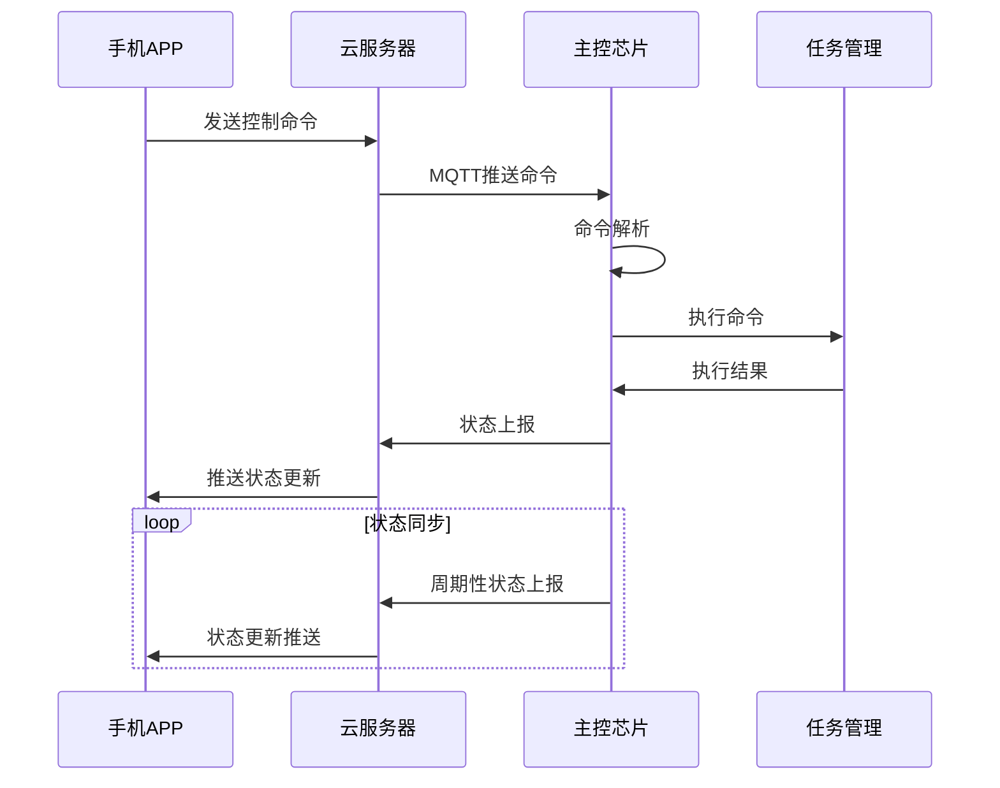
```mermaid
sequenceDiagram
    participant APP as 手机APP
    participant CLOUD as 云服务器
    participant MCU as 主控芯片
    participant TASK as 任务管理
    
    APP->>CLOUD: 发送控制命令
    CLOUD->>MCU: MQTT推送命令
    MCU->>MCU: 命令解析
    MCU->>TASK: 执行命令
    TASK->>MCU: 执行结果
    MCU->>CLOUD: 状态上报
    CLOUD->>APP: 推送状态更新
    
    loop 状态同步
        MCU->>CLOUD: 周期性状态上报
        CLOUD->>APP: 状态更新推送
    end
```

---

## III. 系统支撑软件

### 3.1 安全监控软件

#### 3.1.1 安全监控模块架构

安全监控软件负责整机的安全保护，包括传感器监控、电机保护、电池保护、故障处理等功能。

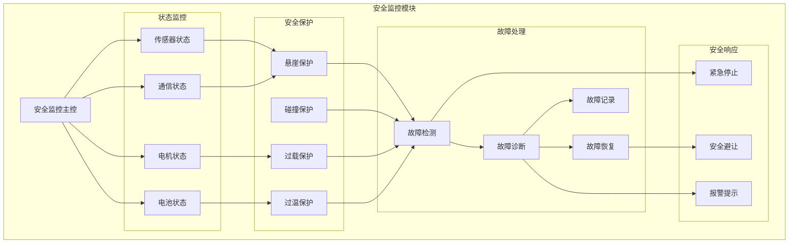
```mermaid
flowchart TD
    subgraph 安全监控模块
        A[安全监控主控]
        
        subgraph 状态监控
            B1[传感器状态]
            B2[电机状态]
            B3[电池状态]
            B4[通信状态]
        end
        
        subgraph 安全保护
            C1[悬崖保护]
            C2[碰撞保护]
            C3[过载保护]
            C4[过温保护]
        end
        
        subgraph 故障处理
            D1[故障检测]
            D2[故障诊断]
            D3[故障恢复]
            D4[故障记录]
        end
        
        subgraph 安全响应
            E1[紧急停止]
            E2[安全避让]
            E3[报警提示]
        end
    end
    
    A --> B1
    A --> B2
    A --> B3
    A --> B4
    
    B1 --> C1
    B2 --> C3
    B3 --> C4
    B4 --> C1
    
    C1 --> D1
    C2 --> D1
    C3 --> D1
    C4 --> D1
    
    D1 --> D2
    D2 --> D3
    D2 --> D4
    D3 --> E2
    D1 --> E1
    D2 --> E3
```

#### 3.1.2 安全监控需求

| 需求项 | 需求描述 | 技术指标 |
|--------|---------|---------|
| 悬崖保护 | 检测高度落差并停止 | 检测高度>3cm，响应<10ms |
| 碰撞保护 | 碰撞检测与缓冲 | 360°全覆盖，响应<5ms |
| 过载保护 | 电机过流保护 | 过流阈值可配置，响应<10ms |
| 过温保护 | 电池/电机温度保护 | 温度阈值60°C |
| 低电量保护 | 低电量自动回充 | 阈值20%，预留回充电量 |
| 被困检测 | 被困状态识别 | 检测时间<10秒 |

#### 3.1.3 故障诊断需求

| 故障类型 | 故障码 | 诊断方法 | 恢复策略 |
|---------|--------|---------|---------|
| 悬崖检测 | 0x01 | 悬崖传感器触发 | 后退停止，等待人工处理 |
| 碰撞检测 | 0x02 | 碰撞传感器触发 | 停止并避让 |
| 被困状态 | 0x03 | 运动检测超时 | 尝试脱困，失败报警 |
| 低电量 | 0x04 | 电压检测 | 自动回充 |
| 电机过载 | 0x05 | 电流检测 | 停止电机，报警 |
| 雷达故障 | 0x06 | 数据异常检测 | 停止清扫，报警 |
| 尘盒已满 | 0x07 | 气压检测 | 提示清理 |
| 水箱缺水 | 0x08 | 水位检测 | 提示加水 |
| 主刷卡住 | 0x09 | 电流异常 | 反转尝试，失败报警 |
| 轮子卡住 | 0x0A | 编码器检测 | 脱困尝试，失败报警 |

#### 3.1.4 安全响应流程

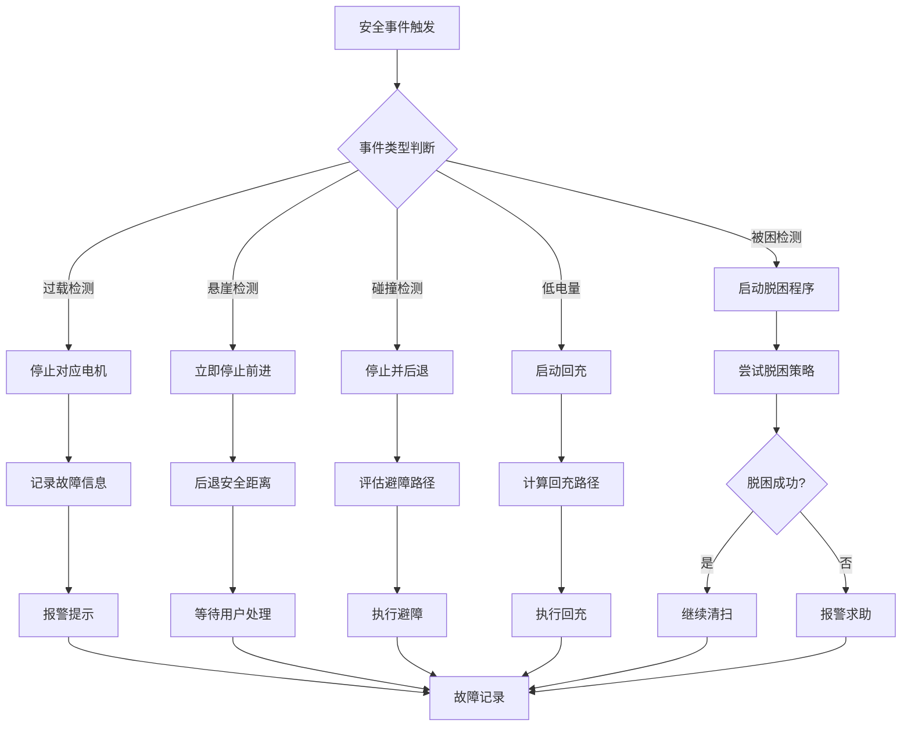
```mermaid
flowchart TD
    A[安全事件触发] --> B{事件类型判断}
    
    B -->|悬崖检测| C[立即停止前进]
    B -->|碰撞检测| D[停止并后退]
    B -->|过载检测| E[停止对应电机]
    B -->|低电量| F[启动回充]
    B -->|被困检测| G[启动脱困程序]
    
    C --> H[后退安全距离]
    D --> I[评估避障路径]
    E --> J[记录故障信息]
    F --> K[计算回充路径]
    G --> L[尝试脱困策略]
    
    H --> M[等待用户处理]
    I --> N[执行避障]
    J --> O[报警提示]
    K --> P[执行回充]
    L --> Q{脱困成功?}
    
    Q -->|是| R[继续清扫]
    Q -->|否| S[报警求助]
    
    O --> T[故障记录]
    M --> T
    N --> T
    P --> T
    R --> T
    S --> T
```

### 3.2 通信与数据管理

#### 3.2.1 通信管理模块架构

通信管理软件负责整机的内外部通信，包括Wi-Fi通信、蓝牙通信、内部模块通信等功能。

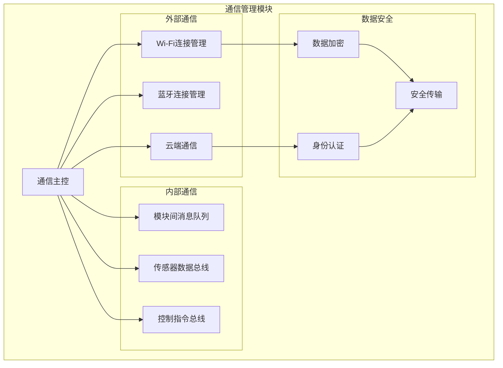
```mermaid
flowchart TD
    subgraph 通信管理模块
        A[通信主控]
        
        subgraph 外部通信
            B1[Wi-Fi连接管理]
            B2[蓝牙连接管理]
            B3[云端通信]
        end
        
        subgraph 内部通信
            C1[模块间消息队列]
            C2[传感器数据总线]
            C3[控制指令总线]
        end
        
        subgraph 数据安全
            D1[数据加密]
            D2[身份认证]
            D3[安全传输]
        end
    end
    
    A --> B1
    A --> B2
    A --> B3
    A --> C1
    A --> C2
    A --> C3
    
    B1 --> D1
    B3 --> D2
    D1 --> D3
    D2 --> D3
```

#### 3.2.2 Wi-Fi通信需求

| 需求项 | 需求描述 | 技术指标 |
|--------|---------|---------|
| 连接模式 | Station模式 | 连接家庭路由器 |
| 配网方式 | 支持多种配网方式 | SmartConfig/AP模式 |
| 重连机制 | 断线自动重连 | 重连间隔5秒，最多10次 |
| 信号强度 | 信号强度检测 | RSSI检测精度±2dBm |
| 省电模式 | Wi-Fi省电管理 | 空闲时降低功耗 |

#### 3.2.3 数据存储需求

| 数据类型 | 存储位置 | 存储容量 | 访问方式 |
|---------|---------|---------|---------|
| 地图数据 | Flash存储 | 最大4张地图 | 文件系统 |
| 用户配置 | Flash存储 | <1MB | 配置文件 |
| 运行日志 | RAM缓冲+Flash | 循环缓冲 | 日志系统 |
| 固件备份 | Flash分区 | 512MB | 分区管理 |
| 临时数据 | RAM | <64MB | 内存管理 |

#### 3.2.4 数据同步需求

| 需求项 | 需求描述 | 技术指标 |
|--------|---------|---------|
| 状态同步 | 实时状态同步到云端 | 同步周期1秒 |
| 地图同步 | 地图数据云端备份 | 变化时同步 |
| 配置同步 | 用户配置云端同步 | 实时同步 |
| 日志上传 | 运行日志上传 | 故障时上传 |

### 3.3 系统管理软件

#### 3.3.1 系统管理模块架构

系统管理软件负责整机的系统级管理，包括启动管理、配置管理、OTA升级、日志管理等功能。

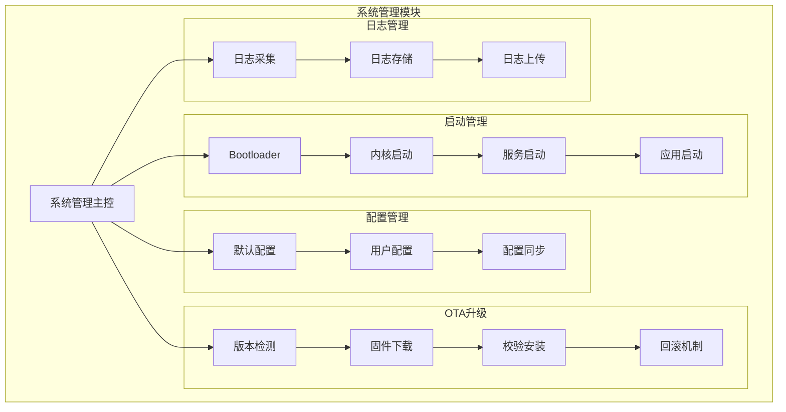
```mermaid
flowchart TD
    subgraph 系统管理模块
        A[系统管理主控]
        
        subgraph 启动管理
            B1[Bootloader]
            B2[内核启动]
            B3[服务启动]
            B4[应用启动]
        end
        
        subgraph 配置管理
            C1[默认配置]
            C2[用户配置]
            C3[配置同步]
        end
        
        subgraph OTA升级
            D1[版本检测]
            D2[固件下载]
            D3[校验安装]
            D4[回滚机制]
        end
        
        subgraph 日志管理
            E1[日志采集]
            E2[日志存储]
            E3[日志上传]
        end
    end
    
    A --> B1
    B1 --> B2
    B2 --> B3
    B3 --> B4
    
    A --> C1
    C1 --> C2
    C2 --> C3
    
    A --> D1
    D1 --> D2
    D2 --> D3
    D3 --> D4
    
    A --> E1
    E1 --> E2
    E2 --> E3
```

#### 3.3.2 启动管理需求

| 需求项 | 需求描述 | 技术指标 |
|--------|---------|---------|
| 启动时间 | 从上电到就绪 | <30秒 |
| 启动阶段 | 分阶段启动管理 | Boot→Kernel→Service→App |
| 启动日志 | 启动过程日志记录 | 支持启动问题诊断 |
| 异常恢复 | 启动异常自动恢复 | 支持安全模式启动 |

#### 3.3.3 启动流程

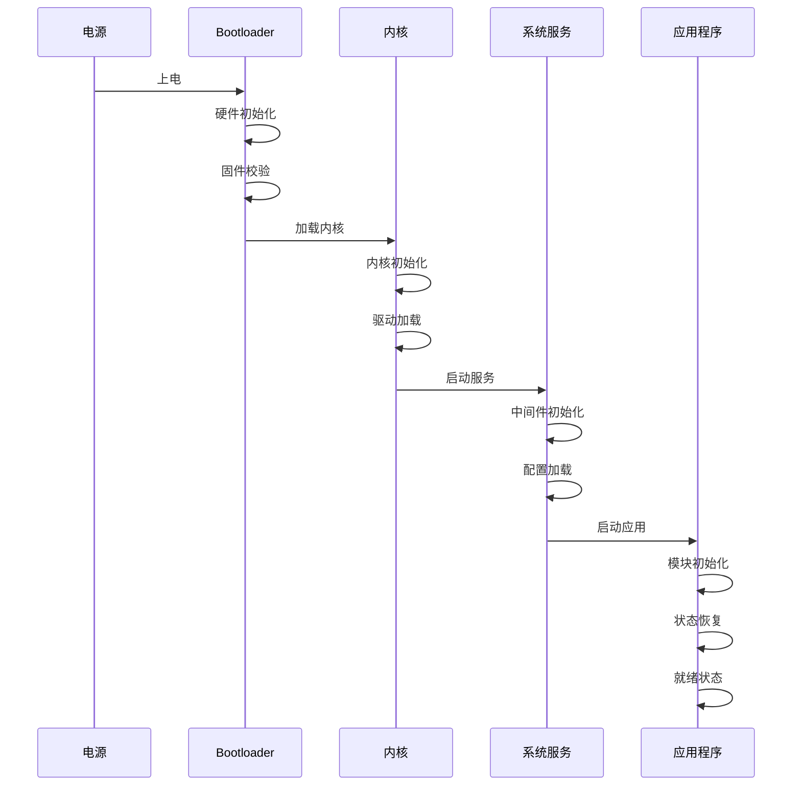
```mermaid
sequenceDiagram
    participant PWR as 电源
    participant BOOT as Bootloader
    participant KERNEL as 内核
    participant SERVICE as 系统服务
    participant APP as 应用程序
    
    PWR->>BOOT: 上电
    BOOT->>BOOT: 硬件初始化
    BOOT->>BOOT: 固件校验
    BOOT->>KERNEL: 加载内核
    
    KERNEL->>KERNEL: 内核初始化
    KERNEL->>KERNEL: 驱动加载
    KERNEL->>SERVICE: 启动服务
    
    SERVICE->>SERVICE: 中间件初始化
    SERVICE->>SERVICE: 配置加载
    SERVICE->>APP: 启动应用
    
    APP->>APP: 模块初始化
    APP->>APP: 状态恢复
    APP->>APP: 就绪状态
```

#### 3.3.4 OTA升级需求

| 需求项 | 需求描述 | 技术指标 |
|--------|---------|---------|
| 升级方式 | 空中升级(OTA) | 支持增量/全量升级 |
| 版本检测 | 自动检测新版本 | 检测周期24小时 |
| 下载管理 | 断点续传下载 | 支持网络中断恢复 |
| 校验机制 | 固件完整性校验 | MD5/SHA256校验 |
| 安装方式 | A/B分区升级 | 升级失败自动回滚 |
| 升级时间 | 完整升级时间 | <10分钟 |

#### 3.3.5 OTA升级状态机

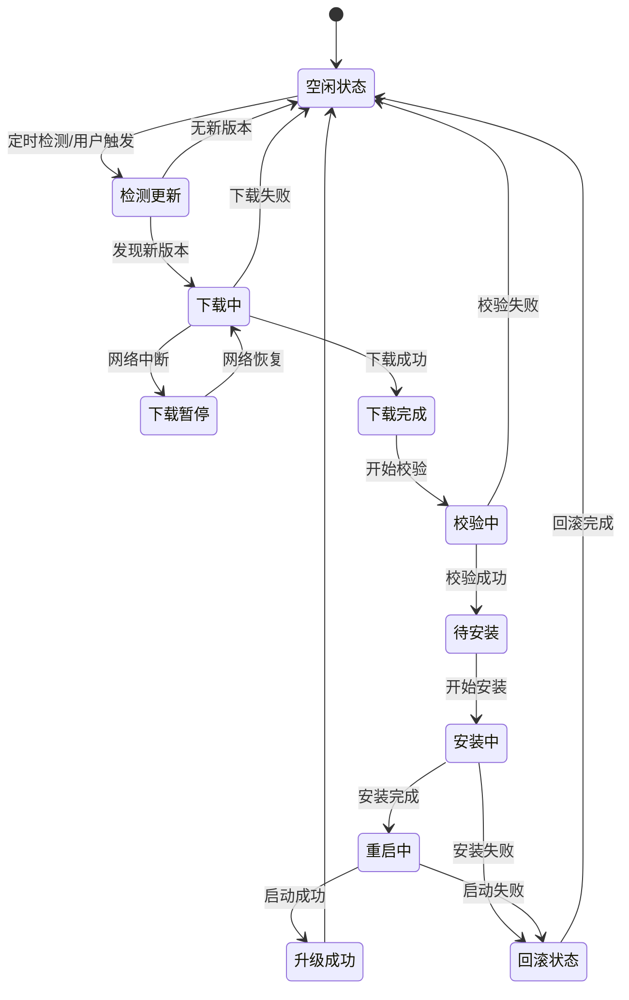
```mermaid
stateDiagram-v2
    [*] --> 空闲状态
    
    空闲状态 --> 检测更新: 定时检测/用户触发
    检测更新 --> 空闲状态: 无新版本
    检测更新 --> 下载中: 发现新版本
    
    下载中 --> 下载暂停: 网络中断
    下载暂停 --> 下载中: 网络恢复
    下载中 --> 下载完成: 下载成功
    下载中 --> 空闲状态: 下载失败
    
    下载完成 --> 校验中: 开始校验
    校验中 --> 空闲状态: 校验失败
    校验中 --> 待安装: 校验成功
    
    待安装 --> 安装中: 开始安装
    安装中 --> 重启中: 安装完成
    安装中 --> 回滚状态: 安装失败
    
    重启中 --> 升级成功: 启动成功
    重启中 --> 回滚状态: 启动失败
    
    回滚状态 --> 空闲状态: 回滚完成
    升级成功 --> 空闲状态
```

#### 3.3.6 日志管理需求

| 需求项 | 需求描述 | 技术指标 |
|--------|---------|---------|
| 日志级别 | 多级别日志记录 | DEBUG/INFO/WARN/ERROR |
| 日志存储 | 循环缓冲存储 | 最大存储100MB |
| 日志上传 | 故障日志自动上传 | 故障时触发上传 |
| 日志导出 | 支持日志导出 | USB/网络导出 |
| 性能影响 | 日志记录性能影响 | CPU占用<1% |

---

## IV. 软件接口定义

### 4.1 模块间接口

#### 4.1.1 运动控制接口

| 接口名称 | 接口类型 | 输入参数 | 输出参数 | 功能描述 |
|---------|---------|---------|---------|---------|
| motion_set_velocity | 函数调用 | linear_vel, angular_vel | result | 设置运动速度 |
| motion_set_pose | 函数调用 | x, y, theta | result | 设置目标位姿 |
| motion_stop | 函数调用 | stop_type | result | 停止运动 |
| motion_get_status | 函数调用 | 无 | velocity, pose, status | 获取运动状态 |
| motion_emergency_stop | 函数调用 | 无 | result | 紧急停止 |

#### 4.1.2 感知处理接口

| 接口名称 | 接口类型 | 输入参数 | 输出参数 | 功能描述 |
|---------|---------|---------|---------|---------|
| perception_get_obstacles | 函数调用 | 无 | obstacle_list | 获取障碍物列表 |
| perception_get_terrain | 函数调用 | 无 | terrain_info | 获取地形信息 |
| perception_get_pose | 函数调用 | 无 | x, y, theta, confidence | 获取当前位姿 |
| perception_update_map | 函数调用 | map_data | result | 更新地图数据 |

#### 4.1.3 导航规划接口

| 接口名称 | 接口类型 | 输入参数 | 输出参数 | 功能描述 |
|---------|---------|---------|---------|---------|
| nav_start_mapping | 函数调用 | 无 | result | 开始建图 |
| nav_stop_mapping | 函数调用 | 无 | map_data | 停止建图 |
| nav_set_target | 函数调用 | x, y | result | 设置导航目标 |
| nav_start_navigation | 函数调用 | 无 | result | 开始导航 |
| nav_get_path | 函数调用 | 无 | path_data | 获取规划路径 |
| nav_set_forbidden | 函数调用 | area_list | result | 设置禁区 |

#### 4.1.4 清洁任务接口

| 接口名称 | 接口类型 | 输入参数 | 输出参数 | 功能描述 |
|---------|---------|---------|---------|---------|
| clean_start | 函数调用 | mode, area, params | result | 开始清洁任务 |
| clean_pause | 函数调用 | 无 | result | 暂停清洁 |
| clean_resume | 函数调用 | 无 | result | 恢复清洁 |
| clean_stop | 函数调用 | 无 | result | 停止清洁 |
| clean_get_progress | 函数调用 | 无 | progress_info | 获取清洁进度 |

### 4.2 外部通信接口

#### 4.2.1 APP控制接口

| 接口名称 | 通信方式 | 请求格式 | 响应格式 | 功能描述 |
|---------|---------|---------|---------|---------|
| app_control | MQTT | JSON命令 | JSON响应 | APP控制命令 |
| app_status | MQTT | 订阅主题 | JSON状态 | 状态推送 |
| app_map | TCP | 二进制 | 二进制 | 地图数据传输 |
| app_video | WebRTC | SDP | SDP | 视频通话 |

#### 4.2.2 语音控制接口

| 接口名称 | 平台 | 指令格式 | 响应方式 | 功能描述 |
|---------|------|---------|---------|---------|
| voice_start_clean | 小爱/小度/天猫 | 语音指令 | 语音播报 | 开始清扫 |
| voice_stop_clean | 小爱/小度/天猫 | 语音指令 | 语音播报 | 停止清扫 |
| voice_return_dock | 小爱/小度/天猫 | 语音指令 | 语音播报 | 返回充电 |
| voice_query_status | 小爱/小度/天猫 | 语音指令 | 语音播报 | 查询状态 |

### 4.3 系统服务接口

#### 4.3.1 配置管理接口

| 接口名称 | 接口类型 | 输入参数 | 输出参数 | 功能描述 |
|---------|---------|---------|---------|---------|
| config_get | 函数调用 | key | value | 获取配置项 |
| config_set | 函数调用 | key, value | result | 设置配置项 |
| config_reset | 函数调用 | 无 | result | 恢复默认配置 |
| config_sync | 函数调用 | 无 | result | 同步配置到云端 |

#### 4.3.2 日志管理接口

| 接口名称 | 接口类型 | 输入参数 | 输出参数 | 功能描述 |
|---------|---------|---------|---------|---------|
| log_write | 函数调用 | level, module, message | result | 写入日志 |
| log_read | 函数调用 | filter | log_list | 读取日志 |
| log_export | 函数调用 | format | log_data | 导出日志 |
| log_clear | 函数调用 | 无 | result | 清除日志 |

---

## V. 非功能性需求

### 5.1 性能需求

| 需求项 | 需求描述 | 技术指标 |
|--------|---------|---------|
| 响应时间 | APP命令响应时间 | <200ms |
| 控制周期 | 运动控制周期 | <10ms |
| 规划周期 | 路径规划周期 | <100ms |
| 状态同步 | 状态同步周期 | 1秒 |
| 内存占用 | 运行时内存占用 | <256MB |
| CPU占用 | 正常运行CPU占用 | <60% |

### 5.2 可靠性需求

| 需求项 | 需求描述 | 技术指标 |
|--------|---------|---------|
| 连续运行 | 连续工作时间 | >24小时 |
| 故障恢复 | 故障自动恢复率 | >95% |
| 数据保护 | 异常断电数据保护 | 地图/配置不丢失 |
| 看门狗 | 软件看门狗保护 | 超时自动重启 |
| 异常处理 | 异常捕获处理 | 100%异常捕获 |

### 5.3 安全性需求

| 需求项 | 需求描述 | 技术指标 |
|--------|---------|---------|
| 数据加密 | 敏感数据加密存储 | AES-256加密 |
| 传输安全 | 数据传输加密 | TLS 1.2+ |
| 身份认证 | 设备身份认证 | 唯一设备ID |
| 权限控制 | 功能权限管理 | 分级权限控制 |
| 隐私保护 | 视频功能隐私保护 | TÜV认证 |

### 5.4 可维护性需求

| 需求项 | 需求描述 | 技术指标 |
|--------|---------|---------|
| 模块化 | 软件模块化设计 | 模块独立编译 |
| 日志记录 | 完善的日志系统 | 多级别日志 |
| 远程诊断 | 支持远程诊断 | 日志远程上传 |
| OTA升级 | 支持OTA升级 | 断点续传/自动回滚 |
| 配置管理 | 灵活的配置管理 | 运行时配置更新 |

---

## VI. 附录

### 6.1 术语定义

| 术语 | 定义 |
|------|------|
| SLAM | Simultaneous Localization and Mapping，同步定位与建图 |
| OTA | Over-The-Air，空中升级 |
| MQTT | Message Queuing Telemetry Transport，消息队列遥测传输协议 |
| HAL | Hardware Abstraction Layer，硬件抽象层 |
| BSP | Board Support Package，板级支持包 |
| FOC | Field-Oriented Control，磁场定向控制 |
| IMU | Inertial Measurement Unit，惯性测量单元 |
| TOF | Time of Flight，飞行时间测距 |
| NPU | Neural Processing Unit，神经网络处理单元 |

### 6.2 参考文档

| 文档编号 | 文档名称 | 版本 |
|---------|---------|------|
| DOC-001 | 石头G10S Pro深度产品调研报告 | V1.0 |
| DOC-002 | 石头G10S Pro产品需求文档 | V1.0 |
| DOC-003 | 石头G10S Pro接口控制文档 | V1.0 |
| DOC-004 | 全志MR系列芯片技术手册 | - |
| DOC-005 | Linux内核开发文档 | 4.19 |

### 6.3 文档修订记录

| 版本 | 日期 | 修订内容 | 作者 |
|------|------|---------|------|
| V1.0 | 2022-01 | 初始版本发布 | 软件研发部 |

---

*本软件需求规格书基于石头G10S Pro深度产品调研报告、产品需求文档及接口控制文档编制，部分技术参数标注「推理」的内容为基于行业经验的合理推演。*
