# 石头 G10S Pro 扫地机器人运动控制与规划文档

**文档版本**：V1.0  
**编制日期**：2022年1月  
**产品代号**：G10S Pro  
**控制系统版本**：MCP-01

---

## I. 运动控制架构

### 1.1 控制系统层级

石头 G10S Pro 运动控制系统采用分层递阶架构，从上到下分为任务层、规划层、控制层和执行层，实现从高层任务到底层执行的系统化控制。

#### 1.1.1 控制系统层级架构

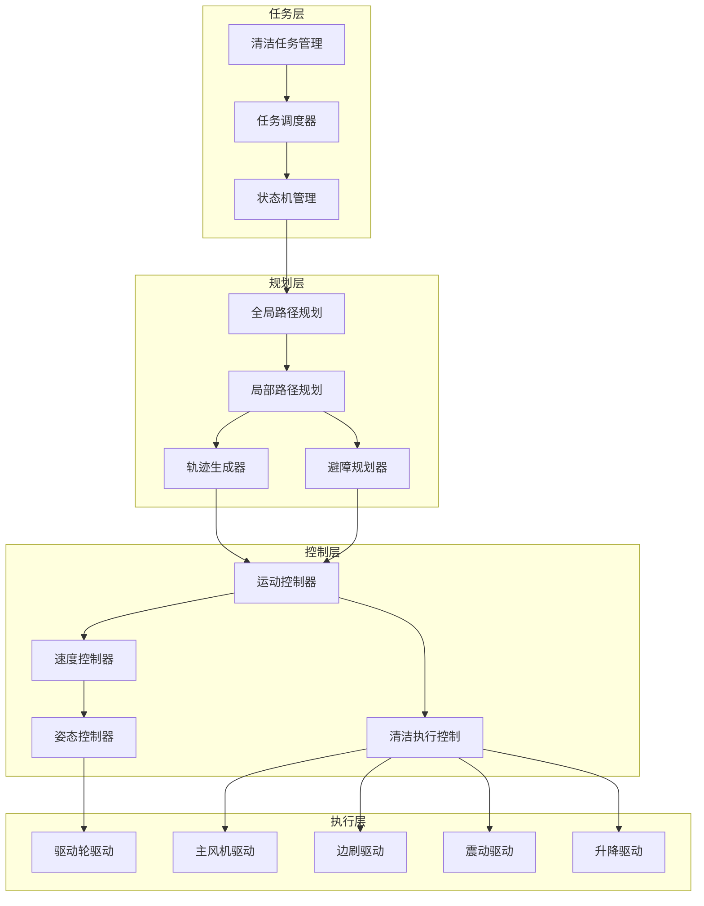
```mermaid
flowchart TD
    subgraph 任务层
        A1[清洁任务管理]
        A2[任务调度器]
        A3[状态机管理]
    end
    
    subgraph 规划层
        B1[全局路径规划]
        B2[局部路径规划]
        B3[轨迹生成器]
        B4[避障规划器]
    end
    
    subgraph 控制层
        C1[运动控制器]
        C2[速度控制器]
        C3[姿态控制器]
        C4[清洁执行控制]
    end
    
    subgraph 执行层
        D1[驱动轮驱动]
        D2[主风机驱动]
        D3[边刷驱动]
        D4[震动驱动]
        D5[升降驱动]
    end
    
    A1 --> A2
    A2 --> A3
    A3 --> B1
    
    B1 --> B2
    B2 --> B3
    B2 --> B4
    B3 --> C1
    B4 --> C1
    
    C1 --> C2
    C2 --> C3
    C1 --> C4
    
    C3 --> D1
    C4 --> D2
    C4 --> D3
    C4 --> D4
    C4 --> D5
```

#### 1.1.2 各层级功能定义

| 层级 | 功能模块 | 功能描述 | 控制周期 |
|------|---------|---------|---------|
| 任务层 | 清洁任务管理 | 解析用户指令，生成清洁任务 | 事件触发 |
| 任务层 | 任务调度器 | 多任务优先级调度与切换 | 100ms |
| 任务层 | 状态机管理 | 系统工作状态管理与转换 | 事件触发 |
| 规划层 | 全局路径规划 | 从起点到终点的最优路径 | 500ms |
| 规划层 | 局部路径规划 | 实时避障路径调整 | 100ms |
| 规划层 | 轨迹生成器 | 平滑运动轨迹生成 | 50ms |
| 规划层 | 避障规划器 | 动态障碍物规避策略 | 50ms |
| 控制层 | 运动控制器 | 运动指令生成与协调 | 10ms |
| 控制层 | 速度控制器 | 速度闭环控制 | 10ms |
| 控制层 | 姿态控制器 | 姿态角闭环控制 | 10ms |
| 控制层 | 清洁执行控制 | 清洁执行器协调控制 | 20ms |
| 执行层 | 各驱动模块 | PWM信号输出与功率驱动 | 0.1ms |

### 1.2 控制模式

#### 1.2.1 运动控制模式

石头 G10S Pro 支持多种运动控制模式，根据不同场景自动切换。

| 模式编号 | 控制模式 | 功能描述 | 适用场景 |
|---------|---------|---------|---------|
| MODE-01 | 速度控制模式 | 控制线速度和角速度 | 正常清扫、巡航 |
| MODE-02 | 位置控制模式 | 控制目标位置 | 定点移动、回充 |
| MODE-03 | 轨迹跟踪模式 | 跟踪规划轨迹 | 弓字形清扫 |
| MODE-04 | 沿墙控制模式 | 保持与墙面固定距离 | 沿墙清扫 |
| MODE-05 | 原地旋转模式 | 零半径原地转向 | 转向、避障 |
| MODE-06 | 脱困控制模式 | 被困时的脱困动作 | 脱困场景 |

#### 1.2.2 控制模式状态机

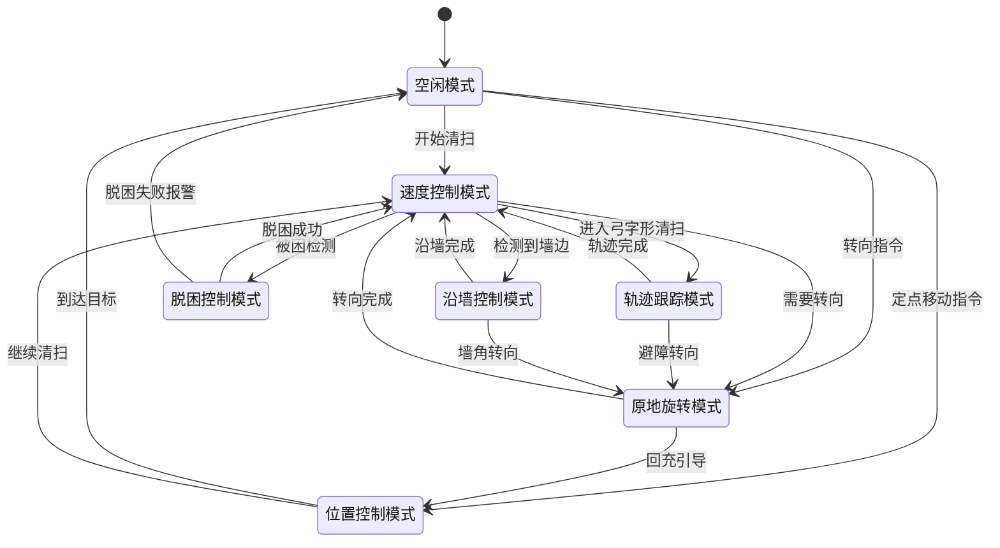
```mermaid
stateDiagram-v2
    [*] --> 空闲模式
    
    空闲模式 --> 速度控制模式: 开始清扫
    空闲模式 --> 位置控制模式: 定点移动指令
    空闲模式 --> 原地旋转模式: 转向指令
    
    速度控制模式 --> 轨迹跟踪模式: 进入弓字形清扫
    速度控制模式 --> 沿墙控制模式: 检测到墙边
    速度控制模式 --> 原地旋转模式: 需要转向
    速度控制模式 --> 脱困控制模式: 被困检测
    
    轨迹跟踪模式 --> 速度控制模式: 轨迹完成
    轨迹跟踪模式 --> 原地旋转模式: 避障转向
    
    沿墙控制模式 --> 速度控制模式: 沿墙完成
    沿墙控制模式 --> 原地旋转模式: 墙角转向
    
    原地旋转模式 --> 速度控制模式: 转向完成
    原地旋转模式 --> 位置控制模式: 回充引导
    
    位置控制模式 --> 空闲模式: 到达目标
    位置控制模式 --> 速度控制模式: 继续清扫
    
    脱困控制模式 --> 速度控制模式: 脱困成功
    脱困控制模式 --> 空闲模式: 脱困失败报警
```

#### 1.2.3 清洁执行模式

| 模式编号 | 清洁模式 | 主风机 | 边刷 | 拖布震动 | 拖布升降 |
|---------|---------|--------|------|---------|---------|
| CLE-01 | 扫拖同步 | 开启 | 开启 | 开启 | 降下 |
| CLE-02 | 单扫模式 | 开启 | 开启 | 关闭 | 升起 |
| CLE-03 | 单拖模式 | 关闭 | 关闭 | 开启 | 降下 |
| CLE-04 | 地毯清扫 | 开启 | 开启 | 关闭 | 升起 |
| CLE-05 | 静音清扫 | 低速 | 低速 | 关闭 | 可选 |
| CLE-06 | 深度清洁 | Max+ | 高速 | 强档 | 降下 |

### 1.3 控制频率

#### 1.3.1 各层级控制频率

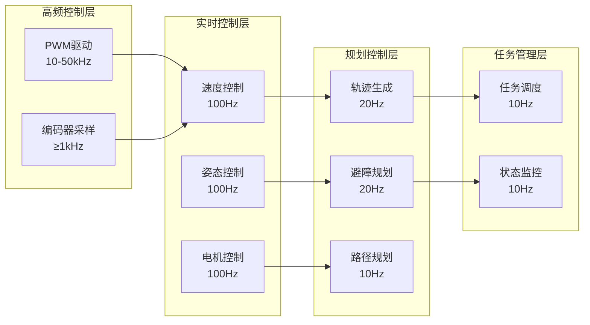
```mermaid
flowchart LR
    subgraph 高频控制层
        A1[PWM驱动<br/>10-50kHz]
        A2[编码器采样<br/>≥1kHz]
    end
    
    subgraph 实时控制层
        B1[速度控制<br/>100Hz]
        B2[姿态控制<br/>100Hz]
        B3[电机控制<br/>100Hz]
    end
    
    subgraph 规划控制层
        C1[轨迹生成<br/>20Hz]
        C2[避障规划<br/>20Hz]
        C3[路径规划<br/>10Hz]
    end
    
    subgraph 任务管理层
        D1[任务调度<br/>10Hz]
        D2[状态监控<br/>10Hz]
    end
    
    A1 --> B1
    A2 --> B1
    B1 --> C1
    B2 --> C2
    B3 --> C3
    C1 --> D1
    C2 --> D2
```

#### 1.3.2 控制频率详细规格

| 控制回路 | 控制频率 | 响应时间 | 实时性要求 |
|---------|---------|---------|-----------|
| PWM驱动 | 10-50kHz | <20μs | 硬实时 |
| 编码器采样 | ≥1kHz | <1ms | 硬实时 |
| 电流采样 | 10kHz | <100μs | 硬实时 |
| 速度控制 | 100Hz | <10ms | 硬实时 |
| 姿态控制 | 100Hz | <10ms | 硬实时 |
| 轨迹生成 | 20Hz | <50ms | 软实时 |
| 避障规划 | 20Hz | <50ms | 软实时 |
| 路径规划 | 10Hz | <100ms | 软实时 |
| 任务调度 | 10Hz | <100ms | 非实时 |

### 1.4 坐标系统

#### 1.4.1 坐标系定义

石头 G10S Pro 采用多坐标系协同的方式进行运动控制。

| 坐标系 | 原点位置 | 坐标轴定义 | 用途 |
|--------|---------|-----------|------|
| 世界坐标系 | 基站位置 | X轴：前方，Y轴：左侧，θ：逆时针为正 | 全局定位、地图表示 |
| 机器人坐标系 | 机器人中心 | X轴：前进方向，Y轴：左侧，θ：逆时针为正 | 运动控制、避障 |
| 传感器坐标系 | 各传感器安装位置 | 根据传感器类型定义 | 数据采集 |
| 轮子坐标系 | 左右轮中心 | 左轮/右轮独立 | 里程计计算 |

#### 1.4.2 坐标系变换

```
图1-1 坐标系变换关系

                    世界坐标系
                        │
                        │ T_world_robot
                        ▼
                ┌───────────────┐
                │  机器人坐标系  │
                │      ↑Y       │
                │      │        │
                │      ├──→X    │
                │      ●        │
                └───────┬───────┘
                        │
          ┌─────────────┼─────────────┐
          │             │             │
          ▼             ▼             ▼
    ┌──────────┐  ┌──────────┐  ┌──────────┐
    │左轮坐标系│  │右轮坐标系│  │传感器坐标系│
    │   ●      │  │      ●   │  │    ●     │
    └──────────┘  └──────────┘  └──────────┘

变换矩阵：
T_world_robot = [cos(θ)  -sin(θ)  x]
                [sin(θ)   cos(θ)  y]
                [  0        0     1]

其中 (x, y, θ) 为机器人在世界坐标系中的位姿
```

#### 1.4.3 运动学参数

| 参数名称 | 符号 | 数值 | 单位 | 说明 |
|---------|------|------|------|------|
| 轮距 | L | 230「推理」 | mm | 左右轮中心距离 |
| 轮径 | D | 65「推理」 | mm | 驱动轮直径 |
| 轮周长 | C | 204.2「推理」 | mm | π×D |
| 编码器分辨率 | N | 360「推理」 | pulse/rev | 每转脉冲数 |
| 距离分辨率 | Δd | 0.567「推理」 | mm/pulse | C/N |
| 最大线速度 | Vmax | 300 | mm/s | 标准清扫速度 |
| 最大角速度 | ωmax | 180「推理」 | °/s | 原地旋转速度 |

---

## II. 核心控制功能

### 2.1 移动控制

#### 2.1.1 差速驱动运动学

石头 G10S Pro 采用双轮差速驱动方式，通过控制左右轮的转速差实现前进、后退和转向。

**运动学方程：**

```
图2-1 差速驱动运动学模型

                    前进方向
                        ↑
                        │
           ┌────────────┼────────────┐
           │            │            │
           │    ┌───────┴───────┐    │
           │    │               │    │
      V_L ←────┤      ●        ├────→ V_R
      ω_L      │    中心       │      ω_R
           │    │               │    │
           │    └───────┬───────┘    │
           │            │            │
           │←──── L ────→│            │
           └────────────┼────────────┘
                        │
                        
运动学方程：
  v = (V_R + V_L) / 2          线速度
  ω = (V_R - V_L) / L          角速度
  
逆运动学方程：
  V_R = v + ω × L / 2          右轮速度
  V_L = v - ω × L / 2          左轮速度
  
里程计计算：
  Δx = v × cos(θ) × Δt
  Δy = v × sin(θ) × Δt
  Δθ = ω × Δt
```

#### 2.1.2 速度控制回路

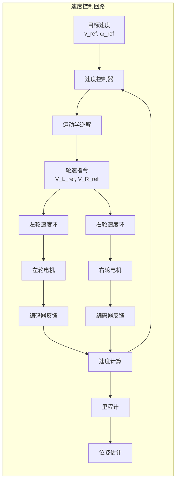
```mermaid
flowchart LR
    subgraph 速度控制回路
        A[目标速度<br/>v_ref, ω_ref] --> B[速度控制器]
        B --> C[运动学逆解]
        C --> D[轮速指令<br/>V_L_ref, V_R_ref]
        D --> E[左轮速度环]
        D --> F[右轮速度环]
        E --> G[左轮电机]
        F --> H[右轮电机]
        G --> I[编码器反馈]
        H --> J[编码器反馈]
        I --> K[速度计算]
        J --> K
        K --> L[里程计]
        K --> B
        L --> M[位姿估计]
    end
```

#### 2.1.3 速度控制器参数

| 控制参数 | 符号 | 数值 | 单位 | 说明 |
|---------|------|------|------|------|
| 线速度P增益 | Kp_v | 2.0「推理」 | - | 线速度比例增益 |
| 线速度I增益 | Ki_v | 0.1「推理」 | - | 线速度积分增益 |
| 线速度D增益 | Kd_v | 0.05「推理」 | - | 线速度微分增益 |
| 角速度P增益 | Kp_ω | 3.0「推理」 | - | 角速度比例增益 |
| 角速度I增益 | Ki_ω | 0.2「推理」 | - | 角速度积分增益 |
| 角速度D增益 | Kd_ω | 0.1「推理」 | - | 角速度微分增益 |
| 最大加速度 | a_max | 200 | mm/s² | 平滑加减速 |
| 最大角加速度 | α_max | 180「推理」 | °/s² | 平滑转向 |
| 速度限幅 | V_limit | 300 | mm/s | 最大速度限制 |
| 角速度限幅 | ω_limit | 180「推理」 | °/s | 最大角速度限制 |

#### 2.1.4 轮速控制回路


```mermaid
flowchart TD
    subgraph 左轮控制
        A1[左轮目标转速] --> B1[速度PI控制器]
        B1 --> C1[PWM生成]
        C1 --> D1[H桥驱动]
        D1 --> E1[左轮电机]
        E1 --> F1[编码器]
        F1 --> G1[速度计算]
        G1 --> B1
    end
    
    subgraph 右轮控制
        A2[右轮目标转速] --> B2[速度PI控制器]
        B2 --> C2[PWM生成]
        C2 --> D2[H桥驱动]
        D2 --> E2[右轮电机]
        E2 --> F2[编码器]
        F2 --> G2[速度计算]
        G2 --> B2
    end
```

#### 2.1.5 轮速控制器参数

| 控制参数 | 数值 | 说明 |
|---------|------|------|
| 速度环采样周期 | 10ms | 100Hz控制频率 |
| PWM频率 | 10kHz | 电机驱动频率 |
| PWM分辨率 | 10bit | 1024级调速 |
| 速度P增益 | 1.5「推理」 | 轮速比例增益 |
| 速度I增益 | 0.05「推理」 | 轮速积分增益 |
| 积分限幅 | 50% | 防止积分饱和 |
| 死区补偿 | 5%「推理」 | 克服电机死区 |

### 2.2 姿态控制

#### 2.2.1 姿态估计融合

石头 G10S Pro 采用编码器与IMU融合的姿态估计方法，提高定位精度和抗干扰能力。

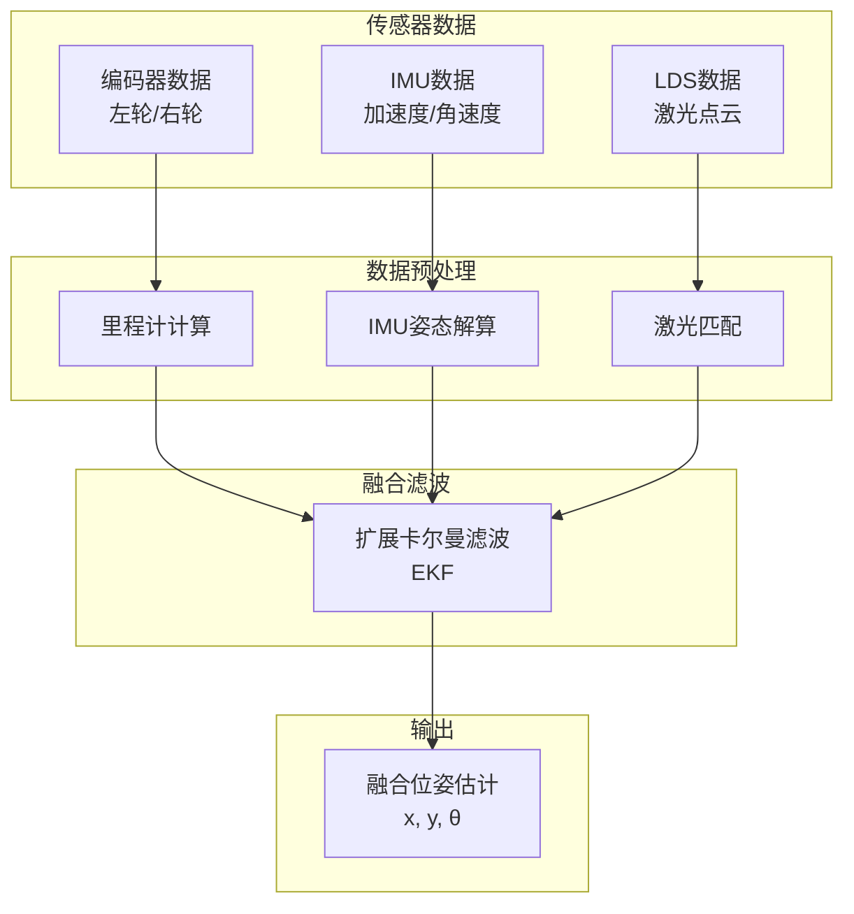
```mermaid
flowchart TD
    subgraph 传感器数据
        A1[编码器数据<br/>左轮/右轮]
        A2[IMU数据<br/>加速度/角速度]
        A3[LDS数据<br/>激光点云]
    end
    
    subgraph 数据预处理
        B1[里程计计算]
        B2[IMU姿态解算]
        B3[激光匹配]
    end
    
    subgraph 融合滤波
        C[扩展卡尔曼滤波<br/>EKF]
    end
    
    subgraph 输出
        D[融合位姿估计<br/>x, y, θ]
    end
    
    A1 --> B1
    A2 --> B2
    A3 --> B3
    
    B1 --> C
    B2 --> C
    B3 --> C
    
    C --> D
```

#### 2.2.2 姿态控制器设计

| 控制参数 | 符号 | 数值 | 说明 |
|---------|------|------|------|
| 航向角P增益 | Kp_θ | 4.0「推理」 | 航向角修正增益 |
| 航向角D增益 | Kd_θ | 0.5「推理」 | 航向角阻尼增益 |
| 横向偏差P增益 | Kp_y | 2.0「推理」 | 横向偏差修正增益 |
| 横向偏差D增益 | Kd_y | 0.3「推理」 | 横向偏差阻尼增益 |
| 姿态修正限幅 | θ_corr_max | 30°「推理」 | 最大修正角度 |

#### 2.2.3 姿态控制流程

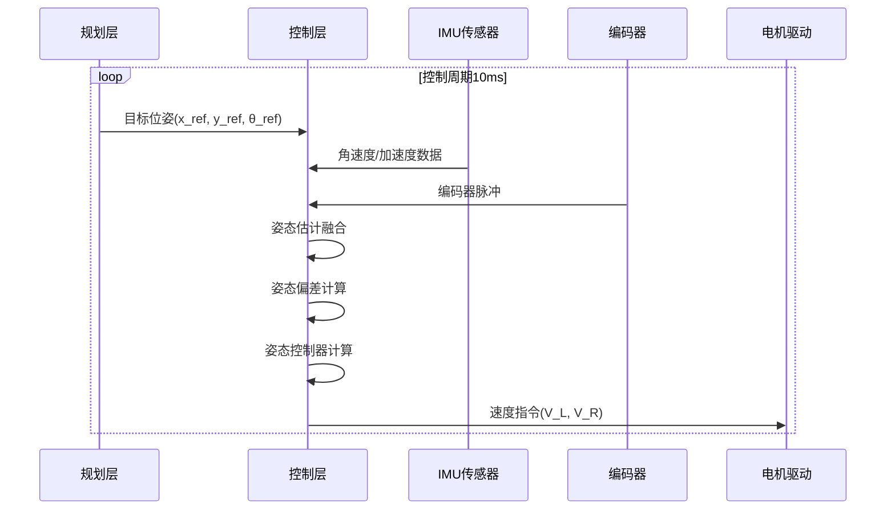
```mermaid
sequenceDiagram
    participant PLAN as 规划层
    participant CTRL as 控制层
    participant IMU as IMU传感器
    participant ENC as 编码器
    participant MOTOR as 电机驱动
    
    loop 控制周期10ms
        PLAN->>CTRL: 目标位姿(x_ref, y_ref, θ_ref)
        IMU->>CTRL: 角速度/加速度数据
        ENC->>CTRL: 编码器脉冲
        CTRL->>CTRL: 姿态估计融合
        CTRL->>CTRL: 姿态偏差计算
        CTRL->>CTRL: 姿态控制器计算
        CTRL->>MOTOR: 速度指令(V_L, V_R)
    end
```

### 2.3 运动规划

#### 2.3.1 全局路径规划

石头 G10S Pro 采用改进的A*算法进行全局路径规划，结合清扫覆盖需求生成最优清扫路径。

**全局规划算法流程：**

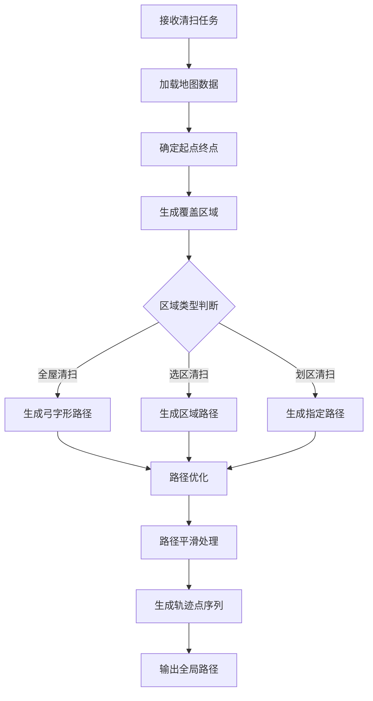
```mermaid
flowchart TD
    A[接收清扫任务] --> B[加载地图数据]
    B --> C[确定起点终点]
    C --> D[生成覆盖区域]
    D --> E{区域类型判断}
    
    E -->|全屋清扫| F[生成弓字形路径]
    E -->|选区清扫| G[生成区域路径]
    E -->|划区清扫| H[生成指定路径]
    
    F --> I[路径优化]
    G --> I
    H --> I
    
    I --> J[路径平滑处理]
    J --> K[生成轨迹点序列]
    K --> L[输出全局路径]
```

#### 2.3.2 覆盖路径规划

| 路径类型 | 适用场景 | 路径特点 | 效率指标 |
|---------|---------|---------|---------|
| 弓字形路径 | 开阔区域 | 平行往返，间距约30cm | 覆盖率>99% |
| 螺旋路径 | 圆形区域 | 从外向内螺旋 | 覆盖率>95% |
| 沿边路径 | 墙边/家具边缘 | 沿边界行走 | 边缘覆盖率>95% |
| 混合路径 | 复杂环境 | 弓字形+沿边组合 | 综合覆盖率>98% |

#### 2.3.3 弓字形路径生成

```
图2-2 弓字形路径示意图

    ┌─────────────────────────────────────┐
    │  ┌─────────────────────────────→    │
    │  │                                 │
    │  │←─────────────────────────────┐  │
    │  │                              │  │
    │  │  ┌─────────────────────────→│  │
    │  │  │                         │  │
    │  │  │←───────────────────────┐│  │
    │  │  │                       ││  │
    │  │  │  ┌───────────────────→││  │
    │  │  │  │                   ││  │
    │  │  │  │←─────────────────┐││  │
    │  │  │  │                  │││  │
    │  ↓  ↓  ↓                  ↓↓↓  ↓
    └─────────────────────────────────────┘
    
路径参数：
- 行间距：d = 280mm（清扫宽度-重叠区域）
- 转弯半径：R = 0（原地转向）
- 转向角度：θ = 180°（U型转弯）
```

#### 2.3.4 局部路径规划

局部路径规划采用动态窗口法（DWA），实时调整运动轨迹以避开障碍物。

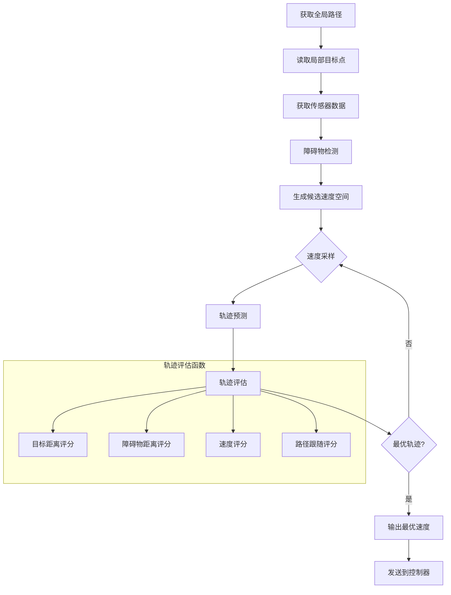
```mermaid
flowchart TD
    A[获取全局路径] --> B[读取局部目标点]
    B --> C[获取传感器数据]
    C --> D[障碍物检测]
    D --> E[生成候选速度空间]
    
    E --> F{速度采样}
    F --> G[轨迹预测]
    G --> H[轨迹评估]
    H --> I{最优轨迹?}
    
    I -->|否| F
    I -->|是| J[输出最优速度]
    J --> K[发送到控制器]
    
    subgraph 轨迹评估函数
        H --> H1[目标距离评分]
        H --> H2[障碍物距离评分]
        H --> H3[速度评分]
        H --> H4[路径跟随评分]
    end
```

#### 2.3.5 DWA参数配置

| 参数名称 | 数值 | 说明 |
|---------|------|------|
| 速度采样数 | 20×20「推理」 | 线速度×角速度采样点 |
| 预测时间 | 2.0s「推理」 | 轨迹预测时长 |
| 线速度采样范围 | 0-300mm/s | 最大线速度限制 |
| 角速度采样范围 | -180-180°/s | 最大角速度限制 |
| 线速度分辨率 | 15mm/s「推理」 | 采样步长 |
| 角速度分辨率 | 18°/s「推理」 | 采样步长 |
| 障碍物安全距离 | 50mm「推理」 | 最小安全距离 |
| 目标吸引增益 | 0.5「推理」 | 目标点吸引力权重 |
| 障碍物排斥增益 | 1.0「推理」 | 障碍物排斥力权重 |

### 2.4 避障控制

#### 2.4.1 避障系统架构

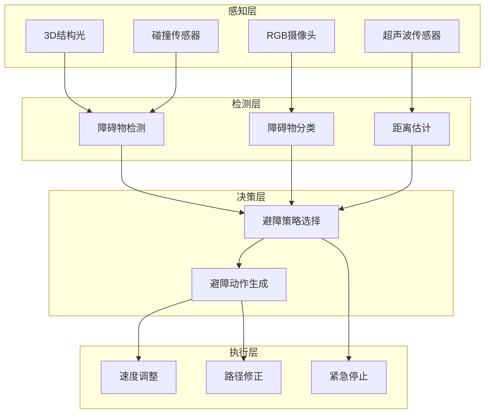
```mermaid
flowchart TD
    subgraph 感知层
        A1[3D结构光]
        A2[RGB摄像头]
        A3[超声波传感器]
        A4[碰撞传感器]
    end
    
    subgraph 检测层
        B1[障碍物检测]
        B2[障碍物分类]
        B3[距离估计]
    end
    
    subgraph 决策层
        C1[避障策略选择]
        C2[避障动作生成]
    end
    
    subgraph 执行层
        D1[速度调整]
        D2[路径修正]
        D3[紧急停止]
    end
    
    A1 --> B1
    A2 --> B2
    A3 --> B3
    A4 --> B1
    
    B1 --> C1
    B2 --> C1
    B3 --> C1
    
    C1 --> C2
    C2 --> D1
    C2 --> D2
    C1 --> D3
```

#### 2.4.2 障碍物分类与避障策略

| 障碍物类型 | 检测距离 | 避障距离 | 避障策略 | 避障动作 |
|-----------|---------|---------|---------|---------|
| 线缆类 | 80cm | 1cm | 绕行 | 减速→绕行→恢复 |
| 鞋类 | 80cm | 3cm | 绕行 | 减速→绕行→恢复 |
| 袜子/毛巾 | 80cm | 2cm | 绕行 | 减速→绕行→恢复 |
| 家具腿 | 80cm | 0.5cm | 沿边 | 沿边清扫 |
| 宠物粪便 | 80cm | 5cm | 远离绕行 | 大范围绕行 |
| 体重秤 | 80cm | 2cm | 绕行 | 减速→绕行→恢复 |
| 地毯 | 底部检测 | - | 升起拖布 | 升起拖布→纯扫模式 |
| 门槛 | 碰撞检测 | - | 越障 | 减速→越障→恢复 |

#### 2.4.3 避障动作时序

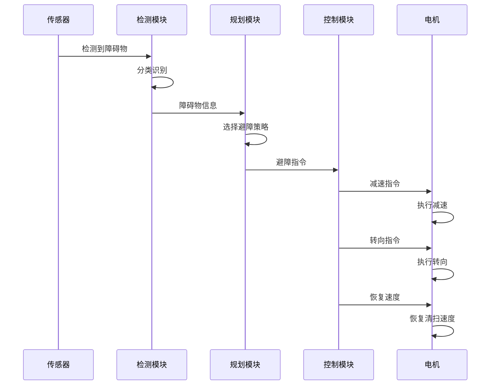
```mermaid
sequenceDiagram
    participant SENS as 传感器
    participant DET as 检测模块
    participant PLAN as 规划模块
    participant CTRL as 控制模块
    participant MOTOR as 电机
    
    SENS->>DET: 检测到障碍物
    DET->>DET: 分类识别
    DET->>PLAN: 障碍物信息
    
    PLAN->>PLAN: 选择避障策略
    PLAN->>CTRL: 避障指令
    
    CTRL->>MOTOR: 减速指令
    MOTOR->>MOTOR: 执行减速
    
    CTRL->>MOTOR: 转向指令
    MOTOR->>MOTOR: 执行转向
    
    CTRL->>MOTOR: 恢复速度
    MOTOR->>MOTOR: 恢复清扫速度
```

### 2.5 清洁执行控制

#### 2.5.1 清洁执行控制架构

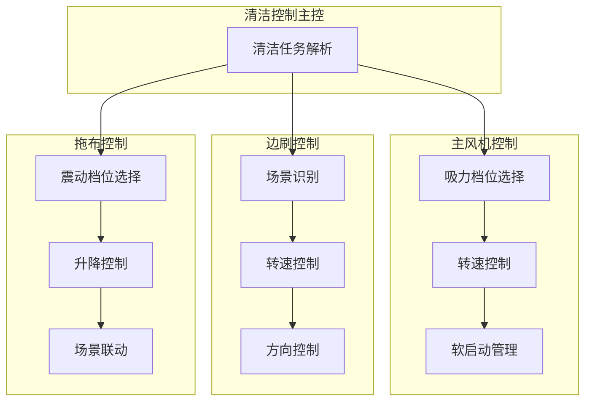
```mermaid
flowchart TD
    subgraph 清洁控制主控
        A[清洁任务解析]
    end
    
    subgraph 主风机控制
        B1[吸力档位选择]
        B2[转速控制]
        B3[软启动管理]
    end
    
    subgraph 边刷控制
        C1[场景识别]
        C2[转速控制]
        C3[方向控制]
    end
    
    subgraph 拖布控制
        D1[震动档位选择]
        D2[升降控制]
        D3[场景联动]
    end
    
    A --> B1
    A --> C1
    A --> D1
    
    B1 --> B2
    B2 --> B3
    
    C1 --> C2
    C2 --> C3
    
    D1 --> D2
    D2 --> D3
```

#### 2.5.2 主风机控制参数

| 吸力档位 | 目标转速 | PWM占空比 | 功率 | 适用场景 |
|---------|---------|----------|------|---------|
| 静音 | 8000RPM「推理」 | 40%「推理」 | 15W「推理」 | 夜间清扫 |
| 标准 | 12000RPM「推理」 | 60%「推理」 | 30W「推理」 | 日常清扫 |
| 强力 | 16000RPM「推理」 | 80%「推理」 | 45W「推理」 | 地毯清扫 |
| Max+ | 20000RPM「推理」 | 100% | 60W「推理」 | 顽固污渍 |

#### 2.5.3 边刷智能调速

| 场景 | 边刷转速 | 控制逻辑 | 触发条件 |
|------|---------|---------|---------|
| 正常清扫 | 130RPM | 低速旋转 | 默认状态 |
| 沿墙清扫 | 330RPM | 高速旋转 | 超声波检测到墙边 |
| 遇障碍物 | 停止/反转 | 避免推动 | 碰撞或视觉检测 |
| 地毯清扫 | 130RPM | 低速旋转 | 地毯传感器触发 |

#### 2.5.4 拖布升降控制

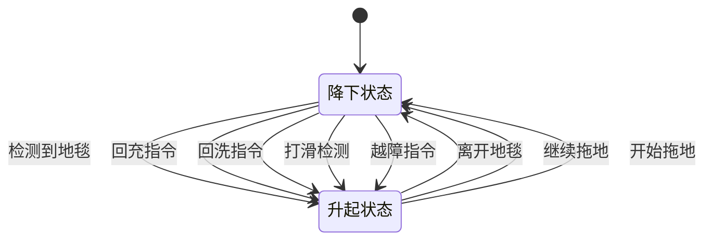
```mermaid
stateDiagram-v2
    [*] --> 降下状态
    
    降下状态 --> 升起状态: 检测到地毯
    降下状态 --> 升起状态: 回充指令
    降下状态 --> 升起状态: 回洗指令
    降下状态 --> 升起状态: 打滑检测
    降下状态 --> 升起状态: 越障指令
    
    升起状态 --> 降下状态: 离开地毯
    升起状态 --> 降下状态: 继续拖地
    升起状态 --> 降下状态: 开始拖地
```

#### 2.5.5 拖布震动控制参数

| 震动档位 | 频率 | PWM占空比 | 适用场景 |
|---------|------|----------|---------|
| 关闭 | 0Hz | 0% | 纯扫模式 |
| 弱档 | 28Hz (1650次/分) | 30%「推理」 | 轻度污渍 |
| 中档 | 38Hz (2300次/分) | 60%「推理」 | 日常清洁 |
| 强档 | 50Hz (3000次/分) | 100% | 顽固污渍 |

---

## III. 动力学与稳定性

### 3.1 动力学建模

#### 3.1.1 机器人动力学模型

石头 G10S Pro 的动力学模型考虑了质量、惯量、摩擦力等因素。

**动力学方程：**

```
图3-1 机器人动力学模型

                    ┌─────────────────────┐
                    │                     │
                    │    机器人本体       │
                    │    质量: m          │
                    │    惯量: I          │
                    │                     │
                    └──────────┬──────────┘
                               │
              ┌────────────────┼────────────────┐
              │                │                │
         ┌────┴────┐     ┌────┴────┐     ┌────┴────┐
         │ 左轮    │     │ 中心    │     │ 右轮    │
         │ τ_L     │     │         │     │ τ_R     │
         │ F_L     │     │         │     │ F_R     │
         └─────────┘     └─────────┘     └─────────┘

运动方程：
  m × dv/dt = F_L + F_R - F_resistance
  I × dω/dt = (F_R - F_L) × L/2 - τ_resistance

其中：
  F_L, F_R: 左右轮驱动力
  τ_L, τ_R: 左右轮扭矩
  F_resistance: 运动阻力（摩擦力、坡度阻力等）
  τ_resistance: 转向阻力矩
```

#### 3.1.2 动力学参数

| 参数名称 | 符号 | 数值 | 单位 | 说明 |
|---------|------|------|------|------|
| 机器人质量 | m | 4.7 | kg | 整机质量 |
| 转动惯量 | I | 0.05「推理」 | kg·m² | 绕中心转动惯量 |
| 轮子半径 | r | 32.5「推理」 | mm | 驱动轮半径 |
| 轮距 | L | 230「推理」 | mm | 左右轮中心距 |
| 滚动摩擦系数 | μ_r | 0.02「推理」 | - | 地面摩擦系数 |
| 最大爬坡角度 | α_max | 15 | ° | 爬坡能力 |
| 最大越障高度 | h_max | 20 | mm | 越障能力 |

#### 3.1.3 电机扭矩特性

| 电机 | 额定扭矩 | 最大扭矩 | 额定转速 | 扭矩常数 |
|------|---------|---------|---------|---------|
| 驱动轮电机 | 50mN·m「推理」 | 100mN·m「推理」 | 150RPM「推理」 | 10mN·m/A「推理」 |
| 主风机电机 | 20mN·m「推理」 | 50mN·m「推理」 | 20000RPM | 5mN·m/A「推理」 |
| 边刷电机 | 10mN·m「推理」 | 20mN·m「推理」 | 330RPM | 2mN·m/A「推理」 |

### 3.2 稳定性控制

#### 3.2.1 稳定性分析

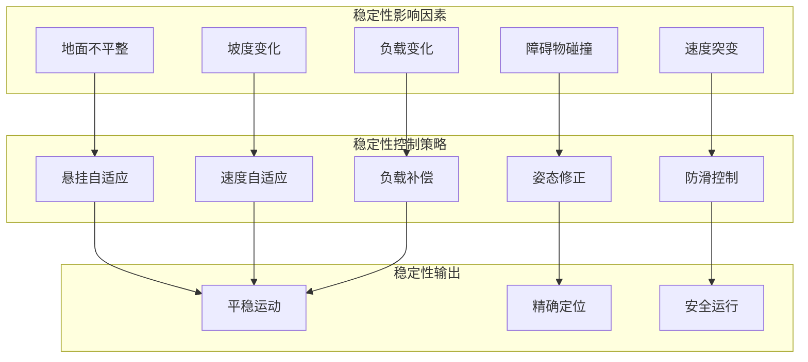
```mermaid
flowchart TD
    subgraph 稳定性影响因素
        A1[地面不平整]
        A2[坡度变化]
        A3[障碍物碰撞]
        A4[速度突变]
        A5[负载变化]
    end
    
    subgraph 稳定性控制策略
        B1[悬挂自适应]
        B2[速度自适应]
        B3[姿态修正]
        B4[防滑控制]
        B5[负载补偿]
    end
    
    subgraph 稳定性输出
        C1[平稳运动]
        C2[精确定位]
        C3[安全运行]
    end
    
    A1 --> B1
    A2 --> B2
    A3 --> B3
    A4 --> B4
    A5 --> B5
    
    B1 --> C1
    B2 --> C1
    B3 --> C2
    B4 --> C3
    B5 --> C1
```

#### 3.2.2 四连杆悬挂控制

石头 G10S Pro 采用四连杆独立悬挂系统，能够自适应地面不平整。

| 悬挂参数 | 数值 | 说明 |
|---------|------|------|
| 悬挂行程 | 10-15mm「推理」 | 轮子上下浮动范围 |
| 悬挂刚度 | 5N/mm「推理」 | 弹簧刚度 |
| 阻尼系数 | 0.3「推理」 | 减震阻尼 |
| 接地压力 | 10-15N「推理」 | 轮子接地压力 |
| 适应坡度 | ≤15° | 最大适应坡度 |

#### 3.2.3 防滑控制

| 防滑策略 | 触发条件 | 控制动作 | 效果 |
|---------|---------|---------|------|
| 打滑检测 | 编码器速度异常 | 降低驱动功率 | 防止轮子空转 |
| 扭矩限制 | 电流超过阈值 | 限制最大扭矩 | 防止打滑 |
| 速度限制 | 检测到打滑 | 降低运动速度 | 恢复抓地力 |
| 升起拖布 | 拖布打滑检测 | 升起拖布支架 | 减小阻力 |

#### 3.2.4 姿态稳定性控制

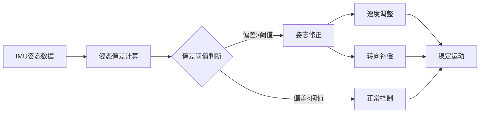
```mermaid
flowchart LR
    A[IMU姿态数据] --> B[姿态偏差计算]
    B --> C{偏差阈值判断}
    
    C -->|偏差<阈值| D[正常控制]
    C -->|偏差>阈值| E[姿态修正]
    
    E --> F[速度调整]
    E --> G[转向补偿]
    
    F --> H[稳定运动]
    G --> H
    D --> H
```

### 3.3 动力学控制

#### 3.3.1 前馈-反馈复合控制

石头 G10S Pro 采用前馈-反馈复合控制策略，提高动态响应性能。

```
图3-2 前馈-反馈复合控制框图

目标速度 ──┬────────────────────────────────────────→ 加法器 ──→ 电机
           │                                              ↑
           │    ┌─────────┐                              │
           └───→│ 前馈控制 │──────────────────────────────┤
                │ G_ff(s) │                              │
                └─────────┘                              │
                                                         │
实际速度 ←───────────────────────────────────────────────┤
           │    ┌─────────┐    ┌─────────┐              │
           └───→│ 反馈控制 │───→│ 限幅器  │──────────────┘
                │ G_fb(s) │    │         │
                └─────────┘    └─────────┘

前馈控制器：G_ff(s) = 1/G_plant(s)
反馈控制器：G_fb(s) = Kp + Ki/s + Kd×s
```

#### 3.3.2 控制器参数整定

| 控制回路 | Kp | Ki | Kd | 控制周期 |
|---------|-----|-----|-----|---------|
| 线速度环 | 2.0「推理」 | 0.1「推理」 | 0.05「推理」 | 10ms |
| 角速度环 | 3.0「推理」 | 0.2「推理」 | 0.1「推理」 | 10ms |
| 轮速环 | 1.5「推理」 | 0.05「推理」 | - | 10ms |
| 航向角环 | 4.0「推理」 | - | 0.5「推理」 | 10ms |

---

## IV. 安全与保护

### 4.1 运动限制

#### 4.1.1 运动约束条件

| 约束类型 | 约束参数 | 约束值 | 说明 |
|---------|---------|--------|------|
| 速度限制 | 最大线速度 | 300mm/s | 硬件能力限制 |
| 速度限制 | 最大角速度 | 180°/s「推理」 | 硬件能力限制 |
| 加速度限制 | 最大线加速度 | 200mm/s² | 平稳性要求 |
| 加速度限制 | 最大角加速度 | 180°/s²「推理」 | 平稳性要求 |
| 坡度限制 | 最大爬坡角度 | 15° | 电机扭矩限制 |
| 越障限制 | 最大越障高度 | 20mm | 悬挂行程限制 |
| 转弯限制 | 最小转弯半径 | 0 | 原地旋转 |

#### 4.1.2 软件限位保护

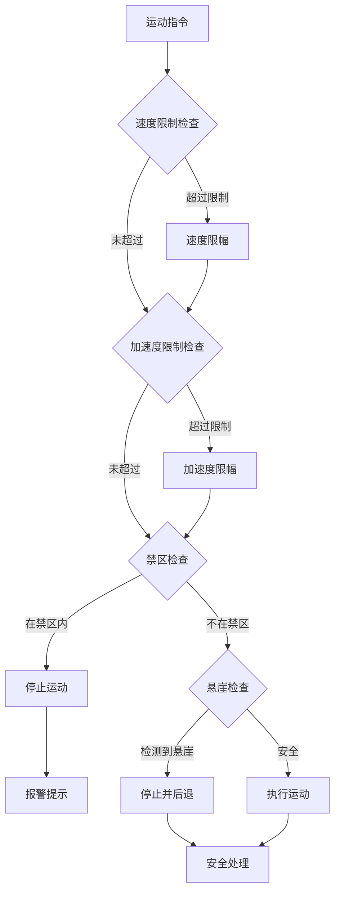
```mermaid
flowchart TD
    A[运动指令] --> B{速度限制检查}
    
    B -->|超过限制| C[速度限幅]
    B -->|未超过| D{加速度限制检查}
    
    C --> D
    
    D -->|超过限制| E[加速度限幅]
    D -->|未超过| F{禁区检查}
    
    E --> F
    
    F -->|在禁区内| G[停止运动]
    F -->|不在禁区| H{悬崖检查}
    
    G --> I[报警提示]
    
    H -->|检测到悬崖| J[停止并后退]
    H -->|安全| K[执行运动]
    
    J --> L[安全处理]
    K --> L
```

#### 4.1.3 禁区与虚拟墙

| 限制类型 | 功能描述 | 参数配置 |
|---------|---------|---------|
| 清洁禁区 | 禁止进入的区域 | 多边形区域定义 |
| 虚拟墙 | 禁止穿越的边界 | 线段定义 |
| 地毯禁区 | 禁止拖地的区域 | 地图标注 |
| 充电禁区 | 禁止清扫的区域 | 基站周边 |

### 4.2 异常处理

#### 4.2.1 异常检测与响应

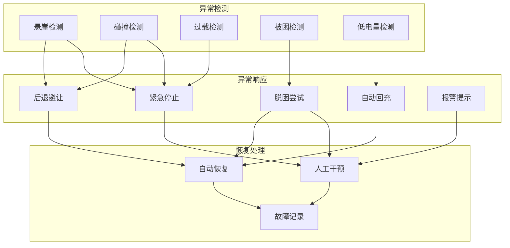
```mermaid
flowchart TD
    subgraph 异常检测
        A1[悬崖检测]
        A2[碰撞检测]
        A3[过载检测]
        A4[被困检测]
        A5[低电量检测]
    end
    
    subgraph 异常响应
        B1[紧急停止]
        B2[后退避让]
        B3[脱困尝试]
        B4[自动回充]
        B5[报警提示]
    end
    
    subgraph 恢复处理
        C1[人工干预]
        C2[自动恢复]
        C3[故障记录]
    end
    
    A1 --> B1
    A1 --> B2
    A2 --> B1
    A2 --> B2
    A3 --> B1
    A4 --> B3
    A5 --> B4
    
    B1 --> C1
    B2 --> C2
    B3 --> C1
    B3 --> C2
    B4 --> C2
    B5 --> C1
    
    C1 --> C3
    C2 --> C3
```

#### 4.2.2 异常处理策略

| 异常类型 | 检测方式 | 响应动作 | 恢复条件 |
|---------|---------|---------|---------|
| 悬崖检测 | 悬崖传感器×6 | 立即停止→后退→转向 | 传感器释放 |
| 前方碰撞 | 碰撞传感器 | 停止→后退→转向 | 传感器释放 |
| 侧方碰撞 | 碰撞传感器 | 停止→转向避让 | 传感器释放 |
| 电机过载 | 电流检测 | 停止电机→报警 | 手动复位 |
| 被困状态 | 运动检测超时 | 脱困尝试×3次 | 脱困成功或失败 |
| 低电量 | 电压检测 | 自动回充 | 电量恢复 |
| 雷达故障 | 数据异常检测 | 停止清扫→报警 | 故障清除 |
| 打滑检测 | 编码器异常 | 升起拖布→减速 | 打滑消除 |

#### 4.2.3 脱困策略

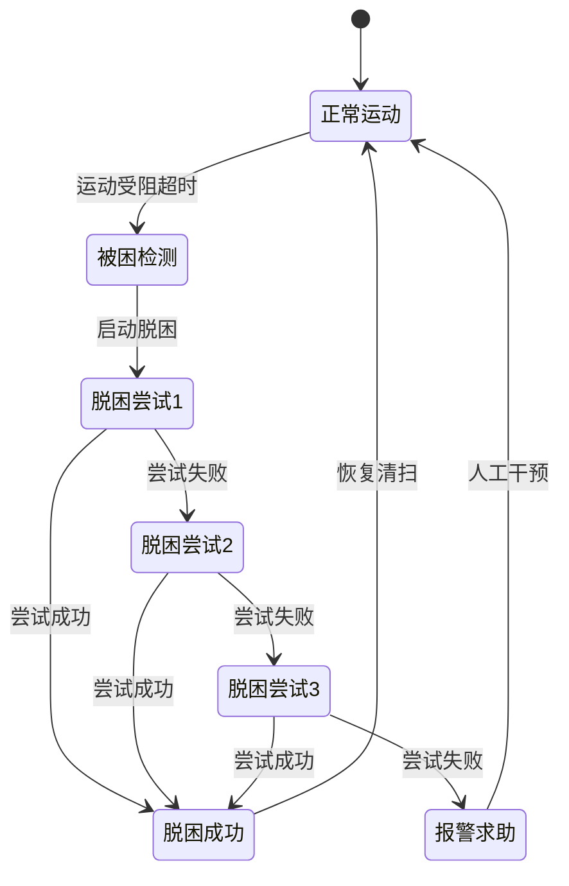
```mermaid
stateDiagram-v2
    [*] --> 正常运动
    
    正常运动 --> 被困检测: 运动受阻超时
    
    被困检测 --> 脱困尝试1: 启动脱困
    
    脱困尝试1 --> 脱困成功: 尝试成功
    脱困尝试1 --> 脱困尝试2: 尝试失败
    
    脱困尝试2 --> 脱困成功: 尝试成功
    脱困尝试2 --> 脱困尝试3: 尝试失败
    
    脱困尝试3 --> 脱困成功: 尝试成功
    脱困尝试3 --> 报警求助: 尝试失败
    
    脱困成功 --> 正常运动: 恢复清扫
    报警求助 --> 正常运动: 人工干预
```

#### 4.2.4 脱困动作序列

| 脱困阶段 | 动作序列 | 动作描述 | 持续时间 |
|---------|---------|---------|---------|
| 阶段1 | 后退→转向→前进 | 简单脱困 | 5秒 |
| 阶段2 | 后退→原地旋转→前进 | 中等脱困 | 8秒 |
| 阶段3 | 后退→摇摆→前进 | 复杂脱困 | 10秒 |
| 失败 | 停止→报警 | 等待人工干预 | 持续 |

### 4.3 紧急停止

#### 4.3.1 紧急停止触发条件

| 触发源 | 触发条件 | 响应时间 | 停止类型 |
|--------|---------|---------|---------|
| 悬崖传感器 | 检测到落差>3cm | <10ms | 急停 |
| 碰撞传感器 | 碰撞触发 | <5ms | 急停 |
| 用户按键 | 长按按键 | <100ms | 软停止 |
| APP指令 | 紧急停止指令 | <200ms | 软停止 |
| 过流保护 | 电流超过阈值 | <10ms | 急停 |
| 固件异常 | 看门狗超时 | <1s | 系统复位 |

#### 4.3.2 紧急停止流程

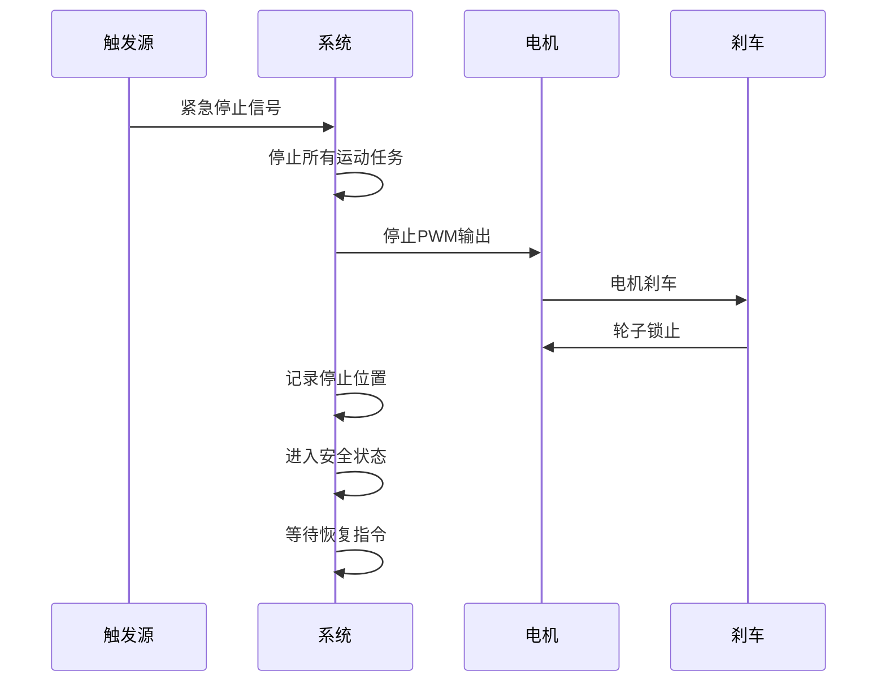
```mermaid
sequenceDiagram
    participant TRIG as 触发源
    participant SYS as 系统
    participant MOTOR as 电机
    participant BRAKE as 刹车
    
    TRIG->>SYS: 紧急停止信号
    SYS->>SYS: 停止所有运动任务
    SYS->>MOTOR: 停止PWM输出
    MOTOR->>BRAKE: 电机刹车
    BRAKE->>MOTOR: 轮子锁止
    
    SYS->>SYS: 记录停止位置
    SYS->>SYS: 进入安全状态
    SYS->>SYS: 等待恢复指令
```

---

## V. 控制参数配置

### 5.1 运动控制参数表

| 参数名称 | 参数ID | 默认值 | 范围 | 单位 | 说明 |
|---------|--------|--------|------|------|------|
| 最大线速度 | V_MAX | 300 | 100-500 | mm/s | 最大移动速度 |
| 最大角速度 | W_MAX | 180 | 60-360 | °/s | 最大转向速度 |
| 线加速度 | A_LINEAR | 200 | 50-500 | mm/s² | 线性加速度 |
| 角加速度 | A_ANGULAR | 180 | 60-360 | °/s² | 角加速度 |
| 转弯减速比 | TURN_RATIO | 0.5 | 0.3-0.8 | - | 转弯时速度比例 |
| 沿墙距离 | WALL_DIST | 10 | 5-30 | mm | 沿墙清扫距离 |
| 避障距离 | OBS_DIST | 20 | 10-50 | mm | 障碍物安全距离 |

### 5.2 清洁控制参数表

| 参数名称 | 参数ID | 默认值 | 范围 | 单位 | 说明 |
|---------|--------|--------|------|------|------|
| 标准吸力转速 | FAN_STD | 12000 | 8000-15000 | RPM | 标准模式转速 |
| 强力吸力转速 | FAN_STRONG | 16000 | 12000-18000 | RPM | 强力模式转速 |
| Max+吸力转速 | FAN_MAX | 20000 | 15000-22000 | RPM | Max+模式转速 |
| 边刷低速 | BRUSH_LOW | 130 | 100-200 | RPM | 正常清扫转速 |
| 边刷高速 | BRUSH_HIGH | 330 | 250-400 | RPM | 沿墙清扫转速 |
| 震动弱档 | VIB_LOW | 28 | 20-35 | Hz | 弱档震动频率 |
| 震动中档 | VIB_MID | 38 | 30-45 | Hz | 中档震动频率 |
| 震动强档 | VIB_HIGH | 50 | 40-60 | Hz | 强档震动频率 |

### 5.3 安全保护参数表

| 参数名称 | 参数ID | 默认值 | 范围 | 单位 | 说明 |
|---------|--------|--------|------|------|------|
| 悬崖检测阈值 | CLIFF_TH | 30 | 20-50 | mm | 悬崖检测高度 |
| 低电量阈值 | BAT_LOW | 20 | 15-30 | % | 低电量报警阈值 |
| 回充电量阈值 | BAT_RETURN | 15 | 10-20 | % | 自动回充电量 |
| 过流保护阈值 | CUR_LIMIT | 5.0 | 3.0-8.0 | A | 电机过流保护 |
| 脱困尝试次数 | STUCK_RETRY | 3 | 1-5 | 次 | 脱困尝试次数 |
| 脱困超时时间 | STUCK_TIME | 10 | 5-20 | 秒 | 脱困判定时间 |

---

## VI. 附录

### 6.1 术语定义

| 术语 | 定义 |
|------|------|
| DWA | Dynamic Window Approach，动态窗口法 |
| EKF | Extended Kalman Filter，扩展卡尔曼滤波 |
| PID | Proportional-Integral-Derivative，比例-积分-微分控制 |
| FOC | Field-Oriented Control，磁场定向控制 |
| SLAM | Simultaneous Localization and Mapping，同步定位与建图 |
| IMU | Inertial Measurement Unit，惯性测量单元 |
| PWM | Pulse Width Modulation，脉宽调制 |

### 6.2 控制算法参考

| 算法名称 | 应用场景 | 参考文献 |
|---------|---------|---------|
| A*算法 | 全局路径规划 | Hart et al., 1968 |
| DWA算法 | 局部避障规划 | Fox et al., 1997 |
| EKF滤波 | 位姿估计融合 | Thrun et al., 2005 |
| PID控制 | 速度/位置控制 | Åström & Hägglund, 1995 |

### 6.3 文档修订记录

| 版本 | 日期 | 修订内容 | 作者 |
|------|------|---------|------|
| V1.0 | 2022-01 | 初始版本发布 | 运动控制部 |

---

*本运动控制与规划文档基于石头G10S Pro深度产品调研报告、硬件需求说明书及接口控制文档编制，部分参数标注「推理」的内容为基于行业经验的合理推演。*
