# 石头 G10S Pro 扫地机器人感知与导航系统

**文档版本**：V1.0  
**编制日期**：2022年1月  
**产品代号**：G10S Pro  
**系统版本**：PNS-01  

---

## I. 感知系统架构

### 1.1 传感器系统配置

石头 G10S Pro 采用行业最豪华的多传感器融合方案，通过激光雷达、视觉传感器、惯性导航单元等多种传感器的协同工作，实现对环境的全方位感知能力。

#### 1.1.1 传感器清单

| 传感器类型 | 型号/规格 | 数量 | 安装位置 | 主要功能 |
|-----------|----------|------|---------|---------|
| LDS激光雷达 | 三角测距式 | 1 | 机身顶部中央 | 环境扫描、建图定位 |
| 3D结构光发射器 | 850nm线激光 | 2 | 机身正面两侧 | 精准测距、障碍物检测 |
| RGB摄像头 | ≥720P CMOS | 1 | 机身正面中央 | AI识别、视频通话 |
| LED补光灯 | 白光LED | 1-2 | 摄像头旁 | 暗光补光 |
| IMU惯性单元 | 6轴IMU | 1 | 主板中央 | 姿态感知、运动估计 |
| 编码器 | 光电编码器 | 2 | 驱动轮 | 里程计、速度反馈 |
| 超声波传感器 | 压电式 | 2 | 侧面+底部 | 沿墙检测、地毯识别 |
| 悬崖传感器 | 红外光电 | 6 | 底部边缘 | 跌落检测 |
| 碰撞传感器 | 机械/光电 | 1 | 机身前部 | 碰撞检测 |

#### 1.1.2 传感器布局图

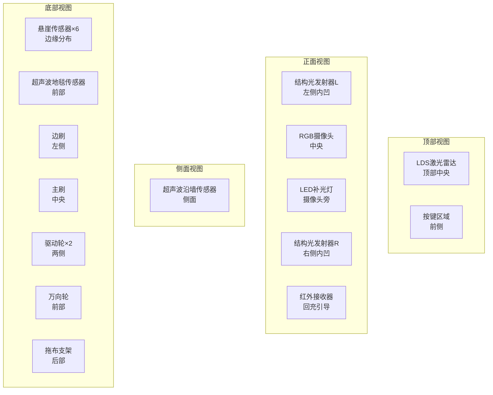

#### 1.1.3 传感器同步机制

| 同步类型 | 涉及传感器 | 同步方式 | 同步精度 | 说明 |
|---------|-----------|---------|---------|------|
| 硬件同步 | 结构光+摄像头 | 触发信号同步 | <1ms | 结构光发射与图像采集同步 |
| 时间戳同步 | 所有传感器 | 统一时间基准 | <10ms | 软件时间戳对齐 |
| 空间同步 | LDS+IMU+编码器 | 外参标定 | <5mm | 坐标系统一 |
| 频率同步 | LDS+IMU | 倍频关系 | - | LDS 5Hz, IMU 100Hz |

### 1.2 感知处理架构

石头 G10S Pro 的感知处理架构采用分层分布式设计，以主控芯片为核心，结合NPU加速单元，实现高效的感知数据处理。

#### 1.2.1 感知处理架构图

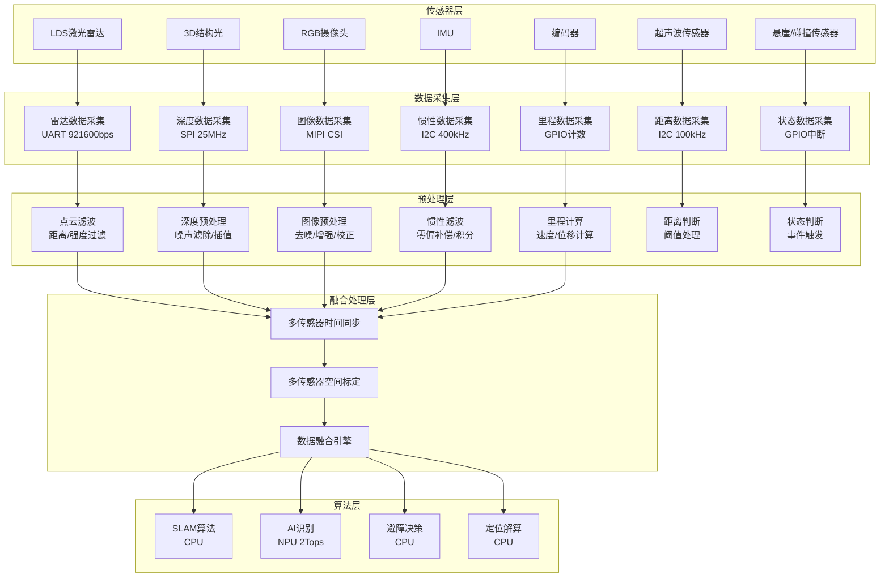

#### 1.2.2 计算平台与负载分配

| 处理单元 | 硬件资源 | 主要任务 | 负载率 | 说明 |
|---------|---------|---------|--------|------|
| CPU主核心 | 八核ARM Cortex-A55 | SLAM、路径规划、系统控制 | 60-80%「推理」 | 通用计算 |
| NPU加速单元 | 2Tops算力 | AI物体识别、语义分割 | 70-90%「推理」 | 神经网络推理 |
| GPU | Mali-G57 | 图像预处理、视频编码 | 30-50%「推理」 | 图形处理 |
| DSP | 内置DSP | 音频处理、信号滤波 | 20-40%「推理」 | 专用信号处理 |

#### 1.2.3 数据处理层级划分

| 层级 | 处理内容 | 更新频率 | 延迟要求 | 数据量 |
|------|---------|---------|---------|--------|
| 原始数据层 | 传感器原始数据采集 | 5-100Hz | <10ms | 高 |
| 预处理层 | 滤波、校正、格式转换 | 5-100Hz | <20ms | 中 |
| 特征提取层 | 特征点、深度信息提取 | 5-30Hz | <50ms | 中 |
| 融合层 | 多传感器数据融合 | 5-30Hz | <100ms | 低 |
| 语义层 | 物体识别、场景理解 | 15-30Hz | <200ms | 低 |

---

## II. 核心感知能力

### 2.1 视觉感知

#### 2.1.1 图像采集与预处理

**摄像头参数规格：**

| 参数项 | 规格值 | 说明 |
|--------|--------|------|
| 传感器类型 | CMOS图像传感器 | 高感光度设计 |
| 分辨率 | ≥720P (1280×720)「推理」 | 满足AI识别需求 |
| 视场角 | ≥120° | 广角视野覆盖 |
| 帧率 | ≥15fps | 实时识别 |
| 光圈 | F2.0~F2.8「推理」 | 大光圈进光 |
| 自动曝光 | 支持 | 适应不同光照 |
| 补光方式 | LED白光补光 | Pro版配置 |

**图像预处理流程：**

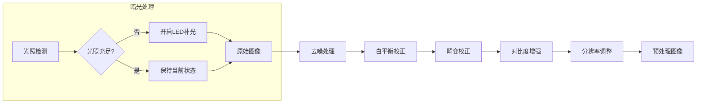

#### 2.1.2 目标检测与识别

石头 G10S Pro 搭载 Reactive AI 2.0 避障系统，通过深度学习算法实现 27 种常见障碍物的智能识别。

**可识别障碍物清单：**

| 类别 | 障碍物类型 | 识别优先级 | 避障策略 |
|------|-----------|-----------|---------|
| 线缆类 | 电源线、数据线、耳机线 | 高 | 绕行避让 |
| 鞋类 | 鞋子、拖鞋、凉鞋 | 高 | 绕行避让 |
| 织物类 | 袜子、毛巾、衣物 | 高 | 绕行避让 |
| 家具类 | 椅子腿、桌腿、沙发脚 | 中 | 贴边清扫 |
| 电器类 | 体重秤、充电座、风扇底座 | 中 | 绕行避让 |
| 宠物类 | 猫、狗、宠物粪便 | 高 | 远距离绕行 |
| 其他类 | 玩具、书本、垃圾桶 | 中 | 绕行避让 |

**AI识别处理流程：**

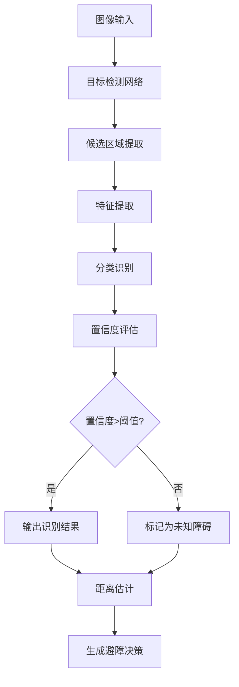

**AI识别性能参数：**

| 性能指标 | 参数值 | 测试条件 |
|---------|--------|---------|
| 识别种类 | 27种 | 标准测试集 |
| 识别准确率 | ≥95%「推理」 | 良好光照条件 |
| 识别距离 | 0.1-0.8m | 有效识别范围 |
| 识别延迟 | <100ms「推理」 | 单帧处理时间 |
| 误检率 | <5%「推理」 | 误识别比例 |
| 漏检率 | <3%「推理」 | 未识别比例 |

#### 2.1.3 深度感知

**3D结构光测距原理：**

```
图2-1 结构光测距原理示意图

                    机身正面
    ┌─────────────────────────────────────┐
    │                                     │
    │   ┌───┐           ┌───┐            │
    │   │ L │           │ R │            │
    │   │结构光发射器    │结构光发射器     │
    │   └─┬─┘           └─┬─┘            │
    │     │               │               │
    │     │ 850nm激光     │               │
    │     ▼               ▼               │
    │   ╱ ╲             ╱ ╲              │
    │  ╱   ╲           ╱   ╲             │
    │ ╱     ╲         ╱     ╲            │
    │▼       ▼       ▼       ▼           │
    │                                       │
    │         ┌─────────────┐              │
    │         │  障碍物表面  │              │
    │         │  (线激光投射) │              │
    │         └─────────────┘              │
    │                                       │
    │   ┌─────────────────────────┐        │
    │   │     RGB摄像头           │        │
    │   │   (接收激光线图像)       │        │
    │   └─────────────────────────┘        │
    │                                       │
    └─────────────────────────────────────┘

测距原理：
- 结构光发射器投射850nm线激光到障碍物表面
- 摄像头捕获激光线图像
- 通过三角测量原理计算障碍物距离
- 测距精度：±5mm「推理」
- 测距范围：0-80cm
```

**深度感知参数：**

| 参数项 | 规格值 | 说明 |
|--------|--------|------|
| 测距方式 | 结构光三角测量 | 主动测距 |
| 激光波长 | 850nm | 红外激光 |
| 激光等级 | Class 1 | 人眼安全 |
| 测距范围 | 0-80cm | 有效测距距离 |
| 测距精度 | ±5mm「推理」 | 毫米级精度 |
| 水平视场角 | 约70°「推理」 | 前方覆盖范围 |
| 垂直视场角 | 约15°「推理」 | 线激光覆盖 |
| 更新频率 | 15-30Hz「推理」 | 实时测距 |

### 2.2 SLAM系统

#### 2.2.1 激光SLAM

石头 G10S Pro 采用 LDS 激光雷达进行同步定位与地图构建，结合 RR mason 9.0 算法系统实现高效建图。

**LDS激光雷达参数：**

| 参数项 | 规格值 | 说明 |
|--------|--------|------|
| 测距方式 | 三角测距 | 成本优化方案 |
| 扫描频率 | 5-10Hz「推理」 | 实时建图 |
| 角度分辨率 | ≤1° | 精确建图 |
| 测距范围 | 0.15-12m「推理」 | 室内建图需求 |
| 测距精度 | ±30mm「推理」 | 定位精度要求 |
| 扫描角度 | 360° | 全向扫描 |
| 升降功能 | 支持 | 降至7.95cm高度 |

**激光SLAM算法流程：**

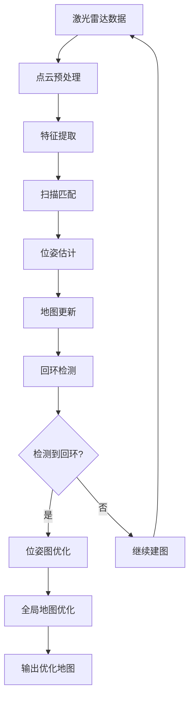

**SLAM建图性能：**

| 性能指标 | 参数值 | 测试条件 |
|---------|--------|---------|
| 建图速度 | 8分钟/全屋 | 120㎡户型 |
| 地图精度 | <5cm「推理」 | 与实际尺寸对比 |
| 定位精度 | <3cm「推理」 | 重复定位测试 |
| 地图存储 | 4张地图 | 多楼层支持 |
| 重定位时间 | <5s「推理」 | 位置丢失后恢复 |

#### 2.2.2 多传感器融合SLAM

石头 G10S Pro 采用激光雷达、IMU、编码器多传感器融合的SLAM方案，提升定位的鲁棒性和精度。

**融合架构图：**

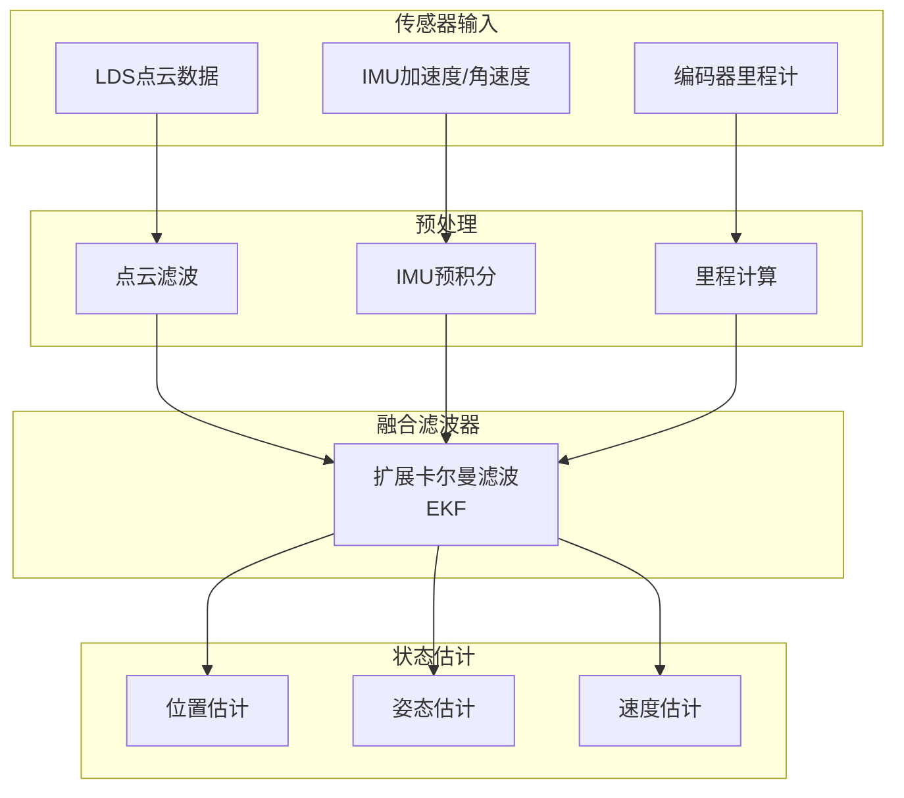

**融合算法参数：**

| 参数项 | 参数值 | 说明 |
|--------|--------|------|
| 融合算法 | EKF + 图优化 | 紧耦合融合 |
| 状态向量维度 | 15维 | 位置、速度、姿态、零偏 |
| 更新频率 | 100Hz | IMU频率 |
| 激光更新频率 | 5-10Hz | 雷达频率 |
| 里程计权重 | 0.3「推理」 | 短距离可信度高 |
| IMU权重 | 0.3「推理」 | 快速运动补偿 |
| 激光权重 | 0.4「推理」 | 长期定位基准 |

### 2.3 多传感器融合

#### 2.3.1 融合架构设计

石头 G10S Pro 采用分层融合架构，将多传感器数据在时间、空间、决策三个层面进行融合。

**融合架构层次图：**

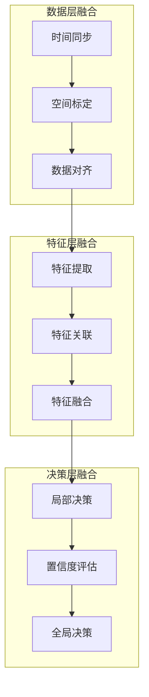

#### 2.3.2 时间同步机制

| 同步方式 | 涉及传感器 | 实现方法 | 同步精度 |
|---------|-----------|---------|---------|
| 硬件触发 | 结构光+摄像头 | 触发信号同步 | <1ms |
| 软件时间戳 | 所有传感器 | 统一时间基准 | <10ms |
| 插值同步 | IMU+LDS | 时间插值对齐 | <5ms |

**时间同步流程：**

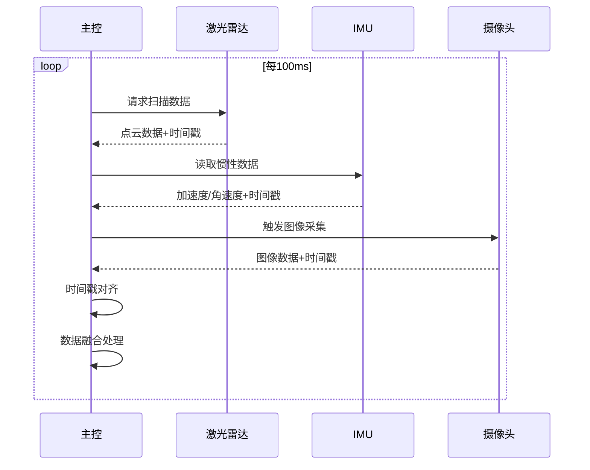

#### 2.3.3 空间标定

**坐标系定义：**

```
图2-2 坐标系定义示意图

                    机器人坐标系 (Robot Frame)
                           ↑ Y (前进方向)
                           │
                           │
                           │
              ─────────────┼─────────────→ X (右侧方向)
                           │
                           │
                         ● (原点: 机器人中心)
                         
    ┌─────────────────────────────────────────────────────┐
    │                                                      │
    │   LDS坐标系           IMU坐标系         相机坐标系   │
    │   (顶部中央)          (主板中央)        (正面中央)   │
    │                                                      │
    │   ┌───┐               ┌───┐            ┌───┐       │
    │   │ L │               │ I │            │ C │       │
    │   └─┬─┘               └─┬─┘            └─┬─┘       │
    │     │                   │                │          │
    │   偏移:                 偏移:            偏移:       │
    │   x=0, y=0            x=0, y=0         x=0, y=-a   │
    │   z=h_lidar           z=0              z=h_cam     │
    │                                                      │
    └─────────────────────────────────────────────────────┘
    
    外参标定参数「推理」:
    - LDS到机器人中心: (0, 0, 50mm)
    - IMU到机器人中心: (0, 0, 0)
    - 相机到机器人中心: (0, -100mm, 30mm)
    - 结构光到相机: 已工厂标定
```

**外参标定参数：**

| 传感器 | 相对机器人中心偏移 | 旋转角度 | 标定方法 |
|--------|-------------------|---------|---------|
| LDS激光雷达 | (0, 0, 50mm)「推理」 | 0° | 工厂标定 |
| IMU | (0, 0, 0)「推理」 | 0° | 工厂标定 |
| RGB摄像头 | (0, -100mm, 30mm)「推理」 | 俯仰角-15°「推理」 | 工厂标定 |
| 结构光 | 与摄像头一体 | 与摄像头一体 | 工厂标定 |

#### 2.3.4 融合算法设计

**障碍物检测融合算法：**

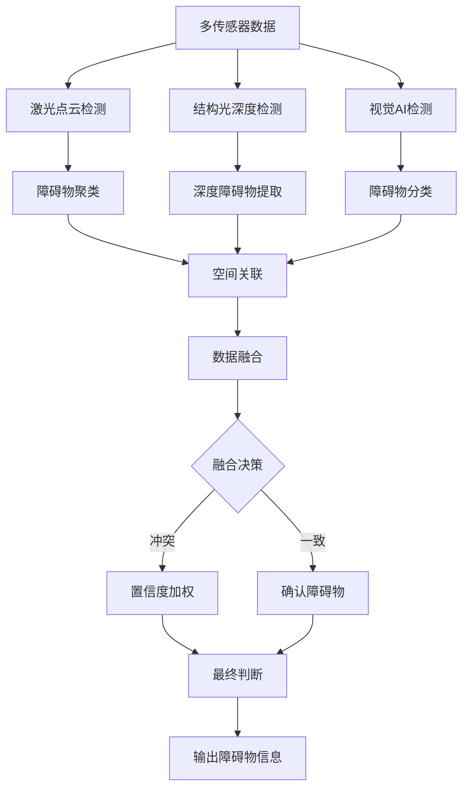

**融合权重配置：**

| 检测场景 | 激光权重 | 结构光权重 | 视觉权重 | 说明 |
|---------|---------|-----------|---------|------|
| 开阔区域 | 0.6 | 0.2 | 0.2 | 激光主导 |
| 近距离障碍 | 0.2 | 0.5 | 0.3 | 结构光主导 |
| 物体识别 | 0.1 | 0.2 | 0.7 | 视觉主导 |
| 暗光环境 | 0.5 | 0.4 | 0.1 | 主动传感器主导 |
| 地毯区域 | 0.3 | 0.2 | 0.5 | 视觉辅助判断 |

---

## III. 定位与导航系统

### 3.1 定位系统

#### 3.1.1 全局定位

石头 G10S Pro 采用多源融合的全局定位方案，结合激光SLAM、视觉特征和地标识别实现精准定位。

**全局定位架构：**

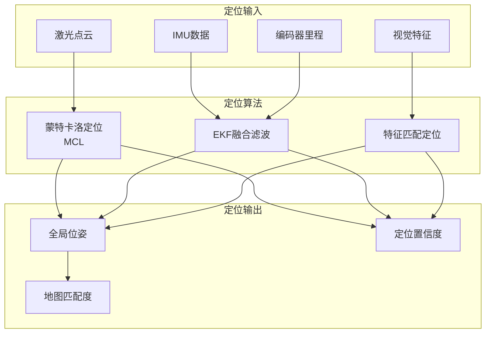

**全局定位性能：**

| 性能指标 | 参数值 | 测试条件 |
|---------|--------|---------|
| 定位精度 | <5cm「推理」 | 已建图环境 |
| 定位延迟 | <100ms「推理」 | 实时定位 |
| 重定位成功率 | >95%「推理」 | 位置丢失后 |
| 重定位时间 | <5s「推理」 | 恢复定位 |
| 定位稳定性 | >99%「推理」 | 长时间运行 |

#### 3.1.2 局部定位

局部定位主要用于机器人的实时运动控制和避障，采用高频率的里程计和IMU融合方案。

**局部定位参数：**

| 参数项 | 参数值 | 说明 |
|--------|--------|------|
| 更新频率 | 100Hz | IMU采样频率 |
| 里程计精度 | <1%/m「推理」 | 短距离精度 |
| IMU零偏稳定性 | <0.1°/s「推理」 | 漂移控制 |
| 融合算法 | 互补滤波 | 实时性好 |
| 短期精度 | <1cm「推理」 | 1秒内精度 |

#### 3.1.3 重定位能力

当机器人位置丢失或被人为移动后，系统通过全局定位算法快速恢复定位。

**重定位流程：**

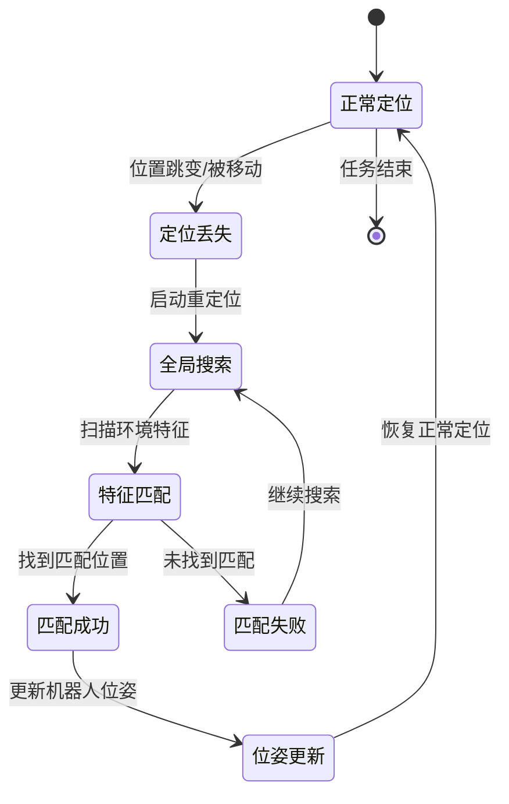

**重定位策略：**

| 场景 | 重定位策略 | 预期时间 | 成功率 |
|------|-----------|---------|--------|
| 轻微位移(<1m) | 局部搜索 | <2s | >99% |
| 明显位移(1-3m) | 区域搜索 | <5s | >95% |
| 大范围位移(>3m) | 全局搜索 | <10s | >90% |
| 跨房间移动 | 全局搜索+地标 | <15s | >85% |

### 3.2 导航系统

#### 3.2.1 环境建模

石头 G10S Pro 采用栅格地图和拓扑地图相结合的环境建模方案，支持多种地图类型。

**地图类型定义：**

| 地图类型 | 数据结构 | 用途 | 更新频率 |
|---------|---------|------|---------|
| 栅格地图 | 2D栅格 | 路径规划、避障 | 实时更新 |
| 拓扑地图 | 节点+边 | 全局导航、房间划分 | 任务更新 |
| 语义地图 | 标注层 | 房间类型、家具位置 | 用户编辑 |
| 3D地图 | 高程信息 | 门槛、地毯识别 | 任务更新 |

**栅格地图参数：**

| 参数项 | 参数值 | 说明 |
|--------|--------|------|
| 分辨率 | 5cm/格「推理」 | 地图精度 |
| 栅格值定义 | 0-255 | 占据概率 |
| 地图尺寸 | 最大50m×50m | 大户型支持 |
| 存储格式 | 压缩栅格 | 节省存储 |

#### 3.2.2 路径规划

石头 G10S Pro 采用分层路径规划架构，包括全局路径规划和局部路径规划两个层次。

**路径规划架构图：**

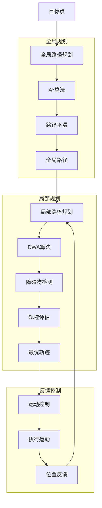

**全局路径规划（A*算法）：**

| 参数项 | 参数值 | 说明 |
|--------|--------|------|
| 搜索算法 | A* | 启发式搜索 |
| 启发函数 | 欧氏距离 | 最优路径 |
| 代价函数 | 距离+转角 | 平滑路径 |
| 路径平滑 | B样条插值 | 减少转弯 |
| 规划周期 | 事件触发 | 目标变更时 |

**局部路径规划（DWA算法）：**

| 参数项 | 参数值 | 说明 |
|--------|--------|------|
| 算法 | DWA | 动态窗口法 |
| 速度采样 | 10×10「推理」 | 速度空间采样 |
| 预测时间 | 2-3s「推理」 | 轨迹预测长度 |
| 评估函数 | 多目标加权 | 最优轨迹选择 |
| 更新频率 | 5-10Hz | 实时规划 |

**DWA轨迹评估函数：**

```
图3-1 DWA轨迹评估函数

G(v, ω) = α·heading(v, ω) + β·dist(v, ω) + γ·velocity(v, ω) + δ·clearance(v, ω)

其中：
- heading(v, ω): 航向评分，轨迹终点朝向目标的角度
- dist(v, ω): 距离评分，轨迹上最近障碍物距离
- velocity(v, ω): 速度评分，优先选择较高速度
- clearance(v, ω): 间隙评分，轨迹周围空间裕度
- α, β, γ, δ: 权重系数「推理」

典型权重配置：
- α = 0.4 (航向权重)
- β = 0.3 (距离权重)
- γ = 0.2 (速度权重)
- δ = 0.1 (间隙权重)
```

#### 3.2.3 运动控制

**运动控制参数：**

| 参数项 | 参数值 | 说明 |
|--------|--------|------|
| 最大线速度 | 0.3m/s | 标准清扫速度 |
| 最大角速度 | 60°/s「推理」 | 原地旋转速度 |
| 线加速度 | 0.2m/s²「推理」 | 平稳加速 |
| 角加速度 | 30°/s²「推理」 | 平稳转向 |
| 控制周期 | 10ms | 实时控制 |
| 控制算法 | PID+前馈 | 复合控制 |

#### 3.2.4 特殊场景导航

**特殊场景处理策略：**

| 场景类型 | 导航策略 | 传感器支持 | 处理方式 |
|---------|---------|-----------|---------|
| 狭窄通道 | 沿中线导航 | LDS+沿墙传感器 | 减速通过 |
| U型区域 | 沿墙清扫 | LDS+碰撞传感器 | 弓字形路径 |
| 地毯区域 | 升起拖布 | 超声波地毯传感器 | 仅扫地模式 |
| 门槛跨越 | 减速通过 | IMU+编码器 | 增大驱动力 |
| 低矮区域 | 降下雷达 | LDS升降机构 | 7.95cm穿越 |
| 暗光环境 | 开启补光 | LED补光灯 | 正常导航 |

**低矮区域导航流程：**

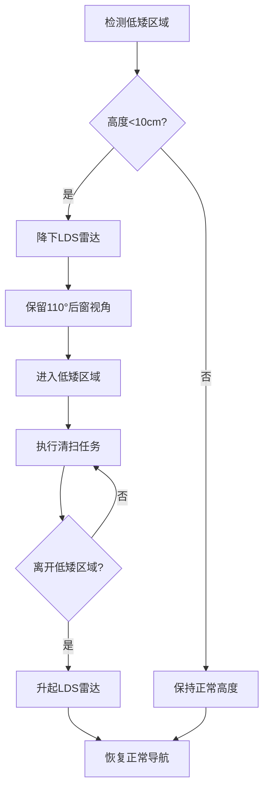

### 3.3 环境理解

#### 3.3.1 场景理解

石头 G10S Pro 具备场景理解能力，能够自动识别房间类型并调整清洁策略。

**房间类型识别：**

| 房间类型 | 识别特征 | 清洁策略 | 参数调整 |
|---------|---------|---------|---------|
| 客厅 | 大面积、沙发茶几 | 标准清扫 | 中等吸力 |
| 卧室 | 床、衣柜、较小面积 | 安静清扫 | 低吸力、低水量 |
| 厨房 | 灶台、冰箱、油污 | 深度清扫 | 高吸力、高水量 |
| 卫生间 | 马桶、洗手台、小面积 | 重点清扫 | 高水量拖地 |
| 阳台 | 落地窗、小面积 | 快速清扫 | 标准模式 |
| 走廊 | 狭长形状 | 沿边清扫 | 边刷高速 |

#### 3.3.2 目标理解

**障碍物属性理解：**

| 属性类型 | 识别方法 | 处理策略 | 优先级 |
|---------|---------|---------|--------|
| 静态障碍 | 地图标记 | 规划绕行 | 低 |
| 动态障碍 | 实时检测 | 即时避让 | 高 |
| 可移动障碍 | AI识别 | 轻推或绕行 | 中 |
| 危险障碍 | AI识别(如宠物粪便) | 远距离绕行 | 最高 |
| 家具边缘 | LDS检测 | 贴边清扫 | 中 |

#### 3.3.3 可通行区域分析

**可通行性判断：**

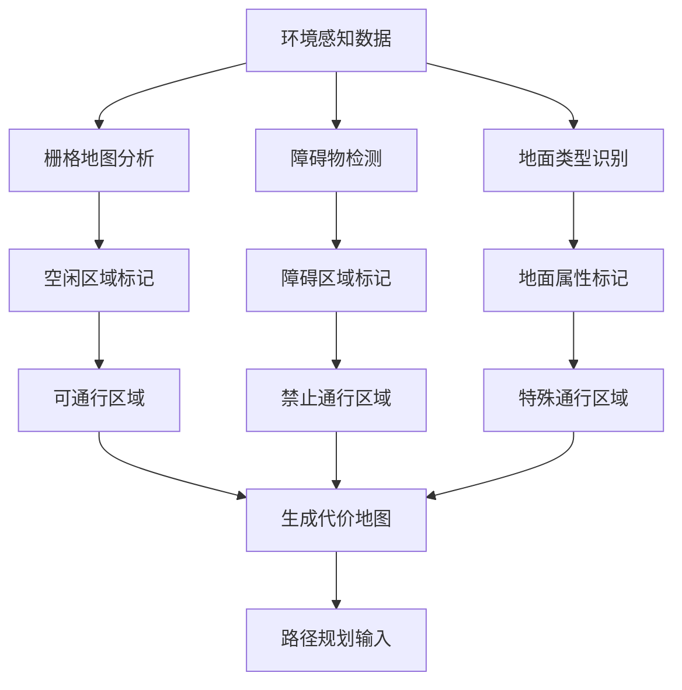

**代价地图配置：**

| 区域类型 | 代价值 | 说明 |
|---------|--------|------|
| 空闲区域 | 0 | 自由通行 |
| 未知区域 | 50 | 谨慎通行 |
| 障碍物附近 | 100-254 | 渐进代价 |
| 障碍物 | 255 | 禁止通行 |
| 地毯区域 | 10「推理」 | 可通行但特殊处理 |
| 虚拟墙 | 255 | 用户设置禁区 |

---

## IV. 性能指标

### 4.1 感知性能指标

#### 4.1.1 检测性能

| 性能指标 | 参数值 | 测试条件 | 说明 |
|---------|--------|---------|------|
| 障碍物检测距离 | 0-80cm | 结构光有效范围 | 毫米级精度 |
| 障碍物识别种类 | 27种 | AI识别能力 | Reactive AI 2.0 |
| 障碍物识别准确率 | ≥95%「推理」 | 标准测试集 | 良好光照条件 |
| 检测响应时间 | <100ms「推理」 | 单次检测 | 实时响应 |
| 误检率 | <5%「推理」 | 误识别比例 | 非障碍物误判 |
| 漏检率 | <3%「推理」 | 未识别比例 | 障碍物漏检 |

#### 4.1.2 测距性能

| 传感器 | 测距范围 | 测距精度 | 更新频率 | 说明 |
|--------|---------|---------|---------|------|
| LDS激光雷达 | 0.15-12m | ±30mm「推理」 | 5-10Hz | 环境建图 |
| 3D结构光 | 0-80cm | ±5mm「推理」 | 15-30Hz「推理」 | 近距离测距 |
| 超声波传感器 | 0-30cm「推理」 | ±10mm「推理」 | 10-20Hz「推理」 | 沿墙/地毯检测 |
| 悬崖传感器 | ≥3cm | - | ≥100Hz | 跌落检测 |

#### 4.1.3 建图性能

| 性能指标 | 参数值 | 测试条件 | 说明 |
|---------|--------|---------|------|
| 建图速度 | 8分钟/全屋 | 120㎡户型 | RR mason 9.0 |
| 地图精度 | <5cm「推理」 | 与实际尺寸对比 | 栅格地图 |
| 地图存储 | 4张 | 多楼层支持 | 3手动+1自动 |
| 地图更新 | 实时 | 清扫过程中 | 动态更新 |
| 重定位时间 | <5s「推理」 | 位置丢失后 | 快速恢复 |

### 4.2 导航性能指标

#### 4.2.1 定位精度

| 性能指标 | 参数值 | 测试条件 | 说明 |
|---------|--------|---------|------|
| 全局定位精度 | <5cm「推理」 | 已建图环境 | 长期定位 |
| 局部定位精度 | <1cm「推理」 | 1秒内 | 短期定位 |
| 定位稳定性 | >99%「推理」 | 长时间运行 | 不丢失定位 |
| 重定位成功率 | >95%「推理」 | 位置丢失后 | 恢复定位 |
| 角度精度 | <3°「推理」 | 航向角精度 | IMU融合 |

#### 4.2.2 导航精度

| 性能指标 | 参数值 | 测试条件 | 说明 |
|---------|--------|---------|------|
| 路径跟踪精度 | <3cm「推理」 | 直线跟踪 | 误差控制 |
| 目标点到达精度 | <5cm「推理」 | 指定点位 | 最终位置误差 |
| 转弯精度 | <5°「推理」 | 90°转弯 | 角度误差 |
| 覆盖率 | >98%「推理」 | 规划区域 | 清扫覆盖 |
| 重复路径偏差 | <5cm「推理」 | 同一路径 | 一致性 |

#### 4.2.3 导航效率

| 性能指标 | 参数值 | 测试条件 | 说明 |
|---------|--------|---------|------|
| 清扫效率 | 20㎡/10min「推理」 | 标准模式 | 单位时间面积 |
| 路径规划时间 | <1s「推理」 | 全局规划 | A*算法 |
| 局部规划时间 | <100ms「推理」 | DWA算法 | 实时规划 |
| 避障响应时间 | <200ms「推理」 | 检测到避让 | 即时响应 |
| 脱困时间 | <30s「推理」 | 被困后脱困 | 自动脱困 |

#### 4.2.4 安全性指标

| 性能指标 | 参数值 | 测试条件 | 说明 |
|---------|--------|---------|------|
| 碰撞避免率 | >95%「推理」 | 正常环境 | 主动避障 |
| 跌落保护 | 100% | 悬崖检测 | 无跌落事故 |
| 卡困恢复率 | >90%「推理」 | 自动脱困 | 无需人工干预 |
| 紧急停止响应 | <100ms「推理」 | 急停触发 | 快速停止 |
| 安全距离保持 | >1cm | 障碍物附近 | 避免碰撞 |

---

## V. 附录

### 5.1 术语定义

| 术语 | 定义 |
|------|------|
| SLAM | Simultaneous Localization and Mapping，同步定位与地图构建 |
| LDS | Laser Distance Sensor，激光测距传感器 |
| IMU | Inertial Measurement Unit，惯性测量单元 |
| EKF | Extended Kalman Filter，扩展卡尔曼滤波 |
| MCL | Monte Carlo Localization，蒙特卡洛定位 |
| DWA | Dynamic Window Approach，动态窗口法 |
| NPU | Neural Processing Unit，神经网络处理单元 |
| CSI | Camera Serial Interface，相机串行接口 |
| FOV | Field of View，视场角 |
| TOF | Time of Flight，飞行时间测距 |

### 5.2 参考标准

| 标准编号 | 标准名称 |
|---------|---------|
| IEC 60825-1 | Safety of laser products - Part 1: Equipment classification |
| GB/T 35139 | 服务机器人性能规范 |
| GB/T 37244 | 消费类机器人通用技术条件 |
| ISO 13482 | Robots and robotic devices - Safety requirements for personal care robots |

### 5.3 文档修订记录

| 版本 | 日期 | 修订内容 | 作者 |
|------|------|---------|------|
| V1.0 | 2022-01 | 初始版本发布 | 感知算法部 |

---

*本感知与导航系统文档基于石头G10S Pro深度产品调研报告、硬件需求说明书及接口控制文档编制，部分参数标注「推理」的内容为基于行业经验的合理推演。*
