# 石头 G10S Pro 扫地机器人智能交互系统

**文档版本**：V1.0  
**编制日期**：2022年1月  
**产品代号**：G10S Pro  
**交互系统版本**：IIS-01  

---

## I. 交互系统架构

### 1.1 交互系统概述

石头 G10S Pro 智能交互系统采用多模态融合架构，整合语音交互、视觉交互、触摸交互、动作交互等多种交互方式，为用户提供自然、便捷、智能的人机交互体验。系统支持 APP 远程控制、语音助手联动、实时视频通话、实体按键操作等多种交互模式，满足不同场景下的用户需求。

#### 1.1.1 支持的交互模态

| 交互模态 | 输入方式 | 输出方式 | 主要应用场景 |
|---------|---------|---------|-------------|
| 语音交互 | 语音指令（智能音箱） | 语音播报、APP推送 | 远程控制、状态查询 |
| 视觉交互 | 摄像头采集 | 视频画面、障碍物照片 | 远程监控、视频通话 |
| 触摸交互 | APP触控、实体按键 | 屏幕反馈、LED状态灯 | 精细控制、快速操作 |
| 动作交互 | 机器人运动状态 | 运动执行、状态变化 | 任务执行、自动响应 |

#### 1.1.2 交互系统架构图

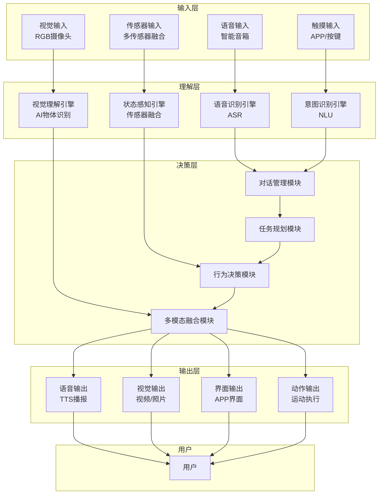

### 1.2 多模态融合策略

#### 1.2.1 融合层级架构

石头 G10S Pro 采用三层融合架构实现多模态交互的协同工作：

| 融合层级 | 融合内容 | 融合方式 | 典型应用 |
|---------|---------|---------|---------|
| 数据层 | 传感器原始数据 | 时间同步、空间配准 | SLAM建图、避障感知 |
| 特征层 | 语义特征提取 | 特征向量融合 | 意图理解、场景识别 |
| 决策层 | 多模态决策结果 | 加权投票、置信度融合 | 任务执行、行为选择 |

#### 1.2.2 多模态融合过程图

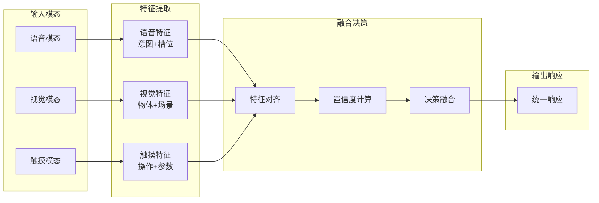

#### 1.2.3 冲突处理机制

| 冲突类型 | 冲突描述 | 解决策略 | 优先级规则 |
|---------|---------|---------|-----------|
| 指令冲突 | 多个模态同时发出不同指令 | 时间优先+置信度优先 | 紧急停止>安全指令>普通指令 |
| 意图冲突 | 不同模态理解结果不一致 | 加权融合+用户确认 | 用户确认>高置信度>默认值 |
| 资源冲突 | 多个任务竞争同一资源 | 任务队列+优先级调度 | 安全任务>清洁任务>其他任务 |
| 时序冲突 | 指令执行顺序冲突 | 状态机约束+依赖检查 | 依赖任务优先执行 |

### 1.3 系统层级架构

#### 1.3.1 输入层架构

输入层负责采集和处理各种交互输入信号，包括语音、图像、触摸和传感器数据。

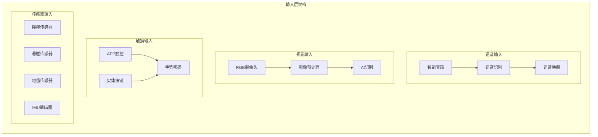

#### 1.3.2 理解层架构

理解层负责对输入信号进行语义理解和意图识别。

| 模块名称 | 功能描述 | 技术实现 | 性能指标 |
|---------|---------|---------|---------|
| 语音识别引擎 | 将语音转换为文本 | 云端ASR服务 | 识别准确率>95%「推理」 |
| 视觉理解引擎 | 图像内容识别与理解 | NPU加速CNN | 27种障碍物识别 |
| 意图识别引擎 | 理解用户操作意图 | NLU模型 | 意图识别准确率>90%「推理」 |
| 状态感知引擎 | 融合传感器状态信息 | 多传感器融合 | 状态更新频率≥10Hz |

#### 1.3.3 决策层架构

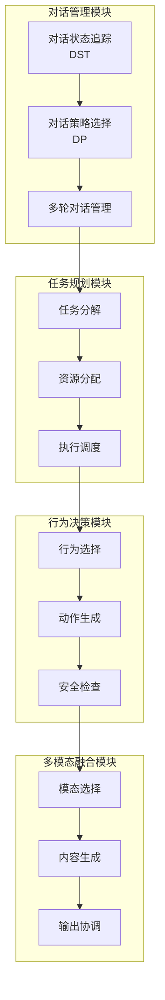

#### 1.3.4 输出层架构

| 输出模态 | 输出设备 | 输出内容 | 响应时间 |
|---------|---------|---------|---------|
| 语音输出 | 扬声器「推理」 | 状态播报、故障提示 | <500ms「推理」 |
| 视觉输出 | APP界面、摄像头画面 | 视频通话、障碍物照片 | <200ms |
| 界面输出 | APP界面 | 地图显示、状态更新 | <100ms |
| 动作输出 | 电机系统 | 清洁动作、导航行为 | <50ms |

---

## II. 核心交互能力

### 2.1 语音交互

#### 2.1.1 语音交互架构

石头 G10S Pro 支持通过智能音箱进行语音控制，兼容小爱音箱、小度音箱、天猫精灵、Siri 捷径四大主流语音控制平台，实现语音指令的远程控制和状态查询。

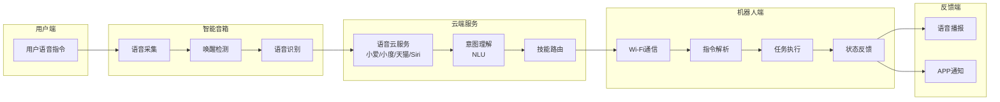

#### 2.1.2 支持的语音平台

| 语音平台 | 唤醒词 | 支持功能 | 技术特点 |
|---------|-------|---------|---------|
| 小爱音箱 | "小爱同学" | 清扫控制、状态查询、场景联动 | 米家生态深度集成 |
| 小度音箱 | "小度小度" | 清扫控制、状态查询 | 百度AI能力支持 |
| 天猫精灵 | "天猫精灵" | 清扫控制、状态查询 | 阿里生态集成 |
| Siri捷径 | "Hey Siri" | 快捷指令控制 | iOS快捷指令集成 |

#### 2.1.3 语音指令集

| 指令类别 | 语音指令示例 | 执行动作 | 响应时间 |
|---------|------------|---------|---------|
| 清扫控制 | "开始清扫" | 启动全屋清扫 | <2s |
| 清扫控制 | "停止清扫" | 停止当前清扫 | <1s |
| 清扫控制 | "暂停清扫" | 暂停当前任务 | <1s |
| 清扫控制 | "回充" | 返回基站充电 | <2s |
| 模式设置 | "安静模式清扫" | 设置静音模式并开始清扫 | <2s |
| 模式设置 | "强力清扫" | 设置强力模式并开始清扫 | <2s |
| 状态查询 | "电量多少" | 播报当前电量 | <2s |
| 状态查询 | "清扫进度" | 播报清扫进度 | <2s |
| 区域清扫 | "清扫客厅" | 清扫指定房间 | <3s |
| 场景联动 | "我要出门了" | 执行出门清扫场景 | <3s |

#### 2.1.4 语音输出能力

| 输出类型 | 输出内容 | 触发条件 | 播报方式 |
|---------|---------|---------|---------|
| 状态播报 | "开始清扫" | 任务启动时 | 主动播报 |
| 状态播报 | "清扫完成" | 任务完成时 | 主动播报 |
| 故障提示 | "请清理主刷" | 检测到故障时 | 主动播报 |
| 故障提示 | "请加水" | 水箱缺水时 | 主动播报 |
| 交互反馈 | "好的" | 收到语音指令时 | 确认播报 |
| 警告提示 | "电量不足" | 电量低于20%时 | 主动播报 |

### 2.2 视觉交互

#### 2.2.1 视觉交互架构

石头 G10S Pro 配备 RGB 摄像头和 LED 补光灯，支持实时视频通话、远程监控、障碍物实景照片等视觉交互功能。

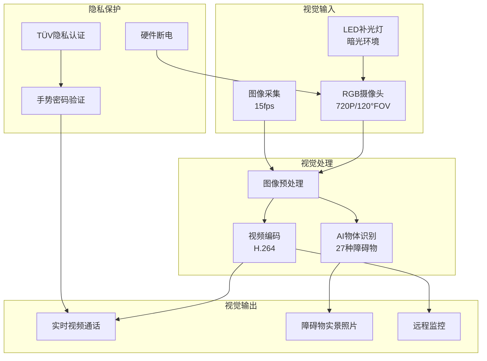

#### 2.2.2 摄像头硬件规格

| 规格项 | 参数值 | 说明 |
|--------|--------|------|
| 传感器类型 | CMOS图像传感器 | AI视觉识别 |
| 分辨率 | ≥720P「推理」 | 物体识别需求 |
| 视场角 | ≥120° | 广角视野 |
| 帧率 | ≥15fps | 实时识别 |
| 补光灯 | 白光LED | Pro版配置 |
| 夜视功能 | LED补光 | 暗光环境工作 |

#### 2.2.3 视觉交互功能

| 功能名称 | 功能描述 | 使用场景 | 技术实现 |
|---------|---------|---------|---------|
| 实时视频通话 | 通过APP查看机器人实时画面 | 远程监控、家庭看护 | Wi-Fi视频流传输 |
| 双向语音通话 | 通过机器人进行语音对话 | 远程交流、宠物互动 | 音频编解码传输 |
| 障碍物实景照片 | 清扫过程中拍摄障碍物照片 | 了解家中情况、避障说明 | AI识别触发拍照 |
| 远程监控 | 远程查看家中情况 | 安全监控、老人看护 | 实时视频流 |

#### 2.2.4 隐私保护机制

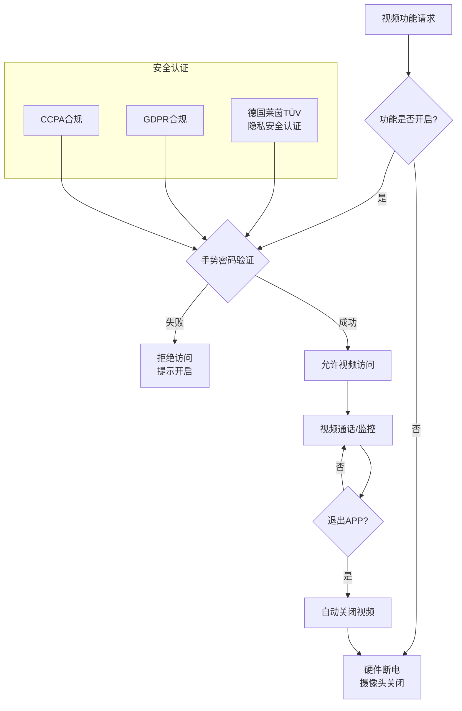

| 安全措施 | 实现方式 | 安全等级 | 认证标准 |
|---------|---------|---------|---------|
| 默认关闭 | 视频功能默认不开启 | 高 | 用户主动启用 |
| 手势密码 | 需设置手势密码才能使用 | 高 | 身份验证 |
| 硬件断电 | 不开启时摄像头硬件断电 | 最高 | 物理隔离 |
| 数据加密 | 视频数据AES-256加密传输 | 高 | 传输安全 |
| 隐私认证 | 德国莱茵TÜV隐私安全认证 | 高 | 第三方认证 |

### 2.3 触摸交互

#### 2.3.1 触摸交互架构

石头 G10S Pro 支持两种触摸交互方式：APP 触控交互和实体按键交互，为用户提供灵活的操作选择。

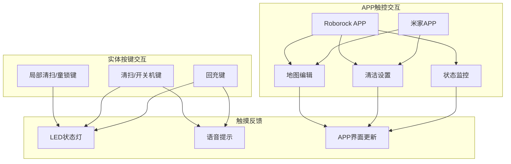

#### 2.3.2 APP交互功能

**Roborock APP 功能模块：**

| 功能模块 | 功能描述 | 操作方式 | 数据更新 |
|---------|---------|---------|---------|
| 地图管理 | 房间分区、合并分割 | 触控编辑 | 实时更新 |
| 清洁设置 | 吸力、水量、清洁次数 | 滑块/选择 | 即时生效 |
| 定时任务 | 设置定时清洁计划 | 时间选择 | 云端同步 |
| 禁区设置 | 设置清洁禁区/虚拟墙 | 区域绘制 | 即时生效 |
| 视频通话 | 实时视频监控 | 一键开启 | 实时传输 |
| 状态监控 | 电量、耗材、清洁进度 | 自动显示 | 实时更新 |

**米家 APP 功能模块：**

| 功能模块 | 功能描述 | 特色功能 |
|---------|---------|---------|
| 设备控制 | 基础清洁控制 | 米家生态联动 |
| 场景联动 | 与其他智能设备联动 | 自动化场景 |
| 状态查看 | 设备状态监控 | 米家首页显示 |
| 固件升级 | OTA固件更新 | 自动推送 |

#### 2.3.3 实体按键定义

| 按键名称 | 位置 | 短按功能 | 长按功能 | LED反馈 |
|---------|------|---------|---------|---------|
| 局部清扫/童锁键 | 顶部左侧 | 启动局部清扫 | 开启/关闭童锁 | 橙色闪烁 |
| 清扫/开关机键 | 顶部中央 | 启动/暂停清扫 | 开机/关机 | 白色常亮 |
| 回充键 | 顶部右侧 | 返回基站充电 | 取消回充 | 白色闪烁 |

#### 2.3.4 LED状态指示

| 工作状态 | LED显示模式 | 颜色 | 闪烁频率 |
|---------|------------|------|---------|
| 待机状态 | 常亮 | 白色 | - |
| 清扫中 | 呼吸灯 | 白色 | 1Hz |
| 充电中 | 常亮 | 橙色 | - |
| 充满电 | 常亮 | 白色 | - |
| 故障状态 | 快闪 | 红色 | 2Hz |
| 童锁开启 | 常亮 | 橙色 | - |
| 视频通话中 | 常亮 | 蓝色 | - |

### 2.4 动作交互

#### 2.4.1 动作交互架构

动作交互指机器人通过运动状态变化与用户进行交互，包括主动行为响应和被动状态反馈。

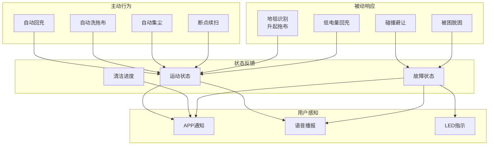

#### 2.4.2 智能行为响应

| 行为类型 | 触发条件 | 执行动作 | 用户反馈 |
|---------|---------|---------|---------|
| 自动回充 | 电量<20% | 返回基站充电 | APP推送+语音播报 |
| 自动洗拖布 | 拖布脏污检测/区域清扫完成 | 返回基站清洗 | APP状态更新 |
| 自动集尘 | 尘盒满/清扫完成 | 返回基站集尘 | APP状态更新 |
| 断点续扫 | 充电完成后 | 从断点继续清扫 | APP进度显示 |
| 地毯避让 | 识别到地毯 | 升起拖布+增大吸力 | 无感知 |
| 脱困行为 | 被困住 | 尝试多种脱困策略 | 失败时APP报警 |

---

## III. 对话系统

### 3.1 对话管理

#### 3.1.1 对话模式

石头 G10S Pro 的对话系统支持单轮对话和多轮对话两种模式，通过智能音箱和 APP 实现语音交互。

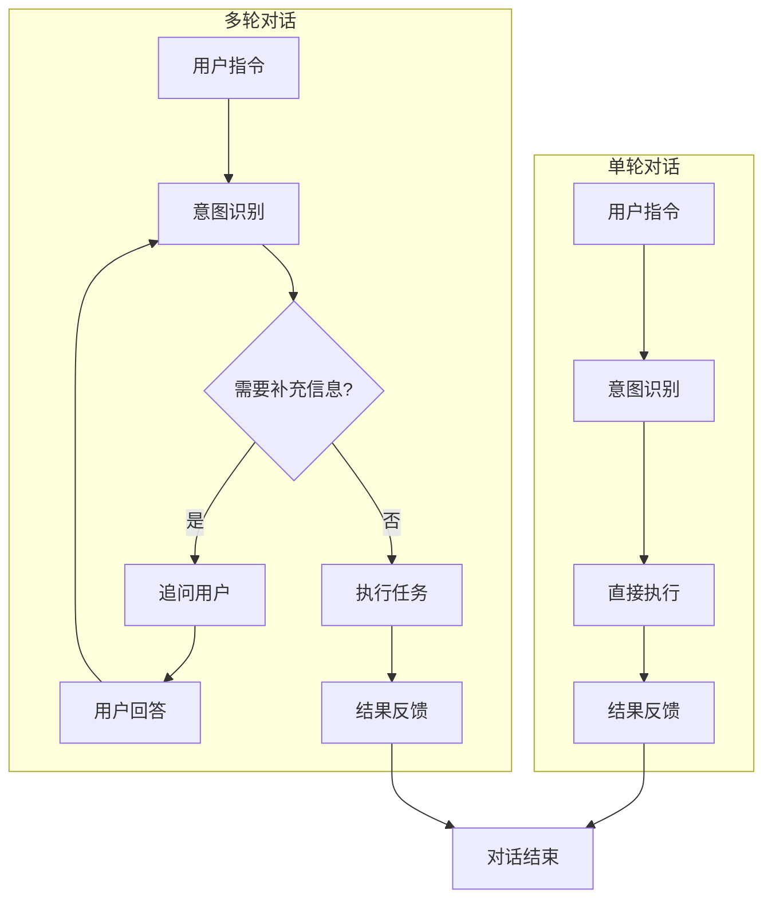

| 对话模式 | 适用场景 | 特点 | 示例 |
|---------|---------|------|------|
| 单轮对话 | 简单指令执行 | 一次交互完成任务 | "开始清扫" |
| 多轮对话 | 复杂任务设置 | 需要多次交互确认 | "清扫客厅，用强力模式" |

#### 3.1.2 对话状态追踪

| 状态类型 | 状态描述 | 状态转换条件 | 存储方式 |
|---------|---------|-------------|---------|
| 空闲状态 | 等待用户指令 | 收到指令 | 内存 |
| 理解状态 | 正在解析用户意图 | 解析完成/超时 | 内存 |
| 确认状态 | 等待用户确认 | 用户确认/取消 | 内存 |
| 执行状态 | 正在执行任务 | 任务完成/失败 | 内存+持久化 |
| 反馈状态 | 输出执行结果 | 反馈完成 | 内存 |

#### 3.1.3 对话策略设计

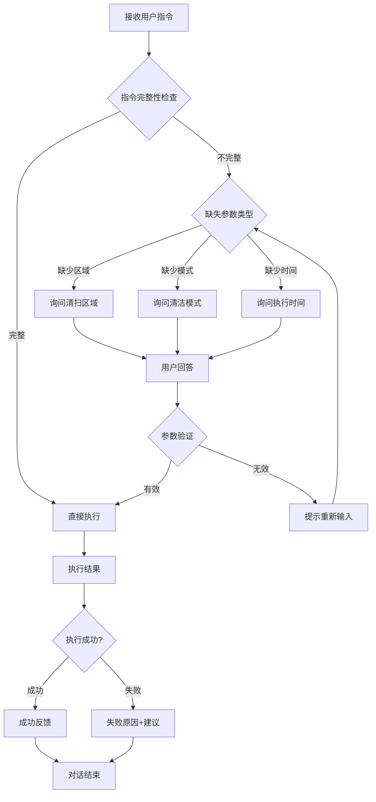

### 3.2 知识库系统

#### 3.2.1 知识类型

| 知识类型 | 知识内容 | 存储位置 | 更新方式 |
|---------|---------|---------|---------|
| 设备知识 | 设备功能、参数、状态 | 本地+云端 | 固件更新 |
| 环境知识 | 地图数据、房间信息 | 本地 | 实时更新 |
| 用户知识 | 用户偏好、历史记录 | 云端 | 用户操作 |
| 故障知识 | 故障类型、解决方案 | 本地+云端 | 固件更新 |

#### 3.2.2 意图识别知识库

| 意图类别 | 意图名称 | 触发词示例 | 槽位参数 |
|---------|---------|-----------|---------|
| 清扫控制 | START_CLEAN | 开始清扫、打扫 | 区域、模式 |
| 清扫控制 | STOP_CLEAN | 停止清扫、暂停 | 无 |
| 清扫控制 | RETURN_DOCK | 回充、回去充电 | 无 |
| 模式设置 | SET_MODE | 安静模式、强力模式 | 模式类型 |
| 状态查询 | QUERY_STATUS | 电量多少、清扫进度 | 查询类型 |
| 区域清扫 | CLEAN_AREA | 清扫客厅、打扫卧室 | 区域名称 |

#### 3.2.3 房间名称映射

| 房间类型 | 默认名称 | 用户自定义 | 识别方式 |
|---------|---------|-----------|---------|
| 客厅 | 客厅 | 支持 | 地图标注 |
| 卧室 | 主卧/次卧 | 支持 | 地图标注 |
| 厨房 | 厨房 | 支持 | 地图标注 |
| 卫生间 | 卫生间 | 支持 | 地图标注 |
| 餐厅 | 餐厅 | 支持 | 地图标注 |
| 书房 | 书房 | 支持 | 地图标注 |

### 3.3 自然语言生成

#### 3.3.1 响应模板设计

| 响应类型 | 响应模板 | 变量参数 | 示例输出 |
|---------|---------|---------|---------|
| 确认响应 | "好的，正在{action}" | action | "好的，正在开始清扫" |
| 完成响应 | "{task}已完成，{detail}" | task, detail | "清扫已完成，清洁面积50平方米" |
| 错误响应 | "抱歉，{reason}，{suggestion}" | reason, suggestion | "抱歉，电量不足，请先充电" |
| 询问响应 | "请问{question}？" | question | "请问要清扫哪个房间？" |
| 状态响应 | "当前{status}，{detail}" | status, detail | "当前电量80%，可清扫约150平方米" |

#### 3.3.2 个性化回复策略

| 用户类型 | 回复风格 | 语言特点 | 示例 |
|---------|---------|---------|------|
| 新用户 | 详细引导 | 解释性语言 | "已为您开始清扫，您可以在APP中查看清扫进度" |
| 熟练用户 | 简洁直接 | 简短确认 | "好的，开始清扫" |
| 老年用户 | 清晰缓慢 | 重复强调 | "好的，开始清扫了，清扫完成会告诉您" |

---

## IV. 扩展交互能力

### 4.1 情感交互

#### 4.1.1 情感识别能力

石头 G10S Pro 通过用户行为分析和交互模式识别，感知用户的情感状态，提供更加人性化的交互体验。

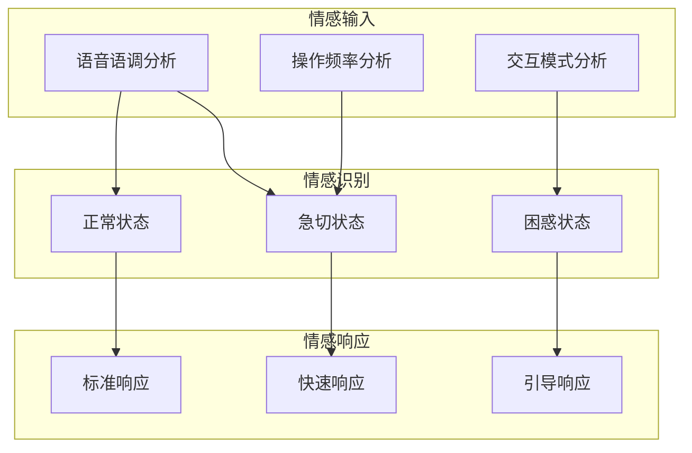

| 情感状态 | 识别特征 | 响应策略 | 示例行为 |
|---------|---------|---------|---------|
| 正常状态 | 正常操作频率、清晰指令 | 标准响应 | "好的，开始清扫" |
| 急切状态 | 连续指令、快速操作 | 快速响应、减少确认 | 立即执行，简短反馈 |
| 困惑状态 | 重复操作、错误指令 | 引导响应、提供帮助 | "您可以说：开始清扫" |

#### 4.1.2 情感表达设计

| 表达场景 | 表达方式 | 语音内容 | LED表现 |
|---------|---------|---------|---------|
| 任务完成 | 愉悦语气 | "清扫完成啦" | 绿色呼吸灯 |
| 遇到困难 | 谦逊语气 | "抱歉，我遇到点困难" | 橙色闪烁 |
| 等待指令 | 期待语气 | "请告诉我下一步做什么" | 白色常亮 |
| 电量充足 | 自信语气 | "电量充足，随时待命" | 白色常亮 |

### 4.2 场景联动交互

#### 4.2.1 智能家居联动

石头 G10S Pro 支持与米家生态链设备联动，实现场景化智能交互。

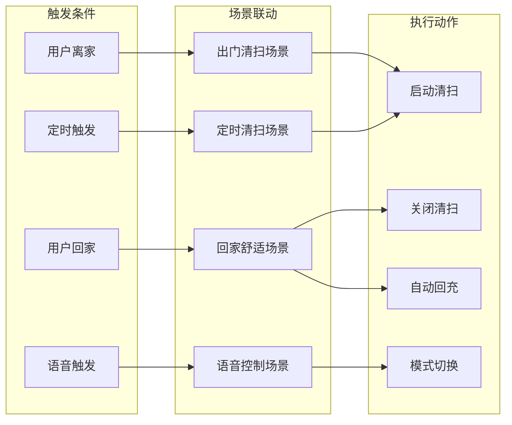

#### 4.2.2 联动场景配置

| 场景名称 | 触发条件 | 联动设备 | 执行动作 |
|---------|---------|---------|---------|
| 出门清扫 | 门锁上锁/离家模式 | 扫地机器人 | 启动全屋清扫 |
| 回家舒适 | 门锁解锁/回家模式 | 扫地机器人+空调 | 停止清扫+开启空调 |
| 定时清扫 | 每周一三五9:00 | 扫地机器人 | 启动清扫 |
| 语音场景 | "我要出门了" | 扫地机器人+灯光 | 启动清扫+关闭灯光 |

---

## V. 性能指标

### 5.1 响应性能

#### 5.1.1 各模态响应时间

| 交互模态 | 操作类型 | 响应时间要求 | 实测值「推理」 |
|---------|---------|-------------|---------------|
| 语音交互 | 语音指令识别 | <2s | 1.5s |
| 语音交互 | 语音播报启动 | <500ms | 300ms |
| 视觉交互 | 视频通话建立 | <3s | 2s |
| 视觉交互 | 视频帧传输延迟 | <200ms | 150ms |
| 触摸交互 | APP指令响应 | <1s | 500ms |
| 触摸交互 | 按键响应 | <100ms | 50ms |
| 动作交互 | 运动指令执行 | <50ms | 30ms |

#### 5.1.2 并发处理能力

| 并发场景 | 并发数量 | 处理方式 | 性能表现 |
|---------|---------|---------|---------|
| 多用户APP连接 | 最多5个「推理」 | 连接池管理 | 正常响应 |
| 语音+APP同时操作 | 2个 | 优先级调度 | 语音优先 |
| 多传感器数据融合 | 9类传感器 | 并行处理 | 实时更新 |

### 5.2 用户体验指标

#### 5.2.1 交互自然度

| 评估维度 | 评估标准 | 目标值 | 评估方式 |
|---------|---------|-------|---------|
| 语音识别准确率 | 意图识别正确率 | >95% | 用户测试统计 |
| 操作便捷性 | 完成任务所需步骤 | ≤3步 | 任务分析 |
| 反馈及时性 | 用户操作后反馈时间 | <1s | 性能测试 |
| 界面友好性 | 用户满意度评分 | >4.5/5 | 用户调研 |

#### 5.2.2 任务完成率

| 任务类型 | 任务描述 | 完成率目标 | 失败处理 |
|---------|---------|-----------|---------|
| 简单清扫任务 | 开始/停止清扫 | >99% | 语音提示+APP通知 |
| 区域清扫任务 | 指定房间清扫 | >95% | 确认房间名称 |
| 模式设置任务 | 设置清扫模式 | >98% | 提供模式选项 |
| 状态查询任务 | 查询电量/进度 | >99% | 语音播报 |

#### 5.2.3 用户满意度指标

| 指标名称 | 测量方法 | 目标值 | 改进措施 |
|---------|---------|-------|---------|
| 整体满意度 | 用户评分 | >4.5/5 | 持续优化交互流程 |
| 功能易用性 | 任务完成时间 | <30秒 | 简化操作步骤 |
| 响应满意度 | 响应时间评分 | >4.0/5 | 优化响应速度 |
| 语音交互满意度 | 语音识别评分 | >4.0/5 | 优化语音模型 |

---

## VI. 交互安全

### 6.1 交互安全架构

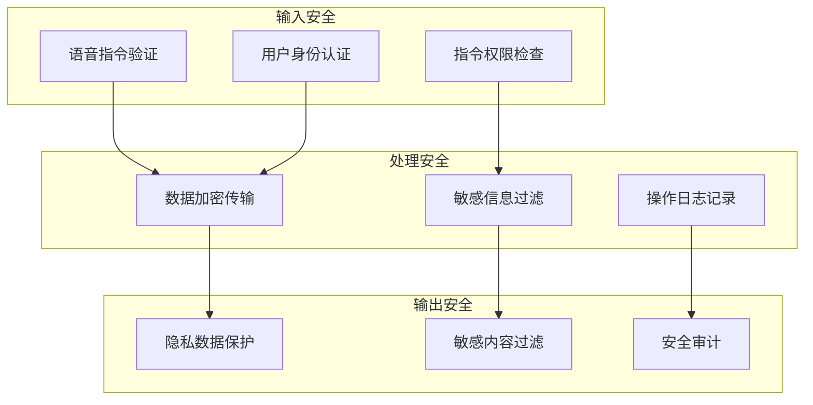

### 6.2 隐私保护措施

| 保护措施 | 实现方式 | 保护范围 | 认证标准 |
|---------|---------|---------|---------|
| 视频隐私 | 默认关闭+手势密码+硬件断电 | 视频通话功能 | TÜV隐私认证 |
| 数据加密 | AES-256加密传输 | 所有通信数据 | 行业标准 |
| 用户授权 | 功能开关+权限管理 | 敏感功能 | GDPR合规 |
| 数据存储 | 本地优先+云端加密 | 用户数据 | CCPA合规 |

### 6.3 交互安全策略

| 安全策略 | 策略描述 | 实施方式 | 安全等级 |
|---------|---------|---------|---------|
| 童锁功能 | 防止儿童误操作 | 长按按键开启/关闭 | 中 |
| 视频隐私锁 | 保护视频功能隐私 | 手势密码验证 | 高 |
| 远程操作确认 | 防止远程误操作 | 关键操作需确认 | 中 |
| 异常操作检测 | 防止恶意操作 | 行为分析+告警 | 高 |

---

## VII. 附录

### 7.1 术语定义

| 术语 | 定义 |
|------|------|
| ASR | Automatic Speech Recognition，自动语音识别 |
| NLU | Natural Language Understanding，自然语言理解 |
| NLP | Natural Language Processing，自然语言处理 |
| TTS | Text-to-Speech，语音合成 |
| DST | Dialogue State Tracking，对话状态追踪 |
| DP | Dialogue Policy，对话策略 |
| NPU | Neural Processing Unit，神经网络处理单元 |
| OTA | Over-The-Air，空中升级 |
| GDPR | General Data Protection Regulation，欧盟通用数据保护条例 |
| CCPA | California Consumer Privacy Act，加州消费者隐私法案 |

### 7.2 参考标准

| 标准编号 | 标准名称 |
|---------|---------|
| ISO 9241-110 | 人机交互工效学标准 |
| GB/T 25000.51 | 软件质量要求和评价 |
| IEC 62366-1 | 医疗器械可用性工程 |
| GDPR | 欧盟通用数据保护条例 |
| CCPA | 加州消费者隐私法案 |

### 7.3 文档修订记录

| 版本 | 日期 | 修订内容 | 作者 |
|------|------|---------|------|
| V1.0 | 2022-01 | 初始版本发布 | 交互设计部 |

---

*本智能交互系统文档基于石头G10S Pro深度产品调研报告、硬件需求说明书及接口控制文档编制，部分参数标注「推理」的内容为基于行业经验的合理推演。*
