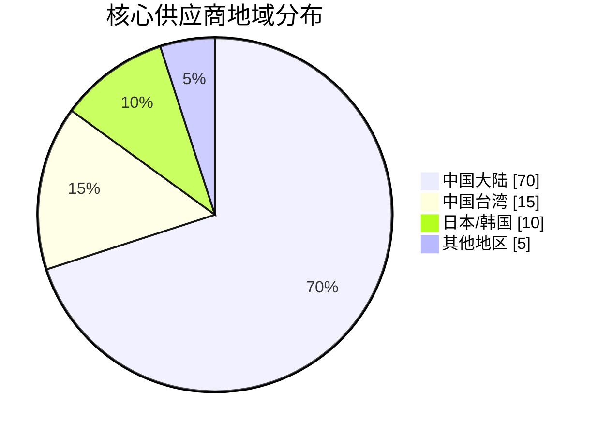
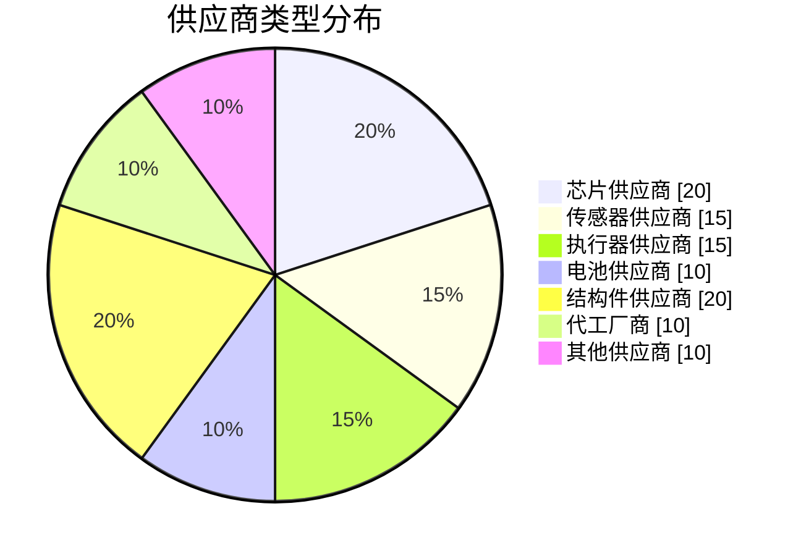
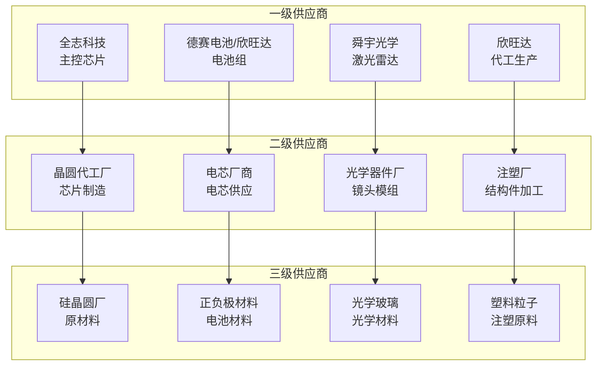
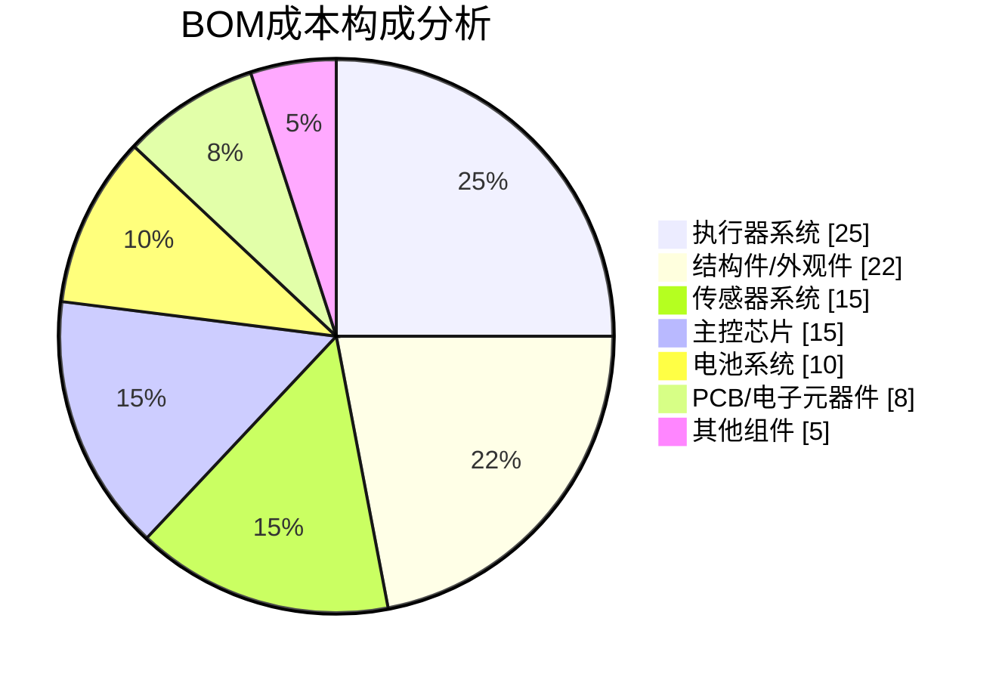
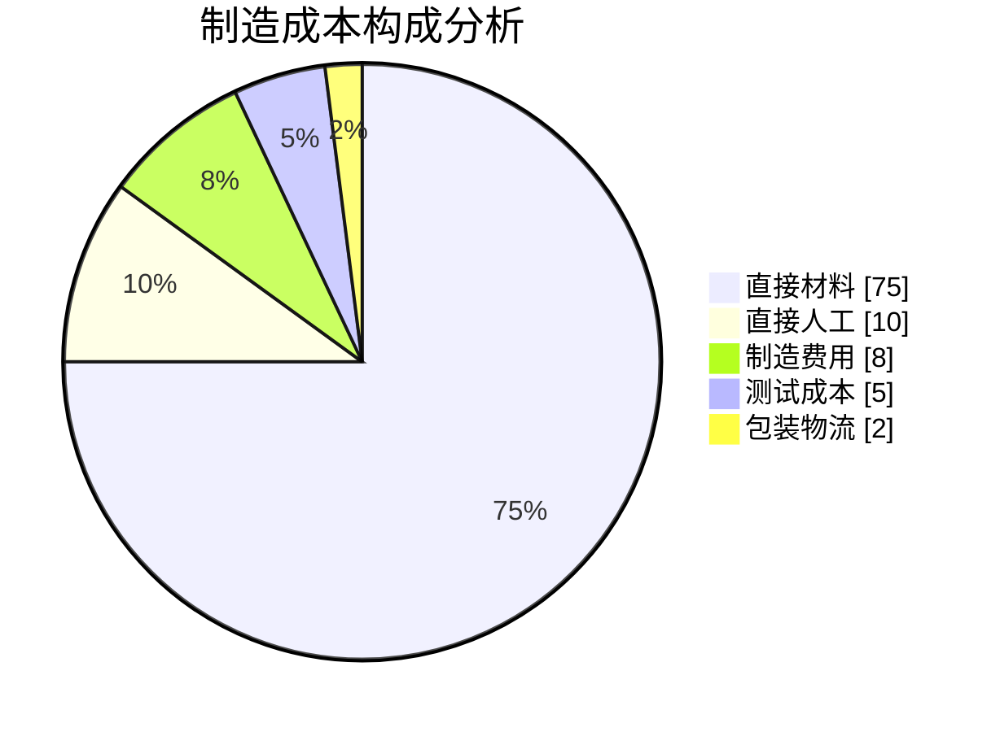
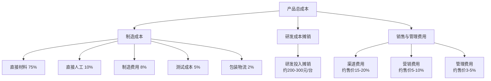
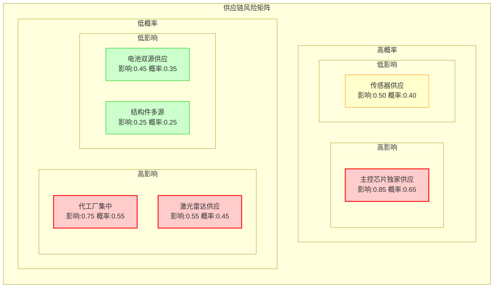
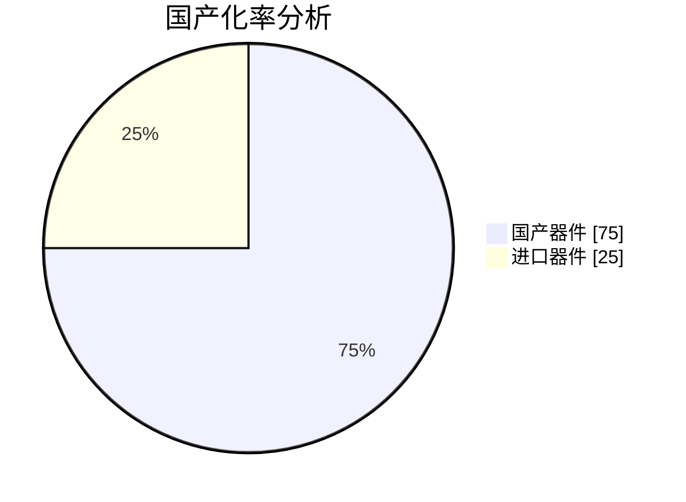

# 石头 G10S Pro 扫地机器人供应链与成本分析

**文档版本**：V1.0  
**编制日期**：2022年1月  
**产品代号**：G10S Pro  
**分析基准**：SCA-01  

---

## I. 供应链总览

### 1.1 供应商分布

石头 G10S Pro 的供应链体系体现了高度的专业化分工和严格的质量控制标准，核心供应商大多与小米产业链重合，体现了石头科技作为小米生态链企业时期建立的供应链基础。

#### 1.1.1 供应商地域分布

| 地域 | 供应商数量占比 | 主要供应品类 | 代表供应商 |
|------|--------------|-------------|-----------|
| 中国大陆 | 70% | 主控芯片、电池、结构件、代工 | 全志科技、德赛电池、欣旺达 |
| 中国台湾 | 15% | 传感器、光学器件 | 舜宇光学（部分产线） |
| 日本/韩国 | 10% | 高端传感器、精密器件 | 索尼（摄像头传感器）「推理」 |
| 其他地区 | 5% | 特种材料、连接器 | 泰科、莫仕「推理」 |

#### 1.1.2 供应商类型分布

| 供应商类型 | 数量占比 | 采购金额占比 | 战略重要性 |
|-----------|---------|-------------|-----------|
| 芯片供应商 | 20% | 15% | 极高 |
| 传感器供应商 | 15% | 12% | 高 |
| 执行器供应商 | 15% | 18% | 高 |
| 电池供应商 | 10% | 10% | 高 |
| 结构件供应商 | 20% | 25% | 中 |
| 代工厂商 | 10% | 15% | 高 |
| 其他供应商 | 10% | 5% | 低 |

### 1.2 供应链架构

#### 1.2.1 供应链层级架构图

#### 1.2.2 供应关系类型

| 供应关系 | 供应商数量 | 采购金额占比 | 风险等级 | 管理策略 |
|---------|-----------|-------------|---------|---------|
| 独家供应 | 5-8家 | 30%「推理」 | 高 | 战略合作、备选开发 |
| 双源供应 | 10-15家 | 40%「推理」 | 中 | 竞价采购、动态调整 |
| 多源供应 | 20-30家 | 30%「推理」 | 低 | 市场化采购 |

#### 1.2.3 核心供应商清单

| 排名 | 供应商名称 | 供应品类 | 采购占比 | 合作年限 | 供应模式 |
|------|-----------|---------|---------|---------|---------|
| 1 | 欣旺达 | 代工+电池 | >30%「推理」 | 6年+ | 战略合作 |
| 2 | 全志科技 | 主控芯片 | >50%（芯片） | 5年+ | 独家供应 |
| 3 | 德赛电池 | 电池组 | 约30%（电池）「推理」 | 5年+ | 双源供应 |
| 4 | 舜宇光学 | 激光雷达 | 主要供应商 | 4年+ | 主要供应 |
| 5 | 信泰光学 | 光学器件 | 部分传感器 | 4年+ | 双源供应 |
| 6 | 东莞力嘉 | 结构件 | 部分结构件 | 3年+ | 多源供应 |
| 7 | AVNET | 电子元器件 | 分销商 | 5年+ | 分销采购 |

---

## II. 核心器件供应链

### 2.1 计算平台供应链

#### 2.1.1 主控芯片供应链

石头 G10S Pro 的主控芯片采用全志科技提供的解决方案，全志科技作为国内领先的机器人芯片供应商，在石头科技的芯片供应中占据超过 50% 的市场份额。

**主控芯片供应信息：**

| 项目 | 信息 |
|------|------|
| 芯片供应商 | 全志科技（Allwinner） |
| 芯片系列 | MR系列（机器人专用） |
| CPU架构 | 八核ARM Cortex-A55 |
| NPU算力 | 2Tops |
| 制程工艺 | 12nm「推理」 |
| 供应模式 | 独家供应 |
| 采购占比 | >50%（芯片类） |
| 预估单价 | 200-300元/片「推理」 |

**全志科技合作优势：**

| 优势项 | 描述 |
|--------|------|
| 技术定制 | 提供环境感知与SLAM解决方案定制 |
| 成本优势 | 国产芯片，成本低于进口方案 |
| 供应稳定 | 国内供应链，不受国际贸易影响 |
| 技术支持 | 本地化技术支持团队 |
| 生态完善 | 完善的机器人芯片生态 |

#### 2.1.2 存储芯片供应链

| 芯片类型 | 供应商 | 规格 | 预估单价「推理」 |
|---------|--------|------|-----------------|
| DDR4内存 | 三星/海力士/长江存储 | 1GB | 20-30元 |
| eMMC存储 | 三星/海力士/长江存储 | 4GB | 15-25元 |
| Flash存储 | 兆易创新/华邦 | 外置存储 | 5-10元 |

### 2.2 执行器供应链

#### 2.2.1 电机供应链

石头 G10S Pro 共配备 6 个电机，包括主风机电机、边刷电机、驱动轮电机×2、震动电机、升降电机。

**电机供应信息：**

| 电机类型 | 电机规格 | 预估供应商「推理」 | 预估单价「推理」 | 年需求量 |
|---------|---------|-------------------|-----------------|---------|
| 主风机电机 | BLDC无刷，5100Pa | 卧龙/大洋 | 80-120元 | 高 |
| 驱动轮电机×2 | 有刷DC，差速驱动 | 鸣志/大洋 | 30-50元/个 | 高 |
| 边刷电机 | 有刷DC，130-330RPM | 鸣志/大洋 | 15-25元 | 高 |
| 震动电机 | 线性振动马达 | 瑞声/歌尔 | 20-35元 | 高 |
| 升降电机 | 步进/DC电机 | 鸣志/大洋 | 15-25元 | 高 |

**电机供应商分析：**

| 供应商 | 主要产品 | 市场地位 | 合作风险 |
|--------|---------|---------|---------|
| 卧龙电驱 | 主风机电机 | 国内领先 | 低 |
| 大洋电机 | 驱动电机 | 国内主流 | 低 |
| 鸣志电器 | 步进电机 | 国内领先 | 低 |
| 瑞声科技 | 震动马达 | 全球领先 | 低 |
| 歌尔股份 | 震动马达 | 全球领先 | 低 |

#### 2.2.2 驱动器供应链

| 驱动器类型 | 预估供应商「推理」 | 预估单价「推理」 | 备注 |
|-----------|-------------------|-----------------|------|
| 主风机驱动IC | TI/Infineon | 10-20元 | 三相桥驱动 |
| 电机驱动IC | TI/DRV系列 | 5-10元/个 | H桥驱动 |

### 2.3 传感器供应链

#### 2.3.1 激光雷达供应链

| 项目 | 信息 |
|------|------|
| 传感器类型 | 三角测距激光雷达 |
| 主要供应商 | 舜宇光学 |
| 备选供应商 | 速腾聚创、镭神智能「推理」 |
| 预估单价 | 80-150元 |
| 年需求量 | 高 |
| 技术特点 | 成本优化方案 |

**激光雷达供应商对比：**

| 供应商 | 技术路线 | 成本水平 | 供应稳定性 | 技术支持 |
|--------|---------|---------|-----------|---------|
| 舜宇光学 | 三角测距 | 低 | 高 | 良好 |
| 速腾聚创 | 混合固态 | 中 | 中 | 优秀 |
| 镭神智能 | 三角测距 | 低 | 中 | 良好 |

#### 2.3.2 视觉传感器供应链

| 传感器类型 | 规格 | 预估供应商「推理」 | 预估单价「推理」 |
|-----------|------|-------------------|-----------------|
| RGB摄像头 | ≥720P CMOS | 索尼/豪威/格科微 | 30-50元 |
| 3D结构光 | 850nm线激光 | 自研/定制 | 40-60元 |
| LED补光灯 | 白光LED | 国内厂商 | 5-10元 |

#### 2.3.3 其他传感器供应链

| 传感器类型 | 数量 | 预估供应商「推理」 | 预估单价「推理」 |
|-----------|------|-------------------|-----------------|
| IMU惯性单元 | 1 | 意法半导体/博世/Invensense | 15-30元 |
| 编码器 | 2 | 霍尼韦尔/欧姆龙/国产 | 10-20元/个 |
| 超声波传感器 | 2 | 国产厂商 | 5-10元/个 |
| 悬崖传感器 | 6 | 国产厂商 | 3-5元/个 |
| 碰撞传感器 | 1 | 国产厂商 | 5-10元 |

### 2.4 电池供应链

#### 2.4.1 电池组供应信息

石头 G10S Pro 采用德赛电池或欣旺达提供的 14.4V/5200mAh 锂离子电池系统。

| 项目 | 信息 |
|------|------|
| 电池类型 | 锂离子电池 |
| 标称电压 | 14.4V（4S配置） |
| 额定容量 | 5200mAh |
| 额定能量 | 74.88Wh |
| 主要供应商 | 德赛电池、欣旺达 |
| 预估单价 | 150-200元 |
| 供应模式 | 双源供应 |

**电池供应商分析：**

| 供应商 | 市场地位 | 客户群体 | 供应优势 |
|--------|---------|---------|---------|
| 德赛电池 | 全球领先 | 苹果、华为、小米 | 技术领先、品质稳定 |
| 欣旺达 | 国内领先 | 小米、OPPO、vivo | 成本优势、产能充足 |

#### 2.4.2 电芯供应链

| 项目 | 信息 |
|------|------|
| 电芯类型 | 18650/21700电芯 |
| 电芯供应商 | 三星SDI/LG/宁德时代/比亚迪「推理」 |
| 电芯数量 | 4S1P或2S2P配置 |
| 单颗电芯价格 | 15-25元「推理」 |

### 2.5 结构件供应链

#### 2.5.1 结构件材料与供应商

| 部件名称 | 材料选型 | 预估供应商「推理」 | 预估成本「推理」 |
|---------|---------|-------------------|-----------------|
| 上盖外壳 | ABS+PC复合 | 东莞力嘉/模具厂 | 40-60元 |
| 机身外壳 | ABS塑料 | 东莞力嘉/模具厂 | 30-50元 |
| 底盘框架 | PA66+GF30 | 东莞力嘉/模具厂 | 50-80元 |
| 雷达保护罩 | PC聚碳酸酯 | 光学器件厂 | 15-25元 |
| 驱动轮 | TPU+金属轴 | 橡胶制品厂 | 20-30元/个 |
| 拖布支架 | ABS+金属件 | 结构件厂 | 25-40元 |
| 密封件 | 硅胶/橡胶 | 密封件厂 | 5-10元 |

#### 2.5.2 基站结构件供应链

| 部件名称 | 材料 | 预估成本「推理」 |
|---------|------|-----------------|
| 基站外壳 | ABS塑料 | 80-120元 |
| 清水箱 | 食品级塑料 | 20-30元 |
| 污水箱 | 食品级塑料 | 20-30元 |
| 集尘仓 | ABS塑料 | 15-25元 |
| 清洗槽 | 不锈钢/塑料 | 30-50元 |

---

## III. 成本分析

### 3.1 BOM成本分析

#### 3.1.1 BOM成本构成

#### 3.1.2 BOM成本明细表

| 成本项目 | 预估成本（元） | 占比 | 主要器件 | 备注 |
|---------|--------------|------|---------|------|
| **执行器系统** | 250-350 | 25% | 主风机、驱动轮、边刷、震动、升降电机 | 含驱动电路 |
| **结构件/外观件** | 220-280 | 22% | 机身外壳、底盘、基站外壳 | 含模具摊销 |
| **传感器系统** | 150-200 | 15% | LDS雷达、摄像头、IMU、超声波等 | 含结构光 |
| **主控芯片** | 150-200 | 15% | 全志MR系列+存储芯片 | 含NPU |
| **电池系统** | 100-150 | 10% | 14.4V/5200mAh电池组 | 含BMS |
| **PCB/电子元器件** | 80-120 | 8% | 主板、连接器、阻容感 | 含电源管理 |
| **其他组件** | 50-80 | 5% | 拖布、滤网、尘袋、包装 | 耗材配件 |
| **BOM总成本** | **1000-1380** | 100% | - | 估算值 |

#### 3.1.3 各模块成本详细分析

**执行器系统成本明细：**

| 器件名称 | 预估单价（元） | 数量 | 小计（元） | 占比 |
|---------|--------------|------|-----------|------|
| 主风机电机（BLDC） | 80-120 | 1 | 80-120 | 32% |
| 驱动轮电机 | 30-50 | 2 | 60-100 | 27% |
| 震动电机 | 20-35 | 1 | 20-35 | 10% |
| 边刷电机 | 15-25 | 1 | 15-25 | 7% |
| 升降电机 | 15-25 | 1 | 15-25 | 7% |
| 电机驱动IC | 5-10 | 6 | 30-60 | 17% |
| **合计** | - | - | **220-365** | 100% |

**传感器系统成本明细：**

| 器件名称 | 预估单价（元） | 数量 | 小计（元） | 占比 |
|---------|--------------|------|-----------|------|
| LDS激光雷达 | 80-150 | 1 | 80-150 | 50% |
| RGB摄像头模组 | 30-50 | 1 | 30-50 | 17% |
| 3D结构光模块 | 40-60 | 1 | 40-60 | 20% |
| IMU惯性单元 | 15-30 | 1 | 15-30 | 8% |
| 编码器 | 10-20 | 2 | 20-40 | 13% |
| 其他传感器 | 3-10 | 10+ | 30-50 | 17% |
| **合计** | - | - | **215-380** | 100% |

**结构件成本明细：**

| 器件名称 | 预估单价（元） | 数量 | 小计（元） | 占比 |
|---------|--------------|------|-----------|------|
| 主机外壳组件 | 70-110 | 1 | 70-110 | 30% |
| 底盘框架 | 50-80 | 1 | 50-80 | 22% |
| 基站外壳 | 80-120 | 1 | 80-120 | 35% |
| 驱动轮组件 | 20-30 | 2 | 40-60 | 17% |
| 其他结构件 | 20-40 | 1 | 20-40 | 13% |
| **合计** | - | - | **260-410** | 100% |

### 3.2 制造成本分析

#### 3.2.1 制造成本构成

| 成本项目 | 预估成本（元） | 占比 | 说明 |
|---------|--------------|------|------|
| 直接材料 | 1000-1380 | 75% | BOM成本 |
| 直接人工 | 130-180 | 10% | 组装人工 |
| 制造费用 | 100-150 | 8% | 设备折旧、能源等 |
| 测试成本 | 70-90 | 5% | 功能测试、老化测试 |
| 包装物流 | 30-40 | 2% | 包装材料、物流 |
| **制造成本合计** | **1330-1840** | 100% | - |

#### 3.2.2 组装成本分析

| 组装环节 | 预估工时 | 人工成本（元） | 说明 |
|---------|---------|--------------|------|
| 底盘组件组装 | 8-12分钟 | 15-25 | 驱动轮、主刷、传感器安装 |
| 机身主体组装 | 10-15分钟 | 20-30 | PCB、电池、尘盒安装 |
| 上盖组件组装 | 5-8分钟 | 10-15 | 雷达、按键面板安装 |
| 整机总装测试 | 15-20分钟 | 25-40 | 整机装配、功能测试 |
| 包装入库 | 3-5分钟 | 5-10 | 包装、检验 |
| **合计** | **41-60分钟** | **75-120** | - |

#### 3.2.3 测试成本分析

| 测试项目 | 测试时间 | 成本（元） | 说明 |
|---------|---------|-----------|------|
| 功能测试 | 5分钟 | 15-20 | 开机、通信、传感器测试 |
| 性能测试 | 10分钟 | 25-35 | 吸力、导航、清洁测试 |
| 老化测试 | 2-4小时 | 20-30 | 高温老化、连续运行 |
| 安规测试 | 3分钟 | 10-15 | 绝缘、耐压测试 |
| **合计** | - | **70-100** | - |

### 3.3 总成本分析

#### 3.3.1 成本结构分析

#### 3.3.2 成本与售价对比

| 成本项目 | 金额（元） | 占售价比例 | 说明 |
|---------|-----------|-----------|------|
| BOM成本 | 1000-1380 | 18-24% | 直接材料成本 |
| 制造成本 | 1330-1840 | 23-32% | 含人工、制造费用 |
| 研发摊销 | 200-300 | 4-5%「推理」 | 按销量摊销 |
| 渠道费用 | 850-1140 | 15-20%「推理」 | 经销商、电商 |
| 营销费用 | 280-570 | 5-10%「推理」 | 广告、推广 |
| 管理费用 | 170-280 | 3-5%「推理」 | 运营管理 |
| **总成本** | **2830-4130** | **50-73%** | - |
| **毛利润** | **1570-2870** | **27-50%** | - |
| **售价** | **5699** | **100%** | 首发价 |

#### 3.3.3 成本优化空间分析

| 优化方向 | 当前成本 | 优化潜力 | 优化措施 |
|---------|---------|---------|---------|
| 芯片成本 | 150-200元 | 10-15% | 国产替代、批量采购 |
| 传感器成本 | 150-200元 | 15-20% | 国产替代、自研算法 |
| 结构件成本 | 220-280元 | 10-15% | 模具优化、材料替代 |
| 制造成本 | 130-180元 | 15-20% | 自动化、工艺优化 |
| **综合优化** | - | **10-15%** | - |

---

## IV. 供应链风险分析

### 4.1 供应风险分析

#### 4.1.1 供应链风险矩阵

#### 4.1.2 单一供应商风险

| 风险项 | 风险等级 | 影响程度 | 应对措施 |
|--------|---------|---------|---------|
| 主控芯片独家供应 | 高 | 极高 | 开发备选方案、战略合作 |
| LDS雷达主要供应商 | 中 | 高 | 开发备选供应商 |
| 代工厂集中 | 中 | 高 | 自建工厂、越南代工 |
| 部分传感器独家 | 低 | 中 | 开发替代方案 |

#### 4.1.3 地缘政治风险

| 风险项 | 风险等级 | 影响器件 | 应对措施 |
|--------|---------|---------|---------|
| 芯片出口限制 | 低 | 高端芯片 | 国产替代已实现 |
| 关税壁垒 | 中 | 整机出口 | 越南代工生产 |
| 供应链断供 | 低 | 关键器件 | 库存备货、多源供应 |

#### 4.1.4 产能风险

| 风险项 | 风险等级 | 触发条件 | 应对措施 |
|--------|---------|---------|---------|
| 峰值产能不足 | 中 | 促销季、新品发布 | 提前备货、产能规划 |
| 供应商产能紧张 | 中 | 行业需求增长 | 长期协议、产能锁定 |
| 原材料短缺 | 低 | 供应链中断 | 安全库存、多源采购 |

### 4.2 成本风险分析

#### 4.2.1 价格波动风险

| 风险项 | 波动幅度 | 影响成本 | 应对措施 |
|--------|---------|---------|---------|
| 芯片价格波动 | ±10-20% | ±15-30元 | 长期协议、批量采购 |
| 电池原材料波动 | ±15-30% | ±15-45元 | 价格联动、库存管理 |
| 塑料原料波动 | ±10-15% | ±20-40元 | 价格联动、材料替代 |
| 电机价格波动 | ±5-10% | ±10-35元 | 多源供应、竞价采购 |

#### 4.2.2 汇率风险

| 风险项 | 敏感度 | 影响成本 | 应对措施 |
|--------|--------|---------|---------|
| 美元汇率波动 | 中 | 进口器件成本 | 人民币结算、远期锁汇 |
| 欧元汇率波动 | 低 | 部分进口器件 | 人民币结算 |
| 日元汇率波动 | 低 | 部分传感器 | 国产替代 |

### 4.3 质量风险分析

#### 4.3.1 核心器件质量风险

| 器件类型 | 质量风险点 | 风险等级 | 控制措施 |
|---------|-----------|---------|---------|
| 主控芯片 | 算力不足、稳定性 | 低 | 严格测试、备选方案 |
| 电池组 | 安全性、循环寿命 | 高 | 供应商审核、来料检验 |
| 激光雷达 | 精度、寿命 | 中 | 可靠性测试、备选供应商 |
| 电机 | 寿命、噪音 | 中 | 老化测试、供应商管理 |
| 结构件 | 尺寸精度、外观 | 低 | 来料检验、过程控制 |

---

## V. 国产化分析

### 5.1 国产化现状

#### 5.1.1 国产化率分析

| 器件类别 | 国产化率 | 国产代表 | 进口代表 |
|---------|---------|---------|---------|
| 主控芯片 | 100% | 全志科技 | - |
| 电池组 | 100% | 德赛、欣旺达 | - |
| 结构件 | 100% | 国内厂商 | - |
| 激光雷达 | 90% | 舜宇光学 | 部分光学器件 |
| 电机 | 95% | 卧龙、鸣志 | 部分精密电机 |
| 摄像头传感器 | 50%「推理」 | 豪威、格科微 | 索尼、三星 |
| IMU传感器 | 60%「推理」 | 国内厂商 | 意法、博世 |
| 存储芯片 | 70%「推理」 | 长江存储 | 三星、海力士 |

#### 5.1.2 各模块国产化程度

| 模块 | 国产化程度 | 关键国产器件 | 关键进口器件 |
|------|-----------|-------------|-------------|
| 计算平台 | 高 | 全志MR系列芯片 | 部分存储芯片 |
| 执行器系统 | 高 | 卧龙、鸣志电机 | 部分驱动IC |
| 传感器系统 | 中高 | 舜宇激光雷达 | 高端摄像头传感器 |
| 电池系统 | 高 | 德赛、欣旺达 | - |
| 结构件 | 高 | 国内注塑厂 | - |

### 5.2 国产替代可行性

#### 5.2.1 可替代器件清单

| 器件类型 | 当前供应商 | 国产替代方案 | 替代可行性 | 性能差距 |
|---------|-----------|-------------|-----------|---------|
| 摄像头传感器 | 索尼/三星 | 豪威/格科微 | 高 | 基本无差距 |
| IMU传感器 | 意法/博世 | 国内厂商 | 中 | 轻微差距 |
| 存储芯片 | 三星/海力士 | 长江存储 | 高 | 无差距 |
| 电机驱动IC | TI | 国产厂商 | 中 | 轻微差距 |
| 高端传感器 | 进口 | 国内研发中 | 低 | 存在差距 |

#### 5.2.2 国产替代性能价格对比

| 器件类型 | 进口方案价格 | 国产方案价格 | 性能对比 | 替代建议 |
|---------|-------------|-------------|---------|---------|
| 摄像头传感器 | 40-60元 | 25-40元 | 国产略低 | 推荐替代 |
| IMU传感器 | 20-35元 | 12-20元 | 国产略低 | 可替代 |
| 存储芯片 | 25-40元 | 18-30元 | 基本相同 | 推荐替代 |
| 电机驱动IC | 8-15元 | 5-10元 | 国产略低 | 可替代 |

#### 5.2.3 替代风险评估

| 替代方案 | 技术风险 | 供应风险 | 成本风险 | 综合评估 |
|---------|---------|---------|---------|---------|
| 摄像头国产化 | 低 | 低 | 无 | 可行 |
| IMU国产化 | 中 | 低 | 无 | 需验证 |
| 存储国产化 | 低 | 低 | 无 | 可行 |
| 驱动IC国产化 | 中 | 低 | 无 | 需验证 |

### 5.3 国产化成本影响

#### 5.3.1 国产替代成本变化

| 替代项目 | 原成本（元） | 替代后成本（元） | 成本节省 | 节省比例 |
|---------|-------------|-----------------|---------|---------|
| 摄像头传感器 | 40-60 | 25-40 | 15-20 | 33% |
| IMU传感器 | 20-35 | 12-20 | 8-15 | 40% |
| 存储芯片 | 25-40 | 18-30 | 7-10 | 28% |
| 电机驱动IC | 40-60 | 25-40 | 15-20 | 33% |
| **合计** | **125-195** | **80-130** | **45-65** | **36%** |

#### 5.3.2 国产化综合效益

| 效益项 | 量化指标 | 说明 |
|--------|---------|------|
| 成本降低 | 45-65元/台 | 直接材料成本降低 |
| 供应安全 | 提升30%「推理」 | 减少进口依赖 |
| 响应速度 | 提升20%「推理」 | 本地化供应 |
| 技术自主 | 提升25%「推理」 | 核心技术掌控 |

---

## VI. 优化建议

### 6.1 供应商优化建议

#### 6.1.1 供应商整合建议

| 整合方向 | 当前状态 | 优化目标 | 预期效益 |
|---------|---------|---------|---------|
| 芯片供应商 | 独家供应 | 双源供应 | 降低风险10% |
| 传感器供应商 | 多家分散 | 集中采购 | 成本降低5% |
| 结构件供应商 | 多家分散 | 区域集中 | 物流成本降低10% |
| 代工厂商 | 外协为主 | 自建+外协 | 产能保障提升 |

#### 6.1.2 供应商开发建议

| 开发方向 | 目标供应商类型 | 开发优先级 | 预期时间 |
|---------|---------------|-----------|---------|
| 主控芯片备选 | 国产芯片厂商 | 高 | 12-18个月 |
| 激光雷达备选 | 国内激光雷达厂商 | 中 | 6-12个月 |
| 高端传感器 | 国内传感器厂商 | 中 | 12-24个月 |
| 结构件供应商 | 区域配套厂商 | 低 | 3-6个月 |

#### 6.1.3 供应商管理建议

| 管理措施 | 适用范围 | 实施要点 | 预期效果 |
|---------|---------|---------|---------|
| 战略合作 | 核心供应商 | 长期协议、联合开发 | 供应稳定、成本优化 |
| 绩效考核 | 全部供应商 | 质量、交期、成本、服务 | 持续改进 |
| 风险监控 | 关键供应商 | 产能、财务、质量监控 | 风险预警 |
| 协同开发 | 战略供应商 | 联合设计、成本优化 | 产品竞争力提升 |

### 6.2 成本优化建议

#### 6.2.1 设计优化建议

| 优化方向 | 具体措施 | 预期节省 | 实施难度 |
|---------|---------|---------|---------|
| 芯片选型 | 国产替代、功能裁剪 | 10-15% | 中 |
| 传感器精简 | 功能整合、冗余消除 | 5-10% | 中 |
| 结构件优化 | 材料替代、结构简化 | 8-12% | 低 |
| 电机优化 | 规格统一、供应商整合 | 5-8% | 低 |

#### 6.2.2 采购优化建议

| 优化方向 | 具体措施 | 预期节省 | 实施难度 |
|---------|---------|---------|---------|
| 集中采购 | 品类整合、批量采购 | 5-10% | 低 |
| 竞价采购 | 多源竞争、动态调整 | 3-8% | 低 |
| 长期协议 | 价格锁定、供应保障 | 2-5% | 中 |
| 国产替代 | 国产器件替代进口 | 10-20% | 中 |

#### 6.2.3 制造优化建议

| 优化方向 | 具体措施 | 预期节省 | 实施难度 |
|---------|---------|---------|---------|
| 自动化生产 | 组装自动化、测试自动化 | 15-25% | 高 |
| 工艺优化 | 流程简化、效率提升 | 5-10% | 中 |
| 良率提升 | 质量改进、报废降低 | 3-8% | 中 |
| 产能规划 | 自建工厂、越南代工 | 5-10% | 高 |

### 6.3 风险优化建议

#### 6.3.1 供应风险优化

| 风险项 | 优化措施 | 实施优先级 | 预期效果 |
|--------|---------|-----------|---------|
| 单一供应商 | 开发备选供应商 | 高 | 风险降低50% |
| 产能风险 | 安全库存、产能锁定 | 高 | 供应保障提升 |
| 地缘政治 | 国产替代、越南代工 | 中 | 风险转移 |
| 质量风险 | 供应商审核、来料检验 | 中 | 质量保障提升 |

#### 6.3.2 成本风险优化

| 风险项 | 优化措施 | 实施优先级 | 预期效果 |
|--------|---------|-----------|---------|
| 价格波动 | 长期协议、价格联动 | 高 | 成本稳定 |
| 汇率风险 | 人民币结算、远期锁汇 | 中 | 汇率对冲 |
| 通胀风险 | 成本优化、效率提升 | 中 | 成本控制 |

#### 6.3.3 库存优化建议

| 库存类型 | 优化策略 | 目标库存 | 预期效果 |
|---------|---------|---------|---------|
| 关键器件 | 安全库存 | 4-6周用量 | 供应保障 |
| 通用器件 | JIT采购 | 1-2周用量 | 资金效率 |
| 长周期器件 | 提前备货 | 8-12周用量 | 供应保障 |
| 成品库存 | 按需生产 | 2-4周销量 | 库存周转 |

---

## VII. 附录

### 7.1 术语定义

| 术语 | 定义 |
|------|------|
| BOM | Bill of Materials，物料清单 |
| NPU | Neural Processing Unit，神经网络处理单元 |
| BLDC | Brushless DC Motor，无刷直流电机 |
| LDS | Laser Distance Sensor，激光测距传感器 |
| IMU | Inertial Measurement Unit，惯性测量单元 |
| JIT | Just In Time，准时制生产 |
| MOQ | Minimum Order Quantity，最小起订量 |

### 7.2 参考标准

| 标准编号 | 标准名称 |
|---------|---------|
| GB/T 19001 | 质量管理体系 要求 |
| GB/T 24001 | 环境管理体系 要求及使用指南 |
| GB/T 31241 | 便携式电子产品用锂离子电池和电池组 安全要求 |
| IATF 16949 | 汽车行业质量管理体系 |

### 7.3 文档修订记录

| 版本 | 日期 | 修订内容 | 作者 |
|------|------|---------|------|
| V1.0 | 2022-01 | 初始版本发布 | 供应链管理部 |

---

*本供应链与成本分析文档基于石头G10S Pro深度产品调研报告、硬件需求说明书及结构设计说明书编制，部分参数标注「推理」的内容为基于行业经验的合理推演。*
