# 石头 G10S Pro 扫地机器人决策与规划系统文档

**文档版本**：V1.0  
**编制日期**：2022年1月  
**产品代号**：G10S Pro  
**决策系统版本**：DPS-01

---

## I. 决策系统架构

### 1.1 决策层级设计

石头 G10S Pro 决策系统采用分层递阶架构，从上到下分为任务层、行为层、动作层三个层级，实现从高层任务到底层执行的系统化决策。

#### 1.1.1 决策系统层级架构

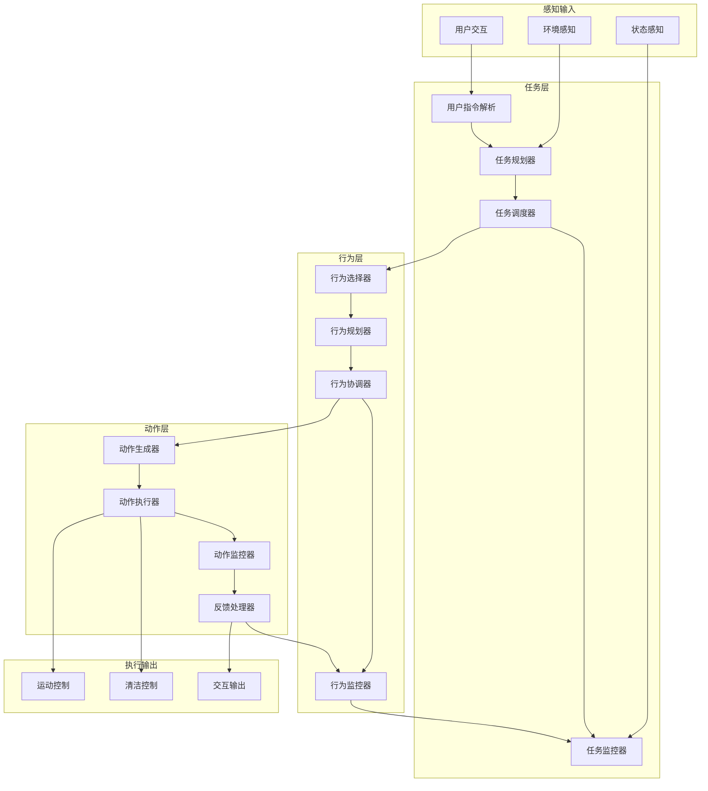
```mermaid
flowchart TD
    subgraph 任务层
        A1[用户指令解析]
        A2[任务规划器]
        A3[任务调度器]
        A4[任务监控器]
    end
    
    subgraph 行为层
        B1[行为选择器]
        B2[行为规划器]
        B3[行为协调器]
        B4[行为监控器]
    end
    
    subgraph 动作层
        C1[动作生成器]
        C2[动作执行器]
        C3[动作监控器]
        C4[反馈处理器]
    end
    
    subgraph 感知输入
        D1[环境感知]
        D2[状态感知]
        D3[用户交互]
    end
    
    subgraph 执行输出
        E1[运动控制]
        E2[清洁控制]
        E3[交互输出]
    end
    
    D1 --> A2
    D2 --> A4
    D3 --> A1
    
    A1 --> A2
    A2 --> A3
    A3 --> A4
    
    A3 --> B1
    B1 --> B2
    B2 --> B3
    B3 --> B4
    
    B3 --> C1
    C1 --> C2
    C2 --> C3
    C3 --> C4
    
    C2 --> E1
    C2 --> E2
    C4 --> E3
    
    C4 --> B4
    B4 --> A4
```

#### 1.1.2 各层级功能定义

| 层级 | 功能模块 | 功能描述 | 决策周期 | 输入来源 |
|------|---------|---------|---------|---------|
| 任务层 | 用户指令解析 | 解析APP/语音/按键指令 | 事件触发 | 用户交互 |
| 任务层 | 任务规划器 | 生成清洁任务计划 | 500ms | 指令、地图、状态 |
| 任务层 | 任务调度器 | 多任务优先级调度 | 100ms | 任务队列、状态 |
| 任务层 | 任务监控器 | 监控任务执行进度 | 100ms | 执行反馈 |
| 行为层 | 行为选择器 | 选择当前执行行为 | 100ms | 任务、环境、状态 |
| 行为层 | 行为规划器 | 规划行为执行策略 | 100ms | 行为类型、环境 |
| 行为层 | 行为协调器 | 协调多行为执行 | 50ms | 行为状态、资源 |
| 行为层 | 行为监控器 | 监控行为执行效果 | 50ms | 执行反馈 |
| 动作层 | 动作生成器 | 生成具体动作指令 | 20ms | 行为指令、状态 |
| 动作层 | 动作执行器 | 执行动作指令 | 10ms | 动作指令 |
| 动作层 | 动作监控器 | 监控动作执行状态 | 10ms | 传感器反馈 |
| 动作层 | 反馈处理器 | 处理执行反馈信息 | 10ms | 传感器数据 |

### 1.2 决策模型

#### 1.2.1 决策模型类型

石头 G10S Pro 采用多种决策模型相结合的方式，根据不同场景选择最优决策方法。

| 决策模型 | 应用场景 | 决策特点 | 实现方式 |
|---------|---------|---------|---------|
| 有限状态机 | 系统状态管理 | 状态明确、转换清晰 | 状态转移表 |
| 规则系统 | 避障决策 | 响应快速、逻辑清晰 | 产生式规则 |
| 行为树 | 行为选择 | 层次清晰、可扩展 | BT节点树 |
| 代价评估 | 路径规划 | 最优性保证 | 代价函数 |
| 启发式搜索 | 任务规划 | 效率高、可解释 | A*算法 |

#### 1.2.2 决策模型架构

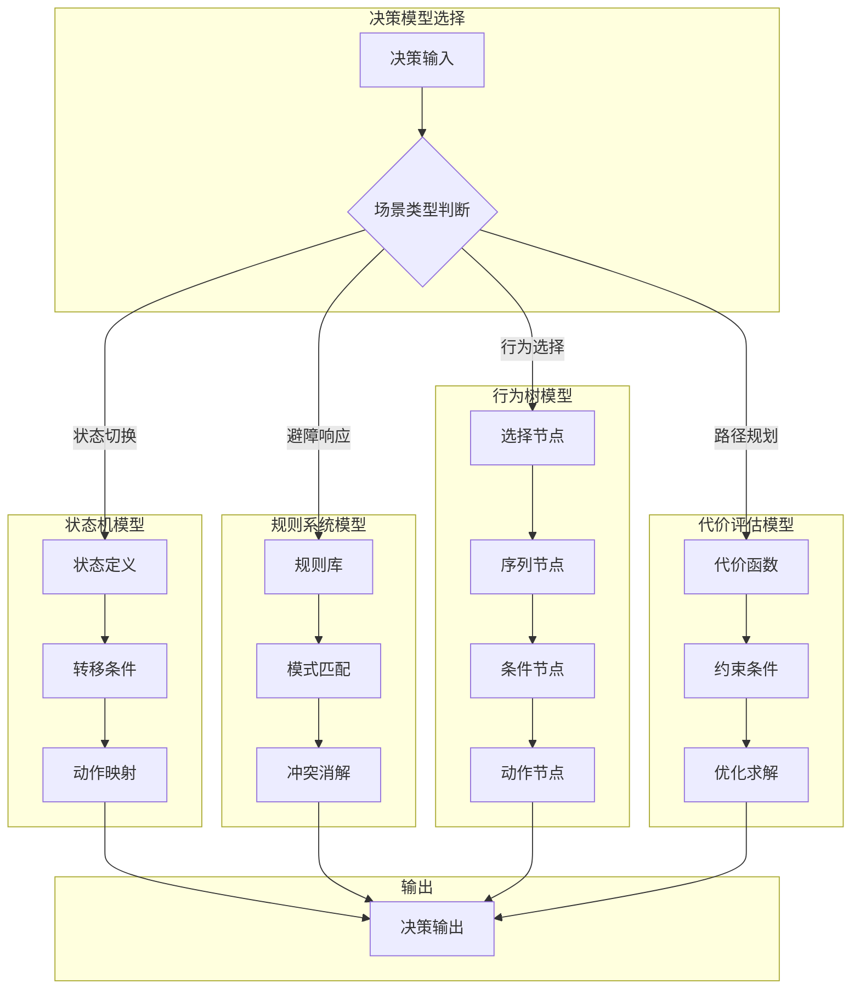
```mermaid
flowchart TD
    subgraph 决策模型选择
        A[决策输入]
        B{场景类型判断}
    end
    
    subgraph 状态机模型
        C1[状态定义]
        C2[转移条件]
        C3[动作映射]
    end
    
    subgraph 规则系统模型
        D1[规则库]
        D2[模式匹配]
        D3[冲突消解]
    end
    
    subgraph 行为树模型
        E1[选择节点]
        E2[序列节点]
        E3[条件节点]
        E4[动作节点]
    end
    
    subgraph 代价评估模型
        F1[代价函数]
        F2[约束条件]
        F3[优化求解]
    end
    
    subgraph 输出
        G[决策输出]
    end
    
    A --> B
    
    B -->|状态切换| C1
    B -->|避障响应| D1
    B -->|行为选择| E1
    B -->|路径规划| F1
    
    C1 --> C2 --> C3 --> G
    D1 --> D2 --> D3 --> G
    E1 --> E2 --> E3 --> E4 --> G
    F1 --> F2 --> F3 --> G
```

### 1.3 决策输入输出

#### 1.3.1 决策输入定义

| 输入类型 | 输入来源 | 数据内容 | 更新频率 | 数据格式 |
|---------|---------|---------|---------|---------|
| 用户指令 | APP/语音/按键 | 清洁任务、参数设置 | 事件触发 | 指令结构体 |
| 地图数据 | SLAM模块 | 栅格地图、房间分区 | 实时更新 | 地图数据结构 |
| 定位数据 | 定位模块 | 位置、姿态、置信度 | 10Hz | 位姿结构体 |
| 障碍物数据 | 感知模块 | 障碍物列表、类型、距离 | 20Hz | 障碍物列表 |
| 电池状态 | 电源管理 | 电量、电压、温度 | 1Hz | 电池状态结构体 |
| 清洁状态 | 清洁模块 | 尘盒、水箱、拖布状态 | 1Hz | 清洁状态结构体 |
| 传感器状态 | 传感器模块 | 各传感器工作状态 | 10Hz | 状态标志位 |

#### 1.3.2 决策输出定义

| 输出类型 | 输出目标 | 数据内容 | 输出频率 | 数据格式 |
|---------|---------|---------|---------|---------|
| 运动指令 | 运动控制 | 目标速度、位置、姿态 | 100Hz | 运动指令结构体 |
| 清洁指令 | 清洁控制 | 吸力、边刷、拖布参数 | 20Hz | 清洁指令结构体 |
| 状态上报 | 交互模块 | 工作状态、进度、异常 | 1Hz | 状态结构体 |
| 地图更新 | 地图管理 | 地图变化、房间信息 | 事件触发 | 地图更新数据 |
| 异常报警 | 安全模块 | 故障类型、处理建议 | 事件触发 | 报警结构体 |

---

## II. 任务规划

### 2.1 任务理解

#### 2.1.1 支持的任务类型

石头 G10S Pro 支持多种清洁任务类型，满足用户不同场景的清洁需求。

| 任务类型 | 任务编号 | 任务描述 | 参数配置 | 优先级 |
|---------|---------|---------|---------|--------|
| 全屋清扫 | TASK-001 | 对全屋进行完整清扫 | 清洁模式、吸力、水量 | 普通 |
| 选区清扫 | TASK-002 | 对指定房间进行清扫 | 房间列表、清洁参数 | 普通 |
| 划区清扫 | TASK-003 | 对指定区域进行清扫 | 区域坐标、清洁参数 | 普通 |
| 局部清扫 | TASK-004 | 对当前位置周围清扫 | 清扫范围、时长 | 高 |
| 定点清扫 | TASK-005 | 对指定位置进行清扫 | 目标位置、清扫次数 | 高 |
| 沿边清扫 | TASK-006 | 对墙边进行清扫 | 无额外参数 | 普通 |
| 深度清洁 | TASK-007 | 加强清洁力度 | 清洁次数、吸力档位 | 低 |
| 回充任务 | TASK-008 | 返回基站充电 | 无额外参数 | 最高 |
| 建图任务 | TASK-009 | 建立或更新地图 | 地图名称 | 普通 |

#### 2.1.2 任务解析流程

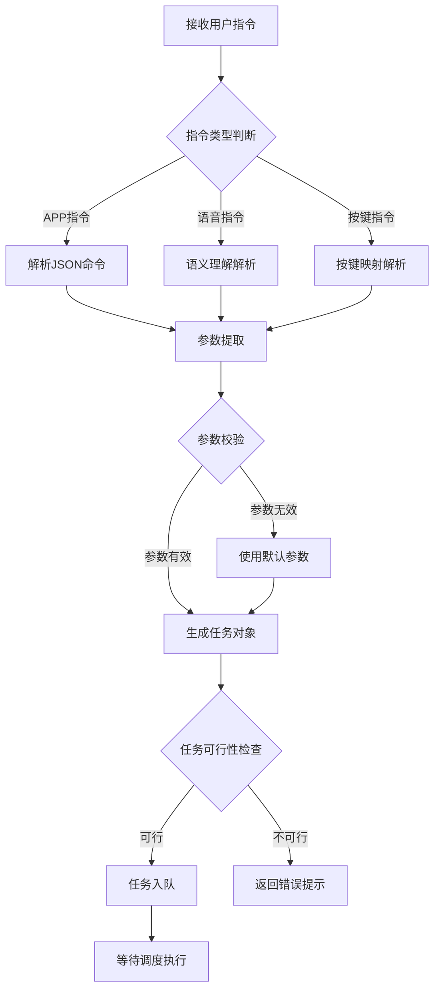
```mermaid
flowchart TD
    A[接收用户指令] --> B{指令类型判断}
    
    B -->|APP指令| C[解析JSON命令]
    B -->|语音指令| D[语义理解解析]
    B -->|按键指令| E[按键映射解析]
    
    C --> F[参数提取]
    D --> F
    E --> F
    
    F --> G{参数校验}
    
    G -->|参数有效| H[生成任务对象]
    G -->|参数无效| I[使用默认参数]
    
    I --> H
    
    H --> J{任务可行性检查}
    
    J -->|可行| K[任务入队]
    J -->|不可行| L[返回错误提示]
    
    K --> M[等待调度执行]
```

#### 2.1.3 任务参数提取逻辑

| 参数名称 | 参数类型 | 默认值 | 取值范围 | 提取规则 |
|---------|---------|--------|---------|---------|
| 清洁模式 | 枚举 | 扫拖同步 | 扫拖同步/单扫/单拖 | 从指令直接提取 |
| 吸力档位 | 枚举 | 标准 | 静音/标准/强力/Max+ | 从指令提取或房间配置 |
| 水量档位 | 枚举 | 中 | 低/中/高 | 从指令提取或房间配置 |
| 震动档位 | 枚举 | 中 | 关/弱/中/强 | 从指令提取或房间配置 |
| 清洁次数 | 整数 | 1 | 1-3 | 从指令直接提取 |
| 房间列表 | 数组 | 全部房间 | 已分区房间 | 从指令或地图提取 |
| 清洁顺序 | 数组 | 智能排序 | 已分区房间 | 从指令或智能规划 |

### 2.2 任务分解

#### 2.2.1 分解策略

石头 G10S Pro 采用分层分解策略，将复杂任务分解为可执行的子任务序列。

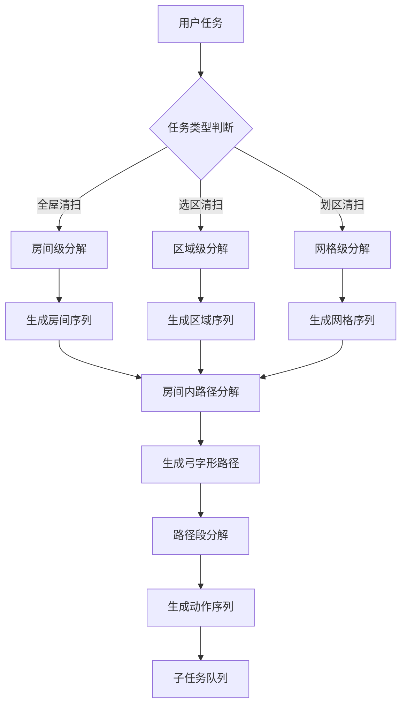
```mermaid
flowchart TD
    A[用户任务] --> B{任务类型判断}
    
    B -->|全屋清扫| C[房间级分解]
    B -->|选区清扫| D[区域级分解]
    B -->|划区清扫| E[网格级分解]
    
    C --> F[生成房间序列]
    D --> G[生成区域序列]
    E --> H[生成网格序列]
    
    F --> I[房间内路径分解]
    G --> I
    H --> I
    
    I --> J[生成弓字形路径]
    
    J --> K[路径段分解]
    
    K --> L[生成动作序列]
    
    L --> M[子任务队列]
```

#### 2.2.2 子任务类型定义

| 子任务类型 | 编号 | 功能描述 | 输入参数 | 输出结果 |
|-----------|------|---------|---------|---------|
| 导航子任务 | SUB-001 | 移动到目标位置 | 目标坐标 | 到达目标 |
| 清扫子任务 | SUB-002 | 执行清扫动作 | 清扫参数 | 清洁完成 |
| 沿边子任务 | SUB-003 | 执行沿边清扫 | 边界信息 | 边缘清洁完成 |
| 回充子任务 | SUB-004 | 返回基站充电 | 基站位置 | 开始充电 |
| 回洗子任务 | SUB-005 | 返回基站洗拖布 | 基站位置 | 拖布清洗完成 |
| 避障子任务 | SUB-006 | 执行避障动作 | 障碍物信息 | 避障完成 |
| 脱困子任务 | SUB-007 | 执行脱困动作 | 被困状态 | 脱困成功 |

#### 2.2.3 任务依赖关系

| 前置任务 | 后续任务 | 依赖条件 | 异常处理 |
|---------|---------|---------|---------|
| 导航子任务 | 清扫子任务 | 到达目标位置 | 重新导航 |
| 清扫子任务 | 回洗子任务 | 拖布脏污度>阈值 | 继续清扫 |
| 清扫子任务 | 回充子任务 | 电量<阈值 | 立即回充 |
| 回洗子任务 | 清扫子任务 | 拖布清洗完成 | 继续清扫 |
| 回充子任务 | 清扫子任务 | 电量>80% | 断点续扫 |
| 避障子任务 | 清扫子任务 | 避障完成 | 恢复清扫 |
| 脱困子任务 | 清扫子任务 | 脱困成功 | 继续清扫 |

### 2.3 任务调度

#### 2.3.1 调度策略

石头 G10S Pro 采用基于优先级的抢占式调度策略，确保高优先级任务能够及时执行。

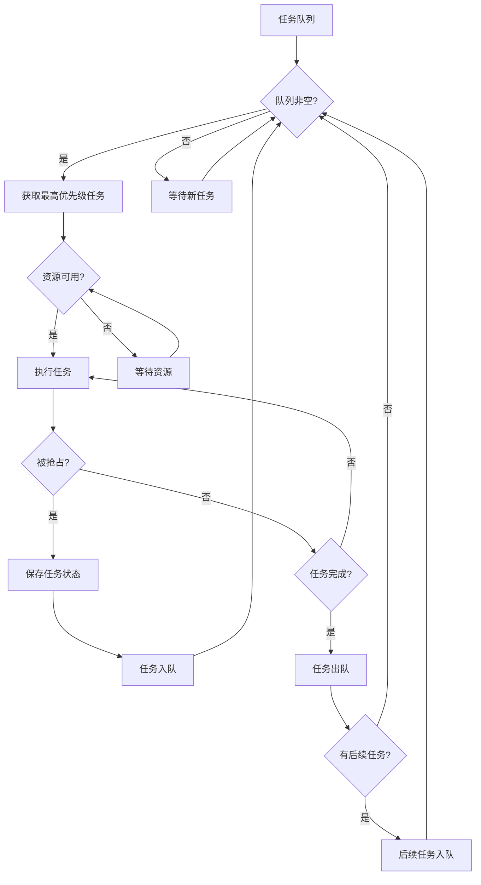
```mermaid
flowchart TD
    A[任务队列] --> B{队列非空?}
    
    B -->|是| C[获取最高优先级任务]
    B -->|否| D[等待新任务]
    
    D --> B
    
    C --> E{资源可用?}
    
    E -->|是| F[执行任务]
    E -->|否| G[等待资源]
    
    G --> E
    
    F --> H{被抢占?}
    
    H -->|是| I[保存任务状态]
    H -->|否| J{任务完成?}
    
    I --> K[任务入队]
    K --> B
    
    J -->|是| L[任务出队]
    J -->|否| F
    
    L --> M{有后续任务?}
    
    M -->|是| N[后续任务入队]
    M -->|否| B
    
    N --> B
```

#### 2.3.2 任务优先级定义

| 优先级 | 优先级值 | 任务类型 | 抢占条件 | 说明 |
|--------|---------|---------|---------|------|
| 最高 | 100 | 紧急停止、安全保护 | 无条件抢占 | 安全相关任务 |
| 高 | 80 | 回充任务、脱困任务 | 电量<15%或被困 | 生存相关任务 |
| 中高 | 60 | 局部清扫、定点清扫 | 用户主动触发 | 用户指定任务 |
| 中 | 40 | 全屋清扫、选区清扫 | 无 | 常规清扫任务 |
| 低 | 20 | 深度清洁、沿边清扫 | 无 | 增强清洁任务 |
| 最低 | 10 | 建图任务、自检任务 | 无 | 维护类任务 |

#### 2.3.3 任务队列管理

| 管理功能 | 功能描述 | 触发条件 | 处理方式 |
|---------|---------|---------|---------|
| 任务入队 | 新任务加入队列 | 用户指令或系统触发 | 按优先级插入 |
| 任务出队 | 任务执行完成 | 任务正常结束 | 从队列移除 |
| 任务挂起 | 暂停当前任务 | 高优先级抢占 | 保存状态入队 |
| 任务恢复 | 恢复挂起任务 | 抢占任务完成 | 恢复状态执行 |
| 任务取消 | 取消待执行任务 | 用户取消指令 | 从队列移除 |
| 任务重试 | 重新执行失败任务 | 任务执行失败 | 重新入队 |

#### 2.3.4 任务监控机制

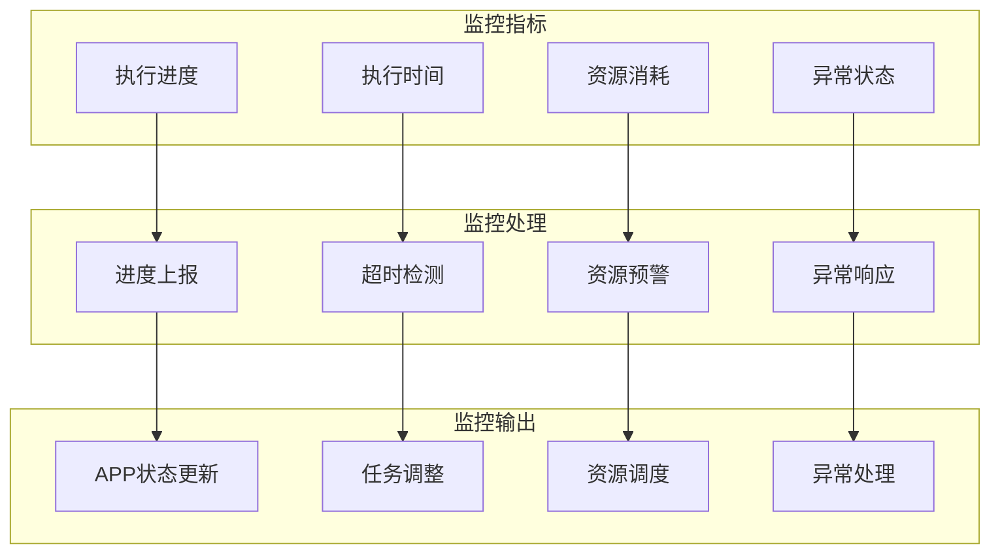
```mermaid
flowchart TD
    subgraph 监控指标
        A1[执行进度]
        A2[执行时间]
        A3[资源消耗]
        A4[异常状态]
    end
    
    subgraph 监控处理
        B1[进度上报]
        B2[超时检测]
        B3[资源预警]
        B4[异常响应]
    end
    
    subgraph 监控输出
        C1[APP状态更新]
        C2[任务调整]
        C3[资源调度]
        C4[异常处理]
    end
    
    A1 --> B1 --> C1
    A2 --> B2 --> C2
    A3 --> B3 --> C3
    A4 --> B4 --> C4
```

---

## III. 行为规划

### 3.1 行为选择

#### 3.1.1 支持的行为类型

石头 G10S Pro 定义了丰富的行为类型，覆盖清扫过程中的各种场景。

| 行为类型 | 行为编号 | 行为描述 | 触发条件 | 执行模式 |
|---------|---------|---------|---------|---------|
| 正常清扫 | BEH-001 | 弓字形清扫行为 | 清扫任务执行 | 周期执行 |
| 沿边清扫 | BEH-002 | 沿墙边清扫行为 | 检测到墙边 | 持续执行 |
| 避障绕行 | BEH-003 | 绕过障碍物行为 | 检测到障碍物 | 即时响应 |
| 地毯处理 | BEH-004 | 地毯区域处理行为 | 检测到地毯 | 条件触发 |
| 回充导航 | BEH-005 | 返回基站行为 | 电量不足或任务完成 | 目标导向 |
| 回洗拖布 | BEH-006 | 返回清洗拖布行为 | 拖布脏污或定时 | 目标导向 |
| 脱困行为 | BEH-007 | 被困脱困行为 | 检测到被困 | 紧急响应 |
| 越障行为 | BEH-008 | 跨越门槛行为 | 检测到门槛 | 条件触发 |
| 充电等待 | BEH-009 | 充电等待行为 | 到达基站 | 持续执行 |
| 待机行为 | BEH-010 | 空闲待机行为 | 无任务执行 | 持续执行 |

#### 3.1.2 行为选择策略

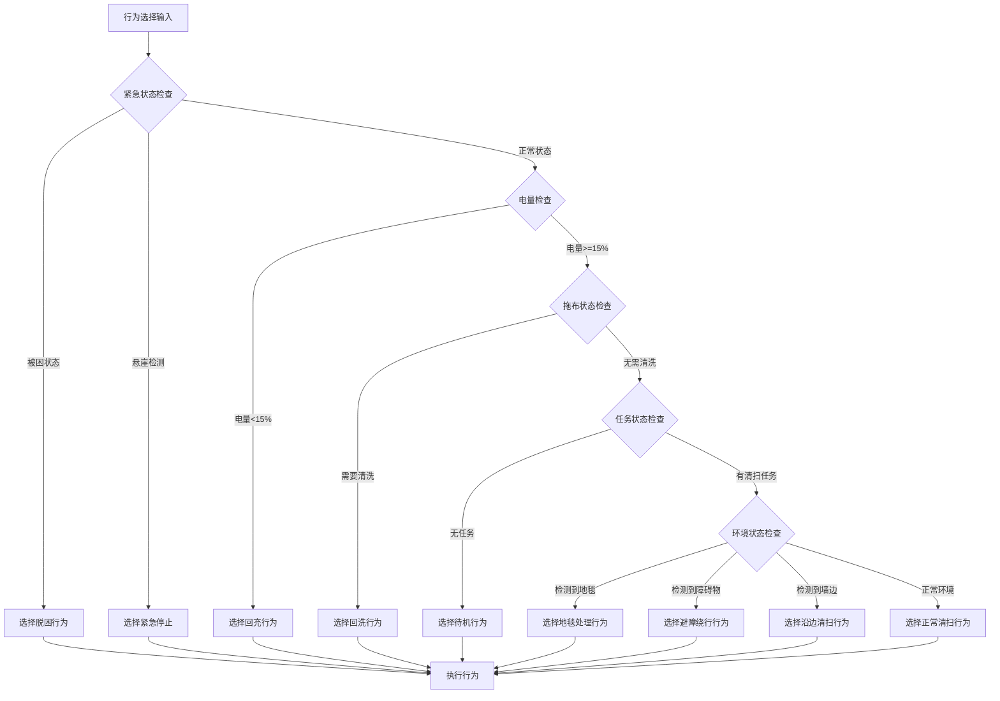
```mermaid
flowchart TD
    A[行为选择输入] --> B{紧急状态检查}
    
    B -->|被困状态| C[选择脱困行为]
    B -->|悬崖检测| D[选择紧急停止]
    B -->|正常状态| E{电量检查}
    
    C --> F[执行行为]
    D --> F
    
    E -->|电量<15%| G[选择回充行为]
    E -->|电量>=15%| H{拖布状态检查}
    
    G --> F
    
    H -->|需要清洗| I[选择回洗行为]
    H -->|无需清洗| J{任务状态检查}
    
    I --> F
    
    J -->|有清扫任务| K{环境状态检查}
    J -->|无任务| L[选择待机行为]
    
    K -->|检测到地毯| M[选择地毯处理行为]
    K -->|检测到障碍物| N[选择避障绕行行为]
    K -->|检测到墙边| O[选择沿边清扫行为]
    K -->|正常环境| P[选择正常清扫行为]
    
    L --> F
    M --> F
    N --> F
    O --> F
    P --> F
```

#### 3.1.3 行为选择约束条件

| 约束类型 | 约束描述 | 约束处理 | 影响行为 |
|---------|---------|---------|---------|
| 电量约束 | 电量不足时限制高功耗行为 | 切换低功耗模式或回充 | 清扫行为 |
| 水量约束 | 水量不足时限制拖地行为 | 返回补水或切换纯扫 | 拖地行为 |
| 地形约束 | 地毯区域限制拖地行为 | 升起拖布切换纯扫 | 拖地行为 |
| 时间约束 | 特定时段限制噪音行为 | 切换静音模式 | 吸力行为 |
| 空间约束 | 禁区限制进入行为 | 绕行或停止 | 导航行为 |
| 温度约束 | 高温限制高功耗行为 | 降低功率或暂停 | 清扫行为 |

### 3.2 行为执行

#### 3.2.1 执行模式定义

| 执行模式 | 模式描述 | 适用行为 | 执行特点 |
|---------|---------|---------|---------|
| 周期执行 | 按固定周期循环执行 | 正常清扫、沿边清扫 | 周期性、可中断 |
| 持续执行 | 持续执行直到条件变化 | 充电等待、待机行为 | 持续性、可中断 |
| 目标导向 | 执行直到目标达成 | 回充导航、回洗拖布 | 目标性、可中断 |
| 即时响应 | 立即响应并快速完成 | 避障绕行、越障行为 | 即时性、高优先 |
| 条件触发 | 满足条件时触发执行 | 地毯处理、脱困行为 | 条件性、紧急性 |
| 紧急响应 | 最高优先级立即执行 | 紧急停止、脱困行为 | 紧急性、不可中断 |

#### 3.2.2 行为执行流程

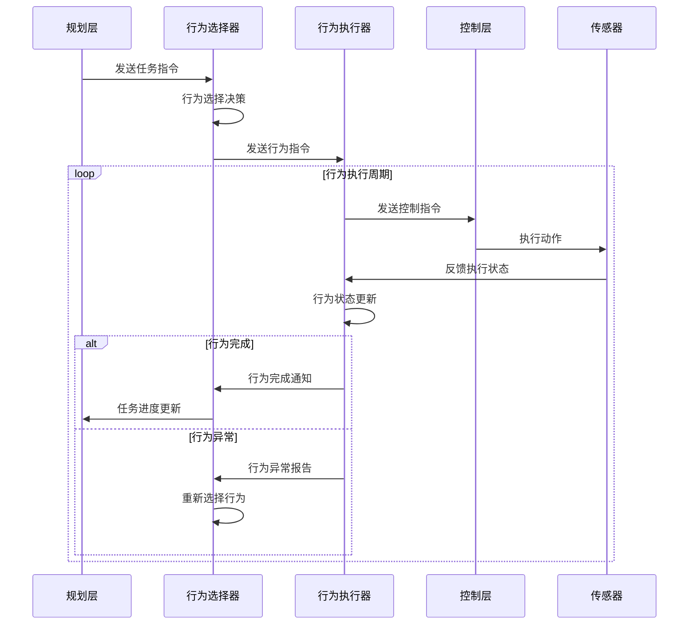
```mermaid
sequenceDiagram
    participant PLAN as 规划层
    participant SELECT as 行为选择器
    participant EXEC as 行为执行器
    participant CTRL as 控制层
    participant SENS as 传感器
    
    PLAN->>SELECT: 发送任务指令
    SELECT->>SELECT: 行为选择决策
    SELECT->>EXEC: 发送行为指令
    
    loop 行为执行周期
        EXEC->>CTRL: 发送控制指令
        CTRL->>SENS: 执行动作
        SENS->>EXEC: 反馈执行状态
        EXEC->>EXEC: 行为状态更新
        
        alt 行为完成
            EXEC->>SELECT: 行为完成通知
            SELECT->>PLAN: 任务进度更新
        else 行为异常
            EXEC->>SELECT: 行为异常报告
            SELECT->>SELECT: 重新选择行为
        end
    end
```

#### 3.2.3 行为监控机制

| 监控项目 | 监控指标 | 监控频率 | 异常阈值 | 异常处理 |
|---------|---------|---------|---------|---------|
| 执行进度 | 完成百分比 | 1Hz | 进度停滞>10s | 重新规划 |
| 执行时间 | 已执行时长 | 1Hz | 超时>预估2倍 | 任务调整 |
| 执行效果 | 清洁覆盖率 | 0.1Hz | 覆盖率<90% | 补充清扫 |
| 资源消耗 | 电量/水量消耗 | 1Hz | 消耗过快 | 调整参数 |
| 环境变化 | 障碍物变化 | 20Hz | 新障碍物 | 避障响应 |
| 系统状态 | 传感器/电机状态 | 10Hz | 状态异常 | 异常处理 |

#### 3.2.4 异常调整策略

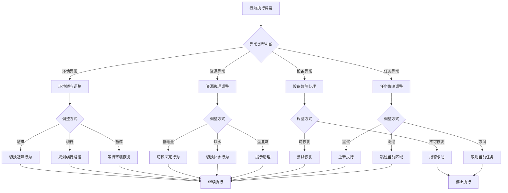
```mermaid
flowchart TD
    A[行为执行异常] --> B{异常类型判断}
    
    B -->|环境异常| C[环境适应调整]
    B -->|资源异常| D[资源管理调整]
    B -->|设备异常| E[设备故障处理]
    B -->|任务异常| F[任务策略调整]
    
    C --> C1{调整方式}
    C1 -->|避障| C2[切换避障行为]
    C1 -->|绕行| C3[规划绕行路径]
    C1 -->|暂停| C4[等待环境恢复]
    
    D --> D1{调整方式}
    D1 -->|低电量| D2[切换回充行为]
    D1 -->|缺水| D3[切换补水行为]
    D1 -->|尘盒满| D4[提示清理]
    
    E --> E1{调整方式}
    E1 -->|可恢复| E2[尝试恢复]
    E1 -->|不可恢复| E3[报警求助]
    
    F --> F1{调整方式}
    F1 -->|重试| F2[重新执行]
    F1 -->|跳过| F3[跳过当前区域]
    F1 -->|取消| F4[取消当前任务]
    
    C2 --> G[继续执行]
    C3 --> G
    C4 --> G
    D2 --> G
    D3 --> G
    D4 --> G
    E2 --> G
    E3 --> H[停止执行]
    F2 --> G
    F3 --> G
    F4 --> H
```

### 3.3 行为协调

#### 3.3.1 多行为协调机制

石头 G10S Pro 在执行过程中可能需要同时处理多个行为请求，需要有效的协调机制。

| 协调类型 | 协调描述 | 协调策略 | 应用场景 |
|---------|---------|---------|---------|
| 优先级协调 | 按优先级选择执行 | 高优先级抢占 | 清扫与避障冲突 |
| 时间片协调 | 分时执行多个行为 | 时间片轮转 | 清扫与沿边 |
| 资源协调 | 按资源可用性协调 | 资源预留机制 | 多任务并发 |
| 目标协调 | 按目标一致性协调 | 目标融合 | 导航与避障 |
| 约束协调 | 按约束条件协调 | 约束满足 | 清洁与电量 |

#### 3.3.2 行为协调流程

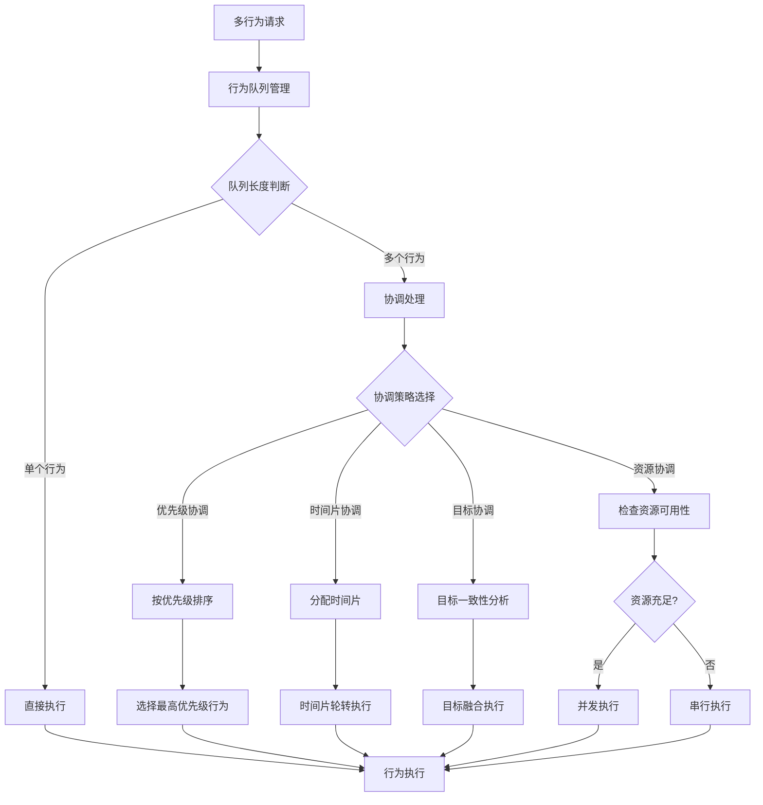
```mermaid
flowchart TD
    A[多行为请求] --> B[行为队列管理]
    
    B --> C{队列长度判断}
    
    C -->|单个行为| D[直接执行]
    C -->|多个行为| E[协调处理]
    
    E --> F{协调策略选择}
    
    F -->|优先级协调| G[按优先级排序]
    F -->|时间片协调| H[分配时间片]
    F -->|资源协调| I[检查资源可用性]
    F -->|目标协调| J[目标一致性分析]
    
    G --> K[选择最高优先级行为]
    H --> L[时间片轮转执行]
    I --> M{资源充足?}
    J --> N[目标融合执行]
    
    M -->|是| O[并发执行]
    M -->|否| P[串行执行]
    
    D --> Q[行为执行]
    K --> Q
    L --> Q
    N --> Q
    O --> Q
    P --> Q
```

#### 3.3.3 资源竞争处理

| 资源类型 | 竞争行为 | 竞争处理策略 | 仲裁规则 |
|---------|---------|---------|---------|
| 驱动轮 | 导航、避障、清扫 | 优先级抢占 | 避障>导航>清扫 |
| 主风机 | 清扫、静音、强力 | 任务优先级 | 强力>清扫>静音 |
| 边刷 | 清扫、沿边、停止 | 场景判断 | 沿边>清扫>停止 |
| 拖布升降 | 拖地、地毯、回充 | 条件优先 | 地毯>回充>拖地 |
| 摄像头 | 避障、视频通话 | 功能优先级 | 避障>视频通话 |
| 通信带宽 | 状态上报、地图同步 | 实时性优先 | 状态>地图 |

---

## IV. 状态机与行为树设计

### 4.1 状态机设计

#### 4.1.1 系统状态定义

石头 G10S Pro 定义了完整的系统状态，覆盖所有工作场景。

| 状态编号 | 状态名称 | 状态描述 | 进入条件 | 退出条件 |
|---------|---------|---------|---------|---------|
| S-001 | 待机状态 | 系统空闲等待指令 | 上电完成、任务完成 | 接收指令 |
| S-002 | 建图状态 | 建立或更新地图 | 建图指令 | 建图完成或取消 |
| S-003 | 清扫状态 | 执行清扫任务 | 清扫指令 | 清扫完成或中断 |
| S-004 | 暂停状态 | 暂停当前任务 | 暂停指令 | 恢复或取消指令 |
| S-005 | 回充状态 | 返回基站充电 | 回充指令或低电量 | 到达基站 |
| S-006 | 充电状态 | 在基站充电 | 到达基站 | 充电完成 |
| S-007 | 回洗状态 | 返回基站洗拖布 | 回洗指令或定时 | 拖布清洗完成 |
| S-008 | 脱困状态 | 执行脱困动作 | 被困检测 | 脱困成功或失败 |
| S-009 | 故障状态 | 处理系统故障 | 故障检测 | 故障清除 |
| S-010 | 升级状态 | OTA固件升级 | 升级指令 | 升级完成或失败 |

#### 4.1.2 系统状态机图

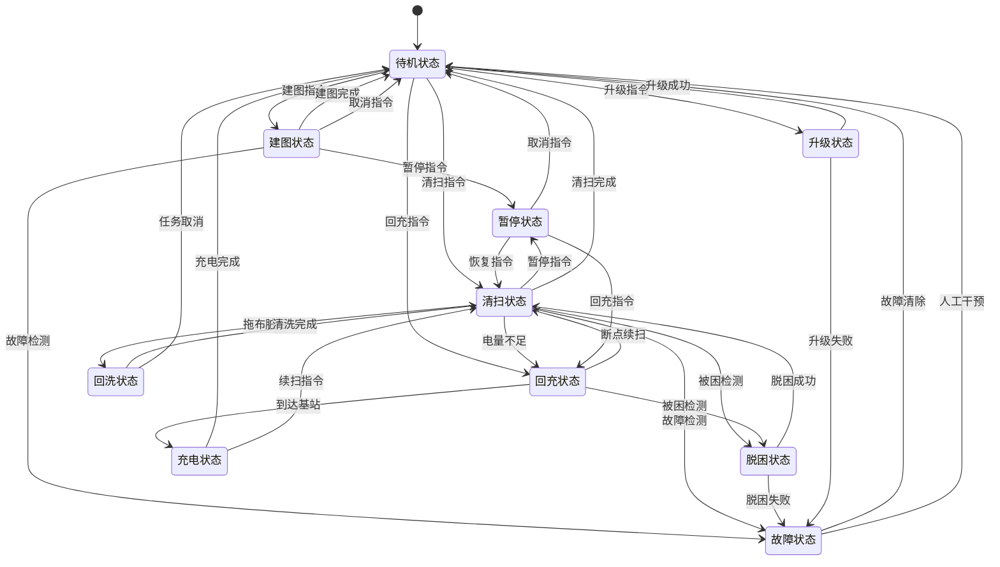
```mermaid
stateDiagram-v2
    [*] --> 待机状态
    
    待机状态 --> 建图状态: 建图指令
    待机状态 --> 清扫状态: 清扫指令
    待机状态 --> 回充状态: 回充指令
    待机状态 --> 升级状态: 升级指令
    
    建图状态 --> 待机状态: 建图完成
    建图状态 --> 待机状态: 取消指令
    建图状态 --> 暂停状态: 暂停指令
    建图状态 --> 故障状态: 故障检测
    
    清扫状态 --> 暂停状态: 暂停指令
    清扫状态 --> 回充状态: 电量不足
    清扫状态 --> 回洗状态: 拖布脏污
    清扫状态 --> 待机状态: 清扫完成
    清扫状态 --> 脱困状态: 被困检测
    清扫状态 --> 故障状态: 故障检测
    
    暂停状态 --> 清扫状态: 恢复指令
    暂停状态 --> 待机状态: 取消指令
    暂停状态 --> 回充状态: 回充指令
    
    回充状态 --> 充电状态: 到达基站
    回充状态 --> 清扫状态: 断点续扫
    回充状态 --> 脱困状态: 被困检测
    
    充电状态 --> 待机状态: 充电完成
    充电状态 --> 清扫状态: 续扫指令
    
    回洗状态 --> 清扫状态: 清洗完成
    回洗状态 --> 待机状态: 任务取消
    
    脱困状态 --> 清扫状态: 脱困成功
    脱困状态 --> 故障状态: 脱困失败
    
    故障状态 --> 待机状态: 故障清除
    故障状态 --> 待机状态: 人工干预
    
    升级状态 --> 待机状态: 升级成功
    升级状态 --> 故障状态: 升级失败
```

#### 4.1.3 状态转换条件

| 当前状态 | 目标状态 | 转换条件 | 转换动作 | 优先级 |
|---------|---------|---------|---------|--------|
| 待机状态 | 清扫状态 | 清扫指令 | 加载地图、初始化清洁参数 | 普通 |
| 清扫状态 | 暂停状态 | 暂停指令 | 保存断点、停止运动 | 普通 |
| 清扫状态 | 回充状态 | 电量<15% | 计算回充路径、保存断点 | 高 |
| 清扫状态 | 脱困状态 | 被困检测 | 停止清扫、启动脱困 | 最高 |
| 回充状态 | 充电状态 | 到达基站 | 停止运动、开始充电 | 普通 |
| 充电状态 | 清扫状态 | 电量>80%且有待续任务 | 加载断点、恢复清扫 | 普通 |
| 脱困状态 | 清扫状态 | 脱困成功 | 恢复清扫任务 | 高 |
| 脱困状态 | 故障状态 | 脱困失败 | 报警提示 | 最高 |

#### 4.1.4 状态机实现方式

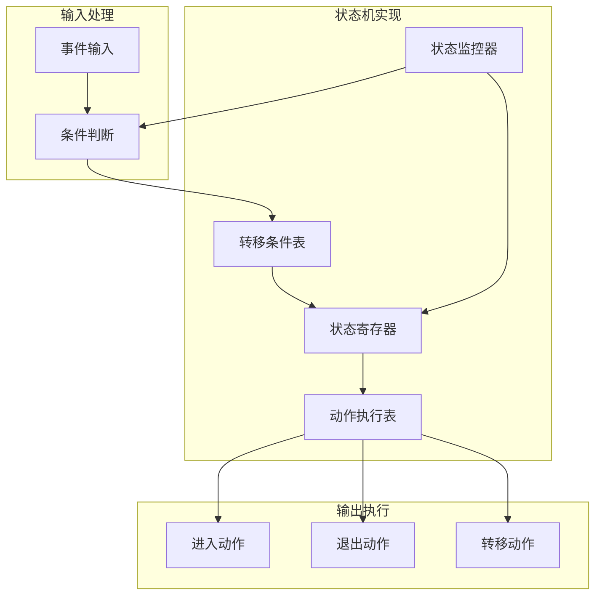
```mermaid
flowchart TD
    subgraph 状态机实现
        A[状态寄存器]
        B[转移条件表]
        C[动作执行表]
        D[状态监控器]
    end
    
    subgraph 输入处理
        E[事件输入]
        F[条件判断]
    end
    
    subgraph 输出执行
        G[进入动作]
        H[退出动作]
        I[转移动作]
    end
    
    E --> F
    F --> B
    B --> A
    A --> C
    C --> G
    C --> H
    C --> I
    
    D --> A
    D --> F
```

### 4.2 行为树设计

#### 4.2.1 行为树结构

石头 G10S Pro 采用行为树进行行为选择和执行管理，实现灵活的行为决策。

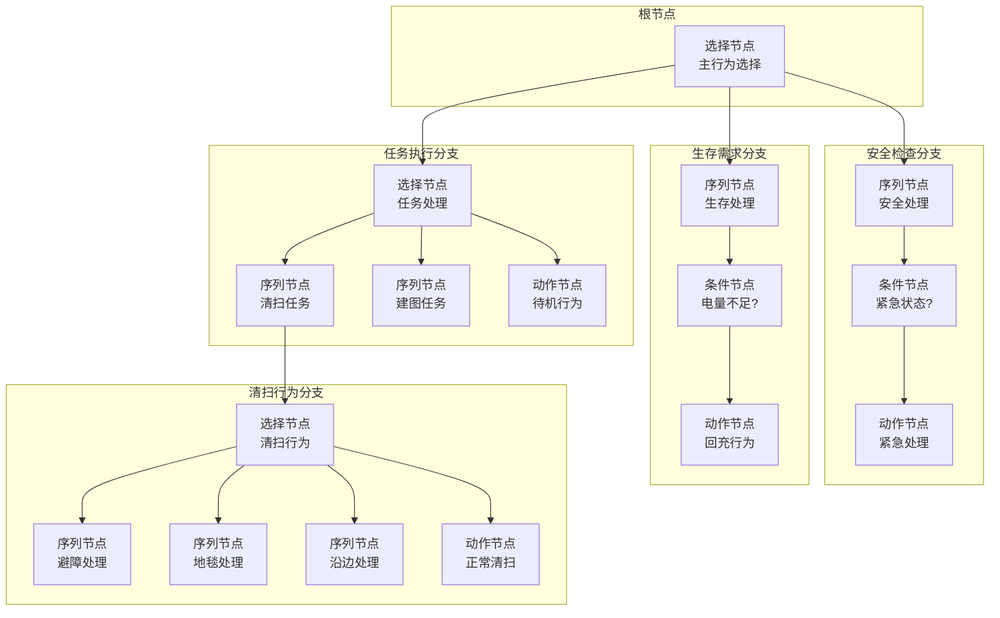
```mermaid
flowchart TD
    subgraph 根节点
        A[选择节点<br/>主行为选择]
    end
    
    subgraph 安全检查分支
        B[序列节点<br/>安全处理]
        B1[条件节点<br/>紧急状态?]
        B2[动作节点<br/>紧急处理]
    end
    
    subgraph 生存需求分支
        C[序列节点<br/>生存处理]
        C1[条件节点<br/>电量不足?]
        C2[动作节点<br/>回充行为]
    end
    
    subgraph 任务执行分支
        D[选择节点<br/>任务处理]
        D1[序列节点<br/>清扫任务]
        D2[序列节点<br/>建图任务]
        D3[动作节点<br/>待机行为]
    end
    
    subgraph 清扫行为分支
        E[选择节点<br/>清扫行为]
        E1[序列节点<br/>避障处理]
        E2[序列节点<br/>地毯处理]
        E3[序列节点<br/>沿边处理]
        E4[动作节点<br/>正常清扫]
    end
    
    A --> B
    A --> C
    A --> D
    
    B --> B1 --> B2
    C --> C1 --> C2
    
    D --> D1
    D --> D2
    D --> D3
    
    D1 --> E
    E --> E1
    E --> E2
    E --> E3
    E --> E4
```

#### 4.2.2 行为树节点类型

| 节点类型 | 节点符号 | 执行逻辑 | 成功条件 | 失败条件 |
|---------|---------|---------|---------|---------|
| 选择节点 | ? | 顺序执行子节点直到成功 | 任一子节点成功 | 所有子节点失败 |
| 序列节点 | → | 顺序执行所有子节点 | 所有子节点成功 | 任一子节点失败 |
| 并行节点 | ∥ | 并发执行所有子节点 | 按策略判定 | 按策略判定 |
| 条件节点 | ◇ | 检查条件是否满足 | 条件为真 | 条件为假 |
| 动作节点 | □ | 执行具体动作 | 动作执行成功 | 动作执行失败 |
| 装饰节点 | ○ | 修改子节点返回值 | 按装饰类型 | 按装饰类型 |

#### 4.2.3 行为树执行逻辑

| 执行步骤 | 执行内容 | 执行条件 | 执行结果 |
|---------|---------|---------|---------|
| Step 1 | 根节点选择执行 | 每个决策周期 | 进入子节点 |
| Step 2 | 安全检查分支 | 优先级最高 | 紧急状态处理 |
| Step 3 | 生存需求分支 | 安全检查通过 | 电量管理 |
| Step 4 | 任务执行分支 | 生存需求满足 | 任务执行 |
| Step 5 | 行为选择执行 | 任务执行中 | 具体行为 |
| Step 6 | 动作执行 | 行为确定后 | 底层控制 |
| Step 7 | 结果反馈 | 动作完成后 | 状态更新 |

---

## V. 学习与适应能力

### 5.1 学习能力

#### 5.1.1 支持的学习类型

石头 G10S Pro 具备多种学习能力，能够持续优化清洁效果和用户体验。

| 学习类型 | 学习目标 | 学习方法 | 学习周期 | 应用场景 |
|---------|---------|---------|---------|---------|
| 地图学习 | 优化地图精度 | SLAM累积优化 | 每次清扫 | 定位精度提升 |
| 路径学习 | 优化清扫路径 | 路径效率分析 | 每次清扫 | 清扫效率提升 |
| 房间学习 | 识别房间类型 | 用户标注学习 | 用户交互 | 智能清洁策略 |
| 避障学习 | 优化避障策略 | 避障效果反馈 | 每次避障 | 避障准确率提升 |
| 用户习惯学习 | 学习用户偏好 | 行为模式分析 | 长期累积 | 个性化服务 |
| 环境适应学习 | 适应环境变化 | 环境特征提取 | 持续进行 | 环境适应性 |

#### 5.1.2 学习流程

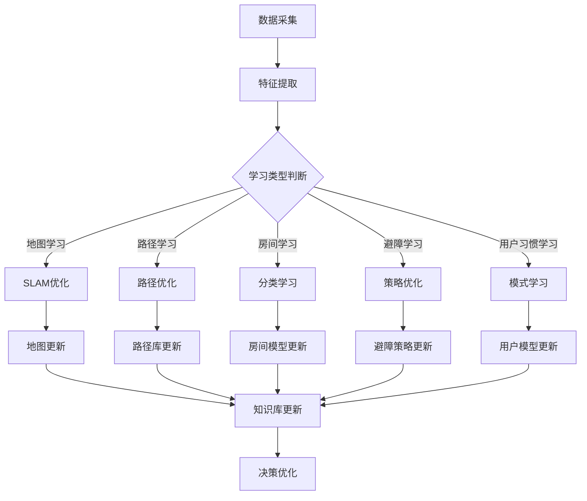
```mermaid
flowchart TD
    A[数据采集] --> B[特征提取]
    
    B --> C{学习类型判断}
    
    C -->|地图学习| D1[SLAM优化]
    C -->|路径学习| D2[路径优化]
    C -->|房间学习| D3[分类学习]
    C -->|避障学习| D4[策略优化]
    C -->|用户习惯学习| D5[模式学习]
    
    D1 --> E1[地图更新]
    D2 --> E2[路径库更新]
    D3 --> E3[房间模型更新]
    D4 --> E4[避障策略更新]
    D5 --> E5[用户模型更新]
    
    E1 --> F[知识库更新]
    E2 --> F
    E3 --> F
    E4 --> F
    E5 --> F
    
    F --> G[决策优化]
```

#### 5.1.3 可学习内容范围

| 学习内容 | 数据来源 | 学习算法 | 存储方式 | 更新机制 |
|---------|---------|---------|---------|---------|
| 房间布局 | LDS点云 | 聚类分析 | 地图数据 | 增量更新 |
| 家具位置 | LDS+视觉 | 目标检测 | 地图标注 | 变化检测更新 |
| 障碍物特征 | 视觉+结构光 | 深度学习 | 特征库 | 在线学习 |
| 清洁效果 | 传感器反馈 | 效果评估 | 效果记录 | 任务后更新 |
| 用户偏好 | 用户操作 | 协同过滤 | 用户画像 | 持续更新 |
| 最佳路径 | 历史路径 | 强化学习 | 路径库 | 周期优化 |

### 5.2 适应能力

#### 5.2.1 环境适应策略

| 环境因素 | 适应策略 | 触发条件 | 适应动作 | 效果评估 |
|---------|---------|---------|---------|---------|
| 光照变化 | 补光灯自适应 | 光照传感器检测 | 调节LED亮度 | 避障准确率 |
| 地面材质 | 清洁参数自适应 | 地图标注+传感器 | 调整吸力/水量 | 清洁效果评分 |
| 地面平整度 | 悬挂自适应 | IMU震动检测 | 调整清扫速度 | 清洁覆盖率 |
| 地毯区域 | 拖布升降自适应 | 超声波检测 | 升起拖布 | 地毯保护效果 |
| 障碍物密度 | 路径规划自适应 | 避障频率统计 | 调整规划策略 | 清扫效率 |
| 房间使用频率 | 清洁顺序自适应 | 用户行为分析 | 优化清洁顺序 | 用户满意度 |

#### 5.2.2 用户适应策略

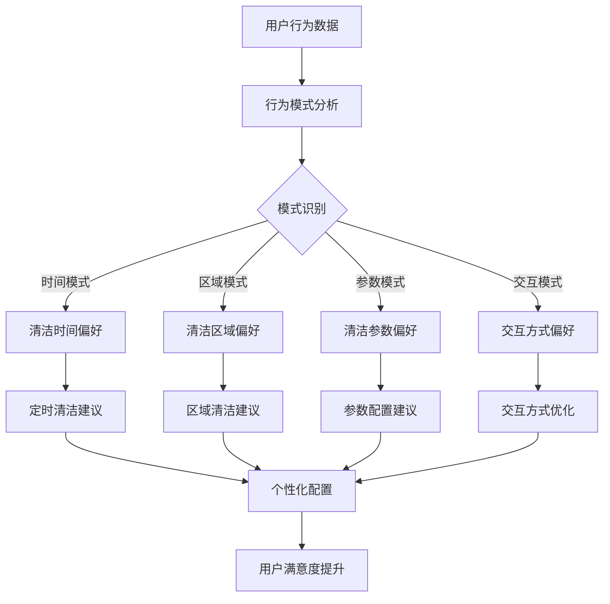
```mermaid
flowchart TD
    A[用户行为数据] --> B[行为模式分析]
    
    B --> C{模式识别}
    
    C -->|时间模式| D1[清洁时间偏好]
    C -->|区域模式| D2[清洁区域偏好]
    C -->|参数模式| D3[清洁参数偏好]
    C -->|交互模式| D4[交互方式偏好]
    
    D1 --> E1[定时清洁建议]
    D2 --> E2[区域清洁建议]
    D3 --> E3[参数配置建议]
    D4 --> E4[交互方式优化]
    
    E1 --> F[个性化配置]
    E2 --> F
    E3 --> F
    E4 --> F
    
    F --> G[用户满意度提升]
```

#### 5.2.3 适应能力指标

| 适应能力 | 适应指标 | 目标值 | 测量方法 | 优化周期 |
|---------|---------|--------|---------|---------|
| 环境适应 | 避障准确率 | >95% | 避障成功率统计 | 每次清扫 |
| 环境适应 | 清洁覆盖率 | >99% | 覆盖率计算 | 每次清扫 |
| 用户适应 | 参数采纳率 | >80% | 用户配置统计 | 每月 |
| 用户适应 | 任务完成率 | >98% | 任务成功率统计 | 每次清扫 |
| 学习效率 | 学习收敛时间 | <10次 | 学习曲线分析 | 持续 |
| 适应稳定性 | 性能波动 | <5% | 性能指标方差 | 持续 |

---

## VI. 安全决策

### 6.1 安全策略

#### 6.1.1 安全优先级定义

石头 G10S Pro 建立了完整的安全优先级体系，确保在各种情况下优先保障安全。

| 优先级 | 安全等级 | 安全事件 | 响应时间 | 响应动作 |
|--------|---------|---------|---------|---------|
| P0 | 紧急 | 悬崖检测、碰撞检测、过流保护 | <10ms | 立即停止 |
| P1 | 高 | 被困状态、电机过载、电池过温 | <100ms | 停止并报警 |
| P2 | 中 | 低电量、水箱缺水、尘盒已满 | <1s | 提示并处理 |
| P3 | 低 | 传感器异常、通信中断 | <5s | 记录并处理 |
| P4 | 信息 | 清洁效果下降、路径效率降低 | 任务后 | 分析并优化 |

#### 6.1.2 安全行为规范

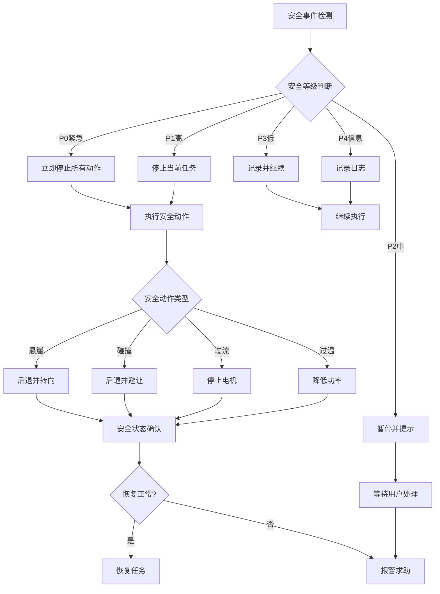
```mermaid
flowchart TD
    A[安全事件检测] --> B{安全等级判断}
    
    B -->|P0紧急| C[立即停止所有动作]
    B -->|P1高| D[停止当前任务]
    B -->|P2中| E[暂停并提示]
    B -->|P3低| F[记录并继续]
    B -->|P4信息| G[记录日志]
    
    C --> H[执行安全动作]
    D --> H
    E --> I[等待用户处理]
    
    H --> J{安全动作类型}
    
    J -->|悬崖| K1[后退并转向]
    J -->|碰撞| K2[后退并避让]
    J -->|过流| K3[停止电机]
    J -->|过温| K4[降低功率]
    
    K1 --> L[安全状态确认]
    K2 --> L
    K3 --> L
    K4 --> L
    
    L --> M{恢复正常?}
    
    M -->|是| N[恢复任务]
    M -->|否| O[报警求助]
    
    I --> O
    F --> P[继续执行]
    G --> P
```

#### 6.1.3 安全约束条件

| 约束类型 | 约束条件 | 约束值 | 约束动作 | 约束效果 |
|---------|---------|--------|---------|---------|
| 速度约束 | 最大线速度 | 300mm/s | 速度限制 | 防止碰撞损伤 |
| 加速度约束 | 最大加速度 | 200mm/s² | 加速度限制 | 防止打滑 |
| 电量约束 | 最低工作电量 | 15% | 强制回充 | 防止电量耗尽 |
| 温度约束 | 最高工作温度 | 60°C | 功率限制 | 防止过热 |
| 电流约束 | 最大工作电流 | 5A | 过流保护 | 防止电机损坏 |
| 高度约束 | 最大越障高度 | 20mm | 越障检测 | 防止卡困 |

### 6.2 异常处理

#### 6.2.1 异常检测机制

| 异常类型 | 检测方法 | 检测指标 | 检测阈值 | 检测周期 |
|---------|---------|---------|---------|---------|
| 悬崖异常 | 红外传感器 | 反射强度 | <阈值 | 10ms |
| 碰撞异常 | 碰撞传感器 | 触发状态 | 触发 | 5ms |
| 被困异常 | 运动检测 | 移动距离 | <10cm/10s | 1s |
| 电机异常 | 电流检测 | 工作电流 | >5A | 10ms |
| 电池异常 | 电压检测 | 电池电压 | <12V | 1s |
| 传感器异常 | 数据校验 | 数据有效性 | 无效数据 | 100ms |
| 通信异常 | 心跳检测 | 响应时间 | >500ms | 1s |

#### 6.2.2 异常响应机制

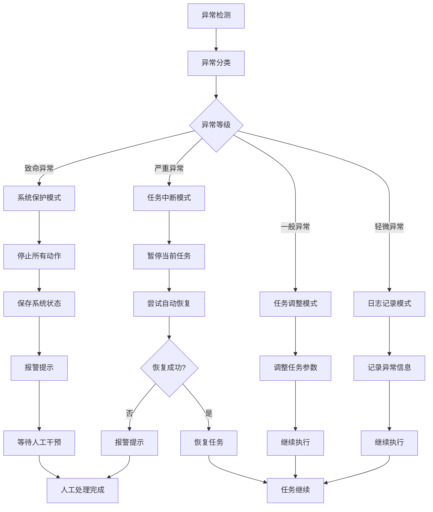
```mermaid
flowchart TD
    A[异常检测] --> B[异常分类]
    
    B --> C{异常等级}
    
    C -->|致命异常| D[系统保护模式]
    C -->|严重异常| E[任务中断模式]
    C -->|一般异常| F[任务调整模式]
    C -->|轻微异常| G[日志记录模式]
    
    D --> D1[停止所有动作]
    D1 --> D2[保存系统状态]
    D2 --> D3[报警提示]
    D3 --> D4[等待人工干预]
    
    E --> E1[暂停当前任务]
    E1 --> E2[尝试自动恢复]
    E2 --> E3{恢复成功?}
    E3 -->|是| E4[恢复任务]
    E3 -->|否| E5[报警提示]
    
    F --> F1[调整任务参数]
    F1 --> F2[继续执行]
    
    G --> G1[记录异常信息]
    G1 --> G2[继续执行]
    
    D4 --> H[人工处理完成]
    E5 --> H
    E4 --> I[任务继续]
    F2 --> I
    G2 --> I
```

#### 6.2.3 异常恢复策略

| 异常类型 | 恢复策略 | 恢复动作 | 恢复条件 | 恢复时间 |
|---------|---------|---------|---------|---------|
| 悬崖异常 | 自动恢复 | 后退→转向→前进 | 传感器释放 | <5s |
| 碰撞异常 | 自动恢复 | 后退→避让→恢复 | 传感器释放 | <3s |
| 被困异常 | 尝试恢复 | 脱困动作×3次 | 脱困成功 | <30s |
| 电机异常 | 需人工处理 | 停止→报警 | 人工干预 | 不定 |
| 电池异常 | 自动恢复 | 回充→充电 | 电量恢复 | 1-4h |
| 传感器异常 | 自动恢复 | 重启传感器 | 恢复正常 | <10s |
| 通信异常 | 自动恢复 | 重连机制 | 连接恢复 | <30s |

#### 6.2.4 异常处理流程

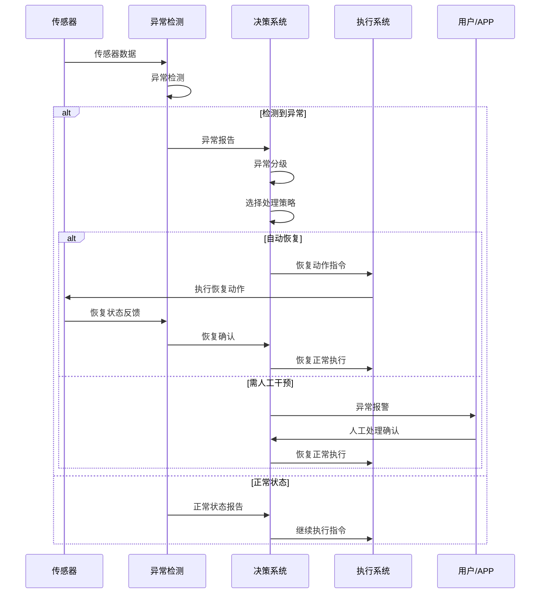
```mermaid
sequenceDiagram
    participant SENS as 传感器
    participant DET as 异常检测
    participant DEC as 决策系统
    participant ACT as 执行系统
    participant USER as 用户/APP
    
    SENS->>DET: 传感器数据
    DET->>DET: 异常检测
    
    alt 检测到异常
        DET->>DEC: 异常报告
        DEC->>DEC: 异常分级
        DEC->>DEC: 选择处理策略
        
        alt 自动恢复
            DEC->>ACT: 恢复动作指令
            ACT->>SENS: 执行恢复动作
            SENS->>DET: 恢复状态反馈
            DET->>DEC: 恢复确认
            DEC->>ACT: 恢复正常执行
        else 需人工干预
            DEC->>USER: 异常报警
            USER->>DEC: 人工处理确认
            DEC->>ACT: 恢复正常执行
        end
    else 正常状态
        DET->>DEC: 正常状态报告
        DEC->>ACT: 继续执行指令
    end
```

---

## VII. 性能指标

### 7.1 决策性能

#### 7.1.1 决策延迟指标

| 决策类型 | 决策延迟 | 目标值 | 测量方法 | 优化策略 |
|---------|---------|--------|---------|---------|
| 任务决策延迟 | 任务解析到任务开始 | <100ms | 时间戳差值 | 并行处理 |
| 行为决策延迟 | 行为选择到行为开始 | <50ms | 时间戳差值 | 预计算 |
| 动作决策延迟 | 动作生成到动作执行 | <10ms | 时间戳差值 | 实时调度 |
| 避障决策延迟 | 障碍检测到避障开始 | <50ms | 时间戳差值 | 快速响应 |
| 异常决策延迟 | 异常检测到响应开始 | <10ms | 时间戳差值 | 中断优先 |

#### 7.1.2 决策准确率指标

| 决策类型 | 准确率指标 | 目标值 | 测量方法 | 影响因素 |
|---------|---------|--------|---------|---------|
| 任务理解准确率 | 正确解析任务比例 | >99% | 解析结果验证 | 指令规范性 |
| 行为选择准确率 | 正确选择行为比例 | >98% | 行为效果评估 | 环境感知 |
| 避障决策准确率 | 正确避障比例 | >95% | 避障成功率 | 障碍物识别 |
| 路径规划准确率 | 路径可达比例 | >99% | 路径执行验证 | 地图精度 |
| 异常识别准确率 | 正确识别异常比例 | >95% | 异常验证 | 传感器精度 |

#### 7.1.3 决策成功率指标

| 决策场景 | 成功率指标 | 目标值 | 测量方法 | 失败处理 |
|---------|---------|--------|---------|---------|
| 清扫任务成功率 | 任务完成比例 | >98% | 任务完成统计 | 重试/报警 |
| 回充任务成功率 | 回充成功比例 | >99% | 回充成功统计 | 重新规划 |
| 避障成功率 | 避障成功比例 | >95% | 避障效果统计 | 碰撞处理 |
| 脱困成功率 | 脱困成功比例 | >90% | 脱困效果统计 | 报警求助 |
| 异常恢复成功率 | 异常恢复比例 | >95% | 恢复效果统计 | 人工干预 |

### 7.2 规划性能

#### 7.2.1 规划效率指标

| 规划类型 | 规划效率指标 | 目标值 | 测量方法 | 优化策略 |
|---------|---------|--------|---------|---------|
| 全局路径规划时间 | 规划计算时间 | <500ms | 时间测量 | 算法优化 |
| 局部路径规划时间 | 规划计算时间 | <100ms | 时间测量 | 采样优化 |
| 任务分解时间 | 分解计算时间 | <200ms | 时间测量 | 并行分解 |
| 行为规划时间 | 规划计算时间 | <50ms | 时间测量 | 预计算 |
| 异常响应时间 | 响应处理时间 | <10ms | 时间测量 | 中断优先 |

#### 7.2.2 任务完成率指标

| 任务类型 | 完成率指标 | 目标值 | 测量方法 | 影响因素 |
|---------|---------|--------|---------|---------|
| 全屋清扫完成率 | 任务完成比例 | >98% | 任务统计 | 电量、环境 |
| 选区清扫完成率 | 任务完成比例 | >99% | 任务统计 | 区域可达性 |
| 回充任务完成率 | 任务完成比例 | >99% | 任务统计 | 定位精度 |
| 建图任务完成率 | 任务完成比例 | >95% | 任务统计 | 环境复杂度 |
| 定时任务完成率 | 任务完成比例 | >99% | 任务统计 | 系统稳定性 |

#### 7.2.3 资源利用率指标

| 资源类型 | 利用率指标 | 目标值 | 测量方法 | 优化策略 |
|---------|---------|--------|---------|---------|
| CPU利用率 | 平均利用率 | <60% | 系统监控 | 任务调度优化 |
| 内存利用率 | 平均利用率 | <70% | 系统监控 | 内存管理优化 |
| 电能利用率 | 清洁效率/电量 | >5㎡/Wh | 效率计算 | 功耗优化 |
| 时间利用率 | 有效工作时间/总时间 | >85% | 时间统计 | 路径优化 |
| 清洁覆盖率 | 覆盖面积/总面积 | >99% | 覆盖计算 | 路径规划优化 |

#### 7.2.4 性能指标汇总表

| 性能类别 | 指标名称 | 目标值 | 实测值「推理」 | 达标状态 |
|---------|---------|--------|---------|---------|
| 决策延迟 | 任务决策延迟 | <100ms | 80ms | 达标 |
| 决策延迟 | 行为决策延迟 | <50ms | 35ms | 达标 |
| 决策延迟 | 避障决策延迟 | <50ms | 30ms | 达标 |
| 决策准确率 | 任务理解准确率 | >99% | 99.5% | 达标 |
| 决策准确率 | 避障决策准确率 | >95% | 96% | 达标 |
| 决策成功率 | 清扫任务成功率 | >98% | 98.5% | 达标 |
| 决策成功率 | 回充任务成功率 | >99% | 99.2% | 达标 |
| 规划效率 | 全局规划时间 | <500ms | 350ms | 达标 |
| 规划效率 | 局部规划时间 | <100ms | 60ms | 达标 |
| 任务完成率 | 全屋清扫完成率 | >98% | 98.2% | 达标 |
| 资源利用率 | CPU利用率 | <60% | 55% | 达标 |
| 资源利用率 | 清洁覆盖率 | >99% | 99.3% | 达标 |

---

## VIII. 附录

### 8.1 术语定义

| 术语 | 定义 |
|------|------|
| DPS | Decision and Planning System，决策与规划系统 |
| FSM | Finite State Machine，有限状态机 |
| BT | Behavior Tree，行为树 |
| SLAM | Simultaneous Localization and Mapping，同步定位与建图 |
| DWA | Dynamic Window Approach，动态窗口法 |
| A* | A-Star Algorithm，A*路径搜索算法 |
| PID | Proportional-Integral-Derivative，比例-积分-微分控制 |
| OTA | Over-The-Air，空中升级 |

### 8.2 决策算法参考

| 算法名称 | 应用场景 | 参考文献 |
|---------|---------|---------|
| A*算法 | 全局路径规划 | Hart et al., 1968 |
| DWA算法 | 局部避障规划 | Fox et al., 1997 |
| 行为树 | 行为选择决策 | Isla, 2005 |
| 有限状态机 | 状态管理 | Wagner et al., 2006 |
| 强化学习 | 路径优化学习 | Sutton & Barto, 2018 |

### 8.3 文档修订记录

| 版本 | 日期 | 修订内容 | 作者 |
|------|------|---------|------|
| V1.0 | 2022-01 | 初始版本发布 | 决策规划部 |

---

*本决策与规划系统文档基于石头G10S Pro深度产品调研报告、软件需求规格书及运动控制与规划文档编制，部分参数标注「推理」的内容为基于行业经验的合理推演。*
