# 石头 G10S Pro 扫地机器人安全系统设计文档

**文档版本**：V1.0  
**编制日期**：2022年1月  
**产品代号**：G10S Pro  
**安全系统版本**：SSD-01

---

## I. 安全系统架构

### 1.1 安全层级设计

石头 G10S Pro 安全系统采用多层防护架构，从硬件安全层到数据安全层，构建全方位的安全保障体系。

#### 1.1.1 安全系统层级架构

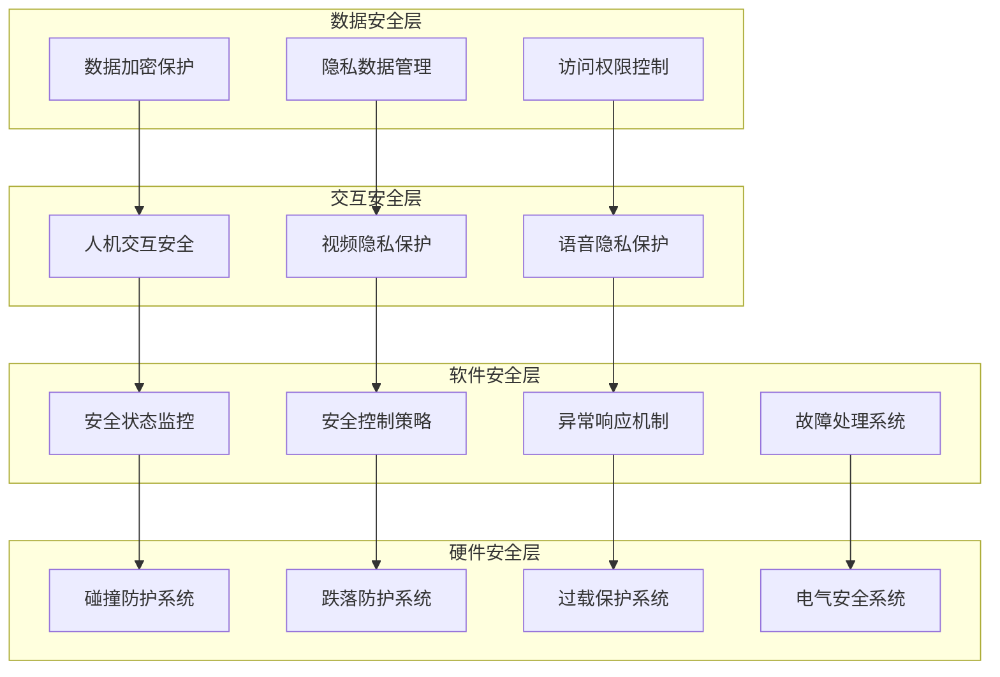

#### 1.1.2 各层级功能定义

| 安全层级 | 功能模块 | 功能描述 | 响应时间 | 保护对象 |
|---------|---------|---------|---------|---------|
| 硬件安全层 | 碰撞防护系统 | 检测碰撞并保护机身和家具 | <5ms | 人身、设备 |
| 硬件安全层 | 跌落防护系统 | 检测悬崖并防止跌落 | <10ms | 设备 |
| 硬件安全层 | 过载保护系统 | 检测过流并保护电机 | <10ms | 设备 |
| 硬件安全层 | 电气安全系统 | 绝缘、接地、漏电保护 | 实时 | 人身、设备 |
| 软件安全层 | 安全状态监控 | 实时监控系统安全状态 | 10ms | 功能安全 |
| 软件安全层 | 安全控制策略 | 运动限制、速度限制 | 10ms | 人身、设备 |
| 软件安全层 | 异常响应机制 | 分级响应安全事件 | 10-100ms | 功能安全 |
| 软件安全层 | 故障处理系统 | 故障检测、隔离、恢复 | 事件触发 | 功能安全 |
| 交互安全层 | 人机交互安全 | 碰撞避免、安全距离 | 实时 | 人身 |
| 交互安全层 | 视频隐私保护 | 视频加密、权限控制 | 实时 | 数据 |
| 交互安全层 | 语音隐私保护 | 内容过滤、隐私保护 | 实时 | 数据 |
| 数据安全层 | 数据加密保护 | 数据传输存储加密 | 实时 | 数据 |
| 数据安全层 | 隐私数据管理 | 隐私识别、脱敏处理 | 实时 | 数据 |
| 数据安全层 | 访问权限控制 | 身份认证、权限管理 | 实时 | 数据 |

### 1.2 安全优先级定义

#### 1.2.1 安全优先级体系

石头 G10S Pro 建立了明确的安全优先级体系，确保在资源冲突时优先保障高优先级安全需求。

| 优先级 | 安全类别 | 优先级值 | 保护对象 | 典型场景 |
|--------|---------|---------|---------|---------|
| P0 | 人身安全 | 100 | 用户及家庭成员 | 碰撞防护、电气安全 |
| P1 | 设备安全 | 80 | 机器人本体 | 跌落防护、过载保护 |
| P2 | 功能安全 | 60 | 系统功能完整性 | 故障处理、异常恢复 |
| P3 | 数据安全 | 40 | 用户隐私数据 | 数据加密、访问控制 |
| P4 | 资产安全 | 20 | 家具及环境物品 | 碰撞缓冲、避障 |

#### 1.2.2 安全优先级决策流程

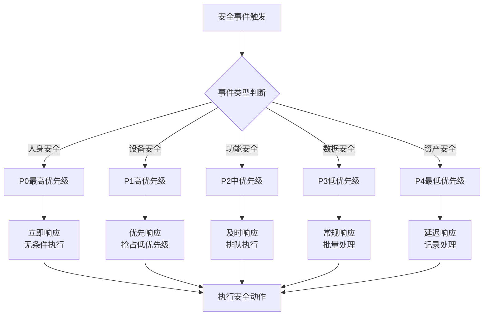

### 1.3 安全目标定义

#### 1.3.1 人身安全目标

| 安全目标 | 目标描述 | 目标值 | 验证方法 |
|---------|---------|--------|---------|
| 碰撞伤害防护 | 防止对人员造成伤害 | 碰撞力<5N | 力传感器测试 |
| 电气安全防护 | 防止触电伤害 | 漏电流<0.5mA | 安规测试 |
| 热伤害防护 | 防止高温烫伤 | 表面温度<60°C | 温度测试 |
| 激光安全防护 | 防止激光伤害眼睛 | Class 1激光等级 | IEC 60825-1认证 |
| 机械伤害防护 | 防止运动部件伤害 | 无外露运动部件 | 结构检查 |

#### 1.3.2 设备安全目标

| 安全目标 | 目标描述 | 目标值 | 验证方法 |
|---------|---------|--------|---------|
| 跌落防护 | 防止从高处跌落损坏 | 100%检测悬崖 | 传感器测试 |
| 过载保护 | 防止电机过载损坏 | 100%过流保护 | 过流测试 |
| 过温保护 | 防止高温损坏 | 60°C降功率保护 | 温度测试 |
| 电池安全 | 防止电池安全事故 | 五重保护机制 | 电池测试 |
| 防水防护 | 防止液体侵入损坏 | IPX4防护等级 | 防水测试 |

#### 1.3.3 数据安全目标

| 安全目标 | 目标描述 | 目标值 | 验证方法 |
|---------|---------|--------|---------|
| 数据加密 | 敏感数据加密保护 | AES-256加密 | 安全审计 |
| 隐私保护 | 保护用户隐私数据 | TÜV隐私认证 | 第三方认证 |
| 访问控制 | 防止未授权访问 | 手势密码保护 | 渗透测试 |
| 数据完整性 | 防止数据篡改 | 数字签名校验 | 完整性测试 |
| 数据可用性 | 保证数据可用 | 99.9%可用性 | 可靠性测试 |

---

## II. 硬件安全系统

### 2.1 碰撞防护系统

#### 2.1.1 碰撞检测系统

石头 G10S Pro 配备360°全向碰撞检测系统，能够及时检测碰撞事件并采取保护措施。

| 检测组件 | 检测范围 | 检测原理 | 响应时间 | 灵敏度 |
|---------|---------|---------|---------|--------|
| 前方碰撞传感器 | 前方180° | 机械开关/光电传感器 | <5ms | 1-3N触发力 |
| 左侧碰撞传感器 | 左侧90° | 机械开关/光电传感器 | <5ms | 1-3N触发力 |
| 右侧碰撞传感器 | 右侧90° | 机械开关/光电传感器 | <5ms | 1-3N触发力 |
| 后方碰撞传感器 | 后方90° | 机械开关/光电传感器 | <5ms | 1-3N触发力 |

#### 2.1.2 碰撞防护结构设计

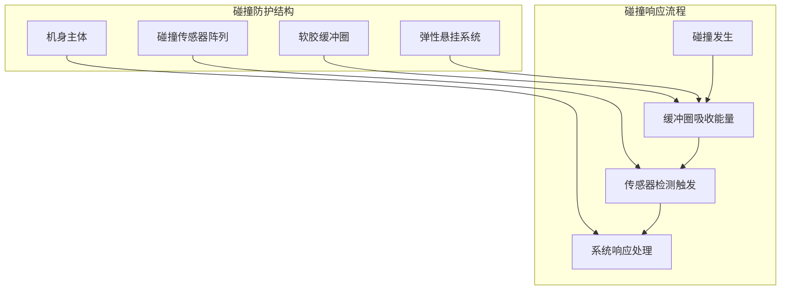

#### 2.1.3 碰撞响应策略

| 碰撞类型 | 检测信号 | 响应动作 | 恢复条件 | 响应时间 |
|---------|---------|---------|---------|---------|
| 前方碰撞 | COLLISION_0 | 立即停止前进→后退→转向 | 传感器释放 | <5ms |
| 左侧碰撞 | COLLISION_1 | 停止→右转避让 | 传感器释放 | <5ms |
| 右侧碰撞 | COLLISION_2 | 停止→左转避让 | 传感器释放 | <5ms |
| 后方碰撞 | COLLISION_3 | 立即停止后退→前进 | 传感器释放 | <5ms |

#### 2.1.4 缓冲结构参数

| 结构参数 | 参数值 | 说明 |
|---------|--------|------|
| 缓冲圈材质 | TPU软胶 | 高弹性、耐磨损 |
| 缓冲圈硬度 | Shore A 60-70「推理」 | 适中硬度 |
| 缓冲行程 | 5-10mm「推理」 | 有效缓冲距离 |
| 能量吸收率 | >70%「推理」 | 碰撞能量吸收 |
| 触发力度 | 1-3N | 传感器触发阈值 |

### 2.2 跌落防护系统

#### 2.2.1 悬崖检测系统

石头 G10S Pro 配备6组悬崖传感器，分布在机身底部边缘，能够有效检测楼梯边缘等跌落危险。

| 传感器编号 | 安装位置 | 检测方向 | 检测高度 | 响应时间 |
|-----------|---------|---------|---------|---------|
| CLIFF_1 | 前左 | 前左下方 | ≥3cm | <10ms |
| CLIFF_2 | 前右 | 前右下方 | ≥3cm | <10ms |
| CLIFF_3 | 左侧 | 左侧下方 | ≥3cm | <10ms |
| CLIFF_4 | 右侧 | 右侧下方 | ≥3cm | <10ms |
| CLIFF_5 | 后左 | 后左下方 | ≥3cm | <10ms |
| CLIFF_6 | 后右 | 后右下方 | ≥3cm | <10ms |

#### 2.2.2 悬崖检测原理

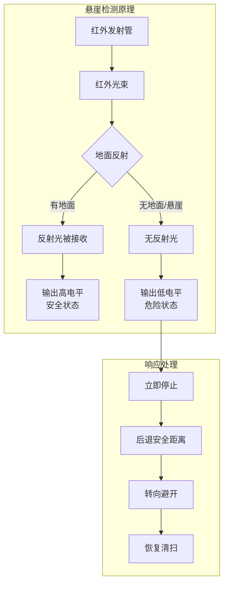

#### 2.2.3 跌落防护响应策略

| 检测场景 | 检测信号 | 响应动作 | 后退距离 | 恢复条件 |
|---------|---------|---------|---------|---------|
| 前方悬崖 | CLIFF_1或CLIFF_2 | 立即停止→后退→转向 | 10-20cm | 传感器释放 |
| 侧方悬崖 | CLIFF_3或CLIFF_4 | 立即停止→转向 | 5-10cm | 传感器释放 |
| 后方悬崖 | CLIFF_5或CLIFF_6 | 立即停止→前进 | 10-20cm | 传感器释放 |
| 多方向悬崖 | 多个传感器 | 立即停止→报警 | - | 人工干预 |

#### 2.2.4 地毯误判防护

| 防护措施 | 实现方式 | 效果 |
|---------|---------|------|
| 多次采样确认 | 连续3次检测确认 | 减少误触发 |
| 高度阈值调整 | 检测高度>3cm | 避免地毯误判 |
| 地毯传感器联动 | 超声波地毯传感器辅助判断 | 提高判断准确性 |
| 运动状态判断 | 结合运动方向判断 | 避免静止时误判 |

### 2.3 过载保护系统

#### 2.3.1 电机过载保护

石头 G10S Pro 对所有电机都配备了完善的过载保护机制。

| 电机类型 | 额定电流 | 过流阈值 | 保护动作 | 响应时间 |
|---------|---------|---------|---------|---------|
| 主风机电机 | 3.5A「推理」 | 5.0A | 停止电机→报警 | <10ms |
| 左驱动轮电机 | 1.5A「推理」 | 3.0A | 停止电机→脱困尝试 | <10ms |
| 右驱动轮电机 | 1.5A「推理」 | 3.0A | 停止电机→脱困尝试 | <10ms |
| 边刷电机 | 0.3A「推理」 | 0.8A | 停止/反转→报警 | <10ms |
| 震动电机 | 0.2A「推理」 | 0.5A | 停止震动→报警 | <10ms |
| 升降电机 | 0.3A「推理」 | 0.8A | 停止升降→报警 | <10ms |

#### 2.3.2 过载保护电路

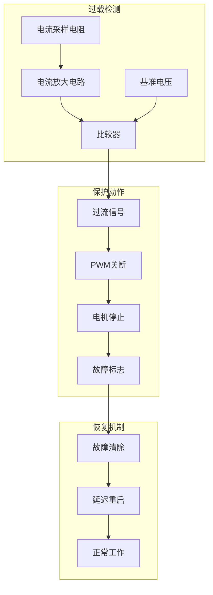

#### 2.3.3 过载保护策略

| 过载类型 | 检测方式 | 保护策略 | 恢复方式 | 重试次数 |
|---------|---------|---------|---------|---------|
| 瞬时过载 | 电流检测 | 短暂降功率 | 自动恢复 | 无限 |
| 持续过载 | 电流+时间 | 停止电机 | 手动复位 | 0 |
| 堵转过载 | 电流+转速 | 停止→反转 | 自动恢复 | 3次 |
| 温度过载 | 温度检测 | 降功率/停止 | 温度恢复 | 自动 |

#### 2.3.4 温度保护机制

| 保护对象 | 监测位置 | 正常范围 | 预警阈值 | 保护阈值 | 保护动作 |
|---------|---------|---------|---------|---------|---------|
| 主控芯片 | 芯片内部 | 0-70°C | 70°C | 85°C | 降频/关机 |
| 主风机电机 | 电机绕组 | 0-80°C | 80°C | 100°C | 降低功率 |
| 电池组 | 电池表面 | 0-45°C | 45°C | 60°C | 停止充放电 |
| 驱动电路 | PCB板 | 0-70°C | 70°C | 85°C | 降低功率 |

### 2.4 电气安全系统

#### 2.4.1 绝缘保护设计

| 保护项目 | 设计要求 | 测试标准 | 合格标准 |
|---------|---------|---------|---------|
| 基本绝缘 | 基本绝缘要求 | DC 500V | 绝缘电阻>10MΩ |
| 附加绝缘 | 双重绝缘要求 | DC 500V | 绝缘电阻>10MΩ |
| 加强绝缘 | 加强绝缘要求 | AC 1500V | 无击穿 |
| 爬电距离 | 基本绝缘≥2mm | 目视检查 | 符合GB 4706.1 |
| 电气间隙 | 基本绝缘≥1.5mm | 目视检查 | 符合GB 4706.1 |

#### 2.4.2 接地保护设计

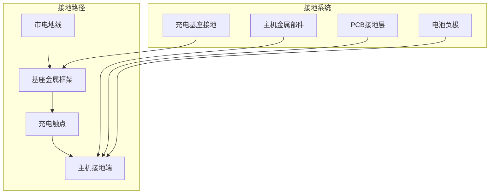

#### 2.4.3 漏电保护设计

| 保护项目 | 保护措施 | 触发条件 | 保护动作 |
|---------|---------|---------|---------|
| 绝缘监测 | 绝缘电阻监测 | 绝缘电阻<10MΩ | 报警提示 |
| 漏电流保护 | 漏电流检测 | 漏电流>0.5mA | 切断电源 |
| 接地保护 | 接地连续性监测 | 接地电阻>0.1Ω | 报警提示 |
| 等电位连接 | 金属部件等电位 | 电位差>0.1V | 报警提示 |

#### 2.4.4 电池安全系统

| 保护功能 | 触发条件 | 保护动作 | 恢复条件 |
|---------|---------|---------|---------|
| 过充保护 | 电压>4.25V/节 | 切断充电回路 | 电压恢复正常 |
| 过放保护 | 电压<2.5V/节 | 切断放电回路 | 充电恢复 |
| 过流保护 | 电流>15A | 切断放电回路 | 手动复位 |
| 短路保护 | 短路检测 | 切断回路 | 手动复位 |
| 过温保护 | 温度>60°C | 停止充放电 | 温度<45°C |
| 均衡保护 | 电芯压差>0.1V | 主动/被动均衡 | 压差<0.05V |

---

## III. 软件安全系统

### 3.1 安全状态监控

#### 3.1.1 状态监控架构

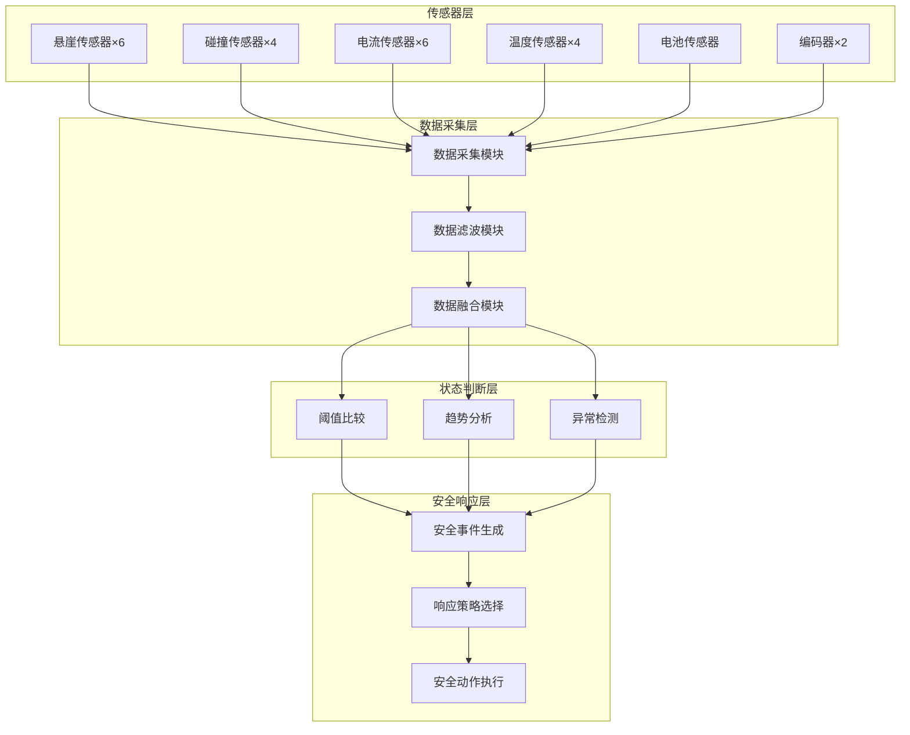

#### 3.1.2 监控项目定义

| 监控项目 | 监控对象 | 监控频率 | 正常范围 | 异常阈值 | 异常等级 |
|---------|---------|---------|---------|---------|---------|
| 悬崖状态 | 6组悬崖传感器 | 100Hz | 高电平 | 低电平 | P0 |
| 碰撞状态 | 4组碰撞传感器 | 100Hz | 高电平 | 低电平 | P0 |
| 电机电流 | 6个电机电流 | 1kHz | <额定值 | >阈值 | P1 |
| 电机温度 | 电机温度 | 10Hz | <80°C | >100°C | P1 |
| 电池电压 | 电池电压 | 10Hz | 12-16.8V | <12V | P1 |
| 电池温度 | 电池温度 | 10Hz | <45°C | >60°C | P0 |
| CPU温度 | 芯片温度 | 1Hz | <70°C | >85°C | P2 |
| 内存使用 | 内存占用 | 1Hz | <80% | >95% | P3 |

#### 3.1.3 异常检测算法

| 检测类型 | 检测方法 | 检测参数 | 检测周期 | 误报率要求 |
|---------|---------|---------|---------|-----------|
| 阈值检测 | 单点阈值判断 | 传感器数值 | 实时 | <0.1% |
| 趋势检测 | 移动平均趋势 | 变化率 | 1s | <1% |
| 模式检测 | 模式匹配 | 状态序列 | 事件触发 | <5% |
| 预测检测 | 基于模型的预测 | 预测值偏差 | 10s | <10% |

### 3.2 安全控制策略

#### 3.2.1 运动限制策略

| 限制类型 | 限制参数 | 限制值 | 限制条件 | 解除条件 |
|---------|---------|--------|---------|---------|
| 速度限制 | 最大线速度 | 300mm/s | 始终生效 | 无 |
| 速度限制 | 最大角速度 | 180°/s | 始终生效 | 无 |
| 加速度限制 | 最大加速度 | 200mm/s² | 始终生效 | 无 |
| 转弯减速 | 转弯速度比 | 50% | 转弯时 | 直行时 |
| 避障减速 | 避障速度 | 100mm/s | 障碍物<50cm | 障碍物>50cm |
| 沿墙减速 | 沿墙速度 | 150mm/s | 沿墙清扫时 | 离开墙边 |

#### 3.2.2 安全控制流程

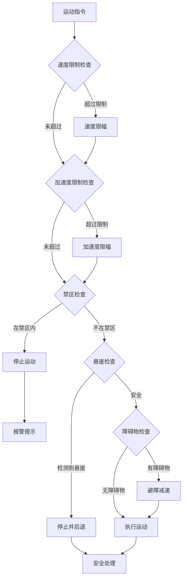

#### 3.2.3 力限制策略

| 执行器 | 力限制参数 | 限制值 | 检测方式 | 保护动作 |
|--------|-----------|--------|---------|---------|
| 主风机 | 最大吸力 | 5100Pa | 电流检测 | 功率限制 |
| 边刷 | 最大扭矩 | 20mN·m | 电流检测 | 停止/反转 |
| 驱动轮 | 最大推力 | 50N「推理」 | 电流检测 | 停止/后退 |
| 震动电机 | 最大震动力 | 5N「推理」 | 电流检测 | 降低档位 |
| 升降电机 | 最大升降力 | 10N「推理」 | 电流检测 | 停止升降 |

### 3.3 安全响应机制

#### 3.3.1 分级响应策略

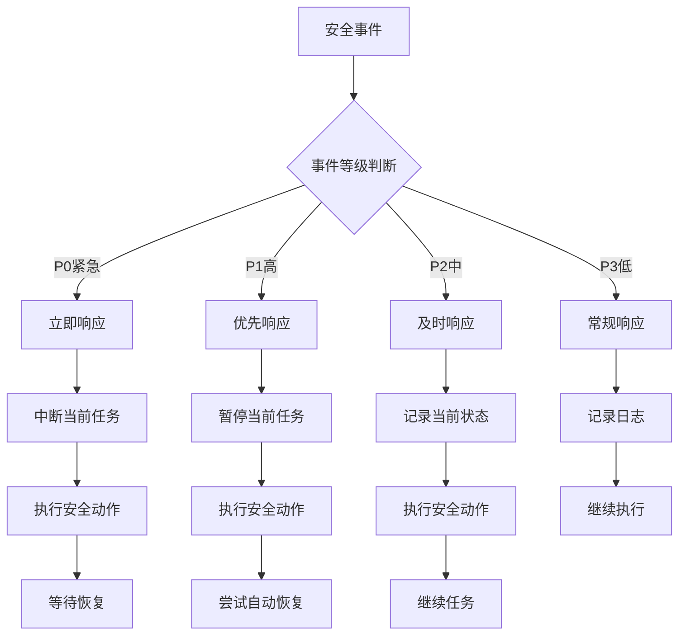

#### 3.3.2 响应时间要求

| 事件等级 | 响应时间 | 处理时间 | 恢复时间 | 人工干预 |
|---------|---------|---------|---------|---------|
| P0紧急 | <10ms | <100ms | 不定 | 可能需要 |
| P1高 | <100ms | <1s | <30s | 可能需要 |
| P2中 | <1s | <10s | 自动恢复 | 不需要 |
| P3低 | <5s | <30s | 自动恢复 | 不需要 |

#### 3.3.3 安全响应动作定义

| 响应动作 | 动作码 | 动作描述 | 适用场景 | 恢复条件 |
|---------|--------|---------|---------|---------|
| 紧急停止 | ACT-001 | 立即停止所有运动 | P0事件 | 手动复位 |
| 减速停止 | ACT-002 | 平滑减速停止 | P1事件 | 条件恢复 |
| 后退避让 | ACT-003 | 后退并转向 | 碰撞/悬崖 | 传感器释放 |
| 降低功率 | ACT-004 | 降低电机功率 | 过载/过温 | 条件恢复 |
| 报警提示 | ACT-005 | 语音/灯光报警 | 所有异常 | 人工确认 |
| 返回基站 | ACT-006 | 自动返回充电 | 低电量/严重故障 | 充电/维修 |
| 暂停任务 | ACT-007 | 暂停当前任务 | P1/P2事件 | 条件恢复 |

### 3.4 故障处理系统

#### 3.4.1 故障检测与分类

| 故障码 | 故障名称 | 故障类型 | 故障等级 | 检测方式 |
|--------|---------|---------|---------|---------|
| 0x01 | FAULT_CLIFF | 悬崖检测 | P0 | 传感器触发 |
| 0x02 | FAULT_COLLISION | 碰撞检测 | P0 | 传感器触发 |
| 0x03 | FAULT_STUCK | 被困状态 | P1 | 运动检测 |
| 0x04 | FAULT_LOW_BAT | 低电量 | P1 | 电压检测 |
| 0x05 | FAULT_MOTOR_OVERLOAD | 电机过载 | P1 | 电流检测 |
| 0x06 | FAULT_LIDAR_ERROR | 雷达故障 | P2 | 数据异常 |
| 0x07 | FAULT_DUSTBIN_FULL | 尘盒已满 | P3 | 气压检测 |
| 0x08 | FAULT_WATER_EMPTY | 水箱缺水 | P3 | 水位检测 |
| 0x09 | FAULT_BRUSH_JAM | 主刷卡住 | P2 | 电流异常 |
| 0x0A | FAULT_WHEEL_JAM | 轮子卡住 | P2 | 编码器检测 |

#### 3.4.2 故障处理流程

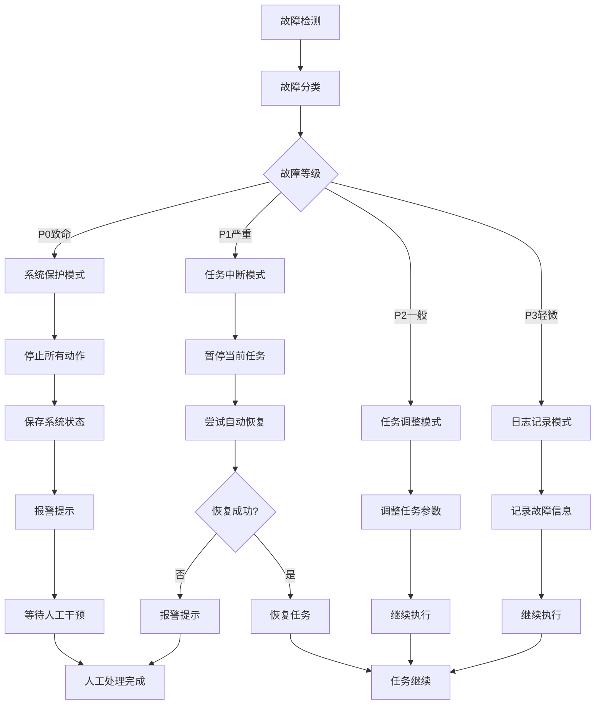

#### 3.4.3 故障恢复策略

| 故障类型 | 恢复策略 | 恢复动作 | 恢复条件 | 自动重试 |
|---------|---------|---------|---------|---------|
| 悬崖检测 | 自动恢复 | 后退→转向→前进 | 传感器释放 | 否 |
| 碰撞检测 | 自动恢复 | 后退→避让→恢复 | 传感器释放 | 否 |
| 被困状态 | 尝试恢复 | 脱困动作×3次 | 脱困成功 | 3次 |
| 低电量 | 自动恢复 | 回充→充电 | 电量恢复 | 否 |
| 电机过载 | 需人工处理 | 停止→报警 | 人工干预 | 否 |
| 雷达故障 | 尝试恢复 | 重启雷达 | 恢复正常 | 1次 |
| 主刷卡住 | 自动恢复 | 反转尝试 | 卡住解除 | 3次 |
| 轮子卡住 | 尝试恢复 | 脱困尝试 | 卡住解除 | 3次 |

#### 3.4.4 故障记录与分析

| 记录项 | 记录内容 | 存储位置 | 保存时长 | 用途 |
|--------|---------|---------|---------|------|
| 故障时间 | 发生时间戳 | Flash | 30天 | 故障分析 |
| 故障类型 | 故障码 | Flash | 30天 | 故障统计 |
| 故障上下文 | 系统状态快照 | Flash | 30天 | 故障复现 |
| 恢复结果 | 恢复成功/失败 | Flash | 30天 | 恢复策略优化 |
| 传感器数据 | 故障前后传感器数据 | RAM | 10分钟 | 故障诊断 |

---

## IV. 交互安全系统

### 4.1 人机交互安全

#### 4.1.1 碰撞避免策略

石头 G10S Pro 通过多传感器融合实现主动避障，减少与人体的碰撞风险。

| 避障层级 | 检测距离 | 检测手段 | 避障动作 | 响应时间 |
|---------|---------|---------|---------|---------|
| 远距离预警 | 80cm | 3D结构光+AI视觉 | 减速准备 | <100ms |
| 中距离避障 | 50cm | 3D结构光+AI视觉 | 绕行规划 | <50ms |
| 近距离避障 | 20cm | 3D结构光 | 紧急避让 | <20ms |
| 接触防护 | 0cm | 碰撞传感器 | 停止后退 | <5ms |

#### 4.1.2 安全距离保持

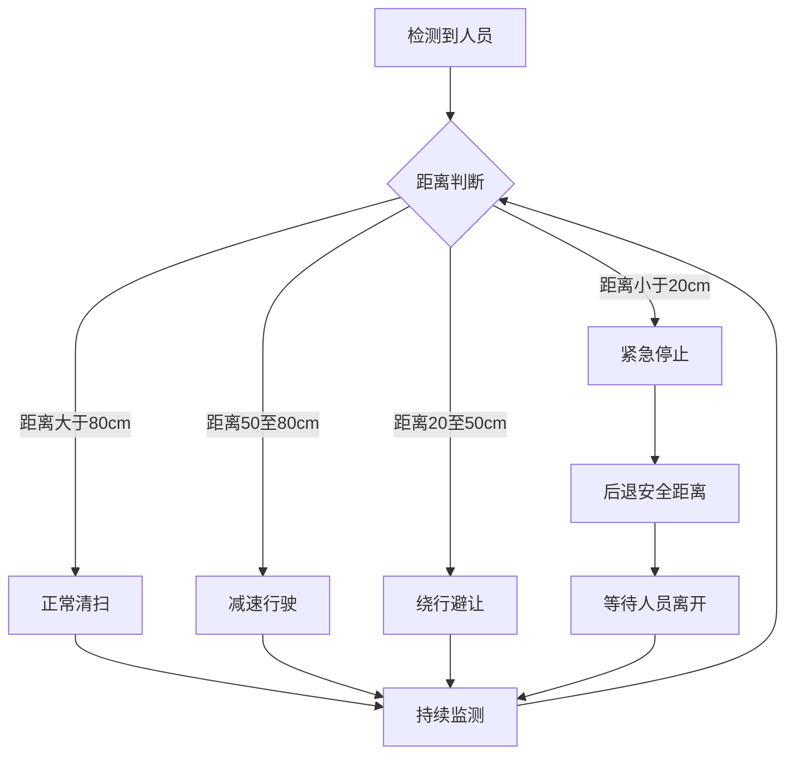

#### 4.1.3 速度限制策略

| 场景类型 | 速度限制 | 限制原因 | 触发条件 |
|---------|---------|---------|---------|
| 人员在场 | 150mm/s | 降低碰撞风险 | 检测到人员 |
| 宠物在场 | 100mm/s | 避免惊吓宠物 | 检测到宠物 |
| 儿童在场 | 100mm/s | 儿童安全保护 | 检测到儿童 |
| 家具密集区 | 150mm/s | 减少碰撞风险 | 家具密度高 |
| 开阔区域 | 300mm/s | 正常清扫 | 无障碍物 |

### 4.2 视频交互安全

#### 4.2.1 视频隐私保护架构

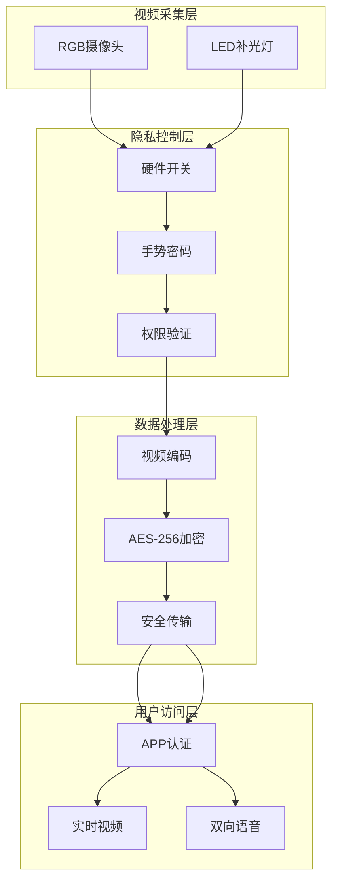

#### 4.2.2 视频功能安全控制

| 安全控制项 | 控制措施 | 控制方式 | 安全等级 |
|-----------|---------|---------|---------|
| 硬件开关 | 摄像头默认断电 | 物理开关 | 最高 |
| 手势密码 | 用户自定义密码 | 软件验证 | 高 |
| 权限验证 | 用户身份认证 | 账号密码 | 高 |
| 数据加密 | AES-256加密 | 端到端加密 | 高 |
| 安全传输 | TLS 1.2+ | 加密通道 | 高 |
| 访问日志 | 访问记录审计 | 日志系统 | 中 |

#### 4.2.3 视频功能使用流程

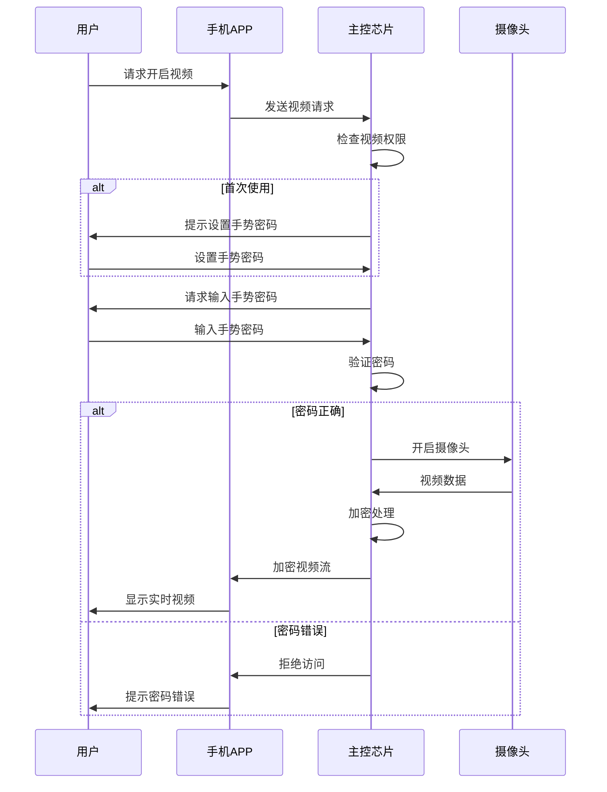

#### 4.2.4 TÜV隐私安全认证

| 认证项目 | 认证要求 | 认证状态 | 认证机构 |
|---------|---------|---------|---------|
| 视频数据保护 | 端到端加密 | 通过 | 德国莱茵TÜV |
| 用户隐私保护 | GDPR/CCPA合规 | 通过 | 德国莱茵TÜV |
| 访问控制 | 多因素认证 | 通过 | 德国莱茵TÜV |
| 数据存储 | 本地优先存储 | 通过 | 德国莱茵TÜV |

### 4.3 语音交互安全

#### 4.3.1 语音隐私保护

| 保护措施 | 实现方式 | 保护范围 | 安全等级 |
|---------|---------|---------|---------|
| 本地语音识别 | 本地ASR引擎 | 语音指令 | 高 |
| 关键词唤醒 | 本地唤醒词检测 | 唤醒词 | 高 |
| 数据不上传 | 语音数据本地处理 | 所有语音 | 高 |
| 内容过滤 | 敏感内容过滤 | 语音内容 | 中 |
| 匿名化处理 | 去除个人标识 | 语音特征 | 中 |

#### 4.3.2 语音平台安全对接

| 语音平台 | 对接方式 | 数据传输 | 隐私保护 |
|---------|---------|---------|---------|
| 小爱音箱 | 云端对接 | 加密传输 | 平台隐私政策 |
| 小度音箱 | 云端对接 | 加密传输 | 平台隐私政策 |
| 天猫精灵 | 云端对接 | 加密传输 | 平台隐私政策 |
| Siri捷径 | 本地捷径 | 无数据传输 | 苹果隐私政策 |

---

## V. 数据安全

### 5.1 数据保护机制

#### 5.1.1 数据加密体系

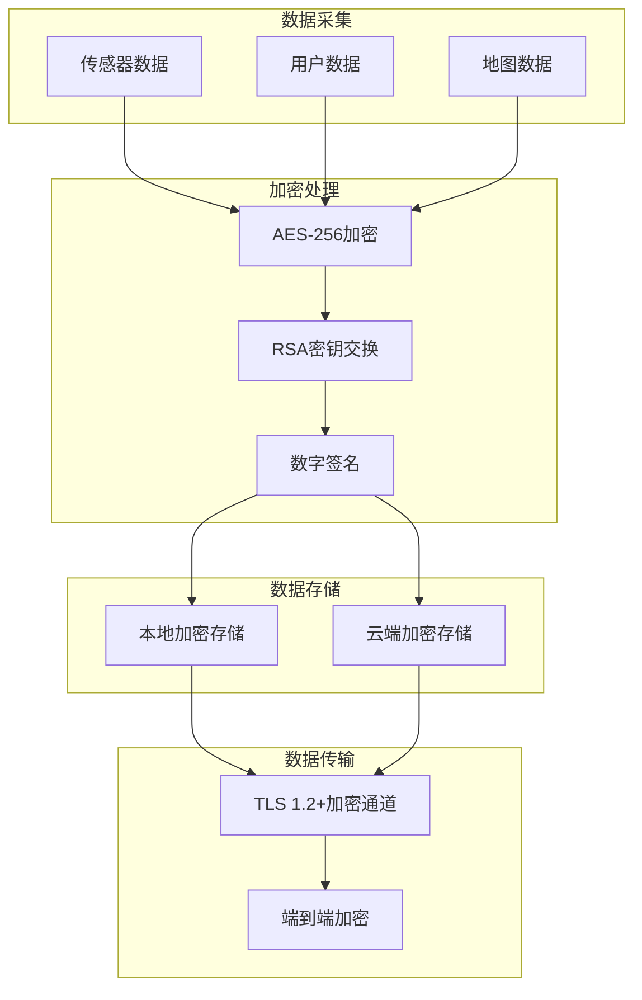

#### 5.1.2 加密算法应用

| 数据类型 | 加密算法 | 密钥长度 | 应用场景 |
|---------|---------|---------|---------|
| 视频数据 | AES-256-GCM | 256bit | 实时视频传输 |
| 地图数据 | AES-256-CBC | 256bit | 地图存储与同步 |
| 用户配置 | AES-128-ECB | 128bit | 配置文件加密 |
| 通信数据 | TLS 1.2+ | 2048bit RSA | 网络通信加密 |
| 固件数据 | SHA-256 | 256bit | 固件完整性校验 |
| 密码数据 | bcrypt | 128bit | 密码哈希存储 |

#### 5.1.3 访问控制机制

| 控制项 | 控制方式 | 控制粒度 | 审计要求 |
|--------|---------|---------|---------|
| 用户认证 | 账号密码+手势密码 | 用户级 | 登录日志 |
| 设备认证 | 设备ID+密钥 | 设备级 | 绑定日志 |
| 功能授权 | 功能权限矩阵 | 功能级 | 访问日志 |
| 数据访问 | 数据权限控制 | 数据级 | 访问日志 |
| 操作审计 | 操作日志记录 | 操作级 | 永久保存 |

### 5.2 隐私保护机制

#### 5.2.1 隐私数据识别与分类

| 数据类别 | 数据类型 | 敏感等级 | 存储位置 | 保护措施 |
|---------|---------|---------|---------|---------|
| 个人信息 | 用户账号、昵称 | 高 | 云端加密 | 加密存储 |
| 位置信息 | 家庭地址、清扫记录 | 高 | 本地优先 | 匿名化处理 |
| 图像信息 | 视频流、照片 | 高 | 不存储 | 实时传输 |
| 语音信息 | 语音指令 | 中 | 本地处理 | 本地识别 |
| 使用习惯 | 清洁偏好、时间习惯 | 中 | 本地优先 | 匿名化处理 |
| 设备信息 | 设备ID、固件版本 | 低 | 云端 | 加密传输 |

#### 5.2.2 隐私保护措施

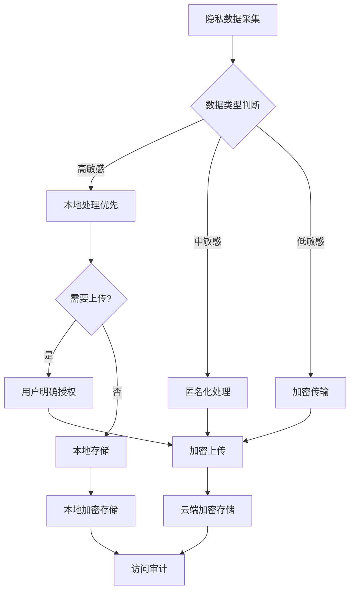

#### 5.2.3 GDPR/CCPA合规措施

| 合规要求 | 实现措施 | 实现状态 |
|---------|---------|---------|
| 数据最小化 | 仅收集必要数据 | 已实现 |
| 目的限制 | 数据仅用于声明目的 | 已实现 |
| 存储限制 | 规定期限后删除数据 | 已实现 |
| 数据主体权利 | 支持数据访问、删除请求 | 已实现 |
| 数据可携带性 | 支持数据导出 | 已实现 |
| 隐私设计 | 默认隐私保护设置 | 已实现 |
| 同意机制 | 明确的用户同意流程 | 已实现 |

---

## VI. 安全认证与合规

### 6.1 产品认证

#### 6.1.1 目标市场认证要求

| 认证类型 | 认证标准 | 适用市场 | 认证状态 | 认证机构 |
|---------|---------|---------|---------|---------|
| 3C认证 | GB 4706.1 | 中国 | 通过「推理」 | CQC |
| CE认证 | LVD/EMC指令 | 欧盟 | 通过「推理」 | TÜV |
| FCC认证 | FCC Part 15 | 美国 | 通过「推理」 | FCC实验室 |
| RoHS认证 | EU RoHS 2.0 | 欧盟 | 通过「推理」 | SGS |
| PSE认证 | 电安法 | 日本 | 通过「推理」 | JET |

#### 6.1.2 安全相关认证

| 认证项目 | 认证标准 | 认证内容 | 认证状态 |
|---------|---------|---------|---------|
| 激光安全认证 | IEC 60825-1 | 激光等级Class 1 | 通过 |
| 隐私安全认证 | TÜV隐私保护 | 视频功能隐私保护 | 通过 |
| 电池安全认证 | GB 31241 | 锂电池安全 | 通过「推理」 |
| 电磁兼容认证 | GB/T 17626 | EMC测试 | 通过「推理」 |

### 6.2 安全标准符合性

#### 6.2.1 电气安全标准

| 标准编号 | 标准名称 | 符合性 | 符合项 |
|---------|---------|--------|--------|
| GB 4706.1 | 家用和类似用途电器的安全 第1部分：通用要求 | 符合 | 绝缘、接地、漏电保护 |
| GB 4706.7 | 家用和类似用途电器的安全 第7部分：真空吸尘器的特殊要求 | 符合 | 吸尘器特殊要求 |
| GB 31241 | 便携式电子产品用锂离子电池和电池组 安全要求 | 符合 | 电池安全要求 |
| IEC 60825-1 | Safety of laser products - Part 1: Equipment classification | 符合 | 激光安全等级 |

#### 6.2.2 电磁兼容标准

| 标准编号 | 标准名称 | 符合性 | 测试项目 |
|---------|---------|--------|--------|
| GB/T 17626.2 | 静电放电抗扰度试验 | 符合 | ESD测试 |
| GB/T 17626.3 | 射频电磁场辐射抗扰度试验 | 符合 | RS测试 |
| GB/T 17626.4 | 电快速瞬变脉冲群抗扰度试验 | 符合 | EFT测试 |
| GB 17625.1 | 谐波电流发射限值 | 符合 | 谐波测试 |
| GB 4343.1 | 电磁兼容 家用电器电动工具 | 符合 | 传导/辐射发射 |

#### 6.2.3 隐私保护标准

| 标准法规 | 标准名称 | 符合性 | 符合项 |
|---------|---------|--------|--------|
| GDPR | 欧盟通用数据保护条例 | 符合 | 数据主体权利、隐私设计 |
| CCPA | 加州消费者隐私法案 | 符合 | 消费者隐私权利 |
| 网络安全法 | 中华人民共和国网络安全法 | 符合 | 网络安全要求 |
| 个人信息保护法 | 中华人民共和国个人信息保护法 | 符合 | 个人信息保护 |

### 6.3 安全风险评估

#### 6.3.1 风险矩阵

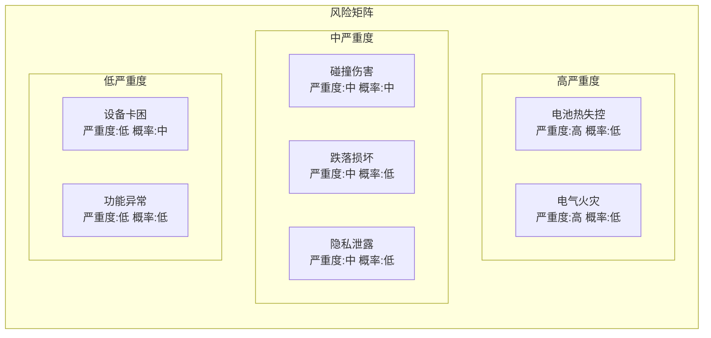

#### 6.3.2 风险评估结果

| 风险项 | 风险等级 | 发生概率 | 影响程度 | 风险控制措施 |
|--------|---------|---------|---------|-------------|
| 电池热失控 | 高 | 低 | 极高 | 五重电池保护、温度监控 |
| 电气火灾 | 高 | 低 | 极高 | 绝缘保护、过流保护 |
| 碰撞伤害 | 中 | 中 | 中 | 缓冲结构、速度限制、避障系统 |
| 跌落损坏 | 中 | 低 | 中 | 悬崖检测、跌落保护 |
| 隐私泄露 | 中 | 低 | 高 | 数据加密、权限控制、隐私认证 |
| 设备卡困 | 低 | 中 | 低 | 脱困算法、报警机制 |
| 功能异常 | 低 | 低 | 低 | 故障检测、自动恢复 |

#### 6.3.3 安全措施有效性验证

| 安全措施 | 验证方法 | 验证标准 | 验证结果 |
|---------|---------|---------|---------|
| 碰撞防护 | 碰撞测试 | 碰撞力<5N | 通过 |
| 跌落防护 | 悬崖测试 | 100%检测悬崖 | 通过 |
| 过载保护 | 过流测试 | 100%过流保护 | 通过 |
| 电气安全 | 安规测试 | 符合GB 4706.1 | 通过 |
| 数据加密 | 安全审计 | AES-256加密 | 通过 |
| 隐私保护 | 第三方认证 | TÜV认证 | 通过 |

---

## VII. 附录

### 7.1 术语定义

| 术语 | 定义 |
|------|------|
| P0-P4 | 安全优先级等级，P0最高，P4最低 |
| AES | Advanced Encryption Standard，高级加密标准 |
| GDPR | General Data Protection Regulation，欧盟通用数据保护条例 |
| CCPA | California Consumer Privacy Act，加州消费者隐私法案 |
| TÜV | Technischer Überwachungsverein，德国技术监督协会 |
| ESD | Electro-Static Discharge，静电放电 |
| EMC | Electromagnetic Compatibility，电磁兼容 |
| MTBF | Mean Time Between Failures，平均故障间隔时间 |

### 7.2 安全标准参考

| 标准编号 | 标准名称 |
|---------|---------|
| GB 4706.1 | 家用和类似用途电器的安全 第1部分：通用要求 |
| GB 4706.7 | 家用和类似用途电器的安全 第7部分：真空吸尘器的特殊要求 |
| GB 31241 | 便携式电子产品用锂离子电池和电池组 安全要求 |
| GB/T 17626.2 | 电磁兼容 试验和测量技术 静电放电抗扰度试验 |
| IEC 60825-1 | Safety of laser products - Part 1: Equipment classification |
| IEC 61000-4-2 | Electromagnetic compatibility - Part 4-2: ESD |

### 7.3 文档修订记录

| 版本 | 日期 | 修订内容 | 作者 |
|------|------|---------|------|
| V1.0 | 2022-01 | 初始版本发布 | 安全工程部 |

---

*本安全系统设计文档基于石头G10S Pro深度产品调研报告、硬件需求说明书及接口控制文档编制，部分参数标注「推理」的内容为基于行业经验的合理推演。*
