# 石头 G10S Pro 扫地机器人设计验证计划

**文档版本**：V1.0  
**编制日期**：2022年1月  
**产品代号**：G10S Pro  
**验证计划编号**：DVP-G10S-01

---

## I. 验证计划概述

### 1.1 验证目标

#### 1.1.1 验证目标定义

石头 G10S Pro 设计验证计划旨在通过系统化的测试验证，确保产品设计满足功能需求、性能指标、安全标准和可靠性要求，为产品量产提供质量保证依据。

| 验证类别 | 验证目标 | 验证内容 | 验证标准 | 验证阶段 |
|---------|---------|---------|---------|---------|
| 功能验证 | 功能完整性验证 | 所有功能正确实现 | PRD功能需求 | EVT/DVT/PVT |
| 性能验证 | 性能指标验证 | 性能指标达标 | 各系统性能指标 | DVT |
| 安全验证 | 安全合规验证 | 安全标准符合 | GB/IEC安全标准 | DVT/PVT |
| 可靠性验证 | 可靠性指标验证 | 可靠性指标达标 | MTBF等指标 | DVT/PVT |
| 认证验证 | 认证合规验证 | 认证测试通过 | CCC/CE/FCC等 | PVT |

#### 1.1.2 验证范围

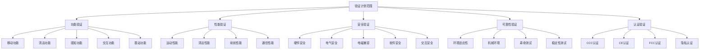

### 1.2 验证阶段划分

#### 1.2.1 验证阶段定义

| 阶段代号 | 阶段名称 | 验证目标 | 样机数量 | 验证重点 |
|---------|---------|---------|---------|---------|
| EVT | 工程验证测试 | 验证设计可行性 | 5-10台 | 功能实现验证 |
| DVT | 设计验证测试 | 验证设计完整性 | 20-30台 | 性能指标验证 |
| PVT | 生产验证测试 | 验证量产可行性 | 50-100台 | 工艺一致性验证 |
| MP | 量产阶段 | 持续质量监控 | 抽样 | 出货质量检验 |

#### 1.2.2 阶段验证流程

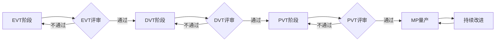

### 1.3 验证依据

#### 1.3.1 产品需求文档

| 文档名称 | 文档编号 | 验证依据内容 | 适用阶段 |
|---------|---------|-------------|---------|
| 产品需求文档-PRD | PRD-G10S-01 | 功能需求、性能指标、认证要求 | EVT/DVT/PVT |
| 硬件需求说明书-HRS | HRS-G10S-01 | 硬件规格、电气参数、传感器参数 | DVT |
| 结构设计说明书-MD | MD-G10S-01 | 结构参数、防护等级、材料要求 | DVT |
| 软件需求规格书-SRS | SRS-G10S-01 | 软件功能、算法性能、接口规范 | EVT/DVT |
| 运动控制与规划-MCP | MCP-G10S-01 | 运动性能指标、控制精度 | DVT |
| 感知与导航系统-PNS | PNS-G10S-01 | 定位精度、建图精度、避障性能 | DVT |
| 智能交互系统-IIS | IIS-G10S-01 | 交互性能、响应时间、用户体验 | DVT |
| 决策与规划系统-DPS | DPS-G10S-01 | 决策性能、规划效率、任务完成率 | DVT |
| 安全系统设计-SSD | SSD-G10S-01 | 安全指标、保护功能、认证要求 | DVT/PVT |

#### 1.3.2 行业标准

| 标准类型 | 标准编号 | 标准名称 | 验证内容 |
|---------|---------|---------|---------|
| 电气安全 | GB 4706.1 | 家用电器安全通用要求 | 电气安全测试 |
| 电气安全 | GB 4706.7 | 真空吸尘器特殊要求 | 吸尘器安全测试 |
| 电池安全 | GB 31241 | 锂离子电池安全要求 | 电池安全测试 |
| 电磁兼容 | GB/T 17626 | 电磁兼容试验系列 | EMC测试 |
| 激光安全 | IEC 60825-1 | 激光产品安全 | 激光等级测试 |
| 防护等级 | GB/T 4208 | 外壳防护等级 | IPX4测试 |

---

## II. 功能验证

### 2.1 移动功能验证

#### 2.1.1 基础移动能力验证

石头 G10S Pro 采用双驱动轮差速驱动方案，需验证其基础移动能力满足设计要求。

| 测试项目 | 测试方法 | 测试条件 | 通过标准 | 测试设备 |
|---------|---------|---------|---------|---------|
| 前进功能 | 指令控制前进 | 平整地面 | 平稳前进，速度误差<5% | 编码器、秒表 |
| 后退功能 | 指令控制后退 | 平整地面 | 平稳后退，速度误差<5% | 编码器、秒表 |
| 原地旋转 | 指令控制旋转 | 平整地面 | 原地旋转，角度误差<5° | 陀螺仪、角度尺 |
| 弧线运动 | 指令控制弧线 | 平整地面 | 弧线轨迹符合预期 | 轨迹记录系统 |
| 爬坡能力 | 坡道测试 | 15°坡度 | 顺利爬坡不打滑 | 坡道、角度仪 |
| 越障能力 | 门槛测试 | 2cm高度障碍 | 顺利越过不卡困 | 门槛、高度尺 |

#### 2.1.2 特殊移动能力验证

| 测试项目 | 测试方法 | 测试条件 | 通过标准 | 测试设备 |
|---------|---------|---------|---------|---------|
| 低矮空间穿越 | 雷达升降测试 | 7.95cm高度空间 | 雷达降下后顺利通过 | 高度规、测试架 |
| 地毯识别与适应 | 地毯区域测试 | 各种地毯类型 | 正确识别并升起拖布 | 各类地毯样本 |
| 脱困能力 | 被困场景测试 | 模拟被困场景 | 30s内成功脱困 | 测试场景 |
| 防跌落 | 悬崖边缘测试 | 楼梯边缘 | 检测悬崖并停止 | 悬崖测试台 |

#### 2.1.3 移动功能测试流程

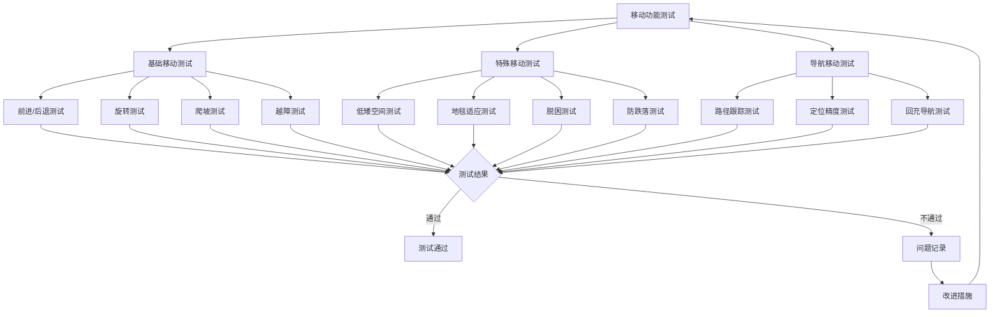

### 2.2 清洁功能验证

#### 2.2.1 吸尘功能验证

| 测试项目 | 测试方法 | 测试条件 | 通过标准 | 参考标准 |
|---------|---------|---------|---------|---------|
| 最大吸力测试 | 吸力计测量 | 风道入口 | ≥5100Pa | 企业标准 |
| 吸力档位测试 | 各档位吸力测量 | 三档测试 | 档位差异明显 | 企业标准 |
| 吸尘效率测试 | 标准尘样测试 | 标准测试条件 | >95% | GB/T 20291 |
| 地毯清洁测试 | 地毯深度清洁 | 标准地毯 | >90%清洁率 | 企业标准 |
| 主刷防缠绕测试 | 毛发缠绕测试 | 长发/宠物毛 | 无缠绕或易清理 | 企业标准 |
| 边刷清扫测试 | 沿墙清扫测试 | 墙边灰尘 | 沿墙<1cm清洁 | 企业标准 |

#### 2.2.2 拖地功能验证

| 测试项目 | 测试方法 | 测试条件 | 通过标准 | 参考标准 |
|---------|---------|---------|---------|---------|
| 震动频率测试 | 频率计测量 | 强档模式 | ≥3000次/分钟 | 企业标准 |
| 震动档位测试 | 各档位频率测量 | 三档测试 | 档位差异明显 | 企业标准 |
| 污渍去除测试 | 凝固咖啡渍测试 | 标准测试条件 | 99.99%去除率 | 企业标准 |
| 拖布升降测试 | 地毯区域测试 | 地毯检测触发 | 5mm升降正常 | 企业标准 |
| 水箱出水量测试 | 出水量测量 | 三档水量 | 出水量符合设定 | 企业标准 |
| 拖地覆盖率测试 | 覆盖率计算 | 全屋测试 | >95%覆盖率 | 企业标准 |

#### 2.2.3 清洁模式验证

| 清洁模式 | 测试内容 | 测试方法 | 通过标准 |
|---------|---------|---------|---------|
| 扫拖同步 | 吸尘+拖地同时工作 | 全屋清扫测试 | 扫拖功能正常协同 |
| 单扫模式 | 仅吸尘工作 | 全屋清扫测试 | 拖布升起不工作 |
| 单拖模式 | 仅拖地工作 | 全屋清扫测试 | 主风机不工作 |
| 深度清洁 | Max+吸力+强档震动 | 污渍区域测试 | 清洁效果达标 |
| 静音清洁 | 标准吸力+低档震动 | 噪音测试 | 噪音<60dB |

### 2.3 感知功能验证

#### 2.3.1 环境感知验证

| 测试项目 | 测试方法 | 测试条件 | 通过标准 | 测试设备 |
|---------|---------|---------|---------|---------|
| 建图能力 | 全屋建图测试 | 100㎡环境 | 8分钟内完成 | 秒表、地图分析 |
| 地图精度 | 地图与实际对比 | 已知环境 | 误差<5% | 测量工具 |
| 多楼层地图 | 多层地图管理 | 4层地图测试 | 正确存储切换 | 测试场景 |
| 障碍物识别 | 27种障碍物测试 | 标准障碍物 | 识别准确率>95% | 障碍物样本 |
| 避障距离 | 避障距离测量 | 各类障碍物 | 约1cm处避让 | 距离测量 |
| 定位精度 | 定位误差测量 | 已知位置 | 误差<5cm | 定位系统 |

#### 2.3.2 传感器功能验证

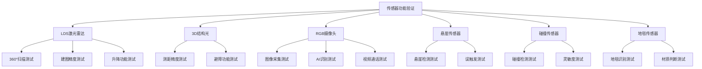

#### 2.3.3 传感器测试项目

| 传感器类型 | 测试项目 | 测试方法 | 通过标准 |
|-----------|---------|---------|---------|
| LDS激光雷达 | 扫描范围 | 360°旋转测试 | 完整360°覆盖 |
| LDS激光雷达 | 测距精度 | 已知距离测试 | 误差<2% |
| LDS激光雷达 | 升降功能 | 升降触发测试 | 升降顺畅无卡顿 |
| 3D结构光 | 测距范围 | 80cm范围测试 | 有效测距80cm |
| 3D结构光 | 测距精度 | 已知距离测试 | 误差<1cm |
| RGB摄像头 | 分辨率 | 图像分析 | ≥720P |
| RGB摄像头 | 视场角 | FOV测量 | ≥120° |
| 悬崖传感器 | 检测高度 | 高度阈值测试 | ≥3cm检测 |
| 碰撞传感器 | 触发力度 | 力度测试 | 1-3N触发 |
| 地毯传感器 | 识别准确率 | 各类地毯测试 | >95%准确率 |

### 2.4 交互功能验证

#### 2.4.1 语音交互验证

| 测试项目 | 测试方法 | 测试条件 | 通过标准 | 测试设备 |
|---------|---------|---------|---------|---------|
| 语音平台兼容 | 四平台联调测试 | 小爱/小度/天猫/Siri | 全部正常响应 | 各平台设备 |
| 指令识别率 | 指令集测试 | 标准指令集 | 识别率>95% | 语音测试系统 |
| 响应时间 | 响应时间测量 | 标准指令 | <2s响应 | 秒表 |
| 语音播报 | 播报功能测试 | 各种状态 | 播报清晰准确 | 人耳判断 |
| 远场唤醒 | 距离测试 | 5m距离 | 正常唤醒 | 测试距离 |

#### 2.4.2 APP交互验证

| 测试项目 | 测试方法 | 测试条件 | 通过标准 | 测试设备 |
|---------|---------|---------|---------|---------|
| 地图管理 | 地图编辑测试 | 分区/合并/命名 | 操作正常 | 测试手机 |
| 清洁控制 | 控制指令测试 | 全屋/选区/划区 | 指令正确执行 | 测试手机 |
| 参数设置 | 参数调节测试 | 吸力/水量/震动 | 参数正确生效 | 测试手机 |
| 定时任务 | 定时功能测试 | 周期性任务 | 准时执行 | 测试手机 |
| 视频功能 | 视频通话测试 | 实时视频 | 画面流畅清晰 | 测试手机 |
| 状态监控 | 状态显示测试 | 实时状态 | 显示准确 | 测试手机 |

#### 2.4.3 实体按键验证

| 按键名称 | 测试项目 | 测试方法 | 通过标准 |
|---------|---------|---------|---------|
| 局部清扫/童锁键 | 短按功能 | 短按测试 | 启动局部清扫 |
| 局部清扫/童锁键 | 长按功能 | 长按3s测试 | 开启/关闭童锁 |
| 清扫/开关机键 | 短按功能 | 短按测试 | 开始/暂停清扫 |
| 清扫/开关机键 | 长按功能 | 长按3s测试 | 开机/关机 |
| 回充键 | 短按功能 | 短按测试 | 启动回充 |
| LED状态灯 | 状态显示 | 各状态测试 | 显示正确 |

### 2.5 基站功能验证

#### 2.5.1 基站核心功能验证

| 测试项目 | 测试方法 | 测试条件 | 通过标准 | 测试设备 |
|---------|---------|---------|---------|---------|
| 自动洗拖布 | 洗拖布测试 | 脏污拖布 | 清洗效果达标 | 目视检查 |
| 自动集尘 | 集尘测试 | 满尘盒 | 2.5L尘袋60天 | 尘袋称重 |
| 自动补水 | 补水测试 | 空水箱 | 200ml补水正常 | 量杯测量 |
| 基站自清洁 | 自清洁测试 | 污水槽脏污 | 清洁效果达标 | 目视检查 |
| 自动抑菌 | 抑菌测试 | 细菌培养 | 99.9%抑菌率 | 细菌检测 |
| 充电功能 | 充电测试 | 低电量电池 | 4小时内充满 | 充电监测 |

#### 2.5.2 基站工作流程验证

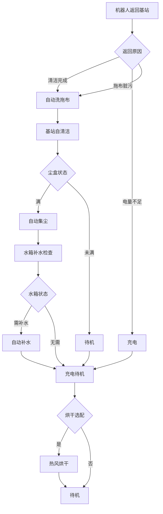

---

## III. 性能验证

### 3.1 运动性能验证

#### 3.1.1 运动精度验证

| 测试项目 | 测试方法 | 测试条件 | 目标值 | 测试设备 |
|---------|---------|---------|--------|---------|
| 最大移动速度 | 速度测量 | 平整地面 | 0.3m/s | 编码器、秒表 |
| 定位精度 | 定点测试 | 已知位置 | <5cm | 定位系统 |
| 导航精度 | 轨迹跟踪 | 复杂环境 | <10cm | 轨迹记录 |
| 速度控制精度 | 速度测量 | 各档速度 | 误差<5% | 编码器 |
| 角度控制精度 | 角度测量 | 旋转测试 | 误差<5° | 陀螺仪 |
| 轨迹跟踪精度 | 轨迹对比 | 弓字形路径 | 误差<10cm | 轨迹记录 |

#### 3.1.2 运动响应验证

| 测试项目 | 测试方法 | 测试条件 | 目标值 | 测试设备 |
|---------|---------|---------|--------|---------|
| 启动响应时间 | 时间测量 | 静止到运动 | <100ms | 示波器 |
| 停止响应时间 | 时间测量 | 运动到静止 | <50ms | 示波器 |
| 转向响应时间 | 时间测量 | 直行到转向 | <200ms | 示波器 |
| 避障响应时间 | 时间测量 | 障碍检测到避障 | <50ms | 示波器 |
| 急停响应时间 | 时间测量 | 急停指令到停止 | <10ms | 示波器 |

### 3.2 清洁性能验证

#### 3.2.1 吸尘性能验证

| 测试项目 | 测试方法 | 测试条件 | 目标值 | 参考标准 |
|---------|---------|---------|--------|---------|
| 最大吸力 | 吸力计测量 | 风道入口 | ≥5100Pa | 企业标准 |
| 吸尘效率 | 标准尘样测试 | 标准条件 | >95% | GB/T 20291 |
| 地毯清洁率 | 地毯测试 | 标准地毯 | >90% | 企业标准 |
| 边角清洁率 | 边角测试 | 墙角区域 | >90% | 企业标准 |
| 沿墙清洁距离 | 距离测量 | 墙边清扫 | <1cm | 直尺 |

#### 3.2.2 拖地性能验证

| 测试项目 | 测试方法 | 测试条件 | 目标值 | 参考标准 |
|---------|---------|---------|--------|---------|
| 震动频率 | 频率计测量 | 强档模式 | ≥3000次/分钟 | 企业标准 |
| 污渍去除率 | 咖啡渍测试 | 凝固污渍 | 99.99% | 企业标准 |
| 拖布覆盖率 | 覆盖率计算 | 全屋测试 | >95% | 企业标准 |
| 拖布升降高度 | 高度测量 | 地毯触发 | 5mm | 高度尺 |
| 拖布升降响应 | 时间测量 | 触发到升起 | <1s | 秒表 |

#### 3.2.3 清洁性能测试矩阵

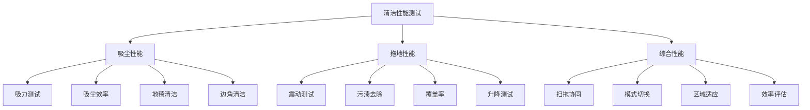

### 3.3 续航性能验证

#### 3.3.1 电池性能验证

| 测试项目 | 测试方法 | 测试条件 | 目标值 | 测试设备 |
|---------|---------|---------|--------|---------|
| 电池容量 | 容量测试 | 标准放电 | ≥5200mAh | 电池测试仪 |
| 电池能量 | 能量计算 | 额定电压 | ≥74.88Wh | 计算值 |
| 标准续航时间 | 续航测试 | 标准模式 | >2.5小时 | 秒表 |
| 最大清扫面积 | 面积测试 | 满电清扫 | ≥200㎡ | 面积测量 |
| 充电时间 | 充电测试 | 完全充电 | <4小时 | 秒表 |
| 循环寿命 | 循环测试 | 容量保持率 | >500次@80% | 电池测试仪 |

#### 3.3.2 功耗验证

| 工作模式 | 测试项目 | 测试方法 | 目标值 | 测试设备 |
|---------|---------|---------|--------|---------|
| 待机模式 | 待机功耗 | 功耗测量 | <1W | 功率计 |
| 标准清扫 | 工作功耗 | 功耗测量 | 30-40W | 功率计 |
| 强力清扫 | 工作功耗 | 功率测量 | 50-60W | 功率计 |
| Max+模式 | 工作功耗 | 功率测量 | 60-69W | 功率计 |
| 充电模式 | 充电功耗 | 功率测量 | 65W | 功率计 |

### 3.4 通信性能验证

#### 3.4.1 无线通信验证

| 测试项目 | 测试方法 | 测试条件 | 目标值 | 测试设备 |
|---------|---------|---------|--------|---------|
| Wi-Fi连接 | 连接测试 | 2.4GHz | 正常连接 | 测试手机 |
| Wi-Fi稳定性 | 长时间连接 | 24小时 | 无断连 | 自动测试 |
| 蓝牙连接 | 连接测试 | BT 5.0 | 正常连接 | 测试手机 |
| 通信距离 | 距离测试 | 室内环境 | >10m | 距离测量 |
| 数据传输速率 | 速率测试 | 地图同步 | >100KB/s | 速率测试 |

#### 3.4.2 通信延迟验证

| 测试项目 | 测试方法 | 测试条件 | 目标值 | 测试设备 |
|---------|---------|---------|--------|---------|
| APP指令响应 | 时间测量 | 指令发送到执行 | <1s | 秒表 |
| 状态上报延迟 | 时间测量 | 状态变化到显示 | <2s | 秒表 |
| 视频传输延迟 | 时间测量 | 画面采集到显示 | <200ms | 秒表 |
| 地图同步延迟 | 时间测量 | 地图更新到显示 | <5s | 秒表 |

### 3.5 决策与规划性能验证

#### 3.5.1 决策性能验证

| 测试项目 | 测试方法 | 测试条件 | 目标值 | 测试设备 |
|---------|---------|---------|--------|---------|
| 任务决策延迟 | 时间测量 | 任务解析到开始 | <100ms | 系统日志 |
| 行为决策延迟 | 时间测量 | 行为选择到开始 | <50ms | 系统日志 |
| 避障决策延迟 | 时间测量 | 检测到避障开始 | <50ms | 系统日志 |
| 任务理解准确率 | 统计分析 | 指令解析结果 | >99% | 统计分析 |
| 避障决策准确率 | 统计分析 | 避障结果 | >95% | 统计分析 |

#### 3.5.2 规划性能验证

| 测试项目 | 测试方法 | 测试条件 | 目标值 | 测试设备 |
|---------|---------|---------|--------|---------|
| 全局规划时间 | 时间测量 | 路径规划计算 | <500ms | 系统日志 |
| 局部规划时间 | 时间测量 | 局部避障规划 | <100ms | 系统日志 |
| 任务分解时间 | 时间测量 | 任务分解计算 | <200ms | 系统日志 |
| 清洁覆盖率 | 覆盖计算 | 全屋清扫 | >99% | 地图分析 |
| 任务完成率 | 统计分析 | 任务执行结果 | >98% | 统计分析 |

---

## IV. 安全验证

### 4.1 硬件安全验证

#### 4.1.1 碰撞防护验证

| 测试项目 | 测试方法 | 测试条件 | 通过标准 | 测试设备 |
|---------|---------|---------|---------|---------|
| 碰撞检测灵敏度 | 碰撞测试 | 各方向碰撞 | 1-3N触发 | 力传感器 |
| 碰撞响应时间 | 时间测量 | 碰撞到停止 | <5ms | 示波器 |
| 缓冲效果 | 碰撞测试 | 标准碰撞速度 | 碰撞力<5N | 力传感器 |
| 360°碰撞检测 | 全向测试 | 各角度碰撞 | 全部检测 | 测试台 |
| 碰撞恢复 | 恢复测试 | 碰撞后恢复 | 正常恢复清扫 | 功能测试 |

#### 4.1.2 跌落防护验证

| 测试项目 | 测试方法 | 测试条件 | 通过标准 | 测试设备 |
|---------|---------|---------|---------|---------|
| 悬崖检测灵敏度 | 悬崖测试 | ≥3cm高度差 | 100%检测 | 悬崖测试台 |
| 悬崖响应时间 | 时间测量 | 检测到停止 | <10ms | 示波器 |
| 地毯误判率 | 地毯测试 | 各种地毯 | <1%误判 | 地毯样本 |
| 多方向检测 | 多方向测试 | 6组传感器 | 全部有效 | 测试台 |
| 跌落防护恢复 | 恢复测试 | 检测后恢复 | 正常恢复工作 | 功能测试 |

#### 4.1.3 过载保护验证

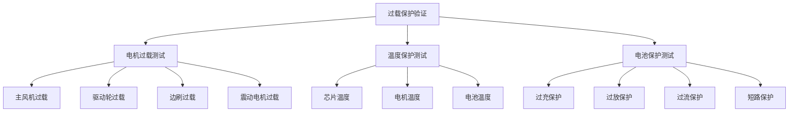

#### 4.1.4 过载保护测试项目

| 保护对象 | 测试项目 | 测试方法 | 触发条件 | 保护动作 |
|---------|---------|---------|---------|---------|
| 主风机电机 | 过流保护 | 电流测试 | >5.0A | 停止电机 |
| 驱动轮电机 | 过流保护 | 电流测试 | >3.0A | 停止电机 |
| 边刷电机 | 过流保护 | 电流测试 | >0.8A | 停止/反转 |
| 震动电机 | 过流保护 | 电流测试 | >0.5A | 停止震动 |
| 主控芯片 | 过温保护 | 温度测试 | >85°C | 降频/关机 |
| 电池组 | 过温保护 | 温度测试 | >60°C | 停止充放电 |

### 4.2 电气安全验证

#### 4.2.1 绝缘测试

| 测试项目 | 测试方法 | 测试条件 | 通过标准 | 参考标准 |
|---------|---------|---------|---------|---------|
| 绝缘电阻 | DC 500V测试 | 常温常湿 | >10MΩ | GB 4706.1 |
| 电气强度 | AC 1500V测试 | 常温常湿 | 无击穿 | GB 4706.1 |
| 爬电距离 | 目视检查 | PCB检查 | ≥2mm | GB 4706.1 |
| 电气间隙 | 目视检查 | PCB检查 | ≥1.5mm | GB 4706.1 |
| 接地电阻 | 接地测试 | 接地端子 | <0.1Ω | GB 4706.1 |

#### 4.2.2 漏电流测试

| 测试项目 | 测试方法 | 测试条件 | 通过标准 | 参考标准 |
|---------|---------|---------|---------|---------|
| 工作漏电流 | 漏电流测试 | 额定电压 | <0.5mA | GB 4706.1 |
| 潮态漏电流 | 潮态测试 | 93%RH | <0.5mA | GB 4706.1 |
| 绝缘监测 | 绝缘测试 | 工作状态 | >10MΩ | 企业标准 |

#### 4.2.3 电池安全验证

| 测试项目 | 测试方法 | 测试条件 | 通过标准 | 参考标准 |
|---------|---------|---------|---------|---------|
| 过充保护 | 过充测试 | 电压>4.25V/节 | 切断充电 | GB 31241 |
| 过放保护 | 过放测试 | 电压<2.5V/节 | 切断放电 | GB 31241 |
| 过流保护 | 过流测试 | 电流>15A | 切断回路 | GB 31241 |
| 短路保护 | 短路测试 | 短路状态 | 切断回路 | GB 31241 |
| 温度保护 | 温度测试 | 温度>60°C | 停止充放电 | GB 31241 |
| 跌落测试 | 1m跌落 | 6面跌落 | 无起火爆炸 | GB 31241 |
| 挤压测试 | 挤压测试 | 标准挤压力 | 无起火爆炸 | GB 31241 |

### 4.3 电磁兼容验证

#### 4.3.1 EMC发射测试

| 测试项目 | 测试方法 | 测试条件 | 通过标准 | 参考标准 |
|---------|---------|---------|---------|---------|
| 传导发射 | 传导测试 | 0.15-30MHz | 符合限值 | GB 4343.1 |
| 辐射发射 | 辐射测试 | 30-1000MHz | 符合限值 | GB 4343.1 |
| 谐波电流 | 谐波测试 | 基站充电 | 符合限值 | GB 17625.1 |
| 电压波动 | 闪烁测试 | 基站充电 | 符合限值 | GB 17625.2 |

#### 4.3.2 EMC抗扰度测试

| 测试项目 | 测试方法 | 测试等级 | 通过标准 | 参考标准 |
|---------|---------|---------|---------|---------|
| 静电放电 | ESD测试 | 接触6kV/空气8kV | B级判据 | GB/T 17626.2 |
| 射频辐射 | RS测试 | 3V/m | A级判据 | GB/T 17626.3 |
| 电快速瞬变 | EFT测试 | 1kV | B级判据 | GB/T 17626.4 |
| 浪涌 | Surge测试 | 1kV线对线 | B级判据 | GB/T 17626.5 |
| 传导骚扰 | CS测试 | 3V | A级判据 | GB/T 17626.6 |
| 电压跌落 | DIP测试 | 0%/40%/70% | B级判据 | GB/T 17626.11 |

### 4.4 软件安全验证

#### 4.4.1 安全状态监控验证

| 测试项目 | 测试方法 | 测试条件 | 通过标准 | 测试设备 |
|---------|---------|---------|---------|---------|
| 悬崖监控 | 悬崖触发测试 | 各方向悬崖 | 100%检测响应 | 测试台 |
| 碰撞监控 | 碰撞触发测试 | 各方向碰撞 | 100%检测响应 | 测试台 |
| 电流监控 | 过流触发测试 | 各电机过流 | 100%检测保护 | 电流源 |
| 温度监控 | 过温触发测试 | 各温度点 | 100%检测保护 | 加热设备 |
| 电池监控 | 电池异常测试 | 各种异常 | 100%检测保护 | 电池模拟器 |

#### 4.4.2 安全响应验证

| 测试项目 | 测试方法 | 测试条件 | 响应时间目标 | 通过标准 |
|---------|---------|---------|-------------|---------|
| P0事件响应 | 紧急事件测试 | 悬崖/碰撞 | <10ms | 立即停止 |
| P1事件响应 | 高优先级测试 | 被困/过载 | <100ms | 停止并报警 |
| P2事件响应 | 中优先级测试 | 低电量/缺水 | <1s | 提示并处理 |
| P3事件响应 | 低优先级测试 | 传感器异常 | <5s | 记录并处理 |

### 4.5 交互安全验证

#### 4.5.1 人机交互安全验证

| 测试项目 | 测试方法 | 测试条件 | 通过标准 | 测试设备 |
|---------|---------|---------|---------|---------|
| 碰撞力限制 | 碰撞力测试 | 标准碰撞速度 | <5N | 力传感器 |
| 安全距离保持 | 距离测试 | 人员检测 | 20cm内停止 | 距离测量 |
| 速度限制 | 速度测试 | 人员在场 | 自动降速 | 速度测量 |
| 表面温度 | 温度测试 | 长时间工作 | <60°C | 温度计 |

#### 4.5.2 视频隐私安全验证

| 测试项目 | 测试方法 | 测试条件 | 通过标准 | 测试设备 |
|---------|---------|---------|---------|---------|
| 默认关闭 | 功能测试 | 出厂状态 | 视频功能关闭 | 功能检查 |
| 手势密码 | 密码测试 | 密码验证 | 正确验证才能访问 | 功能测试 |
| 硬件断电 | 断电测试 | 功能关闭时 | 摄像头断电 | 万用表 |
| 数据加密 | 加密测试 | 视频传输 | AES-256加密 | 抓包分析 |
| TÜV认证 | 认证测试 | 认证项目 | 通过认证 | 认证机构 |

---

## V. 环境与可靠性验证

### 5.1 环境适应性验证

#### 5.1.1 气候环境测试

| 测试项目 | 测试方法 | 测试条件 | 持续时间 | 通过标准 | 参考标准 |
|---------|---------|---------|---------|---------|---------|
| 高温工作 | 高温测试 | 40°C | 4小时 | 功能正常 | GB/T 2423.2 |
| 低温工作 | 低温测试 | 0°C | 4小时 | 功能正常 | GB/T 2423.1 |
| 高温存储 | 高温存储 | 60°C | 24小时 | 无损坏 | GB/T 2423.2 |
| 低温存储 | 低温存储 | -20°C | 24小时 | 无损坏 | GB/T 2423.1 |
| 恒定湿热 | 湿热测试 | 40°C/93%RH | 48小时 | 功能正常 | GB/T 2423.3 |
| 温度循环 | 循环测试 | -20°C~60°C | 10循环 | 无损坏 | GB/T 2423.22 |

#### 5.1.2 防护等级测试

| 测试项目 | 测试方法 | 测试条件 | 通过标准 | 参考标准 |
|---------|---------|---------|---------|---------|
| IPX4防水 | 溅水测试 | 各方向溅水 | 无进水损坏 | GB/T 4208 |
| 防尘测试 | 灰尘测试 | 标准灰尘环境 | 功能正常 | 企业标准 |

#### 5.1.3 环境适应性测试流程

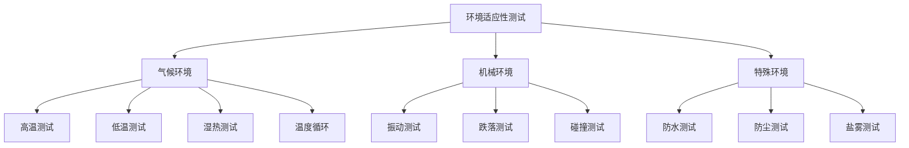

### 5.2 机械环境验证

#### 5.2.1 振动测试

| 测试项目 | 测试方法 | 测试条件 | 持续时间 | 通过标准 | 参考标准 |
|---------|---------|---------|---------|---------|---------|
| 随机振动 | 振动台测试 | 5-500Hz/0.5g | 2小时/轴向 | 无损坏 | GB/T 2423.56 |
| 正弦振动 | 振动台测试 | 5-500Hz/1g | 扫频10次 | 无损坏 | GB/T 2423.10 |
| 运输振动 | 模拟运输 | 模拟路况 | 2小时 | 功能正常 | 企业标准 |

#### 5.2.2 跌落测试

| 测试项目 | 测试方法 | 测试条件 | 跌落高度 | 通过标准 | 参考标准 |
|---------|---------|---------|---------|---------|---------|
| 裸机跌落 | 跌落测试 | 6面跌落 | 0.5m | 功能正常 | GB/T 2423.8 |
| 包装跌落 | 跌落测试 | 6面1角3棱 | 1m | 无损坏 | GB/T 4857.5 |

#### 5.2.3 碰撞测试

| 测试项目 | 测试方法 | 测试条件 | 测试次数 | 通过标准 | 参考标准 |
|---------|---------|---------|---------|---------|---------|
| 碰撞寿命 | 碰撞测试 | 标准碰撞速度 | 10000次 | 功能正常 | 企业标准 |
| 悬挂寿命 | 疲劳测试 | 悬挂行程 | 100万次 | 无损坏 | 企业标准 |

### 5.3 可靠性验证

#### 5.3.1 寿命测试

| 测试项目 | 测试方法 | 测试条件 | 目标值 | 通过标准 | 参考标准 |
|---------|---------|---------|--------|---------|---------|
| MTBF | 寿命测试 | 正常使用 | >2000小时 | 达标 | 企业标准 |
| 主刷寿命 | 寿命测试 | 正常清洁 | >1000小时 | 达标 | 企业标准 |
| 驱动轮寿命 | 寿命测试 | 正常行驶 | >2000小时 | 达标 | 企业标准 |
| 电池循环 | 循环测试 | 充放电循环 | >500次@80% | 达标 | GB 31241 |
| 按键寿命 | 寿命测试 | 按压测试 | >10万次 | 达标 | 企业标准 |
| 雷达寿命 | 寿命测试 | 旋转测试 | >3000小时 | 达标 | 企业标准 |

#### 5.3.2 稳定性测试

| 测试项目 | 测试方法 | 测试条件 | 持续时间 | 通过标准 | 参考标准 |
|---------|---------|---------|---------|---------|---------|
| 连续运行 | 连续测试 | 标准模式 | 72小时 | 无故障 | 企业标准 |
| 压力测试 | 高负载测试 | Max+模式 | 4小时 | 无故障 | 企业标准 |
| 内存泄漏 | 长时间运行 | 7天运行 | 无内存泄漏 | 系统监控 | 企业标准 |
| 通信稳定性 | 连接测试 | 24小时连接 | 无断连 | 系统监控 | 企业标准 |

#### 5.3.3 可靠性测试矩阵

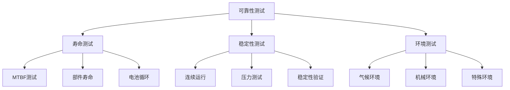

---

## VI. 认证与验收标准

### 6.1 认证测试

#### 6.1.1 目标市场认证

| 认证类型 | 认证标准 | 适用市场 | 测试项目 | 认证机构 | 目标状态 |
|---------|---------|---------|---------|---------|---------|
| CCC认证 | GB 4706.1/GB 4706.7 | 中国 | 电气安全、EMC | CQC | 通过 |
| CE认证 | LVD/EMC指令 | 欧盟 | 电气安全、EMC | TÜV/SGS | 通过 |
| FCC认证 | FCC Part 15 | 美国 | EMC | FCC实验室 | 通过 |
| RoHS认证 | EU RoHS 2.0 | 欧盟 | 有害物质 | SGS | 通过 |
| PSE认证 | 电安法 | 日本 | 电气安全 | JET | 通过 |
| TÜV隐私认证 | TÜV隐私标准 | 全球 | 隐私保护 | TÜV | 通过 |

#### 6.1.2 认证测试项目

| 认证类型 | 测试项目 | 测试标准 | 测试机构 | 预计周期 |
|---------|---------|---------|---------|---------|
| CCC认证 | 电气安全测试 | GB 4706.1 | CQC | 4周 |
| CCC认证 | EMC测试 | GB 4343.1 | CQC | 2周 |
| CE认证 | LVD测试 | EN 60335-1 | TÜV | 4周 |
| CE认证 | EMC测试 | EN 55014 | TÜV | 2周 |
| FCC认证 | EMC测试 | FCC Part 15 | FCC实验室 | 2周 |
| TÜV隐私 | 隐私安全测试 | TÜV标准 | TÜV | 3周 |

#### 6.1.3 认证测试流程

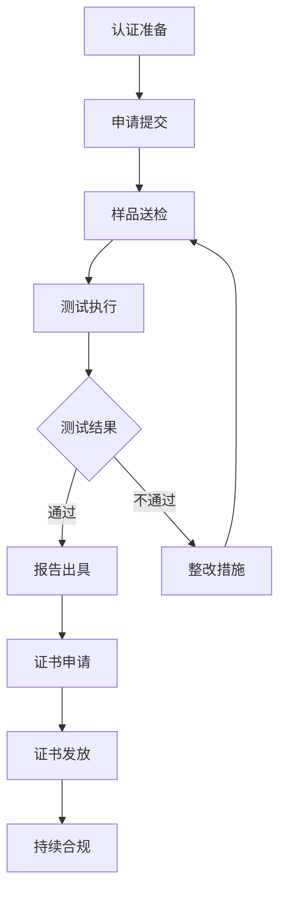

### 6.2 验收标准

#### 6.2.1 功能验收标准

| 功能类别 | 验收项目 | 验收标准 | 验收方法 | 验收阶段 |
|---------|---------|---------|---------|---------|
| 移动功能 | 基础移动 | 全部功能正常 | 功能测试 | EVT/DVT |
| 移动功能 | 特殊移动 | 全部功能正常 | 功能测试 | DVT |
| 清洁功能 | 吸尘功能 | 吸力达标、效率达标 | 性能测试 | DVT |
| 清洁功能 | 拖地功能 | 震动达标、清洁达标 | 性能测试 | DVT |
| 感知功能 | 建图导航 | 精度达标、功能正常 | 性能测试 | DVT |
| 感知功能 | 避障功能 | 识别率达标、避障正常 | 性能测试 | DVT |
| 交互功能 | 语音交互 | 全平台兼容、响应正常 | 功能测试 | DVT |
| 交互功能 | APP交互 | 全功能正常 | 功能测试 | DVT |
| 基站功能 | 核心功能 | 全部功能正常 | 功能测试 | DVT |

#### 6.2.2 性能验收标准

| 性能类别 | 验收项目 | 目标值 | 验收方法 | 验收阶段 |
|---------|---------|--------|---------|---------|
| 运动性能 | 最大速度 | ≥0.3m/s | 性能测试 | DVT |
| 运动性能 | 定位精度 | <5cm | 性能测试 | DVT |
| 清洁性能 | 最大吸力 | ≥5100Pa | 性能测试 | DVT |
| 清洁性能 | 污渍去除率 | ≥99.99% | 性能测试 | DVT |
| 续航性能 | 续航时间 | >2.5小时 | 性能测试 | DVT |
| 续航性能 | 充电时间 | <4小时 | 性能测试 | DVT |
| 决策性能 | 决策延迟 | <100ms | 性能测试 | DVT |
| 规划性能 | 覆盖率 | >99% | 性能测试 | DVT |

#### 6.2.3 安全验收标准

| 安全类别 | 验收项目 | 验收标准 | 验收方法 | 验收阶段 |
|---------|---------|---------|---------|---------|
| 硬件安全 | 碰撞防护 | 碰撞力<5N | 安全测试 | DVT |
| 硬件安全 | 跌落防护 | 100%悬崖检测 | 安全测试 | DVT |
| 硬件安全 | 过载保护 | 100%过流保护 | 安全测试 | DVT |
| 电气安全 | 绝缘电阻 | >10MΩ | 安规测试 | DVT/PVT |
| 电气安全 | 漏电流 | <0.5mA | 安规测试 | DVT/PVT |
| EMC | 发射测试 | 符合限值 | EMC测试 | DVT/PVT |
| EMC | 抗扰度测试 | A/B级判据 | EMC测试 | DVT/PVT |
| 交互安全 | 视频隐私 | TÜV认证通过 | 认证测试 | PVT |

#### 6.2.4 可靠性验收标准

| 可靠性类别 | 验收项目 | 目标值 | 验收方法 | 验收阶段 |
|-----------|---------|--------|---------|---------|
| 环境适应 | 高低温工作 | 功能正常 | 环境测试 | DVT |
| 环境适应 | 湿热测试 | 功能正常 | 环境测试 | DVT |
| 环境适应 | IPX4防水 | 无进水 | 防护测试 | DVT |
| 机械环境 | 振动测试 | 无损坏 | 机械测试 | DVT |
| 机械环境 | 跌落测试 | 功能正常 | 机械测试 | DVT |
| 寿命指标 | MTBF | >2000小时 | 寿命测试 | DVT/PVT |
| 寿命指标 | 电池循环 | >500次@80% | 寿命测试 | DVT |
| 稳定性 | 连续运行 | 72小时无故障 | 稳定性测试 | DVT |

### 6.3 验收判定规则

#### 6.3.1 判定等级定义

| 判定等级 | 等级定义 | 判定条件 | 后续处理 |
|---------|---------|---------|---------|
| A级 | 完全通过 | 所有测试项目通过 | 进入下一阶段 |
| B级 | 基本通过 | 关键项目全部通过，次要项目轻微偏差 | 限期整改后进入下一阶段 |
| C级 | 条件通过 | 关键项目基本通过，需整改验证 | 整改后重新验证 |
| D级 | 不通过 | 关键项目不通过 | 停止开发，重大整改 |

#### 6.3.2 项目分类定义

| 项目类别 | 类别定义 | 判定权重 | 典型项目 |
|---------|---------|---------|---------|
| 关键项目 | 安全相关、认证相关 | 必须通过 | 电气安全、EMC、认证项目 |
| 重要项目 | 核心功能、核心性能 | 必须通过 | 清洁功能、导航功能 |
| 一般项目 | 辅助功能、用户体验 | 允许轻微偏差 | APP功能、交互体验 |
| 参考项目 | 优化类项目 | 允许偏差 | 效率优化、体验优化 |

#### 6.3.3 验收判定流程

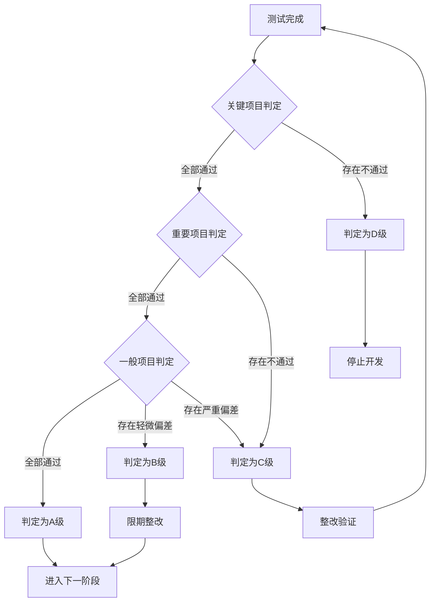

---

## VII. 测试资源与计划

### 7.1 测试设备清单

#### 7.1.1 通用测试设备

| 设备名称 | 设备型号 | 用途 | 精度要求 | 数量 |
|---------|---------|------|---------|------|
| 数字万用表 | Fluke 87V | 电压电流测量 | 0.1% | 5 |
| 示波器 | Tektronix MDO3014 | 信号测量 | 100MHz | 3 |
| 功率计 | Yokogawa WT310 | 功耗测量 | 0.1% | 3 |
| 秒表 | 精度0.01s | 时间测量 | 0.01s | 10 |
| 温度计 | Fluke 54II | 温度测量 | 0.1°C | 5 |
| 声级计 | B&K 2250 | 噪音测量 | 0.1dB | 2 |

#### 7.1.2 专用测试设备

| 设备名称 | 设备型号 | 用途 | 精度要求 | 数量 |
|---------|---------|------|---------|------|
| 吸力测试仪 | 定制设备 | 吸力测量 | 10Pa | 2 |
| 频率计 | Agilent 53220A | 震动频率测量 | 0.1Hz | 2 |
| 力传感器 | HBM U9C | 碰撞力测量 | 0.1N | 3 |
| 电池测试仪 | Arbin BT2000 | 电池性能测试 | 0.1% | 2 |
| 定位系统 | OptiTrack | 轨迹跟踪 | 1mm | 1套 |
| 环境试验箱 | ESPEC | 高低温湿热测试 | 0.5°C | 2 |
| 振动台 | LDS V964 | 振动测试 | 0.1g | 1 |
| 跌落试验机 | 定制设备 | 跌落测试 | 10mm | 1 |
| EMC测试系统 | R&S TS9980 | EMC测试 | 标准要求 | 1套 |
| 安规测试仪 | HIOKI 3153 | 安规测试 | 标准要求 | 2 |

### 7.2 测试样机需求

#### 7.2.1 各阶段样机需求

| 阶段 | 样机数量 | 用途分配 | 特殊要求 |
|------|---------|---------|---------|
| EVT | 10台 | 功能验证5台、性能验证3台、破坏性测试2台 | 功能完整 |
| DVT | 30台 | 功能验证5台、性能验证10台、可靠性测试10台、认证测试5台 | 接近量产状态 |
| PVT | 100台 | 生产验证50台、认证测试20台、可靠性测试20台、备机10台 | 量产工艺 |

#### 7.2.2 样机管理要求

| 管理项目 | 管理要求 | 记录要求 | 保存期限 |
|---------|---------|---------|---------|
| 样机编号 | 唯一编号标识 | 编号记录表 | 项目结束 |
| 样机状态 | 状态跟踪记录 | 状态记录表 | 项目结束 |
| 测试记录 | 详细测试记录 | 测试报告 | 项目结束后3年 |
| 问题记录 | 问题跟踪管理 | 问题清单 | 项目结束后3年 |
| 样机存储 | 专用区域存储 | 存储记录 | 项目结束 |

### 7.3 测试计划

#### 7.3.1 测试进度计划

| 阶段 | 测试内容 | 开始时间 | 结束时间 | 持续时间 |
|------|---------|---------|---------|---------|
| EVT | 功能验证测试 | T+0周 | T+4周 | 4周 |
| EVT | 问题整改验证 | T+4周 | T+6周 | 2周 |
| DVT | 性能验证测试 | T+6周 | T+12周 | 6周 |
| DVT | 安全验证测试 | T+8周 | T+14周 | 6周 |
| DVT | 可靠性测试 | T+10周 | T+18周 | 8周 |
| DVT | 问题整改验证 | T+18周 | T+20周 | 2周 |
| PVT | 认证测试 | T+20周 | T+26周 | 6周 |
| PVT | 生产验证测试 | T+22周 | T+28周 | 6周 |
| PVT | 最终验收 | T+28周 | T+30周 | 2周 |

#### 7.3.2 测试里程碑

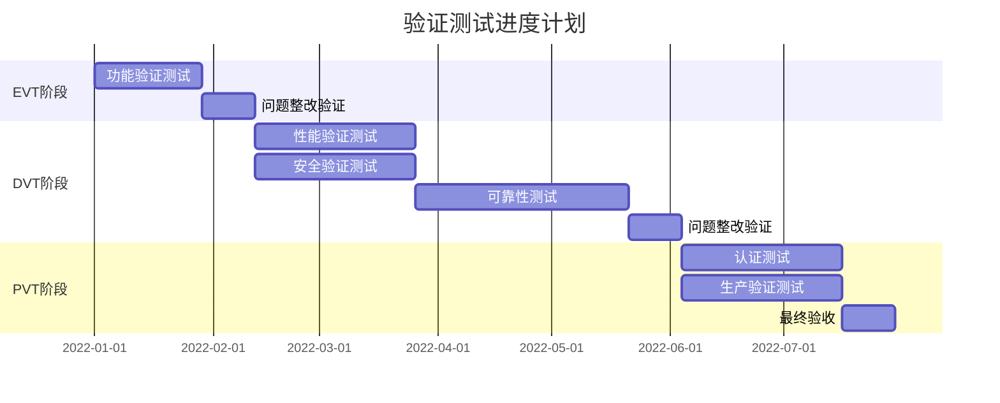

---

## VIII. 附录

### 8.1 术语定义

| 术语 | 定义 |
|------|------|
| EVT | Engineering Verification Test，工程验证测试 |
| DVT | Design Verification Test，设计验证测试 |
| PVT | Production Verification Test，生产验证测试 |
| MP | Mass Production，量产 |
| MTBF | Mean Time Between Failures，平均故障间隔时间 |
| EMC | Electromagnetic Compatibility，电磁兼容 |
| ESD | Electro-Static Discharge，静电放电 |
| LVD | Low Voltage Directive，低电压指令 |
| CCC | China Compulsory Certification，中国强制性产品认证 |
| CE | Conformité Européenne，欧盟认证 |
| FCC | Federal Communications Commission，美国联邦通信委员会 |
| RoHS | Restriction of Hazardous Substances，有害物质限制指令 |
| PSE | Product Safety Electrical Appliance & Material，日本电气安全认证 |
| TÜV | Technischer Überwachungsverein，德国技术监督协会 |

### 8.2 参考标准

| 标准编号 | 标准名称 |
|---------|---------|
| GB 4706.1 | 家用和类似用途电器的安全 第1部分：通用要求 |
| GB 4706.7 | 家用和类似用途电器的安全 第7部分：真空吸尘器的特殊要求 |
| GB 31241 | 便携式电子产品用锂离子电池和电池组 安全要求 |
| GB/T 17626 | 电磁兼容 试验和测量技术系列标准 |
| GB/T 4208 | 外壳防护等级（IP代码） |
| GB/T 20291 | 家用真空吸尘器性能测试方法 |
| GB/T 2423 | 电工电子产品环境试验系列标准 |
| IEC 60825-1 | Safety of laser products - Part 1: Equipment classification |
| IEC 60335-1 | Household and similar electrical appliances - Safety |
| EN 55014 | Electromagnetic compatibility - Requirements for household appliances |

### 8.3 文档修订记录

| 版本 | 日期 | 修订内容 | 作者 |
|------|------|---------|------|
| V1.0 | 2022-01 | 初始版本发布 | 质量部 |

---

*本设计验证计划基于石头G10S Pro深度产品调研报告及各系统设计文档编制，部分参数标注「推理」的内容为基于行业经验的合理推演。*
